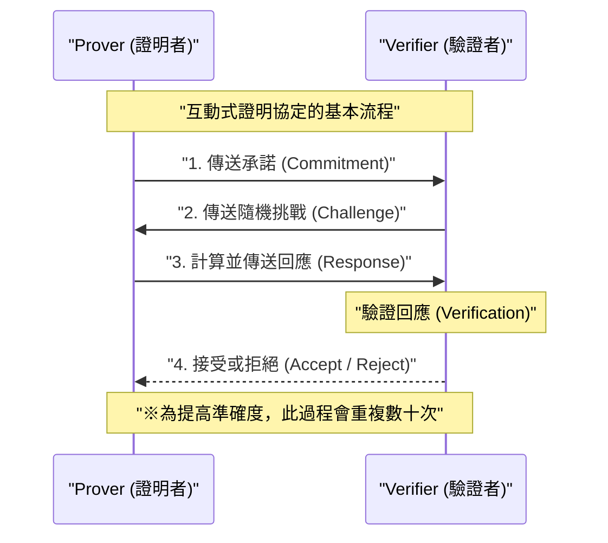
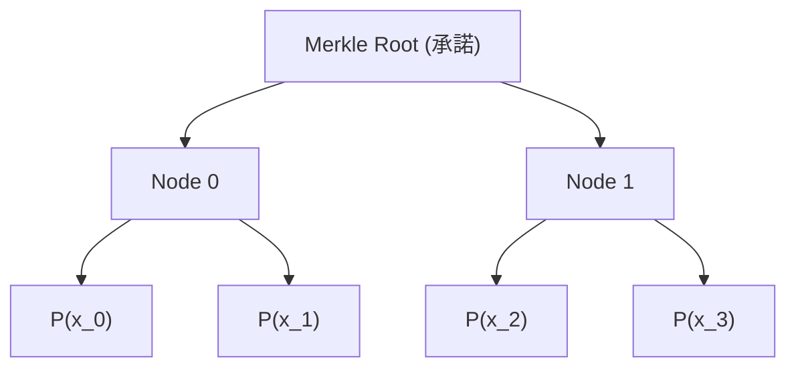
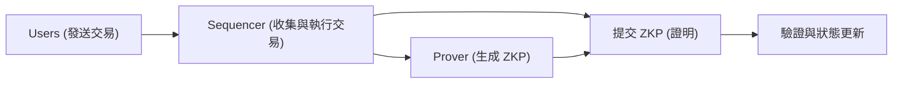

## 前言

在現代數位社會中，資料隱私與擴展性（Scalability）已經成為最重要的兩個課題。隨著個人資料外洩與不當使用的風險增加，「在不向對方透露自己資訊的情況下，證明自己擁有該資訊」的技術需求變得越來越強烈。實現這一點的就是**零知識證明（Zero-Knowledge Proof: ZKP）**。

零知識證明是1980年代由Shafi Goldwasser、Silvio Micali與Charles Rackoff首次提出的密碼學概念，但長久以來僅停留在理論研究階段。然而，隨著區塊鏈技術與Web3的崛起，情況發生了巨大變化。作為能同時解決以太坊等公有鏈所面臨的擴展性問題（處理能力的極限）與隱私問題（所有交易皆被公開）的「魔法棒」，ZKP一躍成為眾所矚目的焦點。

本文將從零知識證明的基本概念出發，深入探討目前主流的**zk-SNARKs**與**zk-STARKs**深奧的數學與密碼學機制，並涵蓋ZK-Rollups與去中心化身份（DID）等最新的Web3與安全應用案例，為您進行極為詳細且具技術深度的解說。

---

## 什麼是零知識證明（ZKP）？

零知識證明（ZKP）是指在證明者（Prover）向驗證者（Verifier）證明某個命題為真時，除了「該命題為真」之外不傳遞任何其他資訊的協定。

### ZKP必須滿足的三個條件

要成立為ZKP，必須嚴格滿足以下三個特性：

1. **完整性（Completeness）**
   如果命題為真，且證明者與驗證者雙方都正確遵守協定，那麼驗證者必須以壓倒性的機率接受（Accept）該證明。
2. **健全性（Soundness）**
   如果命題為假，無論證明者的運算能力多強、多麼心懷不軌，都無法欺騙驗證者使其接受證明（除了可以忽略的極小機率外）。
3. **零知識性（Zero-Knowledge）**
   如果命題為真，驗證者除了「命題為真」這個事實之外，無法從證明過程中獲得任何其他資訊。從驗證者的角度來看，這透過能夠模擬證明過程（存在模擬器）的數學定義來證明。

### 互動式證明與非互動式證明

ZKP分為兩種：證明者與驗證者需要進行多次通訊的**互動式（Interactive）證明**，以及證明者只需發送一次證明資料即可完成的**非互動式（Non-Interactive）證明**。

#### 互動式證明（Interactive ZKP）

早期的ZKP被設計為互動式協定。著名的「阿里巴巴山洞」比喻就屬於此類。一般的協定流程如下：

這種方法雖然強大，但要求驗證者必須在線，因此不便於應用在區塊鏈這種非同步的分散式系統中。在區塊鏈上，任何人必須隨時都能驗證過去的證明。

#### 菲亞特-沙米爾轉換（Fiat-Shamir Heuristic）與非互動化

將互動式證明轉換為非互動式證明（Non-Interactive Zero-Knowledge Proof: NIZK）的劃時代方法，就是**菲亞特-沙米爾轉換（Fiat-Shamir Heuristic）**。

證明者不再依賴驗證者傳送的「隨機挑戰」，而是利用自己的承諾與公開資訊的雜湊值，自行生成「偽隨機挑戰」。只要假設密碼學雜湊函數（例如SHA-256或Keccak等）能作為隨機預言機（Random Oracle）發揮作用，證明者就無法事前預測或操作挑戰，從而在維持與互動式證明同等安全性的情況下，僅透過一次訊息傳送就能完成證明。

---

## zk-SNARKs 的技術細節

目前，ZKP中最廣泛使用的是**zk-SNARKs**（Zero-Knowledge Succinct Non-Interactive Argument of Knowledge）。顧名思義，它具備零知識性（zk），證明大小極小且驗證高速（Succinct，簡潔），並且是非互動式（Non-Interactive）的知識論證（Argument of Knowledge）。

zk-SNARKs的基礎是進階的代數幾何與密碼理論。它將程式的執行與計算轉換為特定多項式方程式的驗證。

### 1. 轉換為算術電路與R1CS（Rank-1 Constraint System）

首先，將想要證明的任意計算（演算法或智慧合約的邏輯）轉換為由加法閘與乘法閘組成的**算術電路（Arithmetic Circuit）**。

接著，將這個算術電路轉換為稱為**R1CS（Rank-1 Constraint System）**的矩陣方程式集合。R1CS是針對變數向量 $x$ ，尋找滿足以下約束條件的矩陣 $A, B, C$ 的問題。

$$ (A \cdot x) \circ (B \cdot x) = C \cdot x $$

其中，$\circ$ 表示哈達瑪積（Hadamard product，逐項相乘）。這個約束條件保證了電路中的所有邏輯閘（尤其是乘法閘）都被正確計算。

### 2. 轉換為QAP（Quadratic Arithmetic Program）

由於R1CS的矩陣約束數量龐大，逐一驗證非常缺乏效率。因此，我們利用拉格朗日插值法，將這些約束壓縮成單一的多項式方程式。這就是**QAP（Quadratic Arithmetic Program）**。

透過轉換為QAP，需要證明的問題便歸結為：「特定多項式 $P(x)$ 是否能被另一個已知的多項式 $Z(x)$ 整除？」的問題。

$$ P(x) = L(x) \cdot R(x) - O(x) $$

其中，$L(x), R(x), O(x)$ 分別是對應矩陣 $A, B, C$ 各行的多項式組合。如果證明者知道正確的解（Witness），在 $P(x)$ 的各個根（評估點）上的值都會是0，因此 $P(x)$ 會將目標多項式 $Z(x)$ 作為因式。也就是說，存在某個多項式 $H(x)$ 使得以下等式成立：

$$ P(x) = H(x) \cdot Z(x) $$

驗證者只需在某個隨機的秘密點 $s$ 上，檢查這個方程式 $P(s) = H(s) \cdot Z(s)$ 是否成立，就能瞬間驗證整個計算是否正確進行。這就是「Succinct（簡潔性）」的秘密。

### 3. 橢圓曲線密碼學與對配（Bilinear Pairings）

然而，如果驗證者知道秘密點 $s$，證明者就能偽造假的多項式來滿足方程式（導致健全性崩潰）。因此，必須在不讓任何人知道 $s$ 的情況下，保持加密狀態（利用同態加密）來進行計算。

實現這一點的是**橢圓曲線對配（Bilinear Pairings）**。
對配 $e$ 是一個特殊的函數，它可以從兩個加密的值中，計算出相當於它們乘積加密值的值。

$$ e(g_1^a, g_2^b) = e(g_1, g_2)^{ab} $$

證明者即使不知道 $s$ 本身，也能利用 $s$ 的次方的加密值（這稱為CRS: Common Reference String）來計算多項式 $P(s)$ 與 $H(s)$ 的加密值。驗證者則使用對配函數，在維持加密值的狀態下驗證 $P(s) = H(s) \cdot Z(s)$ 的關係是否成立。

### 4. 信任設定（Trusted Setup）

zk-SNARKs（特別是早期的Groth16等）最大的弱點在於，它需要生成秘密點 $s$ 的過程，即所謂的**信任設定（Trusted Setup）**。如果 $s$ 的生成者保留了該值而沒有將其銷毀，就能夠生成任意的假證明（Toxic Waste 問題）。

為防止這種情況，會使用多方計算（MPC）進行稱為「Ceremony（儀式）」的程序。只要有多名參與者合作提供隨機性，且至少有一名參與者誠實地銷毀了自己的隨機值，就能保持整個系統的安全性。然而，為了消除這種依賴關係，長年以來相關研究仍不斷在進行。

---

## zk-STARKs 的技術細節

作為對依賴信任設定以及量子電腦破解橢圓曲線密碼學風險的回應，**zk-STARKs**（Zero-Knowledge Scalable Transparent Argument of Knowledge）應運而生。

由Eli Ben-Sasson等人開發的STARKs，正如其名「Transparent（透明性）」，完全不需要信任設定；同時也如同其名「Scalable（可擴展性）」，即使計算量增加，也能有效地保持較小的證明大小與較短的驗證時間。

### 1. 多項式承諾與FRI協定

zk-STARKs不依賴橢圓曲線密碼學，而是將安全性基礎**僅建立在雜湊函數上**。因此，它具備抗量子計算機密碼學（Post-Quantum Cryptography）的特性。

計算的驗證會在轉換為被稱為AIR（Algebraic Intermediate Representation）的格式後，利用一維或多維多項式的性質來進行。STARKs的核心在於**FRI（Fast Reed-Solomon Interactive Oracle Proof of Proximity）**協定。

FRI協定是一種用於驗證「某個函數是否足夠接近特定次數的多項式（Proximity）」的技術。證明者將多項式的值作為默克爾樹（Merkle Tree）的葉節點進行承諾（多項式承諾）。

驗證者要求揭露隨機的幾個點，並使用默克爾證明（Merkle Proof）來確認它們包含在承諾中。透過遞迴地重複此過程，可以以壓倒性的機率保證原始多項式的次數確實很低。

### zk-SNARKs 與 zk-STARKs 的比較

| 特徵 | zk-SNARKs | zk-STARKs |
| :--- | :--- | :--- |
| **密碼學假設** | 橢圓曲線、對配 | 抗碰撞雜湊函數 |
| **信任設定** | 需要（Plonk等為通用型） | 不需要（Transparent） |
| **抗量子性** | 無 | 有 |
| **證明大小** | 極小（~200 Byte） | 稍大（數十 KB） |
| **證明生成計算成本** | 高 | 較SNARKs相對較低 |
| **驗證成本（Gas費）** | 極低（固定） | 低（呈對數增長） |

近年來，如Plonk與Halo2等「不需要信任設定，或只需設定一次的SNARKs」問世，SNARKs與STARKs之間的界線逐漸變得模糊，但基本數學方法的差異依然重要。

---

## 零知識證明在Web3與安全領域的最新應用

從理論走向實踐的ZKP，目前正在Web3與網路安全的最前線掀起革命。

### 1. 透過 ZK-Rollups 實現以太坊的終極擴容

像以太坊這類L1（Layer 1）區塊鏈，為了重視去中心化與安全性，在擴展性上面臨了極大的限制（不可能三角）。解決這個問題的L2（Layer 2）終極解決方案就是**ZK-Rollups**。

ZK-Rollup在鏈下（L2）執行並處理數以千計的交易，然後生成「一個ZKP（Validity Proof，有效性證明）」來顯示這些交易都已正確執行。L1鏈上的智慧合約只需驗證這個證明即可。

與Optimistic Rollups（如Arbitrum或Optimism等）不同，ZK-Rollups最大的優勢在於不需要為了欺詐證明（Fraud Proof）而等待挑戰期（通常為7天）。由於密碼學保證了其正確性，因此在證明被驗證的瞬間，往L1的資金提取（Finality，最終確定性）就完成了。目前，zkSync、Starknet、Scroll、Polygon zkEVM等專案正展開激烈的開發競爭，與EVM（以太坊虛擬機）相容的**zkEVM**的實現正促使生態系快速成長。

### 2. 隱私保護身份（ZKP for Identity）

數位世界中個人認證的方式也將因為ZKP而徹底改變。
例如，面對「你年滿18歲了嗎？」這個問題，在傳統系統中我們必須出示駕照或護照，甚至將姓名與地址等不必要的個人資訊一併交給對方。

利用ZKP，我們可以基於公家機關發行的數位憑證（Verifiable Credential），在數學上**只證明「根據我的出生年月日計算，在今天的日期我已年滿18歲」這個事實**。驗證者只需驗證憑證的簽章與ZKP即可，無法得知使用者的出生年月日或身分。

像Worldcoin這樣的Proof of Personhood（人格證明）專案，也不會直接儲存或分享虹膜資料，而是引入ZKP來僅僅證明「這是一個獨特的人類」。

### 3. 機密智慧合約與企業應用

公有鏈「所有資料皆被公開」的特性，是企業在區塊鏈上處理機密交易或供應鏈資訊時的巨大障礙。

如果使用ZKP技術（例如Aleo或Aztec等專注於隱私的網路），就能在將交易的輸入值、輸出值，甚至執行的智慧合約邏輯本身保持加密的狀態下，僅將狀態更新的正當性記錄在公有鏈上。如此一來，就能在享有公有鏈高度安全性的同時，防止DeFi（去中心化金融）中的搶先交易（Front-running / MEV），並在企業間建立機密聯盟網路。

---

## ZKP的未來挑戰與展望

ZKP無疑是次世代的基礎技術，但也仍有一些挑戰需要解決。

1. **證明生成的計算成本與硬體加速**
   生成ZKP需要龐大的多項式運算、FFT（快速傅立葉轉換）與MSM（多純量乘法）。目前，為了加速這種證明生成，專用硬體（FPGA或ASIC）的開發，也就是所謂的**ZKP挖礦**（Prover Network）研究正在快速進展。
2. **標準化與開發者體驗（DX）的提升**
   用於撰寫ZKP電路的專用語法（如Circom、Cairo、Noir、Leo等）百花齊放。統一這些標準，以及能從現有的Rust或C++自動生成ZKP電路的編譯器發展成熟度，將成為一般軟體工程師導入ZKP的關鍵。

## 結語

零知識證明（ZKP）已經從單純「提高加密貨幣匿名性的技術」，進化為「重新定義整個網際網路信任（Trust）的通用技術」。在數學公式與密碼理論深處計算出的小小證明，將無限擴展區塊鏈的擴展性，並成為堅固保護我們隱私的盾牌。

為了實現Web3的真正大規模採用（Mass Adoption），並建立安全且私密的次世代網際網路，零知識證明將持續扮演最重要的拼圖。ZKP技術未來的發展絕對不容錯過。

---
*參考文獻與相關連結*
- Groth, J. (2016). "On the Size of Pairing-based Non-interactive Arguments"
- Ben-Sasson, E., et al. (2018). "Scalable, transparent, and post-quantum secure computational integrity"
- Vitalik Buterin's blog on zk-SNARKs and zk-STARKs
