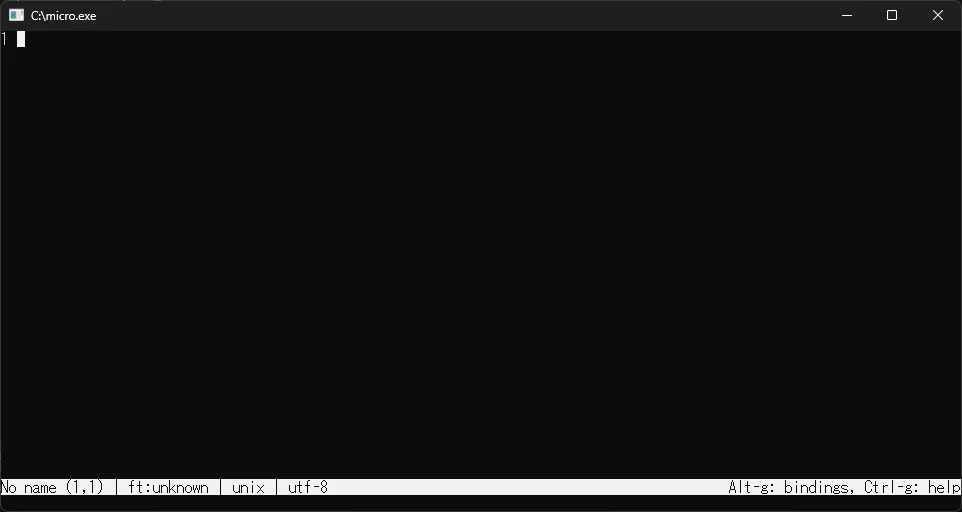

## micro herunterladen
https://github.com/zyedidia/micro/releases

Öffnen Sie den obigen Link, klicken Sie auf `Show all XX assets` (wobei X eine Zahl ist) und laden Sie `micro-X.X.XX-win64.zip` (wobei X eine Zahl ist) herunter.
Entpacken Sie die ZIP-Datei und legen Sie alle Dateien in einem Ordner Ihrer Wahl ab.

## Umgebungsvariablen konfigurieren
Um `micro.exe` über die Eingabeaufforderung verwenden zu können, müssen Sie die Umgebungsvariablen konfigurieren.

1. Drücken Sie die `Win-Taste` + `R-Taste`, geben Sie `sysdm.cpl` ein und drücken Sie die `Eingabetaste`.
2. Klicken Sie in den `Systemeigenschaften` auf `Erweiterte Systemeinstellungen`.
3. Klicken Sie auf `Umgebungsvariablen`.
4. Wählen Sie `Path` unter `Systemvariablen` aus und klicken Sie auf `Bearbeiten`.
5. Klicken Sie auf `Neu` und fügen Sie den Pfad zum Ordner hinzu, der `micro.exe` enthält.
6. Klicken Sie auf `OK`, um alle Dialogfelder zu schließen.
7. Starten Sie die Eingabeaufforderung neu und geben Sie `nano` ein, um zu überprüfen, ob es ausgeführt werden kann.

## So verwenden Sie micro

Wenn Sie in der Eingabeaufforderung `micro` eingeben und ausführen, wird der folgende Bildschirm angezeigt.

Die wichtigsten Vorgänge und Tastenkombinationen sind wie folgt:

| Tastenkombination | Vorgang | 
|--------|-----| 
| Ctrl+Q | Datei schließen | 
| Ctrl+S | Datei speichern | 
| Ctrl+O | Datei öffnen | 
| Ctrl+A | Alles auswählen | 
| Ctrl+X | Auswahl ausschneiden | 
| Ctrl+C | Auswahl kopieren | 
| Ctrl+V | Einfügen | 
| Ctrl+Z | Rückgängig machen | 
| Ctrl+Y | Wiederholen | 
| Ctrl+E | Editor-Befehl ausführen | 

## Referenz
- [micro](https://micro-editor.github.io/)
