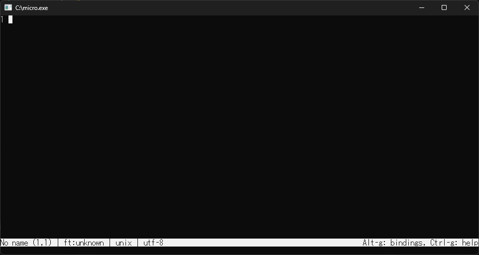

## Download micro
https://github.com/zyedidia/micro/releases

Open the link above, click `Show all XX assets` (where X is a number), and download `micro-X.X.XX-win64.zip` (where X is a number).
Unzip the zip file and place the files in a folder of your choice.

## Set Environment Variables
To use `micro.exe` from the command prompt, you need to set the environment variables.

1. Press `Win key` + `R key`, type `sysdm.cpl`, and press `Enter`.
2. Click `System Properties` in `System Properties`.
3. Click `Environment Variables`.
4. Select `Path` under `System variables` and click `Edit`.
5. Click `New` and add the path of the folder containing `micro.exe`.
6. Click `OK` to close all dialogs.
7. Restart the command prompt and type `nano` to check if it can be executed.

## How to use micro

When you type `micro` in the command prompt and execute it, the following screen is displayed.

The main operations and shortcut keys are as follows.

| Shortcut Key | Operation | 
|--------|-----| 
| Ctrl+Q | Close file | 
| Ctrl+S | Save file | 
| Ctrl+O | Open file | 
| Ctrl+A | Select all | 
| Ctrl+X | Cut selection | 
| Ctrl+C | Copy selection | 
| Ctrl+V | Paste | 
| Ctrl+Z | Undo | 
| Ctrl+Y | Redo | 
| Ctrl+E | Execute editor command | 

## Reference
- [micro](https://micro-editor.github.io/)
