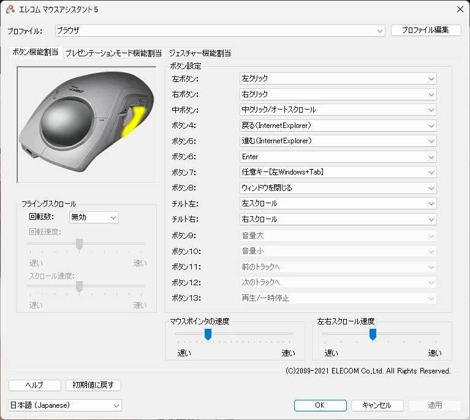

# Elecom ट्रैकबॉल Deft Pro M-DPT1MRBK के बारे में

Elecom का ट्रैकबॉल "Deft Pro M-DPT1MRBK" खरीदे हुए मुझे लगभग एक सप्ताह हो गया है, इसलिए मैं अपने उपयोग के अनुभव की समीक्षा करूंगा।

 **मुख्य विशेषताएं** 
- बटनों की संख्या 8 है, जो काफी है
- तीन तरीकों से कनेक्ट किया जा सकता है: वायर्ड, वायरलेस रिसीवर, और ब्लूटूथ
- बड़ी गेंद (मध्यम आकार का व्यास 44 मिमी)
- Amazon पर खरीद मूल्य: ￥7,012 (2 मई 2021 तक)

## अच्छे बिंदु
- माउस की तुलना में कलाई को हिलाने की आवश्यकता नहीं होती है, जिससे कलाई पर तनाव कम होता है
- बहुत सारे बटन होने के कारण, आप बटनों को विभिन्न कार्य सौंप सकते हैं

वर्तमान में, इसे ऊपर के रूप में सेट किया गया है। आप प्रत्येक एप्लिकेशन के लिए बटन असाइनमेंट भी बदल सकते हैं।
* बटन असाइनमेंट के लिए समर्पित सॉफ़्टवेयर इंस्टॉलेशन आवश्यक है।
- चूंकि गेंद बड़ी है, इसलिए ट्रैकबॉल के बीच भी बारीक गति करना अपेक्षाकृत आसान है

## बुरे बिंदु
- ट्रैकबॉल के चारों ओर धूल जमा हो जाती है, इसलिए गेंद को नियमित रूप से (हर कुछ दिनों में लगभग एक बार) निकालना और साफ करना आवश्यक है
- तर्जनी, मध्यमा आदि से कर्सर ले जाना, और अंगूठे से माउस व्हील चलाना माउस से अलग अहसास देता है, इसलिए इसकी आदत पड़ने में समय लगता है
- यद्यपि मैंने ऊपर लिखा है कि बारीक हलचल करना आसान है, ट्रैकबॉल के साथ कर्सर को 1 पिक्सेल से ले जाना अभी भी मुश्किल है
- बायां बटन दबाते समय व्हील को संचालित नहीं किया जा सकता है (उदाहरण के लिए, जब आप पेंट में किसी क्षेत्र का चयन करते समय ज़ूम इन/आउट करना चाहते हैं)

कुल मिलाकर, हालांकि मुझे लगता है कि यह ट्रैकबॉल के लिए महंगा है, लेकिन आमतौर पर इसे चलाना काफी आसान है, और मुझे लगता है कि मेरे काम की उत्पादकता बढ़ गई है।
मुझे उम्मीद है कि यह उन लोगों के लिए उपयोगी होगा जो इसे खरीदने पर विचार कर रहे हैं।
