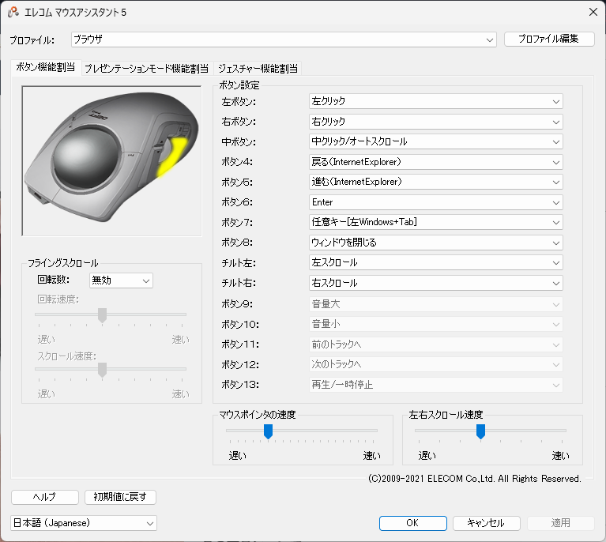

# О трекболе Elecom Deft Pro M-DPT1MRBK

Прошла примерно неделя с момента покупки трекбола Elecom "Deft Pro M-DPT1MRBK", поэтому я сделаю обзор своих впечатлений от его использования.

 **Основные особенности** 
- Большое количество кнопок (8 кнопок)
- Можно подключить 3 способами: по кабелю, через беспроводной ресивер и Bluetooth
- Большой размер шара (средний диаметр 44 мм)
- Цена покупки на Amazon: 7 012 иен (по состоянию на 2 мая 2021 года)

## Плюсы
- По сравнению с мышью нет необходимости двигать запястьем, поэтому нагрузка на запястье снижается
- Поскольку кнопок много, им можно назначать различные функции

В настоящее время я назначил их так, как показано выше. Вы также можете изменять назначения кнопок для каждого приложения.
※ Для назначения кнопок требуется установка специального программного обеспечения.
- Поскольку шар большой, делать точные движения относительно легко по сравнению с другими трекболами

## Минусы
- Вокруг трекбола скапливается пыль, поэтому необходимо регулярно (раз в несколько дней) снимать шар и чистить его
- Поскольку ощущение от работы отличается от мыши (перемещение курсора указательным и средним пальцами, управление колесиком мыши большим пальцем), требуется время, чтобы привыкнуть
- Хотя я написал выше, что легко делать точные движения, всё же трудно перемещать курсор на один пиксель с помощью трекбола
- Нельзя использовать колесико, удерживая левую кнопку (например, если вы хотите изменить масштаб при выделении области в Paint)

В заключение, я думаю, что это один из самых дорогих трекболов, но в целом им довольно легко управлять, и я думаю, что моя работа стала более продуктивной.
Надеюсь, это будет полезно для тех, кто рассматривает возможность покупки.
