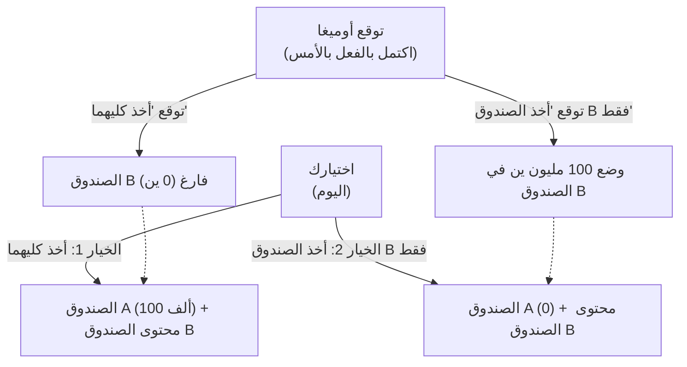

## 1. لعبة الاختيار النهائي

يظهر أمامك كائن فضائي يتمتع بذكاء خارق يُدعى "أوميغا".
أوميغا خبير في تحليل السلوك البشري، ويمتلك قدرة مرعبة على **"توقع الاختيار التالي الذي سيتخذه الشخص بدقة تقارب 100%"**. في التجارب السابقة، لم تخطئ توقعات أوميغا أبدًا.

يضع أوميغا أمامك صندوقين:
- **الصندوق A**: صندوق شفاف. يحتوي بالتأكيد على **"100 ألف ين"**.
- **الصندوق B**: صندوق لا يمكن رؤية ما بداخله. يحتوي إما على **"100 مليون ين"** أو أنه **"فارغ (0 ين)"**.

يطلب منك أوميغا اختيار أحد الإجراءين التاليين:

- **الخيار 1 "أخذ كلا الصندوقين"**: تحصل على الـ 100 ألف ين في الصندوق A، وما بداخل الصندوق B.
- **الخيار 2 "أخذ الصندوق B فقط"**: تحصل فقط على ما بداخل الصندوق B. ويجب عليك التخلي عن الـ 100 ألف ين الموجودة في الصندوق A.

إذا سمعت هذا فقط، فمن المؤكد أن أي شخص سيقرر "أخذ كلا الصندوقين".
لكن، أضاف أوميغا "قاعدة" مرعبة.

**【قاعدة أوميغا】**
> "بالأمس، توقعت بالفعل 'أي خيار ستتخذه' اليوم، وقمت بإعداد محتويات الصندوق B.
> إذا توقعت أنك ستكون جشعًا وتختار 'أخذ كلا الصندوقين'، فقد تركت الصندوق B **فارغًا**.
> إذا توقعت أنك لن تكون جشعًا وتختار 'أخذ الصندوق B فقط'، فقد وضعت في الصندوق B **100 مليون ين**."

الآن، يجب عليك أن تتخذ قرارك.
**هل يجب عليك "أخذ كلا الصندوقين"؟ أم يجب عليك "أخذ الصندوق B فقط"؟**

---

## 2. تصادم "منطقين مثاليين"

ابتكر هذا اللغز الفيزيائي ويليام نيوكومب في عام 1969، ونشره الفيلسوف روبرت نوزيك.
بمجرد نشره، انقسمت آراء علماء الرياضيات والفلاسفة العباقرة في جميع أنحاء العالم إلى "نصفين"، مما أثار جدلًا كبيرًا.

والسبب هو أن **هناك "منطقًا مثاليًا لا يمكن دحضه مطلقًا" لكلا الخيارين**.

### المنطق 1: حجة فريق "أخذ الصندوق B فقط" (تعظيم القيمة المتوقعة)

> "دقة توقعات أوميغا تقارب 100%، أليس كذلك؟ إذًا، وفقًا للبيانات السابقة، يجب أن نثق في أوميغا.
> إذا اخترت 'أخذ كليهما'، فسيكتشف أوميغا ذلك، وستكون النتيجة 100 ألف ين فقط.
> إذا اخترت 'أخذ الصندوق B فقط'، فسيكتشف أوميغا ذلك، وستكون النتيجة 100 مليون ين.
> حتى الأحمق يعرف أيهما يفضل بين 100 ألف ين و100 مليون ين. لذا **يجب عليك بالتأكيد 'أخذ الصندوق B فقط'**!"

يعتمد هذا التفكير على "نظرية المنفعة المتوقعة"، والتي تثق ببساطة في البيانات الإحصائية السابقة والقيم المتوقعة.

### المنطق 2: حجة فريق "أخذ كلا الصندوقين" (الاستراتيجية المهيمنة)

> "انتظر لحظة. قام أوميغا بالتوقع ووضع المحتويات في الصندوق B **'بالأمس'**، أليس كذلك؟
> هذا يعني أنه في هذه اللحظة، محتويات الصندوق B إما أن 'يحتوي على 100 مليون ين' أو 'فارغ'، و**لن تتغير أبدًا** بعد الآن.
> 
> السيناريو 1: إذا كان الصندوق B يحتوي بالفعل على 100 مليون ين، فإن اختيار 'أخذ كليهما' يعطيك 100 مليون و100 ألف ين، بينما 'B فقط' يعطيك 100 مليون ين.
> السيناريو 2: إذا كان الصندوق B فارغًا بالفعل، فإن اختيار 'أخذ كليهما' يعطيك 100 ألف ين، بينما 'B فقط' يعطيك 0 ين.
> 
> في كلا السيناريوهين، **اختيار 'أخذ كليهما' يمنحك بالتأكيد 100 ألف ين إضافية**!
> بغض النظر عما أختاره الآن، لا توجد آلة زمن لتغيير تصرفات أوميغا بالأمس. لذا **يجب عليك بالتأكيد 'أخذ كلا الصندوقين'**!"

يعتمد هذا التفكير على "الاستراتيجية المهيمنة" (Dominant Strategy) في نظرية الألعاب، والتي تعني "اختيار الخيار الأفضل لنفسك بغض النظر عن الإجراء الذي يتخذه الخصم".

---

## 3. هل تؤمن بـ "الإرادة الحرة"؟

فريق "أخذ الصندوق B فقط" وفريق "أخذ كلا الصندوقين".
بعد الاستماع إلى كلتا الحجتين، أيهما تعتقد أنه على صواب؟

في الواقع، لا توجد "إجابة رياضية مثالية ووحيدة" لهذه المفارقة حتى يومنا هذا.
والسبب هو أن في صميم هذه المشكلة يكمن أعظم سؤال فلسفي للبشرية: **"الحتمية مقابل الإرادة الحرة"**.

### الأشخاص الذين أجابوا "أخذ الصندوق B فقط" (الحتميون)
الأشخاص الذين اتخذوا هذا الخيار يقبلون لا شعوريًا **"الحتمية (كل مستقبل في هذا العالم محدد منذ البداية)"**.
قدرة أوميغا على توقع المستقبل بنسبة 100% تعني أن قرارك الحالي لم يتم اختياره بـ "إرادتك الحرة"، بل "كان مقدرًا لك أن تختاره منذ الأمس بسبب قوانين الفيزياء في الكون وحركة الخلايا العصبية في الدماغ".
بما أن المستقبل لا يمكن تغييره، فإن التفكير هو أن الانقياد لـ "مصير أخذ الصندوق B فقط" كما توقع أوميغا هو الأمر الأكثر عقلانية.

### الأشخاص الذين أجابوا "أخذ كلا الصندوقين" (المؤمنون بالإرادة الحرة)
الأشخاص الذين اتخذوا هذا الخيار يؤمنون لا شعوريًا بـ **"الإرادة الحرة (يمكنك شق طريق مستقبلك باختياراتك الخاصة)"**.
لأنهم يؤمنون بأنه "بغض النظر عن توقعات أوميغا بالأمس، يمكنني تغيير خياري بإرادتي الحالية"، فإنهم "يتخذون إجراءً يضيف 100 ألف ين في هذه اللحظة، بغض النظر عن محتويات الصندوق المحددة مسبقًا".
حتى لو كانت النتيجة أن أوميغا توقع ذلك وكان الصندوق فارغًا، فهم يمتلكون المنطق الذي يقتنع بأنه "لا مفر من ذلك لأنه نتيجة لاتخاذ الإجراء الصحيح منطقيًا".

---

## 4. السفر عبر الزمن وانهيار السببية

ما يزيد من تعقيد مفارقة نيوكومب هو انعكاس "السببية (هناك سبب وهناك نتيجة)".

في عالمنا المعتاد والمنطقي،
"اختياري اليوم (السبب)" يصنع "نتيجة الغد".

لكن في لعبة أوميغا،
يبدو أن "اختياري اليوم (السبب)" يحدد **"تصرفات أوميغا بالأمس** (النتيجة)".
يحدث ما يسمى بـ "السببية العكسية" (Backward Causality)، حيث تحدد أفعال المستقبل حقائق الماضي.

إذا كان هناك "متوقع مثالي" مثل أوميغا في الكون، فإن الفطرة السليمة التي نؤمن بها بأن "الوقت يتدفق من الماضي إلى المستقبل" ستنهار.

---

## 5. الخلاصة: التجارب الفكرية تكشف عن "عقلانية" البشر

أي صندوق ستفتحه؟

لقد مر أكثر من نصف قرن منذ تقديم هذه المفارقة، ولكن في استطلاعات الفلسفة والاقتصاد، ينقسم الناس بشكل مذهل إلى النصف تقريبًا بين "فريق أخذ كليهما" و"فريق أخذ B فقط".
والمثير للاهتمام أن كلا المعسكرين يعتقدان بصدق أن "منطق الطرف الآخر معيب تمامًا وهم حمقى".

"ما هو الحكم العقلاني؟"
بغض النظر عن مدى تطور الاقتصاد أو الرياضيات، فإن الأمر ينتهي في النهاية إلى فلسفة "كيف ينظر البشر إلى هذا العالم". مفارقة نيوكومب هي تجربة فكرية جميلة وشريرة في نفس الوقت، وتبرز حدود المنطق.
