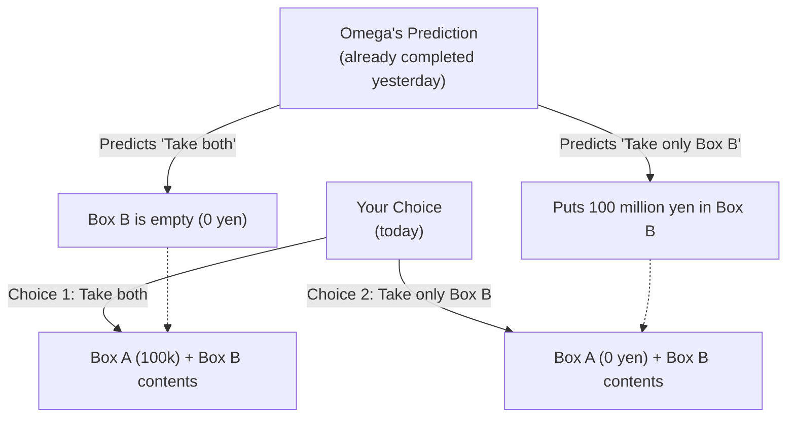

## 1. The Ultimate Choice Game

An alien with superintelligence who calls himself "Omega" appears before you.
Omega is a master of analyzing human behavior and possesses the terrifying ability to **"predict what choice a subject will make next with almost 100% accuracy."** In past experiments, Omega's predictions have never been wrong.

Omega places two boxes in front of you.
- **Box A**: A transparent box. It contains exactly **100,000 yen**.
- **Box B**: An opaque box. It contains either **100 million yen** or is **empty (0 yen)**.

Omega tells you to choose one of the following two actions.

- **Choice 1: "Take both boxes"**: You get both the 100,000 yen in Box A and the contents of Box B.
- **Choice 2: "Take only Box B"**: You get only the contents of Box B. You must give up the 100,000 yen in Box A.

Hearing just this, anyone would decide to "Take both boxes".
However, Omega adds a terrifying "rule".

**[Omega's Rule]**
> "Yesterday, I already predicted 'which choice you will make' today and set the contents of Box B.
> If I predicted you would greedily choose to 'Take both boxes', I left Box B **empty**.
> If I predicted you would not be greedy and choose to 'Take only Box B', I put **100 million yen** in Box B."

Now, you must make a choice.
**Should you "Take both boxes"? Or should you "Take only Box B"?**

---

## 2. Two Clashing "Perfect Logics"

This problem was devised by physicist William Newcomb in 1969 and published by philosopher Robert Nozick.
As soon as it was published, the opinions of brilliant mathematicians and philosophers around the world were split right down the middle, causing a massive controversy.

This is because **there is an "absolutely irrefutable, perfect logic" for either choice.**

### Logic 1: The argument of the "Take only Box B" camp (Expected Value Maximization)

> "Omega's prediction accuracy is almost 100%, right? Then we should trust Omega based on past data.
> If I choose to 'Take both', Omega has foreseen it, and the result is just 100,000 yen.
> If I choose to 'Take only Box B', Omega has foreseen it, and the result is 100 million yen.
> Even a fool knows whether they want 100,000 yen or 100 million yen. Therefore, I should **absolutely 'Take only Box B'**!"

This thinking is based on "Expected Utility Theory," which straightforwardly believes in past statistical data and expected values.

### Logic 2: The argument of the "Take both boxes" camp (Dominant Strategy)

> "Wait a minute. Omega predicted and put the contents in Box B **'yesterday'**, right?
> That means, at this moment, the contents of Box B are already determined to be either 'contains 100 million yen' or 'empty', and **it will never change**.
> 
> Pattern 1: If Box B already contains 100 million yen, choosing to 'Take both' gives me 100.1 million yen, and choosing 'Only B' gives me 100 million yen.
> Pattern 2: If Box B is already empty, choosing to 'Take both' gives me 100,000 yen, and choosing 'Only B' gives me 0 yen.
> 
> In either pattern, **choosing to 'Take both' absolutely gets me 100,000 yen more**!
> Whatever I choose now, Omega's actions yesterday cannot be rewritten by a time machine. Therefore, I should **absolutely 'Take both boxes'**!"

This thinking is based on the "Dominant Strategy" in game theory, which says to "choose the option that is advantageous to you regardless of what action the opponent takes."

---

## 3. Do you believe in "Free Will"?

"The camp that takes only Box B" and "The camp that takes both".
After hearing both arguments, which did you think was right?

Actually, to this day, there is no "mathematically perfect single correct answer" to this paradox.
Because at the root of this problem lies humanity's greatest philosophical question: **"Determinism vs. Free Will"**.

### Those who answered "Take only Box B" (Determinists)
People who make this choice subconsciously accept **"Determinism (everything in the future of this world is determined from the beginning)"**.
The fact that Omega can predict the future with 100% accuracy means that your current decision was not chosen by "your free will," but rather "you were already destined to choose that way since yesterday by the physical laws of the universe and the movement of neurons in your brain."
Since the future cannot be changed, this view holds that it is most rational to follow Omega's prediction and ride the "destiny of taking only Box B."

### Those who answered "Take both boxes" (Free Will advocates)
People who make this choice subconsciously believe in **"Free Will (you can carve out the future through your own choices)"**.
Because they believe that "regardless of Omega's prediction yesterday, I can change my choice with my own will right now," they take the action to "add 100,000 yen at this very moment, regardless of the already determined contents of the box."
Even if the result is that Omega predicted it and the box is empty, they possess the logic to accept that "it cannot be helped because it is the result of taking logically correct action."

---

## 4. Time Travel and the Collapse of Causality

What makes Newcomb's paradox even more complicated is the reversal of "Causality (cause and effect)".

In the common-sense world we live in,
"My choice today (cause)" creates "Tomorrow's result".

However, in Omega's game,
It seems that "My choice today (cause)" determines "**Yesterday's** Omega's action (result)".
A "backward causality" occurs, where future actions determine past facts.

If a "perfect predictor" like Omega exists in the universe, even our common sense that "time flows from the past to the future" collapses.

---

## 5. Conclusion: A Thought Experiment that Uncovers Human "Rationality"

Which box will you open?

More than half a century has passed since this paradox was presented, but in surveys of philosophy and economics, opinions are beautifully split half-and-half between the "Take both" camp and the "Take only B" camp.
And interestingly, both camps genuinely believe that "the opponent's logic is completely bankrupt and foolish".

"What is a rational judgment?"
No matter how much economics and mathematics develop, in the end, it comes down to the philosophy of "how humans perceive this world." Newcomb's paradox is a magnificently mean and beautiful thought experiment that confronts us with the limits of logic.
