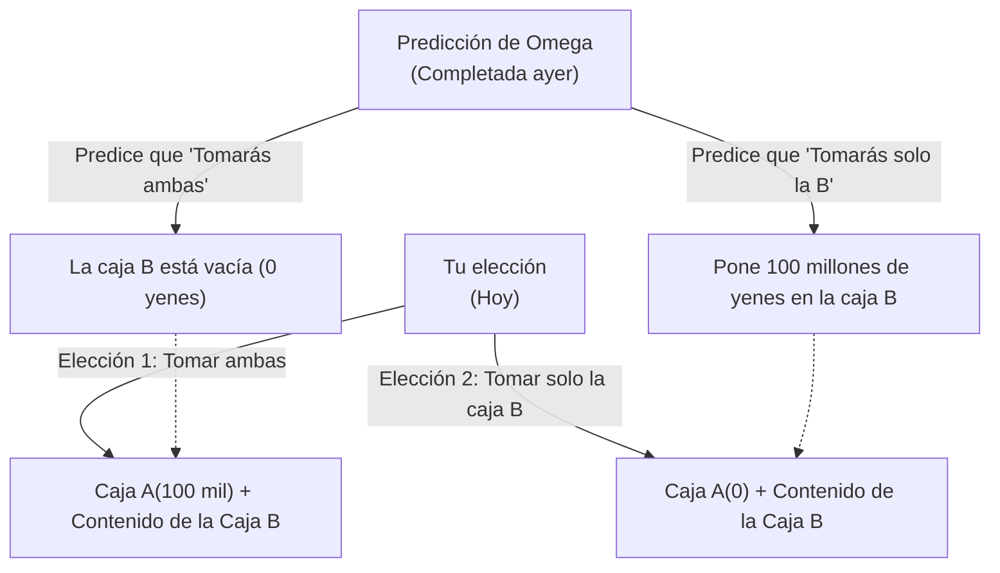

## 1. El Juego de la Elección Definitiva

Ante ti aparece un extraterrestre con superinteligencia que se hace llamar "Omega".
Omega es un maestro analizando el comportamiento humano y tiene la aterradora habilidad de **"predecir con casi un 100% de precisión qué elección tomará el sujeto a continuación"**. En experimentos pasados, las predicciones de Omega nunca han fallado.

Omega coloca dos cajas frente a ti.
- **Caja A**: Una caja transparente. Contiene con total seguridad **"100.000 yenes"**.
- **Caja B**: Una caja opaca. Contiene **"100 millones de yenes"** o bien está **"vacía (0 yenes)"**.

Omega te dice que debes elegir una de las siguientes dos acciones:

- **Elección 1 "Tomar ambas cajas"**: Te quedas con los 100.000 yenes de la caja A y el contenido de la caja B.
- **Elección 2 "Tomar solo la caja B"**: Te quedas únicamente con el contenido de la caja B. Debes renunciar a los 100.000 yenes de la caja A.

Al escuchar solo esto, cualquiera decidiría "Tomar ambas cajas".
Sin embargo, Omega ha añadido una "regla" aterradora.

**【La Regla de Omega】**
> "Ayer ya predije 'qué elección tomarás' hoy y preparé el contenido de la caja B en consecuencia.
> Si fuiste codicioso y predije que 'tomarías ambas cajas', dejé la caja B **vacía**.
> Si no fuiste codicioso y predije que 'tomarías solo la caja B', puse **100 millones de yenes** en la caja B."

Ahora, debes hacer tu elección.
**¿Deberías "Tomar ambas cajas"? ¿O deberías "Tomar solo la caja B"?**

---

## 2. El Choque de Dos "Lógicas Perfectas"

Este problema fue ideado por el físico William Newcomb en 1969 y presentado por el filósofo Robert Nozick.
Tan pronto como se publicó, las opiniones de los matemáticos y filósofos más brillantes del mundo se dividieron "exactamente por la mitad", desencadenando un gran debate.

La razón es que **existe una "lógica perfecta e irrefutable" para ambas opciones**.

### Lógica 1: El argumento del bando "Tomar solo la caja B" (Maximización del valor esperado)

> "¿La precisión de la predicción de Omega es casi del 100%, verdad? Entonces, basándonos en los datos pasados, deberíamos confiar en Omega.
> Si elijo 'Tomar ambas', Omega lo habrá previsto y el resultado serán apenas 100.000 yenes.
> Si elijo 'Tomar solo la caja B', Omega lo habrá previsto y el resultado serán 100 millones de yenes.
> Hasta un tonto sabe si prefiere 100.000 o 100 millones de yenes. ¡Por lo tanto, **absolutamente deberías 'Tomar solo la caja B'**!"

Este enfoque se basa en la "Teoría de la Utilidad Esperada", confiando ciegamente en los datos estadísticos pasados y el valor esperado.

### Lógica 2: El argumento del bando "Tomar ambas cajas" (Estrategia dominante)

> "Un momento. Omega predijo y puso el contenido en la caja B **'ayer'**, ¿verdad?
> Eso significa que, en este momento, el contenido de la caja B ya está fijado en '100 millones de yenes' o 'vacía', y **absolutamente no cambiará**.
> 
> Escenario 1: Si la caja B ya tiene 100 millones de yenes, elegir 'Tomar ambas' te da 100 millones y 100.000 yenes; si eliges 'Solo la B', te da 100 millones de yenes.
> Escenario 2: Si la caja B ya está vacía, elegir 'Tomar ambas' te da 100.000 yenes; si eliges 'Solo la B', te da 0 yenes.
> 
> En cualquiera de los dos escenarios, **¡elegir 'Tomar ambas' definitivamente te da 100.000 yenes más**!
> No importa lo que elijas ahora, la acción de Omega de ayer no puede reescribirse con una máquina del tiempo. ¡Por lo tanto, **absolutamente deberías 'Tomar ambas cajas'**!"

Este enfoque se basa en la "Estrategia Dominante" en la Teoría de Juegos, que dice "elige la opción que te sea más favorable, independientemente de la acción que tome el oponente".

---

## 3. ¿Crees en el "Libre Albedrío"?

"El bando de tomar solo la caja B" y "El bando de tomar ambas cajas".
Después de escuchar ambos argumentos, ¿cuál crees que tiene la razón?

En realidad, hasta el día de hoy, no existe una "única respuesta matemática perfecta" a esta paradoja.
Esto se debe a que en la raíz de este problema se esconde la mayor pregunta filosófica de la humanidad: **"Determinismo vs Libre Albedrío"**.

### Quienes respondieron "Tomar solo la caja B" (Deterministas)
Quienes hicieron esta elección están aceptando inconscientemente el **"Determinismo (todo el futuro de este mundo está decidido desde el principio)"**.
Que Omega pueda predecir el futuro al 100% significa que tu decisión actual no fue elegida por "tu libre albedrío", sino que "ya estabas destinado a elegir así desde ayer por las leyes físicas del universo y el movimiento de las neuronas en tu cerebro".
Dado que el futuro no se puede cambiar, la perspectiva es que es más racional someterse al "destino de tomar solo la caja B" tal como predijo Omega.

### Quienes respondieron "Tomar ambas cajas" (Defensores del libre albedrío)
Quienes hicieron esta elección creen inconscientemente en el **"Libre albedrío (puedes forjar el futuro con tus propias decisiones)"**.
Precisamente porque creen que "sin importar cuál fue la predicción de Omega ayer, puedo cambiar mi elección con mi propia voluntad ahora", actúan para "añadir 100.000 yenes en este mismo momento, independientemente del contenido ya determinado de la caja".
Incluso si el resultado es que Omega lo predijo y la caja está vacía, poseen una lógica que les permite aceptar que "no se puede evitar porque es el resultado de tomar una acción lógicamente correcta".

---

## 4. Viaje en el Tiempo y el Colapso de la Causalidad

Lo que complica aún más la paradoja de Newcomb es la inversión de la "Causalidad (hay una causa y un resultado)".

En el mundo de sentido común en el que vivimos,
"Mi elección de hoy (causa)" crea "el resultado de mañana".

Sin embargo, en el juego de Omega,
Parece que "Mi elección de hoy (causa)" determina "la acción de Omega de **ayer** (resultado)".
Ocurre una "Causalidad retrospectiva" (Backward Causality), donde una acción futura determina un hecho pasado.

Si en el universo existiera un "predictor perfecto" como Omega, incluso nuestro sentido común de que "el tiempo fluye del pasado hacia el futuro" se desmoronaría.

---

## 5. Conclusión: El experimento mental que revela la "Racionalidad" humana

¿Qué caja abrirías?

Ha pasado más de medio siglo desde que se propuso esta paradoja, pero en las encuestas de filosofía y economía, la gente se divide sorprendentemente en un 50/50 entre "los que toman ambas" y "los que toman solo la B".
Y lo fascinante es que ambos bandos creen genuinamente que "el otro bando es un idiota cuya lógica está completamente rota".

"¿Qué es una decisión racional?"
No importa cuánto avancen la economía o las matemáticas, al final siempre llegamos a la filosofía de "cómo el ser humano percibe este mundo". La Paradoja de Newcomb es el experimento mental más malicioso y hermoso, que nos confronta con los límites de la lógica.
