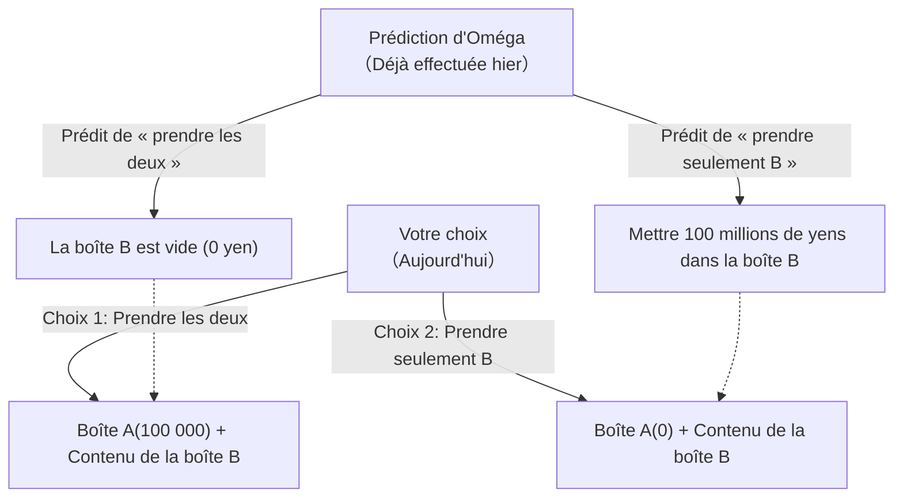

## 1. Le jeu du choix ultime

Devant vous apparaît un extraterrestre doté d'une super-intelligence qui se fait appeler « Oméga ».
Oméga est un expert en analyse du comportement humain et possède une capacité effrayante : **« Il peut prédire le prochain choix d'un sujet avec une précision de près de 100 % »**. Lors de toutes les expériences passées, la prédiction d'Oméga ne s'est jamais trompée.

Oméga place deux boîtes devant vous.
- **Boîte A** : Une boîte transparente. Elle contient à coup sûr **« 100 000 yens »**.
- **Boîte B** : Une boîte opaque. Elle contient soit **« 100 millions de yens »**, soit elle est **« vide (0 yen) »**.

Oméga vous demande de choisir l'une des deux actions suivantes :

- **Choix 1 « Prendre les deux boîtes »** : Vous recevez les 100 000 yens de la boîte A et le contenu de la boîte B.
- **Choix 2 « Prendre seulement la boîte B »** : Vous ne recevez que le contenu de la boîte B. Vous devez renoncer aux 100 000 yens de la boîte A.

En entendant seulement cela, n'importe qui déciderait de « Prendre les deux boîtes ».
Cependant, Oméga a ajouté une « règle » terrifiante.

**【La Règle d'Oméga】**
> « Hier, j'ai déjà prédit 'lequel des deux choix' tu ferais aujourd'hui, et j'ai préparé le contenu de la boîte B en conséquence.
> Si j'ai prédit que tu serais avide et choisirais de 'prendre les deux boîtes', j'ai laissé la boîte B **vide**.
> Si j'ai prédit que tu ne serais pas avide et choisirais de 'prendre seulement la boîte B', j'ai mis **100 millions de yens** dans la boîte B. »

Maintenant, vous devez faire votre choix.
**Devez-vous « prendre les deux boîtes » ? Ou devez-vous « prendre seulement la boîte B » ?**

---

## 2. L'affrontement de deux « logiques parfaites »

Ce problème a été conçu par le physicien William Newcomb en 1969 et présenté par le philosophe Robert Nozick.
Dès sa publication, les opinions des mathématiciens et philosophes les plus brillants du monde se sont divisées en deux, provoquant une énorme controverse.

C'est parce qu'**il existe une « logique parfaite et absolument irréfutable » pour chacune des options**.

### Logique 1 : L'argument du camp « Prendre seulement la boîte B » (Maximisation de l'espérance)

> « La précision de prédiction d'Oméga est de presque 100 %, n'est-ce pas ? Dans ce cas, en suivant les données passées, on devrait faire confiance à Oméga.
> Si je choisis de 'prendre les deux', Oméga l'a deviné, et le résultat est seulement de 100 000 yens.
> Si je choisis de 'prendre seulement la boîte B', Oméga l'a deviné, et le résultat est de 100 millions de yens.
> Même un idiot sait ce qu'il préfère entre 100 000 yens et 100 millions de yens. Donc, **je dois absolument 'prendre seulement la boîte B'** ! »

Cette approche est basée sur la « théorie de l'utilité espérée », qui fait naïvement confiance aux données statistiques passées et aux valeurs attendues.

### Logique 2 : L'argument du camp « Prendre les deux boîtes » (Stratégie dominante)

> « Attends une minute. Oméga a fait sa prédiction et placé le contenu dans la boîte B **'hier'**, n'est-ce pas ?
> Cela signifie qu'à cet instant précis, le contenu de la boîte B est déjà soit 'contient 100 millions de yens', soit 'est vide', et **il ne changera plus jamais**.
> 
> Cas 1 : Si la boîte B contient déjà 100 millions de yens, choisir 'les deux' donne 100 millions 100 000 yens, tandis que choisir 'seulement B' donne 100 millions de yens.
> Cas 2 : Si la boîte B est déjà vide, choisir 'les deux' donne 100 000 yens, tandis que 'seulement B' donne 0 yen.
> 
> Quel que soit le cas, **choisir de 'prendre les deux' garantit absolument 100 000 yens de plus** !
> Ce n'est pas parce que je choisis maintenant l'une ou l'autre option que l'action d'Oméga d'hier sera modifiée par une machine à remonter le temps. Donc, **je dois absolument 'prendre les deux boîtes'** ! »

Cette approche est basée sur la « stratégie dominante » (Dominant Strategy) en théorie des jeux, qui stipule de « choisir l'option la plus avantageuse pour soi, quelle que soit l'action de l'autre ».

---

## 3. Croyez-vous au « libre arbitre » ?

Le camp « Prendre seulement la boîte B » et le camp « Prendre les deux ».
Après avoir entendu les deux arguments, lequel pensez-vous avoir raison ?

En réalité, à ce jour, il n'existe pas de « seule réponse mathématiquement parfaite » à ce paradoxe.
C'est parce qu'au cœur de ce problème se cache la plus grande question philosophique de l'humanité : **« Déterminisme contre Libre Arbitre »**.

### Ceux qui ont répondu « Prendre seulement la boîte B » (Déterministes)
Les personnes ayant fait ce choix acceptent inconsciemment le **« déterminisme (tout l'avenir de ce monde est déjà fixé depuis le début) »**.
Le fait qu'Oméga puisse prédire l'avenir à 100 % signifie que votre décision actuelle n'est pas choisie par « votre libre arbitre », mais qu'elle était « déjà destinée à être choisie hier par les lois physiques de l'univers et les mouvements des neurones de votre cerveau ».
Puisque l'avenir ne peut être changé, l'idée est qu'il est plus rationnel de suivre la prédiction d'Oméga et d'accepter le « destin de prendre seulement la boîte B ».

### Ceux qui ont répondu « Prendre les deux boîtes » (Partisans du libre arbitre)
Les personnes ayant fait ce choix croient inconsciemment au **« libre arbitre (l'avenir peut être ouvert par nos propres choix) »**.
Parce qu'ils croient que « peu importe la prédiction d'Oméga hier, je peux changer mon choix par ma propre volonté aujourd'hui », ils prennent l'action d'ajouter 100 000 yens à cet instant précis, indépendamment du contenu déjà fixé de la boîte.
Même si Oméga l'avait prédit et que la boîte s'avérait vide, ils acceptent ce résultat en se disant : « C'est inévitable puisque c'est le résultat d'une action logiquement correcte ».

---

## 4. Le voyage dans le temps et l'effondrement de la causalité

Ce qui rend le paradoxe de Newcomb encore plus compliqué est l'inversion de la « causalité (il y a une cause et il y a un effet) ».

Dans le monde de bon sens dans lequel nous vivons,
« mon choix d'aujourd'hui (cause) » crée « le résultat de demain ».

Cependant, dans le jeu d'Oméga,
il semble que « mon choix d'aujourd'hui (cause) » détermine « l'action d'Oméga d'**hier** (résultat) ».
C'est une « causalité rétrograde » (backward causality) où une action future détermine un fait passé.

Si un « prédicteur parfait » comme Oméga existait dans l'univers, même notre croyance de bon sens selon laquelle « le temps s'écoule du passé vers l'avenir » s'effondrerait.

---

## 5. Conclusion : La « rationalité » humaine mise à nu par les expériences de pensée

Quelle boîte allez-vous ouvrir ?

Plus d'un demi-siècle s'est écoulé depuis que ce paradoxe a été présenté, mais dans les sondages de philosophie et d'économie, les personnes se divisent remarquablement à peu près à parts égales entre le « camp Prendre les deux » et le « camp Prendre seulement B ».
Et ce qui est intéressant, c'est que chaque camp croit sincèrement que « l'autre camp est constitué d'idiots dont la logique est complètement erronée ».

« Qu'est-ce qu'un jugement rationnel ? »
Peu importe le développement de l'économie ou des mathématiques, on finit toujours par aboutir à la philosophie sur « comment les humains perçoivent ce monde ». Le paradoxe de Newcomb est la plus méchante et la plus belle des expériences de pensée, exposant les limites de la logique.
