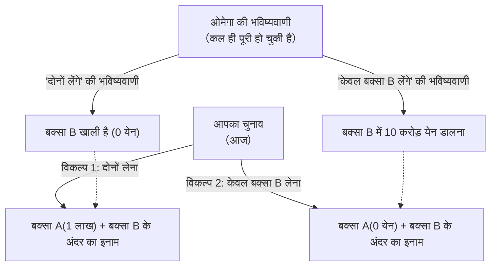

## 1. परम चयन का खेल

आपके सामने खुद को 'ओमेगा' कहने वाला एक सुपर-इंटेलिजेंट (अति-बुद्धिमान) एलियन प्रकट होता है।
ओमेगा मानव व्यवहार का विश्लेषण करने में माहिर है और उसके पास एक भयानक क्षमता है: **"वह लगभग 100% सटीकता के साथ भविष्यवाणी कर सकता है कि कोई व्यक्ति अगला क्या विकल्प चुनेगा"**। पिछले प्रयोगों में भी, ओमेगा की भविष्यवाणी कभी गलत नहीं हुई है।

ओमेगा आपके सामने 2 बक्से रखता है।
- **बक्सा A**: पारदर्शी बक्सा। इसमें निश्चित रूप से **"1 लाख येन"** हैं।
- **बक्सा B**: अपारदर्शी बक्सा (जिसके अंदर नहीं देखा जा सकता)। इसमें या तो **"10 करोड़ येन"** हैं, या फिर यह **"बिल्कुल खाली (0 येन)"** है।

ओमेगा आपसे निम्नलिखित 2 विकल्पों में से कोई एक चुनने को कहता है:

- **विकल्प 1 "दोनों बक्से लेना"**: आपको बक्सा A का 1 लाख येन और बक्सा B के अंदर का इनाम, दोनों मिलेंगे।
- **विकल्प 2 "केवल बक्सा B लेना"**: आपको केवल बक्सा B के अंदर का इनाम मिलेगा। आपको बक्सा A के 1 लाख येन छोड़ने होंगे।

इतना सुनकर, कोई भी "दोनों बक्से लेना" ही तय करेगा।
लेकिन, ओमेगा ने एक खतरनाक 'नियम' जोड़ दिया है।

**【ओमेगा का नियम】**
> "मैंने कल ही भविष्यवाणी कर ली थी कि तुम आज 'कौन सा विकल्प चुनोगे', और उसी के अनुसार मैंने बक्सा B में इनाम रख दिया था।
> यदि मैंने भविष्यवाणी की थी कि तुम लालच में आकर 'दोनों बक्से लोगे', तो मैंने बक्सा B को **खाली** छोड़ दिया है।
> यदि मैंने भविष्यवाणी की थी कि तुम बिना लालच के 'केवल बक्सा B लोगे', तो मैंने बक्सा B में **10 करोड़ येन** डाल दिए हैं।"

अब, आपको अपना चुनाव करना है।
**क्या आपको "दोनों बक्से लेने" चाहिए? या फिर "केवल बक्सा B लेना" चाहिए?**

---

## 2. टकराते हुए 2 "परिपूर्ण तर्क"

इस समस्या की कल्पना 1969 में भौतिक विज्ञानी विलियम न्यूकॉम्ब द्वारा की गई थी, और इसे दार्शनिक रॉबर्ट नोज़िक ने प्रस्तुत किया था।
इसके प्रस्तुत होते ही, दुनिया भर के प्रतिभाशाली गणितज्ञों और दार्शनिकों की राय "दो हिस्सों" में बँट गई, और इसने एक बड़ी बहस छेड़ दी।

ऐसा इसलिए है क्योंकि **दोनों ही विकल्पों के पक्ष में "पूरी तरह से अकाट्य और परिपूर्ण तर्क" मौजूद हैं**।

### तर्क 1: "केवल बक्सा B लेने" वाले पक्ष का दावा (अपेक्षित मूल्य का अधिकतमकरण)

> "ओमेगा की भविष्यवाणी की सटीकता लगभग 100% है, है ना? तो फिर पिछले डेटा के अनुसार, हमें ओमेगा पर विश्वास करना चाहिए।
> यदि मैं 'दोनों लेना' चुनता हूँ, तो ओमेगा ने इसे पहले ही भाँप लिया होगा, और परिणाम सिर्फ 1 लाख येन होगा।
> यदि मैं 'केवल बक्सा B लेना' चुनता हूँ, तो ओमेगा ने इसे भाँप लिया होगा, और परिणाम 10 करोड़ येन होगा।
> 1 लाख येन और 10 करोड़ येन में से कौन सा बेहतर है, यह तो कोई मूर्ख भी बता सकता है। इसलिए मुझे **निश्चित रूप से 'केवल बक्सा B लेना' चाहिए**!"

यह विचार "अपेक्षित उपयोगिता सिद्धांत" पर आधारित है, जो पिछले सांख्यिकीय डेटा और अपेक्षित मूल्यों पर सीधे विश्वास करता है।

### तर्क 2: "दोनों बक्से लेने" वाले पक्ष का दावा (प्रमुख रणनीति)

> "ज़रा रुको। ओमेगा ने भविष्यवाणी करके बक्सा B में इनाम **'कल'** ही रख दिया था, है ना?
> इसका मतलब है कि इस समय बक्सा B में या तो '10 करोड़ येन' हैं या वह 'खाली' है, और यह स्थिति **अब बिल्कुल भी नहीं बदलेगी**।
> 
> स्थिति 1: यदि बक्सा B में पहले से ही 10 करोड़ येन हैं, तो 'दोनों लेना' चुनने पर 10 करोड़ 1 लाख येन मिलेंगे, और 'केवल B' चुनने पर 10 करोड़ येन।
> स्थिति 2: यदि बक्सा B पहले से ही खाली है, तो 'दोनों लेना' चुनने पर 1 लाख येन मिलेंगे, और 'केवल B' चुनने पर 0 येन।
> 
> चाहे कोई भी स्थिति हो, **'दोनों लेने' का चुनाव करने से मुझे हमेशा 1 लाख येन ज़्यादा ही मिलेंगे**!
> अब मैं चाहे जो भी चुनूँ, कल के ओमेगा का काम किसी टाइम मशीन से बदला नहीं जा सकता। इसलिए मुझे **निश्चित रूप से 'दोनों बक्से लेने' चाहिए**!"

यह विचार गेम थ्योरी में "प्रमुख रणनीति (Dominant Strategy)" पर आधारित है, जिसका अर्थ है "सामने वाला चाहे जो भी करे, ऐसा विकल्प चुनें जो आपके लिए फायदेमंद हो"।

---

## 3. क्या आप "स्वतंत्र इच्छा" में विश्वास करते हैं?

"केवल बक्सा B लेने वाले" और "दोनों बक्से लेने वाले"।
दोनों के तर्क सुनकर, आपको कौन सा सही लगा?

दरअसल, आज तक इस विरोधाभास का "गणितीय रूप से पूर्ण और एकमात्र सही उत्तर" मौजूद नहीं है।
ऐसा इसलिए है क्योंकि इस समस्या के मूल में मानवता का सबसे बड़ा दार्शनिक प्रश्न छिपा है: **"नियतिवाद बनाम स्वतंत्र इच्छा"**।

### जिन्होंने "केवल बक्सा B लेना" चुना (नियतिवादी)
यह चुनाव करने वाले लोगों ने अचेतन रूप से **"नियतिवाद (इस दुनिया का सारा भविष्य शुरू से ही तय है)"** को स्वीकार कर लिया है।
ओमेगा का 100% सटीकता के साथ भविष्य की भविष्यवाणी कर सकने का मतलब है कि आपका वर्तमान निर्णय "आपकी स्वतंत्र इच्छा" द्वारा नहीं चुना गया था, बल्कि "ब्रह्मांड के भौतिक नियमों और मस्तिष्क के न्यूरॉन्स की गति के कारण, यह कल से ही तय हो गया था कि आप यही चुनेंगे।"
चूँकि भविष्य को बदला नहीं जा सकता, इसलिए यह सोचना सबसे तर्कसंगत है कि ओमेगा की भविष्यवाणी के अनुसार "केवल बक्सा B लेने की नियति" को स्वीकार कर लिया जाए।

### जिन्होंने "दोनों बक्से लेना" चुना (स्वतंत्र इच्छावादी)
यह चुनाव करने वाले लोग अचेतन रूप से **"स्वतंत्र इच्छा (भविष्य को अपने चुनावों से बनाया जा सकता है)"** में विश्वास करते हैं।
चूंकि वे यह मानते हैं कि "कल की ओमेगा की भविष्यवाणी जो भी रही हो, वे आज अपनी इच्छा से अपना विकल्प बदल सकते हैं," इसलिए वे "बक्से के पहले से तय हो चुके इनाम की परवाह किए बिना, इस क्षण में 1 लाख येन और जोड़ने का कार्य करते हैं।"
भले ही अंततः ओमेगा ने इसकी भविष्यवाणी कर ली हो और बक्सा खाली निकले, वे इस तर्क के समर्थक हैं कि "यह तार्किक रूप से सही कार्य का परिणाम था, इसलिए इसमें कुछ नहीं किया जा सकता था।"

---

## 4. टाइम ट्रैवल और कार्य-कारण का टूटना

न्यूकॉम्ब के विरोधाभास को और भी जटिल बनाने वाली बात "कार्य-कारण (एक कारण होता है और फिर उसका परिणाम)" का उल्टा होना है।

सामान्य दुनिया में जिसमें हम रहते हैं,
"आज का मेरा विकल्प (कारण)" ही "कल का परिणाम" बनाता है।

लेकिन ओमेगा के खेल में,
ऐसा लगता है कि "आज का मेरा विकल्प (कारण)" ही "**कल के** ओमेगा के कार्य (परिणाम)" को तय कर रहा है।
यहाँ "उल्टा कार्य-कारण (Backward Causality)" उत्पन्न हो रहा है, जहाँ भविष्य के कार्य अतीत के तथ्यों को निर्धारित कर रहे हैं।

यदि ओमेगा जैसा कोई "अचूक भविष्यवक्ता" ब्रह्मांड में मौजूद है, तो हमारी यह सामान्य मान्यता ही टूट जाएगी कि "समय अतीत से भविष्य की ओर बहता है।"

---

## 5. निष्कर्ष: विचार प्रयोग जो मानवीय "तार्किकता" को उजागर करता है

आप कौन सा बक्सा खोलेंगे?

इस विरोधाभास को प्रस्तुत किए जाने के आधी सदी से अधिक समय बीत चुका है, लेकिन दर्शन और अर्थशास्त्र के सर्वेक्षणों में आज भी लोगों की राय "दोनों बक्से लेने" और "केवल बक्सा B लेने" के बीच लगभग आधी-आधी बँटी हुई है।
और दिलचस्प बात यह है कि दोनों ही पक्ष पूरी तरह से यह मानते हैं कि "दूसरे पक्ष का तर्क बिल्कुल बकवास है और वे मूर्ख हैं।"

"तार्किक निर्णय क्या है?"
अर्थशास्त्र और गणित चाहे कितने भी विकसित हो जाएं, अंततः हम इसी दार्शनिक प्रश्न पर आकर रुकते हैं कि "मनुष्य इस दुनिया को कैसे देखता है।" न्यूकॉम्ब का विरोधाभास एक बेहद ही पेचीदा और खूबसूरत विचार प्रयोग है जो हमें तर्क की सीमाओं का एहसास कराता है。
