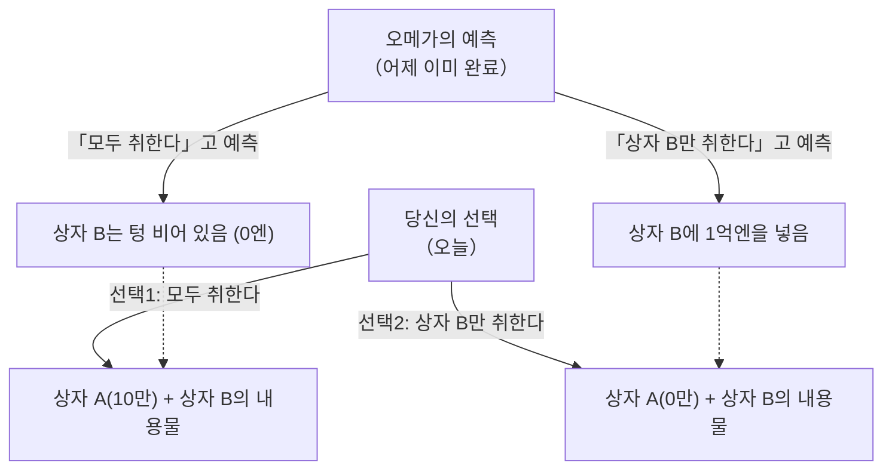

## 1. 궁극의 선택 게임

당신의 눈앞에, 스스로를 "오메가"라고 칭하는 초지능을 가진 외계인이 나타났습니다.
오메가는 인간의 행동을 분석하는 달인으로, **"대상자가 다음에 어떤 선택을 할지, 거의 100%의 정확도로 미래를 예측할 수 있다"**는 무서운 능력을 가지고 있습니다. 과거의 실험에서도 오메가의 예측은 단 한 번도 빗나간 적이 없습니다.

오메가는 당신 앞에 두 개의 상자를 놓았습니다.
- **상자 A**: 투명한 상자. 안에는 확실히 **"10만엔"**이 들어 있습니다.
- **상자 B**: 속이 보이지 않는 상자. 안에는 **"1억엔"**이 들어 있거나, 아니면 **"텅 비어(0엔)"** 있습니다.

오메가는 당신에게 다음 두 가지 행동 중 하나를 선택하라고 말합니다.

- **선택 1 "두 상자를 모두 취한다"**: 상자 A의 10만엔과 상자 B의 내용물을 모두 받습니다.
- **선택 2 "상자 B만 취한다"**: 상자 B의 내용물만 받습니다. 상자 A의 10만엔은 포기해야 합니다.

이것만 들으면, 누구나 "두 상자를 모두 취한다"고 결정할 것입니다.
하지만 오메가는 무서운 "규칙"을 추가했습니다.

**【오메가의 규칙】**
> "나는 어제, 네가 오늘 『어느 쪽을 선택할지』를 이미 예측해서, 상자 B의 내용물을 세팅해 두었다.
> 만약 네가 욕심을 부려 『두 상자를 모두 취한다』고 예측했다면, 나는 상자 B를 **텅 비워** 두었다.
> 만약 네가 욕심을 부리지 않고 『상자 B만 취한다』고 예측했다면, 나는 상자 B에 **1억엔**을 넣어 두었다."

자, 당신은 지금부터 선택을 해야 합니다.
**당신은 "두 상자를 모두 취해야" 할까요? 아니면 "상자 B만 취해야" 할까요?**

---

## 2. 격돌하는 두 가지 "완벽한 논리"

이 문제는 1969년 물리학자 윌리엄 뉴컴에 의해 고안되었고, 철학자 로버트 노직에 의해 발표되었습니다.
발표되자마자 전 세계의 천재적인 수학자와 철학자들의 의견이 "정확히 반"으로 갈리며 큰 논쟁을 불러일으켰습니다.

왜냐하면, **어느 선택지에도 "절대 반박할 수 없는, 완벽한 논리"가 존재하기** 때문입니다.

### 논리 1: "상자 B만 취한다" 파의 주장 (기댓값 최대화)

> "오메가의 예측 정확도는 거의 100%잖아? 그렇다면 과거의 데이터대로 오메가를 믿어야 해.
> 만약 자신이 『모두 취한다』를 선택하면, 오메가는 그것을 꿰뚫어 보고 있어서 결과는 10만엔뿐이야.
> 만약 자신이 『상자 B만 취한다』를 선택하면, 오메가는 그것을 꿰뚫어 보고 있어서 결과는 1억엔이야.
> 10만엔과 1억엔, 어느 쪽을 원하는지는 바보라도 알지. 그러니까 **절대적으로 『상자 B만 취해야』 해**!"

이 사고방식은 과거의 통계 데이터나 기댓값을 순순히 믿는 "기대효용이론"에 바탕을 두고 있습니다.

### 논리 2: "두 상자를 모두 취한다" 파의 주장 (우월 전략)

> "잠깐만. 오메가가 예측해서 상자 B에 내용물을 넣은 것은 **『어제』**의 일이잖아?
> 그렇다는 것은 지금 시점에서 상자 B의 내용물은 『1억엔이 들어 있다』거나 『텅 비어 있다』 둘 중 하나로 확정되어 있고, **이제 절대 변하지 않을** 거야.
> 
> 패턴 1: 만약 상자 B에 이미 1억엔이 들어 있다면, 『모두 취한다』를 선택하면 1억 10만엔, 『B만』이라면 1억엔이야.
> 패턴 2: 만약 상자 B가 이미 텅 비어 있다면, 『모두 취한다』를 선택하면 10만엔, 『B만』이라면 0엔이야.
> 
> 어느 패턴이든, **『모두 취한다』를 선택하는 편이 무조건 10만엔 더 받잖아**!
> 이제 와서 자신이 어느 쪽을 선택하든, 어제의 오메가의 행동이 타임머신을 타고 바뀔 리가 없어. 그러니까 **절대적으로 『두 상자를 모두 취해야』 해**!"

이 사고방식은 게임 이론에서 "상대방이 어떤 행동을 취하든, 자신에게 유리한 선택지를 고른다"는 "우월 전략 (Dominant Strategy)"에 바탕을 두고 있습니다.

---

## 3. 당신은 "자유의지"를 믿는가?

"상자 B만 취한다 파"와 "모두 취한다 파".
양쪽의 주장을 듣고, 당신은 어느 쪽이 옳다고 생각했습니까?

사실 이 역설에는 현재에 이르기까지 "수학적으로 완벽한 유일한 정답"은 존재하지 않습니다.
왜냐하면 이 문제의 밑바탕에는 인류 최대의 철학적 물음인 **"결정론 vs 자유의지"**가 숨겨져 있기 때문입니다.

### "상자 B만 취한다"고 답한 사람 (결정론자)
이 선택을 한 사람은 무의식중에 **"결정론 (이 세상의 미래는 모두 처음부터 정해져 있다)"**을 받아들이고 있습니다.
오메가가 100% 미래를 예측할 수 있다는 것은, 당신의 지금 결단이 "당신의 자유로운 의지"에 의해 선택된 것이 아니라, "우주의 물리 법칙이나 뇌의 뉴런의 움직임에 의해, 어제부터 이미 그렇게 선택하도록 운명 지어져 있었다"는 것입니다.
미래를 바꿀 수 없는 이상, 오메가의 예측대로 "상자 B만 취할 운명"에 편승하는 것이 가장 합리적이라는 사고방식입니다.

### "두 상자를 모두 취한다"고 답한 사람 (자유의지론자)
이 선택을 한 사람은 무의식중에 **"자유의지 (미래는 자신의 선택으로 개척할 수 있다)"**를 믿고 있습니다.
"어제의 오메가의 예측이 어떻든, 지금 자신의 의지로 선택을 바꿀 수 있다"고 믿기 때문에, "이미 확정된 상자의 내용물과는 무관하게, 지금 이 순간에 10만엔을 더 얻는 행동을 취하는" 것입니다.
설령 결과적으로 오메가에게 예측당해 상자가 텅 비어 있었다고 해도, "논리적으로 올바른 행동을 취한 결과니까 어쩔 수 없다"고 납득하는 논리의 소유자입니다.

---

## 4. 시간 여행과 인과의 붕괴

뉴컴의 역설을 더욱 복잡하게 만드는 것이 "인과율 (원인이 있고 결과가 있다)"의 역전입니다.

우리가 살아가는 상식적인 세계에서는,
"오늘 나의 선택 (원인)"이 "내일의 결과"를 만듭니다.

하지만 오메가의 게임에서는,
"오늘 나의 선택 (원인)"이 "**어제의** 오메가의 행동 (결과)"을 결정짓는 것처럼 보입니다.
미래의 행동이 과거의 사실을 결정해 버리는 "역방향의 인과율 (Backward Causality)"이 발생하고 있는 것입니다.

만약 오메가와 같은 "완벽한 예측자"가 우주에 존재한다면, 우리가 믿고 있는 "시간은 과거에서 미래로 흐른다"는 상식조차 붕괴해 버립니다.

---

## 5. 요약: 사고 실험이 파헤치는 인간의 "합리성"

당신은 어느 상자를 열겠습니까?

이 역설이 제시된 지 반세기가 넘었지만, 철학이나 경제학의 설문조사에서는 놀랍게도 "모두 취한다 파"와 "B만 취한다 파"가 반반 정도로 나뉩니다.
그리고 재미있게도, 양 진영 모두 "상대방의 논리는 완전히 파탄 난 바보다"라고 진심으로 믿고 있습니다.

"합리적인 판단이란 무엇인가?"
경제학이나 수학이 아무리 발전해도, 결국은 "인간이 이 세계를 어떻게 파악하고 있는가"라는 철학에 다다르게 됩니다. 뉴컴의 역설은 논리의 한계를 들이미는, 가장 심술궂고도 아름다운 사고 실험인 것입니다.
