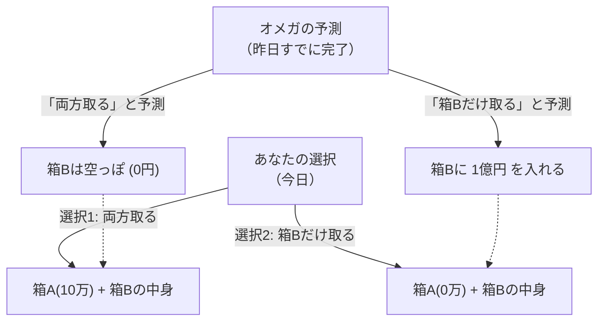

## 1. 究極の選択ゲーム

あなたの目の前に、自らを「オメガ」と名乗る超知能を持った宇宙人が現れました。
オメガは人間の行動を分析する達人で、**「対象者が次にどんな選択をするか、ほぼ100%の精度で未来を予測できる」**という恐るべき能力を持っています。過去の実験でも、オメガの予測は一度も外れたことがありません。

オメガはあなたの前に、2つの箱を置きました。
- **箱A**：透明な箱。中には確実に**「10万円」**が入っています。
- **箱B**：中身が見えない箱。中には**「1億円」**が入っているか、あるいは**「空っぽ（0円）」**のどちらかです。

オメガはあなたに、次の2つのうちどちらかの行動を選べと言います。

- **選択1「両方の箱を取る」**：箱Aの10万円と、箱Bの中身を両方もらえます。
- **選択2「箱Bだけを取る」**：箱Bの中身だけをもらえます。箱Aの10万円は諦めなければなりません。

これだけ聞けば、誰でも「両方の箱を取る」に決まっています。
しかし、オメガは恐ろしい「ルール」を追加しました。

**【オメガのルール】**
> 「私は昨日、お前が今日『どちらの選択をするか』をすでに予測して、箱Bの中身をセットしておいた。
> もしお前が欲張って『両方の箱を取る』と予測したなら、私は箱Bを**空っぽ**にしておいた。
> もしお前が欲張らずに『箱Bだけを取る』と予測したなら、私は箱Bに**1億円**を入れておいた。」

さて、あなたは今から選択をしなければなりません。
**あなたは「両方の箱を取る」べきでしょうか？ それとも「箱Bだけを取る」べきでしょうか？**

---

## 2. 激突する2つの「完璧な論理」

この問題は1969年に物理学者ウィリアム・ニューコムによって考案され、哲学者のロバート・ノージックによって発表されました。
発表されるやいなや、世界中の天才的な数学者や哲学者たちの意見が「真っ二つ」に割れ、大論争を巻き起こしました。

なぜなら、**どちらの選択肢にも「絶対に反論不可能な、完璧な論理」が存在する**からです。

### 論理その1：「箱Bだけを取る」派の主張（期待値最大化）

> 「オメガの予測精度はほぼ100%なんだろ？ だったら過去のデータ通り、オメガを信じるべきだ。
> もし自分が『両方取る』を選べば、オメガはそれを見抜いていて、結果は10万円ぽっちだ。
> もし自分が『箱Bだけ取る』を選べば、オメガはそれを見抜いていて、結果は1億円だ。
> 10万円と1億円、どっちが欲しいかなんてバカでもわかる。だから**絶対に『箱Bだけを取る』べき**だ！」

この考え方は、過去の統計データや期待値を素直に信じる「期待効用理論」に基づいています。

### 論理その2：「両方の箱を取る」派の主張（優越戦略）

> 「ちょっと待て。オメガが予測して箱Bに中身を入れたのは**『昨日』**のことだろ？
> ということは、今の時点で箱Bの中身は『1億円入っている』か『空っぽ』のどちらかに確定していて、**もう絶対に変化しない**はずだ。
> 
> パターン1：もし箱Bにすでに1億円入っているなら、『両方取る』を選べば1億10万円、『Bだけ』なら1億円だ。
> パターン2：もし箱Bがすでに空っぽなら、『両方取る』を選べば10万円、『Bだけ』なら0円だ。
> 
> どっちのパターンにせよ、**『両方取る』を選んだ方が絶対に10万円多くもらえる**じゃないか！
> 今さら自分がどっちを選ぼうが、昨日のオメガの行動がタイムマシンで書き換わるわけがない。だから**絶対に『両方の箱を取る』べき**だ！」

この考え方は、ゲーム理論において「相手がどんな行動を取ろうと、自分にとって有利な選択肢を選ぶ」という「優越戦略（Dominant Strategy）」に基づいています。

---

## 3. あなたは「自由意志」を信じるか？

「箱Bだけを取る派」と「両方取る派」。
両方の言い分を聞いて、あなたはどちらが正しいと思いましたか？

実は、このパラドックスには現在に至るまで「数学的に完璧な唯一の正解」は存在しません。
なぜなら、この問題の根底には、人類最大の哲学的な問いである**「決定論 vs 自由意志」**が隠されているからです。

### 「箱Bだけを取る」と答えた人（決定論者）
この選択をした人は、無意識のうちに**「決定論（この世の未来はすべて最初から決まっている）」**を受け入れています。
オメガが100%未来を予測できるということは、あなたの今の決断は「あなたの自由な意志」によって選ばれたのではなく、「宇宙の物理法則や脳のニューロンの動きによって、昨日からすでにそう選ぶように運命づけられていた」ということです。
未来が変えられない以上、オメガの予測通りに「箱Bだけを取る運命」に乗っかるのが一番合理的だ、という考え方です。

### 「両方の箱を取る」と答えた人（自由意志論者）
この選択をした人は、無意識のうちに**「自由意志（未来は自分の選択で切り開ける）」**を信じています。
「昨日のオメガの予測がどうであれ、今の自分の意志で選択を変えることができる」と信じているからこそ、「すでに確定した箱の中身とは無関係に、今この瞬間に10万円を上乗せする行動をとる」のです。
たとえ結果的にオメガに予測されていて箱が空っぽだったとしても、「論理的に正しい行動をとった結果だから仕方ない」と納得する論理の持ち主です。

---

## 4. タイムトラベルと因果の崩壊

ニューコムのパラドックスをさらにややこしくしているのが、「因果律（原因があって結果がある）」の逆転です。

私たちが生きる常識的な世界では、
「今日の私の選択（原因）」が「明日の結果」を作ります。

しかしオメガのゲームでは、
「今日の私の選択（原因）」が「**昨日の**オメガの行動（結果）」を決めているように見えます。
未来の行動が、過去の事実を決定してしまう「逆向きの因果律（バックワード・コーザリティ）」が発生しているのです。

もしオメガのような「完璧な予測者」が宇宙に存在するなら、私たちが信じている「時間は過去から未来へ流れる」という常識すら崩壊してしまいます。

---

## 5. まとめ：思考実験が暴く人間の「合理性」

あなたはどちらの箱を開けますか？

このパラドックスが提示されてから半世紀以上が経ちますが、哲学や経済学のアンケートでは、見事に「両方取る派」と「Bだけ取る派」が半々くらいに分かれます。
そして面白いことに、どちらの陣営も「相手の論理は完全に破綻しているバカだ」と本気で信じているのです。

「合理的な判断とは何か？」
経済学や数学がどれだけ発展しても、最後は「人間がこの世界をどう捉えているか」という哲学に行き着いてしまう。ニューコムのパラドックスは、論理の限界を突きつける、最高に意地悪で美しい思考実験なのです。
