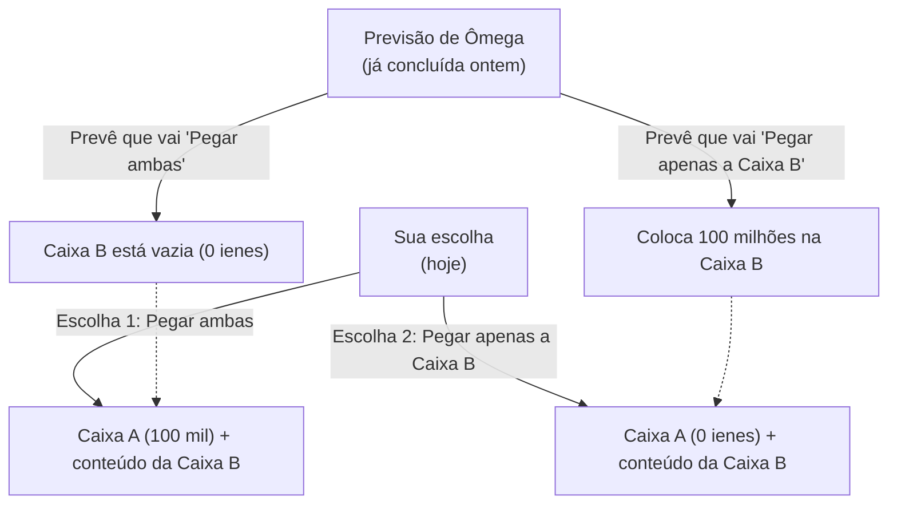

## 1. O Jogo de Escolha Definitivo

Na sua frente, aparece um alienígena com superinteligência que se autodenomina "Ômega".
Ômega é um mestre em analisar o comportamento humano e possui a habilidade aterrorizante de **"prever com quase 100% de precisão qual será a próxima escolha do alvo"**. Em experimentos passados, as previsões de Ômega nunca falharam.

Ômega coloca duas caixas na sua frente:
- **Caixa A**: Uma caixa transparente. Dentro há, com certeza, **"100 mil ienes"**.
- **Caixa B**: Uma caixa cujo interior não pode ser visto. Dentro, pode haver **"100 milhões de ienes"** ou estar **"vazia (0 ienes)"**.

Ômega pede que você escolha uma das duas seguintes ações:

- **Escolha 1 "Pegar ambas as caixas"**: Você ganha os 100 mil ienes da Caixa A e o conteúdo da Caixa B.
- **Escolha 2 "Pegar apenas a Caixa B"**: Você ganha apenas o conteúdo da Caixa B. Você deve abrir mão dos 100 mil ienes da Caixa A.

Ouvindo apenas isso, qualquer um decidiria "Pegar ambas as caixas".
No entanto, Ômega adicionou uma "regra" aterrorizante.

**【A Regra de Ômega】**
> "Ontem, eu já previ 'qual escolha' você faria hoje, e preparei o conteúdo da Caixa B.
> Se você foi ganancioso e eu previ que você 'pegaria ambas as caixas', eu deixei a Caixa B **vazia**.
> Se você não foi ganancioso e eu previ que você 'pegaria apenas a Caixa B', eu coloquei **100 milhões de ienes** na Caixa B."

Agora, você deve fazer a sua escolha.
**Você deve "Pegar ambas as caixas"? Ou deve "Pegar apenas a Caixa B"?**

---

## 2. O Choque de Duas "Lógicas Perfeitas"

Este problema foi idealizado em 1969 pelo físico William Newcomb e publicado pelo filósofo Robert Nozick.
Logo que foi publicado, as opiniões de matemáticos e filósofos geniais ao redor do mundo se dividiram "exatamente ao meio", gerando um grande debate.

Isso porque **existe uma "lógica perfeita e absolutamente irrefutável" para ambas as escolhas**.

### Lógica 1: A defesa dos que "Pegam apenas a Caixa B" (Maximização do Valor Esperado)

> "A precisão da previsão de Ômega não é de quase 100%? Então, de acordo com os dados passados, devemos acreditar em Ômega.
> Se eu escolher 'Pegar ambas', Ômega já terá percebido isso, e o resultado será apenas 100 mil ienes.
> Se eu escolher 'Pegar apenas a Caixa B', Ômega já terá percebido isso, e o resultado será de 100 milhões de ienes.
> Qualquer tolo sabe qual é melhor entre 100 mil e 100 milhões de ienes. Portanto, eu devo **absolutamente 'Pegar apenas a Caixa B'**!"

Essa forma de pensar baseia-se na "Teoria da Utilidade Esperada", que prescreve aceitar fielmente os dados estatísticos passados e o valor esperado.

### Lógica 2: A defesa dos que "Pegam ambas as caixas" (Estratégia Dominante)

> "Espere um pouco. Ômega previu e colocou o conteúdo na Caixa B **'ontem'**, certo?
> Isso significa que, neste exato momento, o conteúdo da Caixa B já está fixo como 'contendo 100 milhões' ou 'vazio', e **não vai mudar de forma alguma**.
> 
> Padrão 1: Se a Caixa B já tiver 100 milhões, escolher 'Pegar ambas' me dará 100 milhões e 100 mil, enquanto 'Apenas B' me dará 100 milhões.
> Padrão 2: Se a Caixa B já estiver vazia, escolher 'Pegar ambas' me dará 100 mil ienes, enquanto 'Apenas B' me dará 0 ienes.
> 
> Seja qual for o padrão, **escolher 'Pegar ambas' definitivamente me dará 100 mil ienes a mais**!
> Não importa o que eu escolha agora, a ação de Ômega de ontem não será reescrita por uma máquina do tempo. Portanto, eu devo **absolutamente 'Pegar ambas as caixas'**!"

Essa forma de pensar baseia-se na "Estratégia Dominante" (Dominant Strategy) da Teoria dos Jogos, que diz "não importa qual ação o oponente tome, escolha a opção mais vantajosa para você".

---

## 3. Você acredita no "Livre-arbítrio"?

Os que defendem "Pegar apenas a Caixa B" e os que defendem "Pegar ambas as caixas".
Ouvindo os argumentos de ambos, qual você acha que está correto?

Na verdade, até os dias de hoje, não existe "uma única resposta matematicamente perfeita" para este paradoxo.
Isso porque, na raiz deste problema, esconde-se a maior questão filosófica da humanidade: **"Determinismo vs Livre-arbítrio"**.

### Aqueles que responderam "Pegar apenas a Caixa B" (Deterministas)
As pessoas que fizeram esta escolha aceitaram inconscientemente o **"Determinismo (todo o futuro deste mundo já está decidido desde o início)"**.
O fato de Ômega poder prever o futuro com 100% de precisão significa que a sua decisão atual não foi escolhida por "seu livre-arbítrio", mas sim "já estava destinada a ser escolhida desde ontem, devido às leis da física do universo e ao movimento dos neurônios no cérebro".
Já que o futuro não pode ser mudado, a ideia é que embarcar no "destino de pegar apenas a Caixa B", conforme a previsão de Ômega, é a atitude mais racional.

### Aqueles que responderam "Pegar ambas as caixas" (Defensores do Livre-arbítrio)
As pessoas que fizeram esta escolha acreditam inconscientemente no **"Livre-arbítrio (o futuro pode ser aberto pelas suas próprias escolhas)"**.
É justamente porque acreditam que "não importa qual foi a previsão de Ômega ontem, eu posso mudar a escolha com a minha vontade atual", que elas tomam a ação de "adicionar 100 mil ienes neste exato momento, independentemente do conteúdo já definido da caixa".
Mesmo que o resultado acabe sendo uma caixa vazia por ter sido previsto por Ômega, eles possuem uma lógica que aceita isso pensando: "Não tem jeito, pois é o resultado de ter tomado a ação logicamente correta".

---

## 4. Viagem no Tempo e o Colapso da Causalidade

O que torna o Paradoxo de Newcomb ainda mais complicado é a inversão da "Causalidade (para toda causa, existe um efeito)".

No mundo de senso comum em que vivemos,
"A minha escolha de hoje (causa)" cria "o resultado de amanhã".

No entanto, no jogo de Ômega,
"A minha escolha de hoje (causa)" parece determinar "a ação de Ômega **de ontem** (resultado)".
Está ocorrendo uma "Causalidade Reversa" (Backward Causality), onde uma ação futura determina um fato passado.

Se um "previsor perfeito" como Ômega existir no universo, até mesmo o nosso senso comum de que "o tempo flui do passado para o futuro" desmoronaria.

---

## 5. Conclusão: A "Racionalidade" Humana Exposta por um Experimento Mental

Qual caixa você abriria?

Já se passou mais de meio século desde que este paradoxo foi apresentado, mas em pesquisas de filosofia e economia, as pessoas se dividem quase perfeitamente meio a meio entre "Pegar ambas" e "Pegar apenas B".
E o mais interessante é que ambos os lados acreditam genuinamente que "a lógica da outra parte é completamente falha e estúpida".

"O que é um julgamento racional?"
Não importa o quanto a economia ou a matemática evoluam, no fim tudo se resume à filosofia de "como os humanos compreendem este mundo". O Paradoxo de Newcomb é um experimento mental supremamente malicioso e belo que nos confronta com os limites da lógica.
