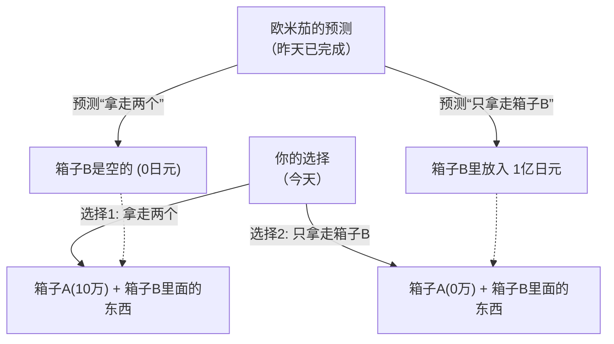

## 1. 终极选择游戏

在你的面前，出现了一个自称“欧米茄（Omega）”、拥有超智能的外星人。
欧米茄是分析人类行为的专家，拥有**“能以几乎100%的准确率预测对象下一步会做什么选择”**的可怕能力。在过去的实验中，欧米茄的预测从未失误过。

欧米茄在你面前放了两个箱子。
- **箱子A**：透明的箱子。里面必定装着**“10万日元”**。
- **箱子B**：看不见里面的箱子。里面要么装着**“1亿日元”**，要么是**“空的（0日元）”**。

欧米茄要求你从以下两种行动中选择一种。

- **选择1“拿走两个箱子”**：可以得到箱子A的10万日元和箱子B里面的东西。
- **选择2“只拿走箱子B”**：只能得到箱子B里面的东西。必须放弃箱子A的10万日元。

光听这些，谁都会决定“拿走两个箱子”。
但是，欧米茄加上了一个可怕的“规则”。

**【欧米茄的规则】**
> “昨天，我已经预测了你今天『会做出哪个选择』，并据此在箱子B里放好了东西。
> 如果你贪心，我预测你会『拿走两个箱子』，我就把箱子B**空着**。
> 如果你不贪心，我预测你会『只拿走箱子B』，我就在箱子B里放了**1亿日元**。”

那么，你现在必须做出选择。
**你是应该“拿走两个箱子”？还是应该“只拿走箱子B”呢？**

---

## 2. 激烈碰撞的两种“完美逻辑”

这个问题由物理学家威廉·纽科姆（William Newcomb）在1969年提出，并由哲学家罗伯特·诺齐克（Robert Nozick）发表。
一经发表，全世界的天才数学家和哲学家们的意见就“一分为二”，引发了巨大的争论。

因为，**这两个选项都存在着“绝对无法反驳的、完美的逻辑”**。

### 逻辑之1：“只拿走箱子B”派的主张（期望值最大化）

> “欧米茄的预测准确率不是几乎100%吗？既然如此，就应该像过去的数据那样相信欧米茄。
> 如果我选择了『拿走两个』，欧米茄早就看穿了这一点，结果只能拿到区区10万日元。
> 如果我选择了『只拿走箱子B』，欧米茄早就看穿了这一点，结果能拿到1亿日元。
> 10万日元和1亿日元，傻子都知道想要哪个。所以**绝对应该『只拿走箱子B』**！”

这种想法基于相信过去统计数据和期望值的“期望效用理论”。

### 逻辑之2：“拿走两个箱子”派的主张（优势策略）

> “等一下。欧米茄预测并把东西放进箱子B里，是**『昨天』**的事吧？
> 这就意味着，在现在的时点上，箱子B里要么『装了1亿日元』，要么『是空的』，这已经是确定的事实，**绝对不会再改变了**。
> 
> 情况1：如果箱子B里已经装了1亿日元，选择『拿走两个』能得到1亿10万日元，选『只拿B』只有1亿日元。
> 情况2：如果箱子B已经是空的，选择『拿走两个』能得到10万日元，选『只拿B』就是0日元。
> 
> 不管是哪种情况，**选『拿走两个』都绝对能多拿10万日元**不是吗！
> 事到如今，不管自己选哪个，昨天欧米茄的行为又不可能像坐时光机一样被改写。所以**绝对应该『拿走两个箱子』**！”

这种想法基于博弈论中的“优势策略（Dominant Strategy）”，即“无论对手采取什么行动，自己都选择对自己最有利的选项”。

---

## 3. 你相信“自由意志”吗？

“只拿走箱子B派”和“拿走两个派”。
听了双方的理由，你认为哪一方是正确的呢？

实际上，这个悖论直到现在也不存在“数学上完美的唯一正确答案”。
因为在这个问题的根基处，隐藏着人类最大的哲学之问——**“决定论 vs 自由意志”**。

### 回答“只拿走箱子B”的人（决定论者）
做出这个选择的人，在潜意识中接受了**“决定论（这个世界的一切未来从一开始就注定了）”**。
欧米茄能100%预测未来，意味着你现在的决定并不是由“你的自由意志”选出来的，而是“根据宇宙的物理法则或大脑神经元的运动，从昨天开始就已经注定了你会这样选”。
既然未来无法改变，那么顺应欧米茄的预测，走上“只拿走箱子B的命运”，就是最合理的想法。

### 回答“拿走两个箱子”的人（自由意志论者）
做出这个选择的人，在潜意识中相信**“自由意志（未来可以通过自己的选择来开创）”**。
正因为相信“无论昨天欧米茄的预测是什么，都可以凭借自己现在的意志来改变选择”，所以才会做出“与已经确定内容的箱子无关，在这一瞬间做出能多拿10万日元的行动”。
即便结果真的被欧米茄预测中了而导致箱子是空的，他们也有着“这是做出了逻辑上正确的行动的结果，所以没办法”这种能说服自己的逻辑。

---

## 4. 时间旅行与因果的崩溃

让纽科姆悖论变得更加复杂的，是“因果律（有因必有果）”的倒转。

在我们所生活的常识性世界中，
“我今天的选择（原因）”创造了“明天的结果”。

但在欧米茄的游戏中，
看起来却是“我今天的选择（原因）”决定了“**昨天**欧米茄的行动（结果）”。
发生了一种未来行动决定过去事实的“逆向因果律（向后因果关系）”。

如果宇宙中真的存在欧米茄这样“完美的预测者”，那么连我们所坚信的“时间从过去流向未来”的常识也会随之崩溃。

---

## 5. 总结：思想实验揭示的人类“合理性”

你会打开哪个箱子呢？

尽管这个悖论被提出已经过了半个多世纪，但在哲学和经济学的问卷调查中，“拿走两个派”和“只拿B派”依然奇妙地各占一半左右。
而且有趣的是，两个阵营的人都由衷地相信“对方的逻辑完全破产了，是个傻子”。

“什么是合理的判断？”
无论经济学和数学发展到什么程度，最终都会归结到“人类如何看待这个世界”这一哲学问题上。纽科姆悖论，就是一个揭示逻辑极限、极其刁钻又美妙的思想实验。
