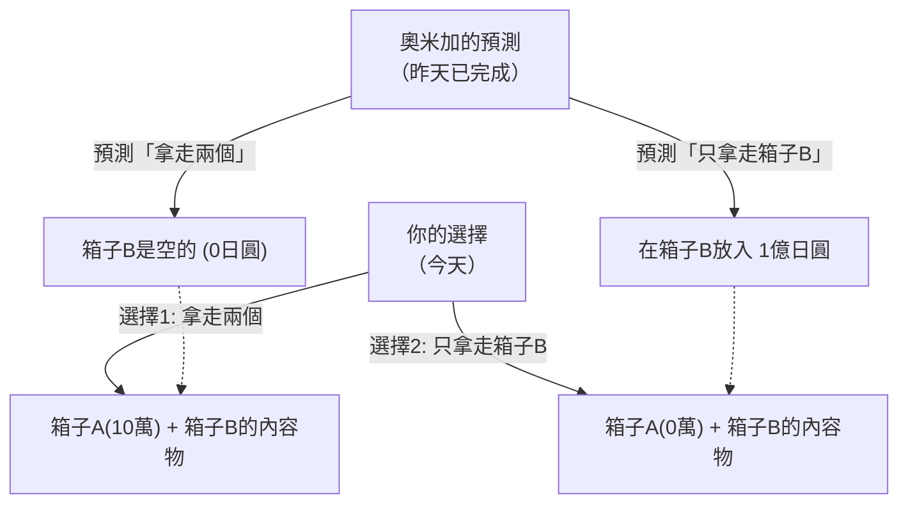

## 1. 終極的選擇遊戲

你的面前出現了一個自稱「奧米加 (Omega)」、擁有超高智慧的外星人。
奧米加是分析人類行為的專家，擁有**「能以幾乎100%的準確率預測目標對象下一步會作何選擇」**的可怕能力。在過去的實驗中，奧米加的預測從未失誤過。

奧米加在你面前放了兩個箱子。
- **箱子A**：透明的箱子。裡面確定有**「10萬日圓」**。
- **箱子B**：看不到裡面的箱子。裡面要嘛有**「1億日圓」**，要嘛就是**「空的（0日圓）」**。

奧米加要你在以下兩種行動中選擇一種。

- **選擇1「拿走兩個箱子」**：你可以同時得到箱子A的10萬日圓和箱子B裡面的東西。
- **選擇2「只拿走箱子B」**：你只能得到箱子B裡面的東西。必須放棄箱子A的10萬日圓。

光聽這些，任何人一定都會決定「拿走兩個箱子」。
但是，奧米加追加了一個可怕的「規則」。

**【奧米加的規則】**
> 「昨天，我已經預測了你今天『會做哪種選擇』，並將東西放進了箱子B。
> 如果我預測你會貪心地『拿走兩個箱子』，我就把箱子B設為**空的**。
> 如果我預測你不貪心，『只拿走箱子B』，我就在箱子B裡放了**1億日圓**。」

現在，你必須做出選擇。
**你應該「拿走兩個箱子」？還是應該「只拿走箱子B」？**

---

## 2. 激烈衝突的兩種「完美邏輯」

這個問題是由物理學家威廉·紐康伯（William Newcomb）在1969年提出，並由哲學家羅伯特·諾齊克（Robert Nozick）發表的。
一經發表，全世界的天才數學家和哲學家們的意見立刻「一分為二」，引發了激烈的爭論。

因為，**這兩個選項都存在著「絕對無法反駁的完美邏輯」**。

### 邏輯之1：「只拿走箱子B」派的主張（期望值最大化）

> 「奧米加的預測準確率幾乎是100%對吧？既然如此，就應該按照過去的數據，相信奧米加。
> 如果我選擇『拿走兩個』，奧米加早就看穿了，結果只會有區區10萬日圓。
> 如果我選擇『只拿走箱子B』，奧米加也早就看穿了，結果會是1億日圓。
> 10萬日圓和1億日圓，傻子都知道想要哪個。所以**絕對應該『只拿走箱子B』**！」

這種想法是基於坦率相信過去的統計數據和期望值的「期望效用理論」。

### 邏輯之2：「拿走兩個箱子」派的主張（優勢策略）

> 「等一下。奧米加進行預測並將東西放進箱子B是**『昨天』**發生的事對吧？
> 也就是說，在此時此刻，箱子B裡的內容物已經確定是『有1億日圓』或是『空的』其中之一，而且**絕對不會再改變了**。
> 
> 情況1：如果箱子B裡已經有1億日圓，選擇『拿走兩個』就能得到1億10萬日圓，選擇『只拿B』則是1億日圓。
> 情況2：如果箱子B已經是空的，選擇『拿走兩個』就能得到10萬日圓，選擇『只拿B』則是0日圓。
> 
> 無論是哪種情況，**選擇『拿走兩個』絕對都能多拿10萬日圓**不是嗎！
> 事到如今，無論我選擇哪一個，昨天奧米加的行動都不可能像搭時光機一樣被改寫。所以**絕對應該『拿走兩個箱子』**！」

這種想法是基於賽局理論中「無論對手採取什麼行動，都選擇對自己有利的選項」的「優勢策略（Dominant Strategy）」。

---

## 3. 你相信「自由意志」嗎？

「只拿走箱子B派」和「拿走兩個派」。
聽完雙方的說法，你覺得哪一邊是正確的呢？

事實上，這個悖論直到現在都還不存在「數學上完美的唯一正確答案」。
因為這個問題的根基隱藏著人類最大的哲學問題——**「決定論 vs 自由意志」**。

### 回答「只拿走箱子B」的人（決定論者）
做出這個選擇的人，在無意識中接受了**「決定論（這世界所有的未來打從一開始就已經注定）」**。
奧米加能100%預測未來，意味著你現在的決定並非出於「你的自由意志」，而是「由宇宙的物理法則和構成大腦的神經元活動，早在昨天就已經注定你會這麼選」。
既然未來無法改變，那麼順應奧米加的預測，搭上「只拿走箱子B的命運」才是最合理的，這是此派的想法。

### 回答「拿走兩個箱子」的人（自由意志論者）
做出這個選擇的人，在無意識中相信著**「自由意志（未來可以透過自己的選擇來開創）」**。
正是因為相信「無論昨天奧米加的預測如何，現在都能憑自己的意志改變選擇」，所以才會「無視已經確定的箱子內容物，在此時此刻採取多拿10萬日圓的行動」。
就算結果真的被奧米加預測中導致箱子是空的，擁有這種邏輯的人也會認為「這是我採取邏輯上正確行動的結果，所以無可奈何」並心服口服。

---

## 4. 時光旅行與因果的崩壞

讓紐康伯悖論變得更加複雜的，是「因果律（有因必有果）」的逆轉。

在我們生活的常識世界裡，
「今天我的選擇（原因）」會創造「明天的結果」。

但在奧米加的遊戲中，
「今天我的選擇（原因）」似乎決定了「**昨天**奧米加的行動（結果）」。
這產生了未來的行動決定了過去事實的「反向因果律（Backward Causality）」。

如果宇宙中真的存在像奧米加這樣「完美的預測者」，那麼我們所深信的「時間從過去流向未來」這種常識甚至都會崩壞。

---

## 5. 總結：思想實驗揭露人類的「合理性」

你會打開哪一個箱子呢？

這個悖論提出至今已超過半個世紀，但在哲學和經濟學的問卷調查中，結果總是很巧合地將「拿走兩個派」和「只拿B派」大約分成各半。
有趣的是，這兩個陣營都真心相信「對方的邏輯完全破綻百出，是個笨蛋」。

「什麼是合理的判斷？」
無論經濟學和數學如何發展，最終都會回歸到「人類如何看待這個世界」的哲學問題。紐康伯悖論就是一個凸顯邏輯極限，極度刁鑽卻又美麗的思想實驗。
