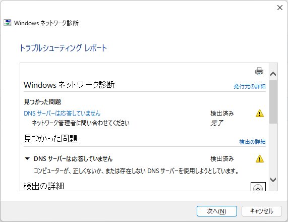

# Umstellung der Internetumgebung zu Hause von Flet's Hikari auf J:COM

Auf Empfehlung eines Bekannten habe ich die Internetleitung zu Hause von Flet's Hikari auf J:COM umgestellt. Die Gründe waren:

1. Die monatlichen Gebühren sind günstiger. 3.619 Yen → 2.180 Yen
2. Die Internetgeschwindigkeit steigt von 100MBps auf 320MBps

Diese Punkte.

# Eindrücke nach der Nutzung
Es ist etwa eine Woche seit der Umstellung vergangen, und bisher gibt es fast keine Probleme. Unten liste ich einige Dinge auf, die mir etwas aufgefallen sind.

Als ich tatsächlich wechselte, bemerkte ich, dass die Download-Geschwindigkeit wirklich schneller wurde, von 60MBps auf fast 320MBps. Allerdings
sank die Upload-Geschwindigkeit, die bei Flet's Hikari noch bei 40MBps lag, auf etwa 10MBps. Dies scheint eine Spezifikation seitens J:COM zu sein.
Da ich derzeit weder streame noch große Datenmengen hochlade, werde ich die Situation vorerst beobachten.

Außerdem arbeiten meine Familie und ich in letzter Zeit hauptsächlich im Homeoffice, und heute fiel das Internet zum ersten Mal für einige Minuten bis zu ein paar Dutzend Minuten aus. Es hat sich automatisch wiederhergestellt, aber
es ist vielleicht kein gutes Zeichen. Es ist noch nicht einmal eine Woche seit der Umstellung vergangen...

Als Randnotiz: Da J:COM P2P-Kommunikation einschränkt, scheint die Geschwindigkeit von P2P-Apps nicht gut zu sein. Wer P2P nutzt, sollte vorsichtig sein.

# Über den Service
Beim Vertragsabschluss erhält man bei einer Anmeldung bei Netflix oder Disney+ eine QUO-Karte im Wert von 40.000 Yen, was die jeweiligen Service-Vertragsgebühren ausgleicht und die monatlichen Gebühren
im Durchschnitt etwas günstiger macht, also habe ich die Services gleichzeitig mit dem Vertrag abonniert. Netflix hat einen 1-Jahres-Vertrag, Disney+ einen Halbjahresvertrag, und es scheint, dass man die Kündigung selbst vornehmen muss.

Da die Umstellung noch frisch ist, werde ich den Artikel aktualisieren, falls weitere Eindrücke oder Erfahrungen zur Nutzung hinzukommen. Bis dann,

# 06.09. Internetverbindung wurde schwierig
- 06.09.2022 gegen 13:13 Uhr ca. 3 bis 5 Minuten
- 06.09.2022 gegen 13:30 Uhr ca. 3 bis 5 Minuten
- Danach noch einige Male...

Da das Problem beim DNS zu liegen schien, habe ich den DNS-Server unter Bezugnahme auf [hier](https://internet.watch.impress.co.jp/docs/column/shimizu/1367271.html) eingerichtet.
Mal sehen, was jetzt passiert... Da ich mich auch mit der DNS-Einstellung nicht verbinden konnte, habe ich den Support kontaktiert, der mir mitteilte, dass eine Notfallwartung durchgeführt wird... Unmittelbar nach der Anfrage verbesserte sich der Verbindungsstatus, also denke ich, dass sie irgendeine Maßnahme ergriffen haben.
