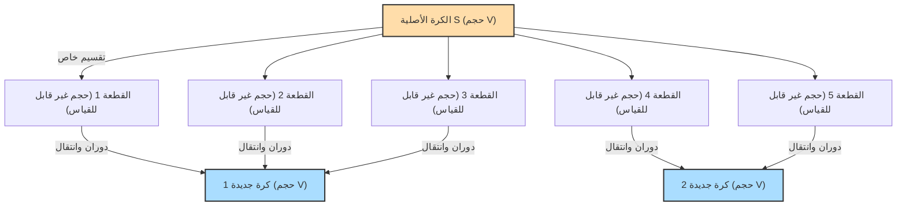

## 1. نظرية سحرية: 1 = 1 + 1 ؟

تخيل أن أمامك كرة من الذهب الخالص.
أنت تقوم بتقطيع هذه الكرة إلى عدة أجزاء باستخدام سكين. ثم تقوم بإعادة تجميع هذه الأجزاء معاً مثل لغز. لا تقوم بتمديد الأجزاء أو ثنيها أو إضافة أي ذهب جديد إليها على الإطلاق. أنت تقوم فقط بنقلها وضمها معاً.

ومع ذلك، عندما تنظر إلى اللغز المكتمل، تجد أنه قد تم تكوين **"كرتين من الذهب الخالص بنفس حجم الكرة الأصلية تماماً"**.

قد تفكر، "هذا سخيف! إنه ينتهك قانون حفظ الكتلة، وهو مجرد وهم من أوهام الخيميائيين!"
إنه مستحيل تماماً في العالم الفيزيائي الحقيقي. ومع ذلك، **في عالم الرياضيات البحتة (الهندسة الرياضية ونظرية المجموعات)، تم إثبات ذلك كنظرية صحيحة منطقياً بنسبة 100%**.

هذه هي **"مفارقة باناخ-تارسكي"**، التي أثبتها عالما الرياضيات ستيفان باناخ وألفريد تارسكي في عام 1924.

---

## 2. الفهم الدقيق لادعاء المفارقة

إذا عبرنا عن النظرية التي أثبتها باناخ وتارسكي بعبارات رياضية دقيقة، فستكون كالتالي:

> **نظرية باناخ-تارسكي**
> أي كرة $S$ في الفضاء ثلاثي الأبعاد يمكن تقسيمها إلى عدد محدود من القطع. ومن خلال إعادة ترتيب هذه القطع (باستخدام الدوران والانتقال فقط)، يمكن إنشاء كرتين لهما نفس نصف قطر الكرة الأصلية $S$ تماماً.

الأمر الأكثر إثارة للدهشة هو أنه بتطبيق هذه النظرية، يمكننا أيضاً قول ما يلي:

- من خلال تقسيم حبة بازلاء واحدة إلى عدد محدود من الأجزاء وإعادة تجميعها، يمكننا صنع **كرة بنفس حجم الشمس تماماً**. (تُعرف أيضاً باسم: مفارقة حبة البازلاء والشمس)

لماذا يُسمح بمثل هذا الشيء السحري رياضياً؟
السر يكمن في كلمتين رئيسيتين: **"اللانهائية"** و **"بديهية الاختيار"**.

---

## 3. الخاصية العجيبة لـ "اللانهائية"

الخطوة الأولى لفهم هذه المفارقة هي معرفة الخاصية الغريبة لـ "المجموعات اللانهائية".

في العالم "المحدود" الذي نتعامل معه عادةً، يكون الكل دائماً أكبر من الجزء.
على سبيل المثال، إذا أخذنا الأرقام الزوجية (5 أرقام) من الأرقام من 1 إلى 10 (10 أرقام)، فإن العدد ينخفض إلى النصف.

ومع ذلك، في عالم "اللانهائية"، هذا المنطق السليم لا ينطبق.
أيهما أكثر: كل "الأعداد الطبيعية" (1، 2، 3، 4، ...) أم كل "الأعداد الزوجية" (2، 4، 6، 8، ...)؟
بشكل بديهي، بما أن الأعداد الزوجية تمثل نصف الأعداد الطبيعية فقط، فقد يبدو أن الأعداد الطبيعية أكثر.
لكن حاول تكوين أزواج على النحو التالي:

- 1 $\rightarrow$ 2
- 2 $\rightarrow$ 4
- 3 $\rightarrow$ 6
- $n \rightarrow 2n$

بهذه الطريقة، لكل عدد طبيعي، يمكننا دائماً إقرانه بعدد زوجي يمثل ضعفه تماماً (تقابل أحادي). ولا تتبقى أي أرقام.
بعبارة أخرى، من الناحية الرياضية، **"عدد الأعداد الطبيعية (لانهائي)" و"عدد الأعداد الزوجية (لانهائي)" لهما نفس الحجم تماماً**!

على الرغم من أننا يفترض أننا أخذنا النصف (الأعداد الزوجية) من الكل (الأعداد الطبيعية)، إلا أن الحجم يظل كما هو. في المجموعات اللانهائية، يمكن أن يحدث أن **"الجزء يساوي الكل"**.
يمكن القول إن نظرية باناخ-تارسكي هي الشكل المطلق لتطبيق هذا "السحر اللانهائي" على مجموعة من "النقاط" في الفضاء ثلاثي الأبعاد.

---

## 4. تقطيع نقاط الفضاء إلى أجزاء "غير قابلة للقياس"

عندما تقطع جسماً حقيقياً (مثل الذهب أو التفاح) بسكين، يكون للأجزاء دائماً "حجم".
ومع ذلك، فإن الكرة في الرياضيات هي **"مجموعة لا نهائية من النقاط"** التي ليس لها حجم.

قام باناخ وتارسكي بتقسيم (تجميع) هذه النقاط اللانهائية بطريقة معقدة وخاصة جداً.
كانت طريقة التقسيم معقدة ومبعثرة لدرجة أنها أصبحت في حالة "لا يمكن فيها قياس الحجم (مجموعة غير قابلة للقياس)".

إذا أصبح كل جزء مجموعة غامضة من النقاط التي "ليس لها حجم (لا يمكن قياسها)"، يمكننا التحرر من قيد القاعدة الفيزيائية التي تنص على أنه "يجب أن يساوي مجموع الأجزاء الحجم الأصلي" (إضافة القياس).

ثم، من خلال تدوير ودمج أجزاء النقاط الغامضة هذه بمهارة، وعن طريق "السحر اللانهائي"، يمكننا إكمال كرتين معبأتين بإحكام بنفس نقاط الكرة الأصلية تماماً.
في الواقع، ثبت أنه من الممكن إجراء هذه العملية المتمثلة في "صنع كرتين من كرة واحدة" بمجرد تقسيم الكرة الأصلية إلى **5 أجزاء** فقط.

---

## 5. السبب الجذري لكل هذا: ما هي "بديهية الاختيار"؟

إذن، لماذا يعتبر هذا "التقسيم المعقد لدرجة لا يمكن معها قياس الحجم" ممكناً رياضياً؟
ذلك لأننا نقبل قاعدة تُعرف باسم **"بديهية الاختيار (Axiom of Choice)"**، والتي تشكل أساس الرياضيات الحديثة.

بشكل تقريبي، فإن بديهية الاختيار هي القاعدة التالية:

> **تصور لبديهية الاختيار**
> عندما يكون هناك أشياء بداخل العديد من الصناديق، فهي القاعدة التي تنص على أنه **"يمكنك اختيار شيء واحد من كل صندوق لإنشاء مجموعة جديدة"**.

إذا كان عدد الصناديق محدوداً، فيمكن لأي شخص القيام بذلك بشكل طبيعي.
ومع ذلك، **إذا كان عدد الصناديق "لانهائياً"**، فلا يمكن للإنسان إنهاء عملية "اختيار واحد تلو الآخر" عدداً لانهائياً من المرات. ومع ذلك، فإن بديهية الاختيار تسمح لنا بافتراض أن "المجموعة التي تم إنشاؤها عن طريق الاختيار يمكن اعتبارها موجودة".

كانت هذه البديهية مريحة للغاية ولا غنى عنها في بناء الرياضيات الحديثة. قَبِل معظم علماء الرياضيات هذه القاعدة قائلين: "حسناً، هذا واضح".

لكن قبول بديهية الاختيار هذه يعني الاعتراف بوجود "مجموعات غامضة من النقاط المبعثرة لدرجة لا يمكن معها قياس حجمها (مجموعات غير قابلة للقياس)" كما ذكرنا سابقاً. ونتيجة لذلك، يتم استنتاج نظرية باناخ-تارسكي، حيث "تصبح كرة واحدة كرتين"، كضرورة منطقية.

---

## 6. الخلاصة: "عالم يتجاوز البديهة" ترسمه الرياضيات

مفارقة باناخ-تارسكي ليست مفارقة بالمعنى الذي يعني أن "هناك تناقضاً في المنطق". إنها مفارقة بمعنى أن **المنطق صحيح بنسبة 100%، لكن الاستنتاج المستمد يتعارض بشدة مع الحدس البشري والقوانين الفيزيائية**.

عندما نُشرت هذه النظرية، جادل بعض علماء الرياضيات قائلين: "إذا أدت إلى مثل هذا الاستنتاج غير المنطقي، فلا بد أن بديهية الاختيار خاطئة!"
ومع ذلك، يقبل العديد من علماء الرياضيات اليوم بديهية الاختيار، ويقبلون أيضاً نظرية باناخ-تارسكي باعتبارها "خاصية غريبة ولكنها جميلة للفضاء ثلاثي الأبعاد والمجموعات اللانهائية".

نظراً لأن العالم المادي الذي نعيش فيه يتكون من "جسيمات ذات حجم (محدود)" تُعرف بالذرات، فلا يمكننا تكبير حبة بازلاء لتصبح بحجم الشمس.
ومع ذلك، على لوحة "الرياضيات" التي ابتكرها العقل البشري، يكون حجم النقطة صفراً، ويُسمح بالعمليات اللانهائية.

يمكن اعتبار مفارقة باناخ-تارسكي واحدة من أعظم روائع الرياضيات الحديثة، حيث تُعلمنا **كيف يمكن لمفهوم "اللانهائية" أن يتجاوز بسهولة الحدس البشري البسيط**.
