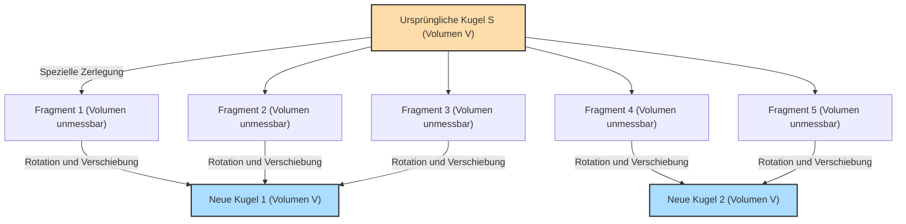

## 1. Ein magischer Satz: 1 = 1 + 1 ?

Stellen Sie sich vor, Sie haben eine Kugel aus reinem Gold vor sich.
Sie zerschneiden diese Kugel mit einem Messer in mehrere Teile. Dann setzen Sie diese Teile wie bei einem Puzzle wieder zusammen. Dabei werden die Teile weder gedehnt, noch verbogen, noch wird neues Gold hinzugefügt. Sie werden nur bewegt und zusammengefügt.

Wenn Sie das Puzzle jedoch betrachten, stellen Sie fest, dass **„zwei Kugeln aus reinem Gold entstanden sind, die exakt dieselbe Größe wie die ursprüngliche Kugel haben“**.

„Das ist doch Unsinn! Das verstößt gegen das Gesetz der Massenerhaltung und ist die Wahnvorstellung eines Alchemisten!“, denken Sie vielleicht.
In der realen physikalischen Welt ist dies absolut unmöglich. In der Welt der **reinen Mathematik (Geometrie und Mengenlehre) ist dies jedoch als ein logisch zu 100 % korrekter Satz bewiesen**.

Dies ist das **„Banach-Tarski-Paradoxon“**, das 1924 von den beiden Mathematikern Stefan Banach und Alfred Tarski bewiesen wurde.

---

## 2. Die Aussage des Paradoxons genau verstehen

Der von Banach und Tarski bewiesene Satz lässt sich in mathematisch präzisen Worten wie folgt ausdrücken:

> **Der Satz von Banach-Tarski**
> Jede beliebige Kugel $S$ im dreidimensionalen Raum kann in eine endliche Anzahl von Fragmenten zerlegt werden. Durch bloßes Neuarrangieren dieser Fragmente (nur durch Rotation und Translation) können zwei Kugeln gebildet werden, die exakt denselben Radius wie die ursprüngliche Kugel $S$ haben.

Noch erstaunlicher ist, dass man bei Anwendung dieses Satzes auch Folgendes behaupten kann:

- Man kann eine einzige Erbse in eine endliche Anzahl von Teilen zerlegen und durch Neuzusammensetzen eine **Kugel von exakt der Größe der Sonne** erschaffen. (Auch bekannt als das Erbsen-und-Sonnen-Paradoxon)

Warum ist solch eine magische Sache mathematisch zulässig?
Das Geheimnis verbirgt sich in zwei Schlüsselbegriffen: **„Unendlichkeit“** und **„Auswahlaxiom“**.

---

## 3. Die wundersame Eigenschaft der „Unendlichkeit“

Der erste Schritt zum Verständnis dieses Paradoxons besteht darin, die seltsamen Eigenschaften „unendlicher Mengen“ zu kennen.

In der „endlichen“ Welt, in der wir normalerweise operieren, ist das Ganze immer größer als seine Teile.
Wenn Sie beispielsweise aus den Zahlen von 1 bis 10 (10 Zahlen) die geraden Zahlen (5 Zahlen) herausnehmen, halbiert sich die Anzahl.

In der Welt der „Unendlichkeit“ gilt dieser gesunde Menschenverstand jedoch nicht.
Was gibt es mehr: alle „natürlichen Zahlen“ (1, 2, 3, 4, ...) oder alle „geraden Zahlen“ (2, 4, 6, 8, ...)?
Intuitiv scheint es, als gäbe es mehr natürliche Zahlen, da die geraden Zahlen nur die Hälfte der natürlichen Zahlen ausmachen.
Aber versuchen Sie, wie folgt Paare zu bilden:

- 1 $\rightarrow$ 2
- 2 $\rightarrow$ 4
- 3 $\rightarrow$ 6
- $n \rightarrow 2n$

Auf diese Weise kann jede natürliche Zahl genau einer verdoppelten geraden Zahl zugeordnet werden (Eins-zu-eins-Zuordnung bzw. Bijektion). Es bleiben keine Zahlen übrig.
Das bedeutet mathematisch gesehen: **„Die Anzahl der natürlichen Zahlen (unendlich)“ und „die Anzahl der geraden Zahlen (unendlich)“ sind exakt gleich groß!**

Obwohl wir die Hälfte (die geraden Zahlen) aus dem Ganzen (den natürlichen Zahlen) herausgenommen haben, hat sich die Größe nicht verändert. Bei unendlichen Mengen kann es passieren, dass **„ein Teil dem Ganzen entspricht“**.
Der Satz von Banach-Tarski ist die ultimative Form dieser „Magie der Unendlichkeit“, angewandt auf die Menge der „Punkte“ im dreidimensionalen Raum.

---

## 4. Raumpunkte werden „nicht-messbar“ zerschnitten

Wenn man einen realen Gegenstand (wie Gold oder einen Apfel) mit einem Messer zerschneidet, haben die Teile immer ein „Volumen“.
Eine Kugel in der Mathematik ist jedoch eine **„Ansammlung von unendlich vielen Punkten“**, die an sich kein Volumen haben.

Banach und Tarski haben diese unendlich vielen Punkte auf eine sehr spezielle und komplexe Weise in Gruppen unterteilt (zerlegt).
Diese Aufteilung ist so komplex und verstreut, dass man das „Volumen nicht mehr messen kann“ (sie werden zu nicht-messbaren Mengen).

Sobald jedes Teil zu einer unbestimmten Ansammlung von Punkten wird, die „kein Volumen haben (nicht messbar sind)“, können wir uns von der physikalischen Regel (der Additivität des Maßes) befreien, die besagt: „Wenn man die Teile zusammenzählt, muss das Ergebnis gleich dem ursprünglichen Volumen sein.“

Wenn man dann diese Teile aus unbestimmten Punkten geschickt dreht und zusammensetzt, sorgt die „Magie der Unendlichkeit“ dafür, dass zwei Kugeln entstehen, die exakt dieselben dicht gepackten Punkte wie die ursprüngliche Kugel enthalten.
Tatsächlich wurde bewiesen, dass diese Operation „aus einer Kugel zwei Kugeln machen“ möglich ist, indem man die ursprüngliche Kugel in nur **5 Teile** zerlegt.

---

## 5. Die Ursache von allem: Was ist das „Auswahlaxiom“?

Aber warum ist eine „Zerlegung, die so komplex ist, dass das Volumen nicht gemessen werden kann“, mathematisch überhaupt möglich?
Das liegt daran, dass die moderne Mathematik das **„Auswahlaxiom“ (Axiom of Choice)** als Regel anerkennt, welches ihre Grundlage bildet.

Grob gesagt ist das Auswahlaxiom folgende Regel:

> **Die Idee des Auswahlaxioms**
> Wenn man viele Kisten hat, in denen sich jeweils Gegenstände befinden, ist es erlaubt, **„aus jeder Kiste genau einen Gegenstand auszuwählen, um ein neues Set (eine neue Menge) zu bilden“**.

Wenn die Anzahl der Kisten endlich ist, kann das jeder problemlos tun.
**Wenn die Anzahl der Kisten jedoch „unendlich“ ist**, kann kein Mensch die Operation des „einzelnen Auswählens“ unendlich oft durchführen und jemals abschließen. Dennoch erlaubt das Auswahlaxiom zu sagen: „Wir können annehmen, dass ein so ausgewähltes Set existiert.“

Dieses Axiom war äußerst nützlich und unverzichtbar für den Aufbau der modernen Mathematik. Die meisten Mathematiker akzeptierten diese Regel und dachten: „Nun, das ist ja selbstverständlich.“

Wenn man dieses Auswahlaxiom jedoch anerkennt, muss man auch die Existenz von „Mengen aus unbestimmten Punkten, die so verstreut sind, dass ihr Volumen nicht gemessen werden kann (nicht-messbare Mengen)“, anerkennen. Und als logische Konsequenz daraus ergibt sich unweigerlich der Satz von Banach-Tarski, dass „aus einer Kugel zwei werden“.

---

## 6. Zusammenfassung: Eine Welt jenseits der Intuition, die die Mathematik zeichnet

Das Banach-Tarski-Paradoxon ist kein Paradoxon (Widerspruch) in dem Sinne, dass „die Logik einen Widerspruch enthält“. Es ist ein Paradoxon in dem Sinne, dass **die Logik zu 100 % korrekt ist, die daraus gezogene Schlussfolgerung jedoch massiv der menschlichen Intuition und den Gesetzen der Physik widerspricht**.

Als dieser Satz veröffentlicht wurde, argumentierten einige Mathematiker: „Wenn solch eine absurde Schlussfolgerung dabei herauskommt, muss das Auswahlaxiom falsch sein!“
Heutzutage akzeptieren die meisten Mathematiker jedoch das Auswahlaxiom und betrachten den Satz von Banach-Tarski als „eine seltsame, aber wunderschöne Eigenschaft, die der dreidimensionale Raum und unendliche Mengen besitzen“.

Da die physikalische Welt, in der wir leben, aus Atomen, also „Körnern mit einer bestimmten Größe (endlich)“, besteht, ist es unmöglich, eine Erbse auf die Größe der Sonne zu vergrößern.
Auf der Leinwand der „Mathematik“, die vom menschlichen Gehirn erschaffen wurde, ist die Größe eines Punktes jedoch null, und unendliche Operationen sind erlaubt.

Das Banach-Tarski-Paradoxon kann als eines der größten Meisterwerke der modernen Mathematik angesehen werden. Es lehrt uns, **wie leichtfertig das Konzept der „Unendlichkeit“ über die einfache Intuition des Menschen hinausgeht**.
