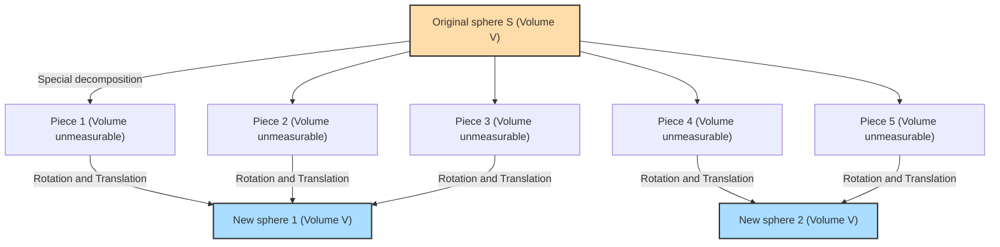

## 1. A Magical Theorem: 1 = 1 + 1 ?

Imagine you have a solid gold sphere (ball) right in front of you.
You cut this sphere into several pieces with a knife. Then, you reassemble those pieces like a puzzle. You don't stretch, bend, or add any new gold to the pieces. You just move them around and put them together.

However, when you look at the completed puzzle, you end up with **"two solid gold spheres of exactly the same size as the original one"**.

You might think, "That's absurd! It violates the law of conservation of mass, and it's an alchemist's delusion!"
In the real physical world, it is absolutely impossible. However, **in the world of pure mathematics (geometry and set theory), this is proven as a logically 100% correct theorem**.

This is the **"Banach-Tarski Paradox"**, proven in 1924 by two mathematicians, Stefan Banach and Alfred Tarski.

---

## 2. Accurately Understanding the Claim of the Paradox

When the theorem proven by Banach and Tarski is expressed in mathematically precise words, it goes like this:

> **Banach-Tarski Theorem**
> Any solid sphere $S$ in 3-dimensional space can be decomposed into a finite number of disjoint pieces. Then, by reassembling those pieces (using only rotations and translations), it is possible to create two solid spheres that have exactly the same radius as the original sphere $S$.

Even more surprisingly, applying this theorem leads to the following conclusion:

- By decomposing a single pea into a finite number of pieces and reassembling them, you can create **a sphere exactly the size of the sun**. (Also known as the pea and the sun paradox)

Why is such magic mathematically permitted?
The secret is hidden in two keywords: **"Infinity"** and the **"Axiom of Choice"**.

---

## 3. The Mysterious Properties of "Infinity"

The first step to understanding this paradox is to learn about the strange properties of "infinite sets".

In the "finite" world we normally deal with, the whole is always strictly greater than the part.
For example, if you take out the even numbers (5 numbers) from the numbers 1 to 10 (10 numbers), the count is halved.

However, this common sense does not apply in the world of "infinity".
Which are more numerous: all "natural numbers" (1, 2, 3, 4, ...) or all "even numbers" (2, 4, 6, 8, ...)?
Intuitively, since even numbers are only half of the natural numbers, you might feel there are more natural numbers.
However, try making pairs as follows:

- 1 $\rightarrow$ 2
- 2 $\rightarrow$ 4
- 3 $\rightarrow$ 6
- $n \rightarrow 2n$

In this way, for every natural number, you can exactly pair it with an even number that is exactly twice its value (a one-to-one correspondence). There are no numbers left over.
In other words, mathematically, **"the number of natural numbers (infinity)" and "the number of even numbers (infinity)" are exactly the same size**!

Even though we supposedly took out half (even numbers) from the whole (natural numbers), the size remains unchanged. In infinite sets, it can happen that **"a part is equal to the whole"**.
The Banach-Tarski theorem can be said to be the ultimate form of applying this "magic of infinity" to sets of "points" in 3-dimensional space.

---

## 4. Points in Space are Cut "Immeasurably"

When you cut a real object (like gold or an apple) with a knife, the pieces always have a "volume".
However, a sphere in mathematics is a **"collection of an infinite number of points"** with no volume in themselves.

Banach and Tarski grouped (divided) these infinite points in a very special and complex way.
The way they are divided is so complex and scattered that they become a state where "volume can no longer be measured (non-measurable set)".

Once each piece becomes a hazy collection of points that "do not have (or cannot be measured for) volume", they can escape the constraint of the physical rule (additivity of measure) that says "the sum of the pieces must equal the original volume".

And by cleverly rotating and combining those pieces of hazy points, the "magic of infinity" completes two spheres packed exactly with the same points as the original sphere.
In fact, it has been proven that this operation of "making two spheres from one sphere" is possible by dividing the original sphere into just **5 pieces**.

---

## 5. The Root of It All: What is the "Axiom of Choice"?

So, why is a "decomposition so complex that its volume cannot be measured" mathematically possible?
It is because we accept the **"Axiom of Choice"**, a rule that forms the foundation of modern mathematics.

Roughly speaking, the Axiom of Choice is the following rule:

> **Concept of the Axiom of Choice**
> When there are items in many boxes, the rule says **"you can choose exactly one item from each box and form a new set"**.

If the number of boxes is finite, anyone can do it normally.
However, **if there are an "infinite" number of boxes**, humans cannot finish the operation of "choosing one by one" an infinite number of times. Even so, the Axiom of Choice admits that "it is acceptable to assume the chosen set exists".

This axiom was extremely convenient and essential in constructing modern mathematics. Most mathematicians accepted this rule, thinking, "Well, it's obvious."

However, accepting this Axiom of Choice means admitting the existence of the "scattered, hazy set of points whose volume cannot be measured (non-measurable set)" mentioned earlier. And as a result, the Banach-Tarski theorem, which states that "one sphere becomes two", is derived as a logical necessity.

---

## 6. Conclusion: The "World Beyond Intuition" Painted by Mathematics

The Banach-Tarski paradox is not a paradox in the sense that "there is a contradiction in logic". It is a paradox in the sense that **while the logic is 100% correct, the derived conclusion violently contradicts human intuition and physical laws**.

When this theorem was published, some mathematicians argued, "If such an absurd conclusion is reached, the Axiom of Choice must be wrong!"
However, today, many mathematicians accept the Axiom of Choice, and the Banach-Tarski theorem is also accepted as a "bizarre but beautiful property held by 3-dimensional space and infinite sets".

Since the physical world we live in is made of "finite-sized particles" called atoms, we cannot turn a pea into the size of the sun.
However, on the canvas of "mathematics" created by the human brain, the size of a point is zero, and infinite operations are allowed.

The Banach-Tarski paradox can be said to be one of the masterpieces of modern mathematics, teaching us **how effortlessly the concept of "infinity" leaps over naive human intuition**.
