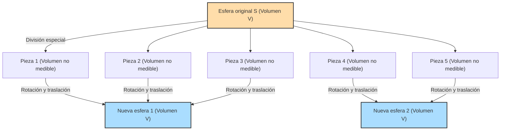

## 1. Un teorema mágico: ¿1 = 1 + 1 ?

Imagina que tienes una esfera de oro puro frente a ti.
Cortas esta esfera en varias piezas con un cuchillo. Luego, combinas estas piezas como si fueran un rompecabezas. No estiras, doblas ni agregas oro nuevo a las piezas. Simplemente las mueves y las unes.

Sin embargo, al observar el rompecabezas terminado, descubres que se han creado **"dos esferas de oro puro exactamente del mismo tamaño que la esfera original"**.

"¡Eso es absurdo! ¡Va en contra de la ley de conservación de la masa y es una fantasía de alquimista!", podrías pensar.
Esto es absolutamente imposible en el mundo físico real. Pero **en el mundo de la matemática pura (geometría y teoría de conjuntos), esto está demostrado como un teorema 100% correcto lógicamente**.

Esta es la **"Paradoja de Banach-Tarski"**, demostrada en 1924 por dos matemáticos: Stefan Banach y Alfred Tarski.

---

## 2. Entendiendo exactamente la afirmación de la paradoja

El teorema demostrado por Banach y Tarski puede expresarse en términos matemáticos precisos de la siguiente manera:

> **Teorema de Banach-Tarski**
> Dada cualquier esfera sólida $S$ en un espacio tridimensional, puede ser dividida en un número finito de piezas disjuntas. Luego, reensamblando estas piezas (solo mediante rotaciones y traslaciones), se pueden formar dos esferas sólidas que tienen exactamente el mismo radio que la esfera original $S$.

Aún más sorprendente, aplicando este teorema, podemos afirmar lo siguiente:

- Al dividir un guisante en un número finito de piezas y reensamblarlas, se puede crear **una esfera exactamente del tamaño del Sol**. (También conocida como la paradoja del guisante y el Sol).

¿Por qué se permite algo tan mágico matemáticamente?
El secreto se esconde en dos palabras clave: **"Infinito"** y **"Axioma de Elección"**.

---

## 3. Las extrañas propiedades del "Infinito"

El primer paso para entender esta paradoja es conocer las extrañas propiedades de los "conjuntos infinitos".

En el mundo "finito" que manejamos habitualmente, el todo siempre es mayor que sus partes.
Por ejemplo, si tomas los números pares (5 números) de entre los números del 1 al 10 (10 números), la cantidad se reduce a la mitad.

Sin embargo, este sentido común no se aplica en el mundo del "infinito".
¿Qué hay más: todos los "números naturales" (1, 2, 3, 4, ...) o todos los "números pares" (2, 4, 6, 8, ...)?
Intuitivamente, parece que hay más números naturales porque los pares son solo la mitad.
Pero intenta emparejarlos de la siguiente manera:

- 1 $\rightarrow$ 2
- 2 $\rightarrow$ 4
- 3 $\rightarrow$ 6
- $n \rightarrow 2n$

De esta manera, por cada número natural, siempre se puede emparejar con exactamente un número par que es el doble de grande (correspondencia uno a uno). No sobra ningún número.
Es decir, matemáticamente, **"la cantidad de números naturales (infinito)" y "la cantidad de números pares (infinito)" son exactamente del mismo tamaño**.

A pesar de haber tomado la mitad (números pares) de la totalidad (números naturales), el tamaño sigue siendo el mismo. En los conjuntos infinitos, puede ocurrir que **"una parte sea igual al todo"**.
El Teorema de Banach-Tarski es la forma definitiva de aplicar esta "magia del infinito" a un conjunto de "puntos" en un espacio tridimensional.

---

## 4. Los puntos del espacio se cortan de forma "No medible"

Cuando cortas un objeto real (como oro o una manzana) con un cuchillo, las piezas siempre tienen un "volumen".
Sin embargo, una esfera en matemáticas es una **"colección infinita de puntos"** que en sí mismos no tienen volumen.

Banach y Tarski dividieron estos infinitos puntos en grupos (particiones) utilizando un método muy especial y complejo.
La forma en que se dividen es tan compleja y dispersa que alcanzan un estado donde "el volumen ya no se puede medir" (conjunto no medible).

Si cada pieza se convierte en una agrupación borrosa de puntos que "no tienen volumen (no se pueden medir)", podemos escapar de la restricción de la regla física (aditividad de la medida) que dicta que "la suma de las piezas debe ser igual al volumen original".

Luego, rotando y combinando hábilmente estas piezas borrosas de puntos, la "magia del infinito" completa dos esferas que están densamente empaquetadas con exactamente los mismos puntos que la esfera original.
De hecho, se ha demostrado que esta operación de "crear dos esferas a partir de una" es posible dividiendo la esfera original en solo **5 piezas**.

---

## 5. El culpable de todo: ¿Qué es el "Axioma de Elección"?

Entonces, ¿por qué es matemáticamente posible realizar una "división tan compleja que su volumen no se puede medir"?
Esto se debe a que aceptamos una regla llamada **"Axioma de Elección" (Axiom of Choice)**, que es fundamental en las matemáticas modernas.

El Axioma de Elección, en términos simples, es la siguiente regla:

> **Concepto del Axioma de Elección**
> Cuando hay objetos dentro de muchas cajas, es la regla que dice que **"puedes elegir un objeto de cada caja para crear un nuevo conjunto"**.

Si el número de cajas es finito, cualquiera puede hacerlo normalmente.
Sin embargo, **si el número de cajas es "infinito"**, un humano no puede terminar de realizar la operación de "elegir uno por uno" infinitas veces. Aun así, el Axioma de Elección permite afirmar que "está bien asumir que el conjunto formado por las elecciones existe".

Este axioma fue extremadamente útil e indispensable para construir las matemáticas modernas. La mayoría de los matemáticos aceptaron esta regla diciendo, "Bueno, es obvio".

Pero, si aceptas este Axioma de Elección, también terminas aceptando la existencia de la "colección dispersa y borrosa de puntos cuyo volumen no se puede medir" (conjuntos no medibles) mencionada antes. Y como resultado, el Teorema de Banach-Tarski, que dice que "una esfera se convierte en dos", se deriva como una necesidad lógica.

---

## 6. Conclusión: El "Mundo más allá de la intuición" que pintan las matemáticas

La Paradoja de Banach-Tarski no es una paradoja en el sentido de que "hay una contradicción en la lógica". Es una paradoja en el sentido de que **la lógica es 100% correcta, pero la conclusión derivada contradice violentamente la intuición humana y las leyes de la física**.

Cuando se publicó este teorema, algunos matemáticos argumentaron: "¡Si se llega a una conclusión tan descabellada, el Axioma de Elección debe estar equivocado!".
Sin embargo, hoy en día, muchos matemáticos aceptan el Axioma de Elección y también aceptan el Teorema de Banach-Tarski como una "propiedad extraña pero hermosa que poseen el espacio tridimensional y los conjuntos infinitos".

Como el mundo físico en el que vivimos está compuesto por átomos, que son "partículas con un tamaño determinado (finitas)", no podemos hacer que un guisante tenga el tamaño del Sol.
Sin embargo, en el lienzo de las "matemáticas" creado por la mente humana, el tamaño de un punto es cero y se permiten las operaciones infinitas.

Se podría decir que la Paradoja de Banach-Tarski es una de las obras maestras de las matemáticas modernas que nos enseña **qué tan fácilmente el concepto de "infinito" puede superar la simple intuición humana**.
