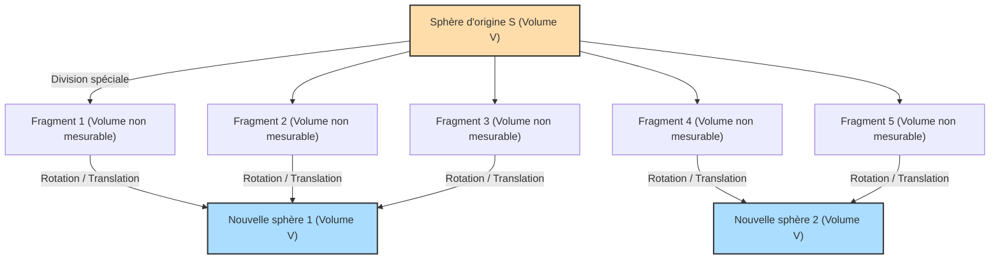

## 1. Un théorème magique : 1 = 1 + 1 ?

Imaginez que vous avez devant vous une sphère d'or pur.
Vous coupez cette sphère en plusieurs morceaux avec un couteau. Ensuite, vous assemblez ces pièces comme un puzzle. Vous ne les étirez pas, ne les pliez pas et n'ajoutez pas d'or supplémentaire. Vous vous contentez de les déplacer et de les coller ensemble.

Cependant, lorsque vous regardez le puzzle terminé, vous obtenez **"deux sphères d'or pur exactement de la même taille que la sphère d'origine"**.

Vous vous dites sûrement : "C'est absurde ! Cela contredit la loi de conservation de la masse, c'est un délire d'alchimiste !".
C'est absolument impossible dans le monde physique réel. Cependant, **dans le monde des mathématiques pures (géométrie et théorie des ensembles), cela est prouvé comme un théorème logiquement correct à 100 %**.

Il s'agit du **"paradoxe de Banach-Tarski"**, prouvé par deux mathématiciens, Stefan Banach et Alfred Tarski, en 1924.

---

## 2. Comprendre précisément l'énoncé du paradoxe

Si l'on exprime le théorème prouvé par Banach et Tarski en termes mathématiques précis, cela donne ce qui suit :

> **Le théorème de Banach-Tarski**
> Toute boule $S$ dans l'espace à trois dimensions peut être divisée en un nombre fini de sous-ensembles. Ces sous-ensembles peuvent ensuite être réassemblés (uniquement par rotation et translation) de manière à former deux boules identiques à la boule d'origine $S$.

Encore plus surprenant, en appliquant ce théorème, on peut également affirmer ce qui suit :

- En divisant un petit pois en un nombre fini de morceaux et en les réassemblant, on peut créer **une boule exactement de la même taille que le Soleil**. (Aussi connu sous le nom de paradoxe du petit pois et du Soleil)

Pourquoi une telle magie est-elle permise mathématiquement ?
Le secret réside dans deux mots-clés : **"l'infini"** et **"l'axiome du choix"**.

---

## 3. Les propriétés étranges de "l'infini"

La première étape pour comprendre ce paradoxe est de connaître les propriétés étranges des "ensembles infinis".

Dans le monde du "fini" que nous manipulons habituellement, le tout est toujours plus grand que la partie.
Par exemple, si vous prenez les nombres pairs (5 nombres) parmi les nombres de 1 à 10 (10 nombres), la quantité diminue de moitié.

Cependant, ce sens commun ne s'applique pas dans le monde de "l'infini".
Entre tous les "nombres entiers naturels" (1, 2, 3, 4, ...) et tous les "nombres pairs" (2, 4, 6, 8, ...), lesquels sont les plus nombreux ?
Intuitivement, on pourrait penser qu'il y a plus de nombres entiers naturels, car les nombres pairs ne représentent que la moitié des entiers.
Cependant, essayez de faire des paires comme suit :

- 1 $\rightarrow$ 2
- 2 $\rightarrow$ 4
- 3 $\rightarrow$ 6
- $n \rightarrow 2n$

Ainsi, pour chaque entier naturel, vous pouvez toujours l'associer à exactement un nombre pair qui en est le double (correspondance biunivoque). Il ne reste aucun nombre.
En d'autres termes, mathématiquement, **"le nombre d'entiers naturels (infini)" et "le nombre de nombres pairs (infini)" ont exactement la même taille** !

Bien que l'on ait retiré la moitié (les nombres pairs) du tout (les nombres entiers naturels), la taille reste inchangée. Dans les ensembles infinis, il peut arriver que **"la partie soit égale au tout"**.
Le théorème de Banach-Tarski est l'expression ultime de cette "magie de l'infini" appliquée aux ensembles de "points" dans un espace tridimensionnel.

---

## 4. Les points de l'espace sont découpés de manière "non mesurable"

Lorsqu'on coupe un objet réel (comme de l'or ou une pomme) avec un couteau, les morceaux ont toujours un "volume".
Cependant, une boule en mathématiques est une **"collection infinie de points"** qui n'a pas de volume en soi.

Banach et Tarski ont divisé ces points infinis en groupes d'une manière très spéciale et complexe.
La méthode de division est tellement complexe et dispersée que l'état résultant devient "impossible à mesurer en termes de volume (ensemble non mesurable)".

Si chaque pièce devient un nuage flou de points qui "n'a pas de volume (ne peut pas être mesuré)", il est possible de s'affranchir de la contrainte physique (additivité de la mesure) stipulant que "la somme des volumes des pièces doit être égale au volume d'origine".

Et lorsque ces pièces de nuages flous sont pivotées et combinées habilement, la "magie de l'infini" permet d'obtenir deux boules remplies des mêmes points que la boule d'origine.
En réalité, il est prouvé que cette opération consistant à "créer deux boules à partir d'une seule" est possible en divisant la boule d'origine en seulement **5 morceaux**.

---

## 5. Le responsable de tout ça : qu'est-ce que "l'axiome du choix" ?

Alors, pourquoi une "division si complexe que son volume ne peut être mesuré" est-elle mathématiquement possible ?
C'est parce que nous acceptons la règle appelée **"l'axiome du choix (Axiom of Choice)"**, qui est le fondement des mathématiques modernes.

Pour résumer, l'axiome du choix est la règle suivante :

> **L'idée de l'axiome du choix**
> Lorsqu'il y a des objets dans de nombreuses boîtes, on a la règle de **"pouvoir choisir exactement un objet dans chaque boîte pour créer un nouvel ensemble"**.

Si le nombre de boîtes est fini, tout le monde peut le faire normalement.
Cependant, si **le nombre de boîtes est "infini"**, il est impossible pour un être humain de terminer l'opération de "choisir un par un" une infinité de fois. Néanmoins, l'axiome du choix admet qu'il est permis de considérer que "l'ensemble créé par ces choix existe".

Cet axiome était extrêmement pratique et indispensable pour construire les mathématiques modernes. La plupart des mathématiciens ont accepté cette règle en se disant : "Eh bien, c'est évident".

Cependant, accepter cet axiome du choix implique d'accepter l'existence d'ensembles de points si éparpillés qu'il est impossible d'en mesurer le volume (ensembles non mesurables). Et en conséquence, le théorème de Banach-Tarski, affirmant qu'une boule se dédouble, en découle comme une nécessité logique.

---

## 6. Conclusion : le "monde au-delà de l'intuition" décrit par les mathématiques

Le paradoxe de Banach-Tarski n'est pas un paradoxe au sens d'"incohérence logique". C'est un paradoxe dans le sens où **la logique est correcte à 100 %, mais la conclusion à laquelle elle aboutit contredit violemment l'intuition humaine et les lois de la physique**.

Lorsque ce théorème a été publié, certains mathématiciens ont soutenu que "si une conclusion aussi insensée en ressort, l'axiome du choix doit être erroné !".
Cependant, aujourd'hui, la plupart des mathématiciens acceptent l'axiome du choix, et le théorème de Banach-Tarski est également accepté comme "une propriété étrange mais belle de l'espace tridimensionnel et des ensembles infinis".

Puisque le monde physique dans lequel nous vivons est constitué de "particules ayant une taille (finies)" appelées atomes, il est impossible de donner à un petit pois la taille du Soleil.
Cependant, sur la toile des "mathématiques" créée par le cerveau humain, la taille d'un point est nulle, et des opérations infinies sont permises.

Le paradoxe de Banach-Tarski nous enseigne **à quel point le concept de "l'infini" surpasse allègrement notre simple intuition humaine**, et on peut dire que c'est l'un des plus grands chefs-d'œuvre des mathématiques modernes.
