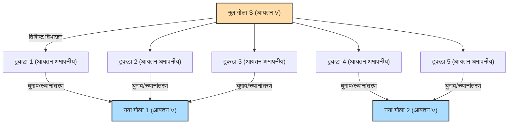

## 1. जादू जैसा प्रमेय: 1 = 1 + 1 ?

मान लीजिए कि आपके सामने शुद्ध सोने का एक गोला (गेंद) है।
इस गोले को चाकू से कई टुकड़ों में काट लें। फिर, उन टुकड़ों को पहेली की तरह एक साथ जोड़ें। टुकड़ों को खींचने, मोड़ने या नया सोना जोड़ने की बिल्कुल भी अनुमति नहीं है। बस उन्हें हिलाना है और एक साथ जोड़ना है।

हालाँकि, जब आप पूरी हो चुकी पहेली को देखते हैं, तो आप पाते हैं कि **"मूल गोले के समान आकार के दो शुद्ध सोने के गोले"** बन गए हैं।

आप सोच सकते हैं, "क्या बकवास है! यह द्रव्यमान के संरक्षण के नियम के विरुद्ध है, और यह एक कीमियागर का भ्रम है!"
वास्तविक भौतिक दुनिया में यह बिल्कुल असंभव है। हालाँकि, **शुद्ध गणित (ज्यामिति और समुच्चय सिद्धांत) की दुनिया में, यह तार्किक रूप से 100% सही प्रमेय के रूप में सिद्ध हो चुका है**।

यही **"बनाख-तार्स्की विरोधाभास"** है, जिसे 1924 में स्टीफन बनाख और अल्फ्रेड तार्स्की नामक दो गणितज्ञों द्वारा सिद्ध किया गया था।

---

## 2. विरोधाभास के दावे को ठीक से समझना

बनाख और तार्स्की द्वारा सिद्ध किए गए प्रमेय को गणितीय रूप से सटीक शब्दों में इस प्रकार व्यक्त किया जा सकता है:

> **बनाख-तार्स्की प्रमेय**
> 3-आयामी अंतरिक्ष में किसी भी गोले $S$ को परिमित संख्या में टुकड़ों में विभाजित किया जा सकता है। और फिर, उन टुकड़ों को (केवल घुमाव और स्थानांतरण द्वारा) पुनर्व्यवस्थित करके, मूल गोले $S$ के बिल्कुल समान त्रिज्या वाले दो गोले बनाए जा सकते हैं।

और भी आश्चर्यजनक बात यह है कि इस प्रमेय को लागू करने पर हम निम्नलिखित भी कह सकते हैं:

- एक मटर के दाने को परिमित संख्या में टुकड़ों में विभाजित करके और उसे फिर से जोड़कर, **बिल्कुल सूर्य के आकार का एक गोला** बनाया जा सकता है। (इसे मटर और सूर्य का विरोधाभास भी कहा जाता है)

गणितीय रूप से ऐसा जादू कैसे संभव है?
इसका रहस्य दो मुख्य शब्दों: **"अनंत"** और **"चयन का स्वयंसिद्ध"** में छिपा है।

---

## 3. "अनंत" की अद्भुत प्रकृति

इस विरोधाभास को समझने का पहला कदम "अनंत समुच्चय" की अजीब प्रकृति को जानना है।

"परिमित" दुनिया में जिसका हम आमतौर पर सामना करते हैं, पूर्ण हमेशा उसके हिस्से से बड़ा होता है।
उदाहरण के लिए, यदि आप 1 से 10 तक की संख्याओं (10 संख्याएँ) में से सम संख्याओं (5 संख्याएँ) को बाहर निकालते हैं, तो संख्याओं की मात्रा आधी हो जाएगी।

हालाँकि, "अनंत" की दुनिया में यह सामान्य ज्ञान काम नहीं करता है।
सभी "प्राकृतिक संख्याओं" (1, 2, 3, 4, ...) और सभी "सम संख्याओं" (2, 4, 6, 8, ...) में से कौन सी अधिक हैं?
सहज रूप से, चूँकि सम संख्याएँ प्राकृतिक संख्याओं की आधी होती हैं, इसलिए ऐसा लगता है कि प्राकृतिक संख्याएँ अधिक हैं।
लेकिन, कृपया नीचे दिए गए अनुसार जोड़े बनाने का प्रयास करें:

- 1 $\rightarrow$ 2
- 2 $\rightarrow$ 4
- 3 $\rightarrow$ 6
- $n \rightarrow 2n$

इस तरह, प्रत्येक प्राकृतिक संख्या के लिए, हम ठीक दोगुनी सम संख्या के साथ एक जोड़ा बना सकते हैं (एक-से-एक पत्राचार)। कोई संख्या नहीं बचेगी।
अर्थात गणितीय रूप से, **"प्राकृतिक संख्याओं की मात्रा (अनंत)" और "सम संख्याओं की मात्रा (अनंत)" बिल्कुल एक ही आकार की हैं**!

यद्यपि हमने पूर्ण (प्राकृतिक संख्या) में से आधा (सम संख्या) निकाल लिया है, फिर भी आकार मूल के समान ही रहता है। अनंत समुच्चयों में, यह संभव है कि **"एक भाग पूर्ण के बराबर हो जाए"**।
बनाख-तार्स्की प्रमेय को इस "अनंत के जादू" का अंतिम रूप कहा जा सकता है जिसे 3-आयामी अंतरिक्ष में "बिंदुओं" के समुच्चय पर लागू किया गया है।

---

## 4. अंतरिक्ष के बिंदुओं को "अमापनीय" रूप में काटा जाता है

जब वास्तविक वस्तुओं (सोना या सेब) को चाकू से काटा जाता है, तो टुकड़ों का हमेशा एक "आयतन" होता है।
हालाँकि, गणित में एक गोला **"बिना आयतन वाले अनंत बिंदुओं का संग्रह"** होता है।

बनाख और तार्स्की ने इन अनंत बिंदुओं को एक बहुत ही विशिष्ट और जटिल तरीके से समूहीकृत (विभाजित) किया।
वह विभाजन इतना जटिल और बिखरा हुआ होता है कि वे ऐसी स्थिति में पहुँच जाते हैं जहाँ "आयतन को मापा नहीं जा सकता (अमापनीय समुच्चय)"।

यदि प्रत्येक टुकड़ा बिंदुओं का एक धुंधला संग्रह बन जाता है जिसका "कोई आयतन नहीं है (मापा नहीं जा सकता)", तो हम भौतिकी के नियम (माप की योगात्मकता) के प्रतिबंध से बच सकते हैं, जो कहता है कि "यदि आप भागों को जोड़ते हैं, तो उन्हें मूल आयतन के बराबर होना चाहिए"।

और फिर, जब इन धुंधले बिंदु वाले टुकड़ों को घुमाया जाता है और कुशलता से एक साथ जोड़ा जाता है, तो "अनंत के जादू" के माध्यम से, मूल गोले के समान घने बिंदुओं से भरे दो गोले बन जाते हैं।
वास्तव में, यह सिद्ध हो चुका है कि यह "एक गोले से दो गोले बनाने" का ऑपरेशन मूल गोले को केवल **5 टुकड़ों** में विभाजित करके ही संभव है।

---

## 5. सभी का मूल कारण: "चयन का स्वयंसिद्ध" क्या है?

तो, गणितीय रूप से "इतना जटिल विभाजन कि आयतन को मापा न जा सके" कैसे संभव है?
ऐसा इसलिए है क्योंकि हम **"चयन का स्वयंसिद्ध (Axiom of Choice)"** नामक एक नियम को स्वीकार करते हैं, जो आधुनिक गणित की नींव है।

चयन का स्वयंसिद्ध, मोटे तौर पर, निम्नलिखित नियम है:

> **चयन के स्वयंसिद्ध की अवधारणा**
> जब कई बक्सों में वस्तुएं होती हैं, तो नियम यह है कि **"आप प्रत्येक बक्से से ठीक एक वस्तु चुनकर एक नया सेट (समुच्चय) बना सकते हैं"**।

यदि बक्सों की संख्या परिमित है, तो कोई भी इसे आसानी से कर सकता है।
हालाँकि, **यदि बक्सों की संख्या "अनंत" है**, तो एक इंसान अनंत बार "एक-एक करके चुनने" के ऑपरेशन को पूरा नहीं कर सकता है। फिर भी, "चुनकर बनाए गए सेट का अस्तित्व माना जा सकता है" इस बात को स्वीकार करना ही चयन का स्वयंसिद्ध है।

यह स्वयंसिद्ध आधुनिक गणित के निर्माण में बहुत उपयोगी और अपरिहार्य था। अधिकांश गणितज्ञों ने इस नियम को यह कहते हुए स्वीकार कर लिया, "ठीक है, यह तो स्पष्ट है।"

हालाँकि, यदि हम इस चयन के स्वयंसिद्ध को स्वीकार करते हैं, तो हमें उन "धुंधले बिंदुओं के समुच्चय जो इतने बिखरे हुए हैं कि उनके आयतन को मापा नहीं जा सकता (अमापनीय समुच्चय)" के अस्तित्व को भी स्वीकार करना होगा। और परिणामस्वरूप, "एक गोला दो बन जाता है" का बनाख-तार्स्की प्रमेय एक तार्किक अनिवार्यता के रूप में सामने आता है।

---

## 6. निष्कर्ष: गणित द्वारा चित्रित "सहज ज्ञान से परे दुनिया"

बनाख-तार्स्की विरोधाभास इस अर्थ में विरोधाभास नहीं है कि "तर्क में कोई अंतर्विरोध है"। यह इस अर्थ में एक विरोधाभास है कि **तर्क 100% सही है, लेकिन निकाला गया निष्कर्ष मानव अंतर्ज्ञान और भौतिकी के नियमों के साथ गहराई से विरोधाभास करता है**।

जब यह प्रमेय प्रकाशित हुआ, तो कुछ गणितज्ञों ने तर्क दिया, "यदि ऐसा बेतुका निष्कर्ष निकलता है, तो चयन का स्वयंसिद्ध गलत होना चाहिए!"
हालाँकि, आज, अधिकांश गणितज्ञ चयन के स्वयंसिद्ध को स्वीकार करते हैं, और बनाख-तार्स्की प्रमेय को "3-आयामी अंतरिक्ष और अनंत समुच्चयों की एक अजीब लेकिन सुंदर संपत्ति" के रूप में भी स्वीकार किया जाता है।

चूँकि जिस भौतिक दुनिया में हम रहते हैं वह परमाणुओं से बनी है, जो "आकार वाले कण (परिमित)" हैं, इसलिए मटर के दाने को सूर्य के आकार का नहीं बनाया जा सकता।
हालाँकि, मानव मस्तिष्क द्वारा बनाए गए "गणित" के कैनवास पर, एक बिंदु का आकार शून्य होता है, और अनंत ऑपरेशनों की अनुमति होती है।

बनाख-तार्स्की विरोधाभास को आधुनिक गणित की महानतम कृतियों में से एक कहा जा सकता है, जो हमें सिखाता है कि **"अनंत" की अवधारणा मानव के सरल अंतर्ज्ञान को कितनी आसानी से पार कर जाती है**।
