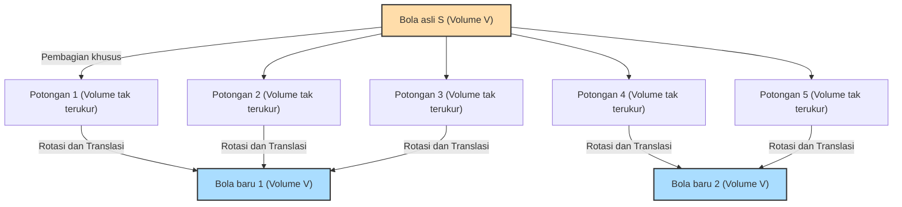

## 1. Teorema Seperti Sihir: 1 = 1 + 1 ?

Bayangkan jika di depan Anda ada sebuah bola emas murni.
Bola ini dipotong menjadi beberapa bagian menggunakan pisau. Kemudian, bagian-bagian tersebut digabungkan kembali seperti menyusun teka-teki (puzzle). Anda sama sekali tidak meregangkan, membengkokkan, atau menambahkan emas baru pada bagian-bagian itu. Hanya memindahkan dan menempelkannya saja.

Namun, saat melihat hasil akhir dari teka-teki tersebut, **"ada dua bola emas murni yang ukurannya sama persis dengan bola aslinya"**.

Anda mungkin berpikir, "Itu konyol! Ini melanggar hukum kekekalan massa, hanya khayalan para alkemis!"
Di dunia fisik nyata, hal ini benar-benar mustahil terjadi. Namun, **dalam dunia matematika murni (geometri dan teori himpunan), ini telah dibuktikan sebagai teorema yang secara logis 100% benar**.

Inilah yang disebut **"Paradoks Banach-Tarski"**, yang dibuktikan oleh dua matematikawan, Stefan Banach dan Alfred Tarski, pada tahun 1924.

---

## 2. Memahami Klaim Paradoks secara Tepat

Jika kita mengungkapkan teorema yang dibuktikan oleh Banach dan Tarski dalam bahasa matematis yang tepat, maka bunyinya adalah sebagai berikut:

> **Teorema Banach-Tarski**
> Sembarang bola $S$ dalam ruang 3 dimensi dapat dibagi menjadi sejumlah berhingga potongan. Kemudian, dengan mengatur ulang potongan-potongan tersebut (hanya menggunakan rotasi dan translasi), kita dapat membuat dua bola yang memiliki jari-jari yang persis sama dengan bola aslinya $S$.

Lebih mengejutkan lagi, jika teorema ini diterapkan, kita dapat mengatakan hal berikut:

- Dengan membagi sebutir kacang polong menjadi potongan-potongan berhingga dan menyusunnya kembali, kita dapat membuat **bola yang besarnya sama persis dengan Matahari**. (Juga dikenal sebagai: Paradoks Kacang Polong dan Matahari)

Mengapa sihir seperti itu diperbolehkan secara matematis?
Rahasianya tersembunyi dalam dua kata kunci: **"Tak Terhingga (Infinity)"** dan **"Aksioma Pilihan (Axiom of Choice)"**.

---

## 3. Sifat Aneh dari "Tak Terhingga"

Langkah pertama untuk memahami paradoks ini adalah mengetahui sifat aneh dari "himpunan tak terhingga".

Di dunia "berhingga" yang biasa kita hadapi, keseluruhan pasti selalu lebih besar daripada bagiannya.
Misalnya, jika kita mengambil angka genap (5 buah) dari angka 1 hingga 10 (10 buah), maka jumlah angkanya akan berkurang setengah.

Namun, di dunia "tak terhingga", akal sehat ini tidak berlaku.
Antara semua "bilangan asli" (1, 2, 3, 4, ...) dan semua "bilangan genap" (2, 4, 6, 8, ...), mana yang lebih banyak?
Secara intuitif, bilangan genap tampaknya hanya setengah dari bilangan asli, jadi bilangan asli terasa lebih banyak.
Tetapi, cobalah buat pasangan seperti ini:

- 1 $\rightarrow$ 2
- 2 $\rightarrow$ 4
- 3 $\rightarrow$ 6
- $n \rightarrow 2n$

Dengan cara ini, untuk setiap bilangan asli, kita selalu bisa memasangkannya tepat dengan satu bilangan genap yang bernilai dua kali lipatnya (korespondensi satu-satu). Tidak ada angka yang tersisa.
Dengan kata lain, secara matematis, **"jumlah bilangan asli (tak terhingga)" dan "jumlah bilangan genap (tak terhingga)" adalah sama besarnya**!

Meskipun kita mengambil setengah (bilangan genap) dari keseluruhan (bilangan asli), ukurannya tidak berubah. Dalam himpunan tak terhingga, bisa terjadi bahwa **"bagian sama dengan keseluruhan"**.
Teorema Banach-Tarski bisa dikatakan sebagai bentuk paling ekstrem dari "sihir tak terhingga" yang diterapkan pada himpunan "titik-titik" di ruang 3 dimensi.

---

## 4. Titik-titik di Ruang Dipotong Menjadi "Tak Terukur"

Ketika benda nyata (seperti emas atau apel) dipotong menggunakan pisau, potongan-potongannya selalu memiliki "volume".
Namun, bola dalam matematika adalah **"kumpulan titik-titik tak terhingga"** yang tidak memiliki volume.

Banach dan Tarski mengelompokkan (membagi) titik-titik tak terhingga ini dengan metode yang sangat khusus dan rumit.
Cara pembagian ini sangat rumit dan tersebar, sehingga berada dalam kondisi "tidak bisa lagi diukur volumenya (himpunan tak terukur)".

Ketika setiap potongan menjadi kumpulan titik-titik kabur yang "tidak memiliki (tidak dapat diukur) volumenya", kita bisa terlepas dari batasan aturan fisika (aditivitas ukuran) yang mengatakan "jika potongan-potongan dijumlahkan, harus sama dengan volume aslinya".

Kemudian, jika kita memutar dan menggabungkan potongan-potongan titik kabur tersebut dengan tepat, melalui "sihir tak terhingga", kita akan menghasilkan dua bola padat yang berisi titik-titik yang sama persis dengan aslinya.
Faktanya, telah dibuktikan bahwa operasi "membuat dua bola dari satu bola" ini dimungkinkan hanya dengan membagi bola asli menjadi **5 potongan** saja.

---

## 5. Sumber dari Semuanya: Apa itu "Aksioma Pilihan"?

Lalu, mengapa "pembagian yang sangat rumit hingga volumenya tidak bisa diukur" bisa dimungkinkan secara matematis?
Itu karena matematika menerima aturan yang disebut **"Aksioma Pilihan (Axiom of Choice)"**, yang menjadi dasar matematika modern.

Aksioma pilihan, secara kasar, adalah aturan berikut:

> **Gambaran Aksioma Pilihan**
> Ketika terdapat banyak kotak yang masing-masing berisi benda, ini adalah aturan yang menyatakan bahwa **"kita dapat mengambil tepat satu benda dari setiap kotak untuk membuat set (himpunan) yang baru"**.

Jika jumlah kotaknya berhingga, siapa pun dapat melakukannya dengan normal.
Namun, **jika jumlah kotaknya "tak terhingga"**, manusia tidak akan bisa menyelesaikan tindakan "memilih satu per satu" dalam waktu yang tak terhingga. Meskipun begitu, aksioma pilihan memperbolehkan kita untuk menganggap bahwa "set yang dibuat dengan cara memilih tersebut itu ada".

Aksioma ini sangat berguna dan sangat diperlukan dalam membangun matematika modern. Sebagian besar matematikawan menerima aturan ini dan menganggapnya "yah, itu sudah wajar."

Namun, jika kita menerima aksioma pilihan ini, kita juga harus mengakui keberadaan "himpunan titik-titik kabur yang sangat tersebar hingga volumenya tidak bisa diukur (himpunan tak terukur)" yang disebutkan sebelumnya. Dan sebagai hasilnya, Teorema Banach-Tarski yang menyatakan "satu bola bisa menjadi dua" secara logis muncul sebagai keniscayaan.

---

## 6. Kesimpulan: "Dunia di Luar Intuisi" yang Digambarkan oleh Matematika

Paradoks Banach-Tarski bukanlah paradoks (kontradiksi) dalam artian "ada kesalahan logika". Ini adalah paradoks dalam artian **logikanya 100% benar, tetapi kesimpulan yang ditarik sangat bertentangan dengan intuisi manusia dan hukum fisika**.

Ketika teorema ini dipublikasikan, beberapa matematikawan berpendapat, "Jika kesimpulan yang tidak masuk akal ini muncul, Aksioma Pilihan pasti salah!"
Namun saat ini, banyak matematikawan menerima Aksioma Pilihan dan juga menerima Teorema Banach-Tarski sebagai "sifat aneh namun indah yang dimiliki oleh ruang 3 dimensi dan himpunan tak terhingga".

Dunia fisik tempat kita tinggal terbuat dari "partikel-partikel yang memiliki ukuran (berhingga)" seperti atom, sehingga tidak mungkin membuat kacang polong menjadi sebesar Matahari.
Namun, di atas kanvas "matematika" yang diciptakan oleh otak manusia, ukuran suatu titik adalah nol, dan operasi tak terhingga diizinkan.

Paradoks Banach-Tarski bisa dikatakan sebagai salah satu karya agung matematika modern yang mengajarkan kita **seberapa mudahnya konsep "tak terhingga" melampaui intuisi sederhana manusia**.
