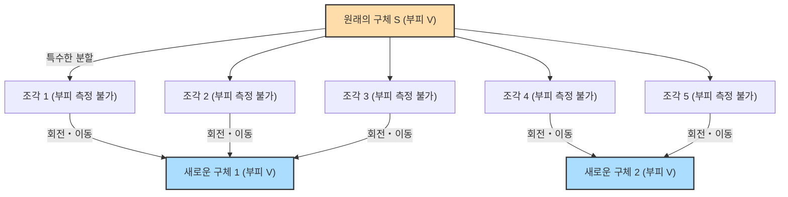

## 1. 마법 같은 정리: 1 = 1 + 1 ?

만약 눈앞에 1개의 순금 공(ball)이 있다고 가정해 봅시다.
이 공을 칼로 여러 조각으로 나눕니다. 그리고 그 조각들을 퍼즐처럼 다시 조합합니다. 조각을 늘리거나 구부리거나 새로운 금을 덧붙이는 일은 절대 하지 않습니다. 오직 이동시켜서 붙이기만 합니다.

그런데 완성된 퍼즐을 보면, **"원래의 공과 완전히 같은 크기의 순금 공이 2개"** 만들어져 있는 것입니다.

"말도 안 돼! 질량 보존의 법칙에 어긋나고, 연금술사의 망상일 뿐이야!"라고 생각할 것입니다.
현실의 물리 세계에서는 절대 있을 수 없는 일입니다. 하지만 **순수 수학(기하학·집합론)의 세계에서는 이것이 논리적으로 100% 참인 정리로 증명되어 있습니다.**

이것이 바로 1924년 스테판 바나흐(Stefan Banach)와 알프레트 타르스키(Alfred Tarski)라는 두 수학자에 의해 증명된 **"바나흐-타르스키 역설"**입니다.

---

## 2. 역설의 주장을 정확히 이해하기

바나흐와 타르스키가 증명한 정리를 수학적으로 정확한 언어로 표현하면 다음과 같습니다.

> **바나흐-타르스키 정리**
> 3차원 공간 내에 있는 임의의 구체 $S$는 유한 개의 조각으로 분할할 수 있다. 그리고 그 조각들을 (회전과 평행 이동만으로) 재배치함으로써 원래의 구체 $S$와 완전히 같은 반지름을 가진 두 개의 구체를 만들어낼 수 있다.

더욱 놀라운 것은, 이 정리를 응용하면 다음과 같은 사실도 말할 수 있다는 점입니다.

- 1개의 완두콩을 유한 개의 조각으로 분할하고 이를 다시 조립함으로써, **태양과 완전히 똑같은 크기의 구체**를 만들 수 있다. (별명: 완두콩과 태양의 역설)

왜 이런 마법 같은 일이 수학적으로 허용되는 것일까요?
그 비밀은 **"무한"**과 **"선택 공리"**라는 두 가지 키워드에 숨겨져 있습니다.

---

## 3. "무한"의 신비한 성질

이 역설을 이해하기 위한 첫걸음은 "무한 집합"의 기묘한 성질을 아는 것입니다.

우리가 평소 다루는 "유한"의 세계에서는 전체가 부분보다 반드시 큽니다.
예를 들어, 1부터 10까지의 숫자(10개) 중에서 짝수(5개)를 꺼내면, 숫자는 반으로 줄어듭니다.

하지만 "무한"의 세계에서는 이 상식이 통하지 않습니다.
모든 "자연수"(1, 2, 3, 4, ...)와 모든 "짝수"(2, 4, 6, 8, ...) 중 어느 쪽이 더 많을까요?
직관적으로는 짝수가 자연수의 절반밖에 되지 않으므로 자연수가 더 많을 것 같은 느낌이 듭니다.
하지만 다음과 같이 짝을 지어보세요.

- 1 $\rightarrow$ 2
- 2 $\rightarrow$ 4
- 3 $\rightarrow$ 6
- $n \rightarrow 2n$

이처럼 모든 자연수에 대해 정확히 두 배가 되는 짝수를 반드시 하나씩 짝지을 수 있습니다(일대일 대응). 남는 수는 없습니다.
즉 수학적으로는, **"자연수의 개수(무한)"와 "짝수의 개수(무한)"는 완전히 같은 크기**인 것입니다!

전체(자연수)에서 절반(짝수)을 떼어냈는데도 크기는 원래대로 변함이 없습니다. 무한 집합에서는 **"부분이 전체와 같아지는"** 일이 일어날 수 있는 것입니다.
바나흐-타르스키 정리는 이 "무한의 마법"을 3차원 공간의 "점"의 집합에 적용한 궁극의 형태라고 할 수 있습니다.

---

## 4. 공간의 점은 "측정 불가능"하게 조각난다

현실의 물체(금이나 사과)를 칼로 자를 경우, 조각에는 반드시 "부피"가 존재합니다.
하지만 수학에서의 구체는 부피를 갖지 않는 **"무한한 점들의 모임"**입니다.

바나흐와 타르스키는 이 무한한 점들을 매우 특수하고 복잡한 방법으로 그룹화(분할)했습니다.
그 나누는 방식이 너무나도 복잡하고 흩어져 있어서 더 이상 "부피를 측정할 수 없는(비가측 집합)" 상태가 됩니다.

각 조각이 "부피를 갖지 않는(측정할 수 없는)" 모호한 점들의 모임이 되어버리면, "조각들을 합치면 원래 부피와 같아야 한다"라는 물리 법칙(측도의 가산 가법성)의 굴레에서 벗어날 수 있습니다.

그리고 그 모호한 점의 조각들을 회전시켜 잘 조합하면, "무한의 마법"에 의해 원래의 구체와 완전히 같은 점이 빽빽하게 찬 구체가 2개 완성되어 버리는 것입니다.
실제로는 원래의 구체를 단 **5개의 조각**으로 나누는 것만으로 이 "1개의 공에서 2개의 공을 만드는" 조작이 가능함이 증명되어 있습니다.

---

## 5. 모든 것의 원흉: "선택 공리"란 무엇인가?

그렇다면 왜 "부피를 잴 수 없을 정도로 복잡한 분할"이 수학적으로 가능한 것일까요?
그것은 현대 수학의 기초가 되는 **"선택 공리(Axiom of Choice)"**라는 규칙을 인정하고 있기 때문입니다.

선택 공리란 간단히 말해 다음과 같은 규칙입니다.

> **선택 공리의 이미지**
> 수많은 상자 속에 각각 물건이 들어 있을 때, **"각 상자에서 물건을 하나씩 골라내어 새로운 세트(집합)를 만들 수 있다"**는 규칙.

상자의 개수가 유한 개라면 누구나 쉽게 할 수 있습니다.
하지만 **상자의 개수가 "무한 개"일 경우**, 인간이 "하나씩 고르는" 조작을 무한 번 끝마칠 수는 없습니다. 그럼에도 "골라서 만든 세트가 존재한다고 보아도 좋다"라고 인정하는 것이 선택 공리입니다.

이 공리는 현대 수학을 구축하는 데 있어 매우 편리하고 필수 불가결한 것이었습니다. 대부분의 수학자들은 "뭐, 당연한 거네"라며 이 규칙을 받아들였습니다.

하지만 이 선택 공리를 인정하면, 앞서 말한 "부피를 잴 수 없을 정도로 흩어진 모호한 점들의 집합(비가측 집합)"의 존재를 인정하게 되어버립니다. 그리고 그 결과로서 "1개의 공이 2개가 된다"는 바나흐-타르스키 정리가 논리적 필연으로 도출되고 마는 것입니다.

---

## 6. 요약: 수학이 그려내는 "직관을 뛰어넘는 세계"

바나흐-타르스키의 역설은 "논리에 모순이 있다"는 의미의 역설(패러독스)이 아닙니다. **논리는 100% 옳지만, 도출된 결론이 인간의 직관이나 물리 법칙과 격렬하게 모순된다**는 의미에서의 역설입니다.

이 정리가 발표되었을 때, 일부 수학자들은 "이렇게 비상식적인 결론이 나온다면, 선택 공리는 틀림없이 잘못된 것이다!"라고 주장했습니다.
하지만 현재는 많은 수학자들이 선택 공리를 받아들이고, 바나흐-타르스키의 정리 또한 "3차원 공간과 무한 집합이 가지는, 기묘하지만 아름다운 성질"로서 받아들이고 있습니다.

우리가 사는 물리 세계는 원자라는 "크기가 있는 알갱이(유한)"로 이루어져 있기 때문에, 완두콩을 태양 크기로 만들 수는 없습니다.
하지만 인간의 두뇌가 만들어낸 "수학"이라는 캔버스 위에서는 점의 크기는 0이며, 무한의 조작이 허용됩니다.

바나흐-타르스키의 역설은, **"무한"이라는 개념이 인간의 소박한 직관을 얼마나 가볍게 뛰어넘는가**를 가르쳐 주는, 현대 수학의 최고 걸작 중 하나라고 할 수 있을 것입니다.
