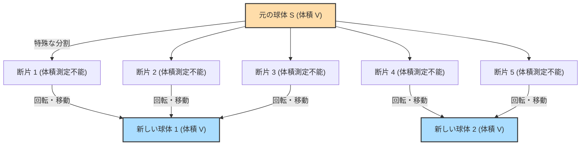

## 1. 魔法のような定理：1 = 1 + 1 ?

もし目の前に1つの純金の球（ボール）があるとします。
この球をナイフでいくつかのパーツに切り分けます。そして、それらのパーツをパズルのように組み合わせていきます。パーツを伸ばしたり、曲げたり、新しい金を付け足したりはいっさいしません。ただ移動させてくっつけるだけです。

ところが、完成したパズルを見ると、**「元の球と全く同じ大きさの純金の球が、2つ」**できあがっているのです。

「そんな馬鹿な！質量保存の法則に反しているし、錬金術師の妄想だ！」と思うでしょう。
現実の物理世界では絶対にありえません。しかし、**純粋な数学（幾何学・集合論）の世界では、これが論理的に100%正しい定理として証明されている**のです。

これが、1924年にステファン・バナッハとアルフレト・タルスキという2人の数学者によって証明された**「バナッハ＝タルスキのパラドックス」**です。

---

## 2. パラドックスの主張を正確に理解する

バナッハとタルスキが証明した定理を、数学的に正確な言葉で表現すると次のようになります。

> **バナッハ＝タルスキの定理**
> 3次元空間内にある任意の球体 $S$ は、有限個の断片に分割することができる。そして、それらの断片を（回転と平行移動のみによって）再配置することで、元の球体 $S$ と全く同じ半径を持つ2つの球体を作り出すことができる。

さらに驚くべきことに、この定理を応用すると次のようなことも言えます。

- 1つのエンドウ豆を有限個のパーツに分割し、それを組み立て直すことで、**太陽と全く同じ大きさの球**を作ることができる。（別名：エンドウ豆と太陽のパラドックス）

なぜ、こんな魔法のようなことが数学的に許されるのでしょうか？
その秘密は、**「無限」**と**「選択公理」**という2つのキーワードに隠されています。

---

## 3. 「無限」の不思議な性質

このパラドックスを理解するための第一歩は、「無限集合」の奇妙な性質を知ることです。

私たちが普段扱っている「有限」の世界では、全体は部分よりも必ず大きくなります。
例えば、1から10までの数字（10個）の中から、偶数（5個）を取り出すと、数は半分に減ってしまいます。

しかし、「無限」の世界ではこの常識が通用しません。
すべての「自然数」（1, 2, 3, 4, ...）と、すべての「偶数」（2, 4, 6, 8, ...）は、どちらの方が多いでしょうか？
直感的には、偶数は自然数の半分しかないので、自然数の方が多い気がします。
しかし、以下のようにペアを作ってみてください。

- 1 $\rightarrow$ 2
- 2 $\rightarrow$ 4
- 3 $\rightarrow$ 6
- $n \rightarrow 2n$

このように、すべての自然数に対して、ちょうど2倍にした偶数を必ず1つずつペアにすることができます（一対一対応）。余る数はありません。
つまり数学的には、**「自然数の個数（無限）」と「偶数の個数（無限）」は全く同じ大きさ**なのです！

全体（自然数）の中から半分（偶数）を取り出したはずなのに、大きさは元のまま変わっていない。無限集合においては、**「部分が全体と等しくなる」**ことが起こり得るのです。
バナッハ＝タルスキの定理は、この「無限の魔法」を3次元空間の「点」の集合に適用した究極の形と言えます。

---

## 4. 空間の点は「非可測」に切り刻まれる

現実の物体（金やリンゴ）を包丁で切った場合、パーツには必ず「体積」が存在します。
しかし、数学における球は、体積を持たない**「無限個の点の集まり」**です。

バナッハとタルスキは、この無限個の点を、非常に特殊で複雑な方法でグループ分け（分割）しました。
その分け方は、あまりにも複雑で散らばっているため、もはや「体積を測ることができない（非可測集合）」状態になります。

各パーツが「体積を持たない（測れない）」モヤモヤした点の集まりになってしまえば、「パーツを足し合わせたら元の体積と同じにならなければならない」という物理のルール（測度の加法性）の縛りから抜け出すことができます。

そして、それらのモヤモヤした点のパーツを回転させて上手く組み合わせると、「無限の魔法」によって、元の球と全く同じ点がギッシリ詰まった球が2つ完成してしまうのです。
実際には、元の球をたった **5つのパーツ** に分割するだけで、この「1つの球から2つの球を作る」操作が可能であることが証明されています。

---

## 5. すべての元凶：「選択公理」とは何か？

では、なぜ「体積を測ることができないほど複雑な分割」が数学的に可能なのでしょうか？
それは、現代数学の基礎となっている**「選択公理（Axiom of Choice）」**というルールを認めているからです。

選択公理とは、ざっくり言うと次のようなルールです。

> **選択公理のイメージ**
> たくさんの箱の中にそれぞれモノが入っているとき、**「各箱から1つずつモノを選び出して、新しいセット（集合）を作ることができる」**というルール。

箱の数が有限個なら、誰でも普通にできます。
しかし、**箱の数が「無限個」あった場合**、人間が「1つずつ選ぶ」操作を無限回終わらせることはできません。それでも、「選んで作ったセットが存在するとして良い」と認めるのが選択公理です。

この公理は、現代の数学を構築する上で非常に便利で不可欠なものでした。数学者のほとんどは「まあ、当たり前だよね」とこのルールを受け入れました。

しかし、この選択公理を認めると、先ほどの「体積が測れないほど散らばったモヤモヤの点の集合（非可測集合）」の存在を認めることになってしまいます。そして、その結果として「1つの球が2つになる」というバナッハ＝タルスキの定理が、論理的必然として導き出されてしまうのです。

---

## 6. まとめ：数学が描き出す「直感を超えた世界」

バナッハ＝タルスキのパラドックスは、「論理に矛盾がある」という意味でのパラドックス（逆説）ではありません。**論理は100%正しいのに、導き出された結論が人間の直感や物理法則と激しく矛盾している**という意味でのパラドックスです。

この定理が発表されたとき、一部の数学者たちは「こんな非常識な結論が出るなら、選択公理は間違っているに違いない！」と主張しました。
しかし現在では、多くの数学者が選択公理を受け入れ、バナッハ＝タルスキの定理も「3次元空間と無限集合が持つ、奇妙だけど美しい性質」として受け入れています。

私たちが暮らす物理世界は原子という「大きさのある粒（有限）」でできているため、エンドウ豆を太陽の大きさにすることはできません。
しかし、人間の頭脳が創り出した「数学」というキャンバスの上では、点のサイズはゼロであり、無限の操作が許されます。

バナッハ＝タルスキのパラドックスは、**「無限」という概念が、人間の素朴な直感をどれほど軽々と飛び越えていくか**を教えてくれる、現代数学の最高傑作の一つと言えるでしょう。
