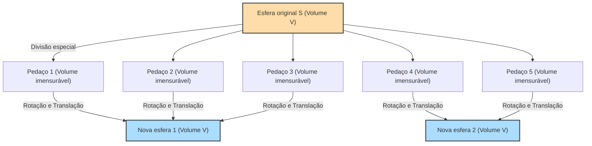

## 1. Um teorema mágico: 1 = 1 + 1 ?

Suponha que você tenha uma esfera de ouro puro bem na sua frente.
Você corta esta esfera em várias partes com uma faca. Então, você começa a juntar essas partes como um quebra-cabeça. Você não estica, dobra ou adiciona nenhum ouro novo às partes. Você apenas as move e as junta.

No entanto, quando você olha para o quebra-cabeça concluído, **"duas esferas de ouro puro exatamente do mesmo tamanho da esfera original"** foram criadas.

Você pode pensar, "Isso é absurdo! Vai contra a lei da conservação da massa, e é a ilusão de um alquimista!".
É absolutamente impossível no mundo físico real. No entanto, **no mundo da matemática pura (geometria e teoria dos conjuntos), isso foi comprovado como um teorema que é logicamente 100% correto**.

Este é o **"Paradoxo de Banach-Tarski"**, comprovado em 1924 por dois matemáticos, Stefan Banach e Alfred Tarski.

---

## 2. Entendendo com precisão a afirmação do paradoxo

O teorema provado por Banach e Tarski pode ser expresso em termos matematicamente precisos da seguinte forma:

> **Teorema de Banach-Tarski**
> Dada qualquer esfera $S$ no espaço tridimensional, ela pode ser dividida em um número finito de pedaços. Então, ao reagrupar esses pedaços (usando apenas rotações e translações), é possível criar duas esferas com exatamente o mesmo raio da esfera original $S$.

Ainda mais surpreendente, se você aplicar este teorema, você pode dizer algo assim:

- Ao dividir uma única ervilha em um número finito de partes e remontá-la, você pode criar **uma esfera exatamente do mesmo tamanho que o Sol**. (Também conhecido como: O Paradoxo da Ervilha e do Sol)

Por que uma coisa tão mágica é matematicamente permitida?
O segredo está escondido em duas palavras-chave: **"Infinito"** e o **"Axioma da Escolha"**.

---

## 3. As propriedades estranhas do "Infinito"

O primeiro passo para entender esse paradoxo é conhecer as propriedades estranhas dos "conjuntos infinitos".

No mundo "finito" com o qual lidamos normalmente, o todo é sempre maior que a parte.
Por exemplo, se você pegar os números pares (5 deles) dos números de 1 a 10 (10 deles), o número é reduzido pela metade.

No entanto, esse senso comum não se aplica no mundo do "infinito".
Qual é maior, todos os "números naturais" (1, 2, 3, 4, ...) ou todos os "números pares" (2, 4, 6, 8, ...)?
Intuitivamente, parece haver mais números naturais, pois os números pares são apenas a metade dos números naturais.
No entanto, tente criar pares da seguinte forma:

- 1 $\rightarrow$ 2
- 2 $\rightarrow$ 4
- 3 $\rightarrow$ 6
- $n \rightarrow 2n$

Dessa forma, para cada número natural, você sempre pode pareá-lo com exatamente um número par que seja o dobro dele (correspondência um-para-um). Não sobram números.
Ou seja, matematicamente, **"a quantidade de números naturais (infinito)" e "a quantidade de números pares (infinito)" têm exatamente o mesmo tamanho**!

Embora metade (números pares) devesse ter sido retirada do todo (números naturais), o tamanho permaneceu o mesmo do original. Em conjuntos infinitos, é possível que **"uma parte seja igual ao todo"**.
O Teorema de Banach-Tarski pode ser dito como a forma definitiva de aplicar essa "mágica do infinito" a um conjunto de "pontos" no espaço tridimensional.

---

## 4. Pontos no espaço são cortados "imensuravelmente"

Quando um objeto real (ouro ou maçã) é cortado com uma faca de cozinha, as partes sempre têm um "volume".
No entanto, uma esfera na matemática é um **"conjunto de um número infinito de pontos"** que não tem volume.

Banach e Tarski dividiram esse número infinito de pontos em grupos de uma forma muito especial e complexa.
O método de divisão é tão complexo e disperso que acaba num estado onde "o volume não pode mais ser medido (conjunto não mensurável)".

Uma vez que cada parte se torna uma coleção nebulosa de pontos que "não tem volume (não pode ser medida)", você pode escapar da restrição da regra da física (aditividade da medida) de que "a soma das partes deve ser igual ao volume original".

E quando você gira e combina as partes desses pontos nebulosos habilmente, através da "mágica do infinito", duas esferas cheias com exatamente os mesmos pontos que a esfera original são completadas.
De fato, foi provado que esta operação de "fazer duas esferas de uma" é possível dividindo a esfera original em apenas **5 pedaços**.

---

## 5. A causa de tudo: O que é o "Axioma da Escolha"?

Então, por que é matematicamente possível ter uma "divisão tão complexa que seu volume não pode ser medido"?
É porque aceitamos a regra chamada **"Axioma da Escolha (Axiom of Choice)"**, que é o alicerce da matemática moderna.

Falando de forma simples, o Axioma da Escolha é a seguinte regra:

> **Imagem do Axioma da Escolha**
> Quando há coisas dentro de muitas caixas, a regra é que **"você pode escolher uma coisa de cada caixa e criar um novo conjunto"**.

Se o número de caixas for finito, qualquer um pode fazer isso normalmente.
No entanto, se **o número de caixas for "infinito"**, um ser humano não pode terminar a operação de "escolher uma de cada vez" um número infinito de vezes. Mesmo assim, o Axioma da Escolha permite reconhecer que "um conjunto criado através da escolha pode ser considerado como existente".

Esse axioma tem sido muito conveniente e essencial na construção da matemática moderna. A maioria dos matemáticos aceitou essa regra, dizendo: "Bem, é óbvio".

No entanto, se você aceitar esse axioma da escolha, você terá que aceitar a existência do mencionado "conjunto de pontos nebulosos tão dispersos que seu volume não pode ser medido (conjunto não mensurável)". E como resultado disso, o Teorema de Banach-Tarski, de que "uma esfera se torna duas", é deduzido como uma necessidade lógica.

---

## 6. Conclusão: "O mundo além da intuição" desenhado pela matemática

O Paradoxo de Banach-Tarski não é um paradoxo no sentido de "há uma contradição na lógica". É um paradoxo no sentido de que **embora a lógica seja 100% correta, a conclusão tirada contradiz fortemente a intuição humana e as leis da física**.

Quando esse teorema foi anunciado, alguns matemáticos argumentaram que "se uma conclusão tão absurda pode ser alcançada, o Axioma da Escolha deve estar errado!".
No entanto, hoje, muitos matemáticos aceitam o Axioma da Escolha, e o Teorema de Banach-Tarski também é aceito como uma "propriedade estranha, mas bela, que o espaço tridimensional e os conjuntos infinitos possuem".

O mundo físico em que vivemos é feito de "partículas com tamanho (finito)", chamadas átomos, então não podemos transformar uma ervilha no tamanho do sol.
No entanto, na tela da "matemática" criada pelo cérebro humano, o tamanho de um ponto é zero, e operações infinitas são permitidas.

O Paradoxo de Banach-Tarski nos ensina o quão facilmente o conceito do "infinito" salta sobre a intuição humana simples, e pode ser considerado uma das obras-primas supremas da matemática moderna.
