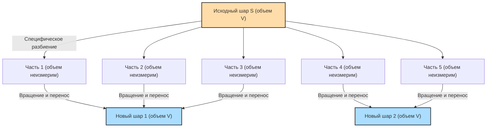

## 1. Волшебная теорема: 1 = 1 + 1 ?

Представьте, что перед вами находится один шар из чистого золота.
Вы разрезаете этот шар ножом на несколько частей. Затем вы собираете эти части вместе, словно пазл. Вы не растягиваете, не сгибаете части и не добавляете новое золото. Вы просто перемещаете их и соединяете.

Однако, взглянув на собранный пазл, вы обнаруживаете, что получились **«два шара из чистого золота, абсолютно такого же размера, как и исходный шар»**.

Вы наверняка подумаете: «Что за вздор! Это противоречит закону сохранения массы и похоже на бред алхимика!»
В реальном физическом мире это абсолютно невозможно. Однако **в мире чистой математики (геометрии и теории множеств) это доказано как логически на 100% верная теорема**.

Это и есть **«парадокс Банаха-Тарского»**, доказанный в 1924 году двумя математиками — Стефаном Банахом и Альфредом Тарским.

---

## 2. Точное понимание сути парадокса

Если выразить теорему, доказанную Банахом и Тарским, математически точным языком, она будет звучать следующим образом:

> **Теорема Банаха-Тарского**
> Любой шар $S$ в трехмерном пространстве может быть разбит на конечное число частей. Затем, путем перестановки этих частей (используя только вращение и параллельный перенос), можно составить два шара, имеющих точно такой же радиус, как и исходный шар $S$.

Что еще более удивительно, применяя эту теорему, можно утверждать следующее:

- Разделив одну горошину на конечное число частей и собрав их заново, можно создать **шар размером с Солнце**. (Также известно как парадокс горошины и Солнца)

Почему же такие магические вещи допускаются в математике?
Секрет кроется в двух ключевых понятиях: **«бесконечность»** и **«аксиома выбора»**.

---

## 3. Удивительные свойства «бесконечности»

Первый шаг к пониманию этого парадокса — узнать о странных свойствах «бесконечных множеств».

В привычном нам «конечном» мире целое всегда больше своей части.
Например, если из чисел от 1 до 10 (10 штук) выбрать только четные (5 штук), количество чисел уменьшится вдвое.

Однако в мире «бесконечности» этот здравый смысл не работает.
Чего больше: всех «натуральных чисел» (1, 2, 3, 4, ...) или всех «четных чисел» (2, 4, 6, 8, ...)?
Интуитивно кажется, что натуральных чисел больше, так как четные числа составляют лишь их половину.
Но попробуйте составить пары следующим образом:

- 1 $\rightarrow$ 2
- 2 $\rightarrow$ 4
- 3 $\rightarrow$ 6
- $n \rightarrow 2n$

Таким образом, для каждого натурального числа можно составить в пару ровно одно четное число, которое в два раза больше (взаимно однозначное соответствие). Ни одного числа не останется без пары.
С математической точки зрения это означает, что **«количество натуральных чисел (бесконечность)» и «количество четных чисел (бесконечность)» абсолютно одинаковы по размеру**!

Мы вроде бы взяли половину (четные числа) из целого (натуральные числа), но размер остался прежним. В бесконечных множествах может случиться так, что **«часть равна целому»**.
Теорема Банаха-Тарского — это высшая форма применения этой «магии бесконечности» к множеству «точек» в трехмерном пространстве.

---

## 4. Точки пространства разбиваются на «неизмеримые» части

Если разрезать реальный объект (золото или яблоко) ножом, у каждой части обязательно будет «объем».
Однако в математике шар — это **«совокупность бесконечного числа точек»**, которые сами по себе не имеют объема.

Банах и Тарский разделили эти бесконечные точки на группы (части) весьма специфическим и сложным способом.
Такое разделение настолько сложное и рассеянное, что полученные части приходят в состояние, когда их «объем невозможно измерить (неизмеримые множества)».

Когда каждая часть становится туманным скоплением точек, «не имеющим объема (неизмеримым)», мы можем обойти физическое правило о том, что «сумма частей должна быть равна исходному объему» (аддитивность меры).

А затем, если мы повернем и удачно скомбинируем эти туманные части точек, благодаря «магии бесконечности» получатся два шара, так же плотно заполненные точками, как и исходный шар.
Фактически доказано, что операция «создания двух шаров из одного» возможна при разделении исходного шара всего на **5 частей**.

---

## 5. Корень всех бед: что такое «аксиома выбора»?

Так почему же математически возможно такое «разбиение, настолько сложное, что невозможно измерить объем»?
Это потому, что мы признаем правило, известное как **«аксиома выбора (Axiom of Choice)»**, которое лежит в основе современной математики.

Грубо говоря, аксиома выбора — это следующее правило:

> **Суть аксиомы выбора**
> Когда есть много коробок, в каждой из которых что-то лежит, это правило гласит: **«можно выбрать по одному элементу из каждой коробки и создать из них новый набор (множество)»**.

Если количество коробок конечно, то любой с легкостью может это сделать.
Однако, **если коробок «бесконечно много»**, человек не может завершить процесс «выбора по одному» бесконечное число раз. Тем не менее, аксиома выбора позволяет утверждать, что «созданное путем такого выбора множество существует».

Эта аксиома оказалась чрезвычайно удобной и необходимой для построения современной математики. Большинство математиков приняли это правило, подумав: «Ну, это же очевидно».

Но если мы принимаем эту аксиому выбора, то нам приходится признать существование упомянутых ранее «туманных множеств точек, рассеянных настолько, что их объем невозможно измерить (неизмеримых множеств)». И как следствие, в качестве логической необходимости выводится теорема Банаха-Тарского, утверждающая, что «один шар превращается в два».

---

## 6. Заключение: «Мир за пределами интуиции», нарисованный математикой

Парадокс Банаха-Тарского — это не парадокс в смысле «противоречия в логике». Это парадокс в том смысле, что **логика на 100% верна, но выводы из нее резко противоречат человеческой интуиции и законам физики**.

Когда эта теорема была опубликована, некоторые математики заявили: «Раз из нее следуют такие абсурдные выводы, значит, аксиома выбора наверняка ошибочна!»
Но сегодня большинство математиков принимают аксиому выбора, а также признают теорему Банаха-Тарского как «странное, но прекрасное свойство трехмерного пространства и бесконечных множеств».

Поскольку физический мир, в котором мы живем, состоит из атомов, которые являются «частицами, имеющими размер (конечными)», мы не можем сделать горошину размером с Солнце.
Однако на холсте «математики», созданном человеческим разумом, размер точки равен нулю, и допускаются бесконечные операции.

Парадокс Банаха-Тарского по праву можно назвать одним из величайших шедевров современной математики, показывающим, **насколько легко понятие «бесконечности» превосходит наивную человеческую интуицию**.
