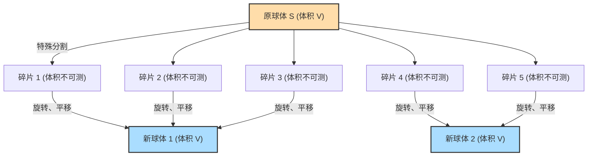

## 1. 魔法般的定理：1 = 1 + 1 ?

假设你面前有一个纯金的球。
你用刀将这个球切成几个部分，然后像拼图一样把这些部分重新组合起来。你不拉伸、不弯曲这些部分，也不添加任何新的黄金，只是单纯地移动并把它们拼接在一起。

然而，当你看着拼好的“拼图”时，会发现**“变成了两个和原来球体大小完全一样的纯金球”**。

你可能会想：“怎么可能！这违背了质量守恒定律，简直是炼金术士的妄想！”
在现实的物理世界中，这确实是绝对不可能的。但是，**在纯粹的数学（几何学、集合论）世界中，这被证明是一个在逻辑上100%正确的定理**。

这就是1924年由斯特凡·巴拿赫（Stefan Banach）和阿尔弗雷德·塔斯基（Alfred Tarski）两位数学家证明的**“巴拿赫-塔斯基悖论”**。

---

## 2. 准确理解悖论的主张

把巴拿赫和塔斯基证明的定理用数学上精确的语言表达如下：

> **巴拿赫-塔斯基定理**
> 三维空间中的任意实心球体 $S$ 可以被分割成有限个碎片。然后，仅通过（旋转和平移）重新排列这些碎片，就可以组合出两个与原球体 $S$ 半径完全相同的实心球体。

更令人惊讶的是，应用这个定理，我们还可以得出以下结论：

- 把一粒豌豆分割成有限个碎片，然后重新组合，就可以变成一个**和太阳一样大的球体**。（别名：豌豆与太阳悖论）

为什么在数学上允许这种魔法般的事情发生呢？
其中的秘密隐藏在**“无限”**和**“选择公理”**这两个关键词中。

---

## 3. “无限”的奇妙性质

理解这个悖论的第一步是了解“无限集合”的奇妙性质。

在我们平时接触的“有限”世界中，整体必然大于部分。
例如，从1到10的数字（10个）中取出偶数（5个），数量就会减半。

但是，在“无限”的世界里，这个常识行不通。
所有的“自然数”（1, 2, 3, 4, ...）和所有的“偶数”（2, 4, 6, 8, ...），哪一个更多呢？
直觉上，由于偶数只有自然数的一半，感觉自然数会更多。
然而，请尝试像下面这样将它们配对：

- 1 $\rightarrow$ 2
- 2 $\rightarrow$ 4
- 3 $\rightarrow$ 6
- $n \rightarrow 2n$

像这样，对于每一个自然数，必定能找到其两倍的偶数与之配对（一一对应），没有任何数字会多余。
也就是说，在数学上，**“自然数的数量（无限）”和“偶数的数量（无限）”是完全一样大的**！

明明从整体（自然数）中取出了一半（偶数），大小却和原来一样没有改变。在无限集合中，**“部分等于整体”**的事情是可能发生的。
巴拿赫-塔斯基定理可以说是将这种“无限的魔法”应用到三维空间中“点”的集合上的终极形式。

---

## 4. 空间中的点被切成“不可测”的状态

用菜刀切开现实中的物体（金子或苹果）时，切出的各个部分必然具有“体积”。
但是，数学中的球体是由没有体积的**“无限个点的集合”**构成的。

巴拿赫和塔斯基用一种极其特殊且复杂的方法对这无限个点进行了分组（分割）。
这种分割方式太过复杂和分散，以至于它们变成了一种“无法测量体积（不可测集合）”的状态。

只要把各个部分变成了“没有体积（无法测量）”的一团散乱的点的集合，就可以摆脱“各部分相加必须等于原体积”这一物理规则（测度的可加性）的束缚。
然后，通过旋转并巧妙组合这些散乱的点的集合，借助“无限的魔法”，就能完成两个和原球体一样密布着点的球体。
实际上，已经证明只要将原来的球仅仅分成 **5个碎片**，就可以实现这种“把一个球变成两个球”的操作。

---

## 5. 罪魁祸首：“选择公理”是什么？

那么，为什么在数学上可以进行“复杂到无法测量体积的分割”呢？
这是因为我们承认了作为现代数学基础的**“选择公理（Axiom of Choice）”**这一规则。

简单来说，选择公理就是这样的规则：

> **选择公理的直观理解**
> 当有许多个盒子里分别装着东西时，**“可以从每个盒子中各取出一个东西，组成一个新的套装（集合）”**的规则。

如果盒子的数量是有限的，任何人都能轻易做到。
但是，**如果盒子的数量是“无限个”**，人类就不可能完成无限次“逐一挑选”的操作。即便如此，选择公理仍然承认“可以认为挑选出来组成的新集合是存在的”。

这个公理在构建现代数学体系时非常方便且不可或缺。大多数数学家都觉得“嗯，这是理所当然的”从而接受了这条规则。

然而，一旦承认了选择公理，就等同于承认了前面提到的“分散到无法测量体积的点的集合（不可测集合）”的存在。其结果就是，“一个球变成两个球”的巴拿赫-塔斯基定理，作为一种逻辑上的必然被推导了出来。

---

## 6. 总结：数学描绘的“超越直觉的世界”

巴拿赫-塔斯基悖论并不是“逻辑上存在矛盾”意义上的悖论（佯谬）。它是指**逻辑上100%正确，但得出的结论却与人类的直觉和物理定律发生强烈冲突**的悖论。

当这个定理被发表时，一些数学家主张：“既然能得出这么违背常理的结论，那么选择公理一定是错的！”
但到了今天，许多数学家都已经接受了选择公理，也把巴拿赫-塔斯基定理视为“三维空间和无限集合所拥有的一种奇妙而美丽的性质”接受了下来。

我们所居住的物理世界是由被称为原子的“有大小的颗粒（有限）”构成的，因此不可能把豌豆变成太阳那么大。
但是，在人类大脑创造出的“数学”这块画布上，点的大小为零，且允许进行无限的操作。

巴拿赫-塔斯基悖论向我们展示了**“无限”这个概念是如何轻易地超越人类朴素直觉的**，它无疑是现代数学的最高杰作之一。
