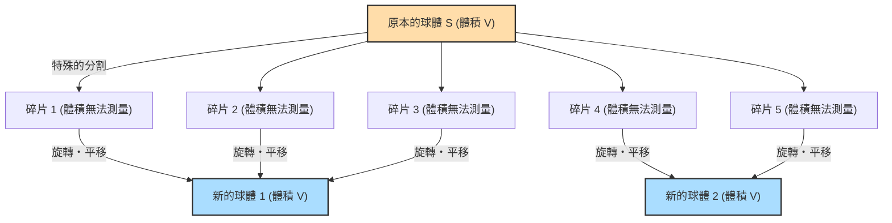

## 1. 如同魔法般的定理：1 = 1 + 1 ?

假設在你眼前有一顆純金的球。
我們用刀子將這顆球切分成幾個部分。接著，把這些部分像拼圖一樣重新組合起來。在這過程中，完全不會將零件拉長、彎曲，也不會加入新的黃金。就只是單純地移動並拼合起來。

然而，當你看到完成的拼圖時，竟然發現**「變成了兩顆與原本大小完全相同的純金球」**。

你一定會想：「怎麼可能！這違反了質量守恆定律，根本是鍊金術士的妄想！」
在現實的物理世界中這絕對不可能發生。但是，**在純數學（幾何學、集合論）的世界裡，這卻是被證明在邏輯上 100% 正確的定理**。

這就是 1924 年由斯蒂芬·巴拿赫（Stefan Banach）和阿爾弗雷德·塔斯基（Alfred Tarski）兩位數學家所證明的**「巴拿赫-塔斯基悖論」（Banach-Tarski paradox）**。

---

## 2. 準確理解悖論的主張

如果用數學上精確的語言來表達巴拿赫與塔斯基所證明的定理，會是如下的樣子：

> **巴拿赫-塔斯基定理**
> 在三維空間中的任意實心球體 $S$，都可以被分割成有限個碎片。然後，藉由（僅限於旋轉和平移）重新排列這些碎片，可以構造出兩個與原本球體 $S$ 半徑完全相同的實心球體。

更令人驚訝的是，應用這個定理還可以得出以下的結論：

- 將一顆豌豆分割成有限個部分，然後重新組合，就可以**造出一顆與太陽完全一樣大的球體**。（別名：豌豆與太陽的悖論）

為什麼這種宛如魔法般的事情在數學上是被允許的呢？
這個秘密隱藏在**「無限」**與**「選擇公理」**這兩個關鍵字之中。

---

## 3. 「無限」的奇妙性質

理解這個悖論的第一步，是認識「無限集合」的奇妙性質。

在我們平時處理的「有限」世界裡，整體一定大於部分。
例如，從 1 到 10 的數字（10 個）中，把偶數（5 個）取出來，數量就會減少一半。

然而，在「無限」的世界裡，這個常識是不適用的。
所有的「自然數」（1, 2, 3, 4, ...）和所有的「偶數」（2, 4, 6, 8, ...），哪一個比較多呢？
直覺上，因為偶數只有自然數的一半，感覺自然數應該比較多。
但是，請嘗試如下地建立配對：

- 1 $\rightarrow$ 2
- 2 $\rightarrow$ 4
- 3 $\rightarrow$ 6
- $n \rightarrow 2n$

像這樣，對於每一個自然數，我們都一定能將其剛好乘以 2 並對應到一個偶數（一一對應）。沒有任何一個數字會多出來。
也就是說，在數學上，**「自然數的數量（無限）」和「偶數的數量（無限）」的大小是完全相同的**！

明明是從整體（自然數）中取出一半（偶數），但其大小卻和原本一樣沒有改變。在無限集合中，**「部分可以等於整體」**的事情是有可能發生的。
巴拿赫-塔斯基定理可以說就是將這種「無限的魔法」，應用到三維空間中的「點」集合上的終極形式。

---

## 4. 空間中的點被切割成「不可測」的狀態

當我們用菜刀切開現實中的物體（黃金或蘋果）時，切出來的碎片必定具有「體積」。
但是，數學中的球體，是一個不具備實體體積的**「無限個點的集合」**。

巴拿赫與塔斯基用了一種非常特殊且複雜的方法，將這無限個點進行了分組（分割）。
這種分法實在太過複雜且極度分散，導致它們變成了一種「無法測量體積的狀態（不可測集合）」。

一旦每個碎片都變成了「沒有體積（無法測量）」、模糊不清的點的集合，就可以擺脫「所有碎片加起來必須等於原本體積」這種物理法則（測度的可加性）的束縛。

然後，只要將這些模糊不清的點碎片旋轉並巧妙地組合起來，透過「無限的魔法」，就能完成兩顆充滿了與原本球體完全一樣的點的球。
實際上，已經被證明只要將原本的球分割成短短的 **5個碎片**，就可以實現這種「從一顆球變出兩顆球」的操作。

---

## 5. 萬惡之源：什麼是「選擇公理」？

那麼，為什麼「複雜到無法測量體積的分割」在數學上是可能的呢？
這是因為我們承認了作為現代數學基礎的**「選擇公理」（Axiom of Choice）**這條規則。

簡單來說，選擇公理是這樣的一條規則：

> **選擇公理的概念**
> 當有許多的箱子，每個箱子裡都裝有物品時，**「可以從每個箱子中各挑選出一樣物品，來組成一個新的集合」**的規則。

如果箱子的數量是有限個，任何人都能輕易做到。
但是，**如果箱子的數量是「無限個」時**，人類是無法完成無限次的「一個一個挑選」操作的。即使如此，依然承認「挑選出來組成的集合是存在的」，這就是選擇公理。

這條公理在建構現代數學時非常方便且不可或缺。大多數數學家也都以「這理所當然嘛」的態度接受了這條規則。

但是，一旦承認了這個選擇公理，就等同於承認了前面提到的「分散到無法測量體積、模糊不清的點的集合（不可測集合）」的存在。結果就是，「一顆球變成兩顆球」的巴拿赫-塔斯基定理，便作為邏輯上的必然結果被推導了出來。

---

## 6. 總結：數學描繪出的「超越直覺的世界」

巴拿赫-塔斯基悖論並不是那種「邏輯上存在矛盾」的悖論。它是**邏輯 100% 正確，但推導出來的結論卻與人類的直覺和物理法則產生劇烈衝突**意義上的悖論。

當這個定理被發表時，一些數學家主張：「如果會得出如此反常識的結論，選擇公理肯定是錯的！」
但到了現在，大多數數學家已經接受了選擇公理，也將巴拿赫-塔斯基定理視為「三維空間和無限集合所擁有的一種奇異但美麗的性質」而接受了它。

因為我們居住的物理世界是由被稱為原子的「具有大小的粒子（有限）」所構成的，所以不可能把豌豆變成太陽那麼大。
然而，在人類頭腦創造出來的「數學」畫布上，點的尺寸是零，因此允許無限的操作。

巴拿赫-塔斯基悖論告訴了我們，**「無限」這個概念能夠多麼輕易地跨越人類樸素的直覺**，可以說它是現代數學最偉大的傑作之一。
