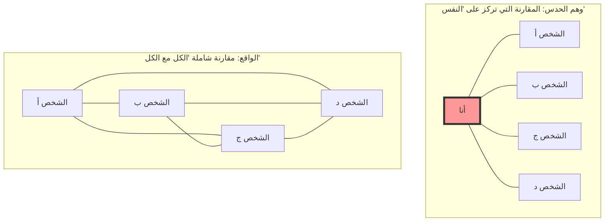
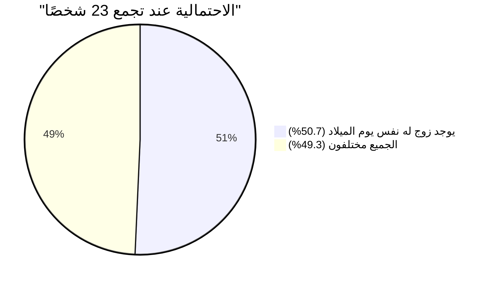

## 1. اختبار الحدس: كم شخصًا يجب أن يجتمعوا لتتجاوز الاحتمالية 50%؟

يجتمع الناس في قاعة حفلات.
هنا، **"ما هو الحد الأدنى لعدد الأشخاص المطلوب لكي تتجاوز احتمالية وجود زوجين على الأقل (شخصين) لهما نفس يوم الميلاد (الشهر واليوم) تمامًا في القاعة نسبة 50%"**؟ (*باستثناء السنوات الكبيسة بافتراض أن السنة 365 يومًا، وبافتراض أن كل يوم ميلاد له احتمالية متساوية*).

يميل الحدس البشري إلى الحساب على النحو التالي:
"السنة بها 365 يومًا. وبما أننا سنضع الأشخاص عشوائيًا في 365 خانة ليحدث تكرار، فلابد من وجود 180 شخصًا على الأقل. حتى لو قللنا التقدير، ألا يجب أن يكون هناك 50 إلى 60 شخصًا لتصل الاحتمالية إلى النصف؟"

ومع ذلك، فإن الإجابة الصحيحة التي يستنتجها علم الرياضيات هي **"23 شخصًا"** فقط.
في فصل دراسي واحد (حوالي 30 إلى 40 شخصًا)، تقفز احتمالية وجود زوج لهما نفس يوم الميلاد إلى حوالي 70% إلى 89%. وإذا كان هناك 50 شخصًا، تصل الاحتمالية إلى 97%، لتصبح الحالة "من النادر ألا يوجد أشخاص لهم نفس يوم الميلاد".

لماذا يختلف حدسنا إلى هذا الحد عن الاحتمالية الواقعية؟

---

## 2. سبب خطأ الحدس: الفرق بين "أنا وشخص ما" و "شخص ما وشخص آخر"

السبب الأكبر وراء خطأ الحدس في هذه المشكلة هو أننا نفكر لا شعوريًا في **"احتمالية وجود شخص له نفس يوم ميلاد شخص معين (مثلًا نفسك)"**.

إذا دخلت القاعة وبحثت "هل يوجد شخص له نفس يوم ميلادي؟"، فإن احتمالية وجود شخص له نفس يوم ميلادك بين 23 شخصًا هي فقط **حوالي 6.1%**. (لكي تتجاوز هذه الاحتمالية 50%، تحتاج بالفعل إلى 253 شخصًا).

ولكن ما تطرحه مفارقة عيد الميلاد ليس زوجًا مكونًا من "أنا وشخص ما". بل يكفي أن يتطابق زوج واحد من بين **"كل التوافيق الممكنة بين جميع الأشخاص في القاعة (الشخص أ والشخص ب، الشخص ب والشخص ج، الشخص ج والشخص أ...)"**.

حتى في مجموعة مكونة من 4 أشخاص فقط، هناك 3 طرق للمقارنة بتركيز على "النفس"، ولكن هناك 6 طرق للمقارنة بين الجميع (${}_4 C_2 = 6$).
عندما يزيد العدد إلى 23 شخصًا، يزداد عدد التوافيق بين الأزواج بشكل انفجاري ليصل إلى **253 طريقة** (${}_{23} C_2$).
ألا تشعر أنه إذا كان هناك 253 زوجًا، فليس من الغريب أن يصيب زوج واحد منهم احتمالية "1 من 365"؟

---

## 3. الإثبات الرياضي: حل ذكي باستخدام الحدث المكمل

من الصعب حساب "احتمالية أن يكون زوج واحد على الأقل له نفس يوم الميلاد" بشكل مباشر (لأن هناك أنماطًا كثيرة جدًا... مثل تطابق زوج واحد فقط، أو تطابق زوجين، أو 3 أشخاص لهم نفس يوم الميلاد... إلخ).
لذلك، نستخدم التقنية الأساسية في نظرية الاحتمالات وهي **"الحدث المكمل (Complementary Event)"**.

الحدث المكمل هو "احتمالية عدم الحدوث".
بمعنى آخر، نقوم بحساب **"احتمالية أن تكون جميع أيام الميلاد مختلفة (لا يوجد أي تطابق)"**، وبطرحها من 100% (1)، نحصل على الاحتمالية المطلوبة.

$$ P(\text{تطابق شخصين على الأقل}) = 1 - P(\text{أيام ميلاد الجميع مختلفة}) $$

لنتخيل الأشخاص وهم يدخلون القاعة بالترتيب ونقوم بالحساب.

1. **الشخص الأول**: لا داعي للقلق من التطابق مع أي شخص. الاحتمالية هي $\frac{365}{365}$.
2. **الشخص الثاني**: يجب أن يكون يوم ميلاده مختلفًا عن الشخص الأول. سيكون في أمان خلال الـ 364 يومًا المتبقية. الاحتمالية هي $\frac{364}{365}$.
3. **الشخص الثالث**: يجب أن يكون يوم ميلاده مختلفًا عن الشخصين السابقين. سيكون في أمان خلال الـ 363 يومًا المتبقية. الاحتمالية هي $\frac{363}{365}$.

بضرب هذه الاحتمالات حتى الشخص رقم $n$، نحصل على الحد العام لـ $P(n)'$، وهي احتمالية أن تكون أيام ميلاد الجميع مختلفة.

$$ P(n)' = \frac{365}{365} \times \frac{364}{365} \times \frac{363}{365} \times \dots \times \frac{365 - (n - 1)}{365} $$

$$ P(n)' = \prod_{k=1}^{n-1} \left(1 - \frac{k}{365}\right) $$

وبالتالي، تصبح "احتمالية أن يكون شخصان على الأقل لهما نفس يوم الميلاد $P(n)$" المطلوبة كالتالي.

$$ P(n) = 1 - \prod_{k=1}^{n-1} \left(1 - \frac{k}{365}\right) $$

إذا عوضنا بعدد الأشخاص $n$ في هذه المعادلة، سنجد أن الاحتمالية ترتفع بسرعة مذهلة.

- عندما $n = 10$، تكون الاحتمالية حوالي **11.7%**
- عندما $n = 23$، تكون الاحتمالية حوالي **50.7%** (هنا تتجاوز 50%!)
- عندما $n = 40$، تكون الاحتمالية حوالي **89.1%**
- عندما $n = 70$، تكون الاحتمالية حوالي **99.9%**

---

## 4. الحساب التقريبي باستخدام متسلسلة تايلور

حساب الضرب 23 مرة يدويًا أمر شاق، لذا دعونا نستخدم صيغة تقريبية رياضية لفهمها بشكل أكثر بديهية.

نأخذ بعين الاعتبار متسلسلة تايلور للدالة الأسية $e^{-x}$. عندما تكون $x$ صغيرة بما يكفي، يتحقق التقريب التالي.
$$ e^{-x} \approx 1 - x $$

بتطبيق ذلك على كل حد من الحدود السابقة $\left(1 - \frac{k}{365}\right)$، نحصل على
$$ 1 - \frac{k}{365} \approx e^{-\frac{k}{365}} $$

بضربها جميعًا (وهي تصبح عملية جمع حسب قوانين الأسس)، نجد أن
$$ P(n)' \approx e^{-\frac{1}{365}} \times e^{-\frac{2}{365}} \times \dots \times e^{-\frac{n-1}{365}} $$
$$ P(n)' \approx \exp\left(-\sum_{k=1}^{n-1} \frac{k}{365}\right) $$

بما أن مجموع الأرقام من 1 إلى $n-1$ هو $\frac{n(n-1)}{2}$ (بمعنى آخر، عدد التوافيق ${}_n C_2$)، إذن
$$ P(n)' \approx \exp\left(-\frac{n(n-1)}{2 \times 365}\right) $$

في هذه المعادلة، نبحث عن $n$ عندما تكون الاحتمالية 50% ($0.5$).
$$ 0.5 = e^{-\frac{n(n-1)}{730}} $$
بأخذ اللوغاريتم الطبيعي للطرفين ($\ln 0.5 \approx -0.693$).
$$ -0.693 = -\frac{n(n-1)}{730} $$
$$ n(n-1) = 0.693 \times 730 \approx 505.89 $$

بتقريب أن $n^2 \approx 506$، نجد أن $n = \sqrt{506} \approx 22.49$
وبذلك توصلنا ببراعة إلى الإجابة **$n \approx 23$**!

---

## 5. التطبيقات في الحياة اليومية و"تصادم التجزئة"

هذه المفارقة ليست مجرد موضوع للحديث في الحفلات. فهي تلعب دورًا بالغ الأهمية في **نظرية التشفير وأمن المعلومات** التي تدعم مجتمع تكنولوجيا المعلومات الحديث.

في أنظمة الكمبيوتر، تُستخدم آلية تسمى "دالة التجزئة (Hash Function)" للتحقق بسرعة من تطابق كلمات المرور أو الملفات. دالة التجزئة تعيد سلسلة نصية عشوائية بطول ثابت (قيمة التجزئة) بغض النظر عن البيانات المدخلة.
ولكن الظاهرة التي تتطابق فيها قيم التجزئة هذه بالصدفة تسمى **"تصادم التجزئة (Hash Collision)"**.

يحدث تصادم التجزئة بنفس مبدأ مفارقة عيد الميلاد تمامًا.
على عكس الحدس البشري الذي يقول "بما أن أنواع قيم التجزئة عدد فلكي، فمن النادر حدوث تصادم"، فإن إنشاء كميات هائلة من البيانات عشوائيًا بواسطة المهاجمين للعثور على "زوج يتطابق فيه شيء مع شيء آخر (تطابق أيام الميلاد)" أسهل مما تتخيل.

يسمى هذا **"هجوم عيد الميلاد (Birthday Attack)"**.
يقوم المهندسون الذين يصممون أنظمة الأمان بتحديد طول قيم التجزئة لتكون طويلة جدًا لضمان الأمان، بناءً على الحقيقة الرياضية بأن "التصادم يحدث أسرع بكثير مما يمليه الحدس".

## 6. الخلاصة: حدود الحدس البشري

مفارقة عيد الميلاد هي مثال مثالي يوضح **مدى ضعف الحدس البشري تجاه "الزيادة الأسية" و"الانفجار التوافقي"**.

نحن أقوياء في الزيادات الخطية (الجمعية)، ولكن لا يمكننا محاكاة ظاهرة في عقولنا حيث يزداد عدد الأزواج بشكل انفجاري بوتيرة $n^2$.
خلف الحدس الذي يقول "الرقم 23 صغير جدًا مقارنة بالرقم الكبير 365"، تكمن **"253 خيطًا غير مرئي (زوجًا)"** تم نسجها بواسطة 23 شخصًا.

في المرة القادمة التي تذهب فيها إلى مكان يتجمع فيه الناس، حاول أن تتخيل ليس فقط "عدد الأشخاص" المرئي، بل "خيوط التوافيق" التي لا حصر لها والموجودة بينهم. من المؤكد أن رؤيتك للعالم ستتغير قليلًا من منظور رياضي.
