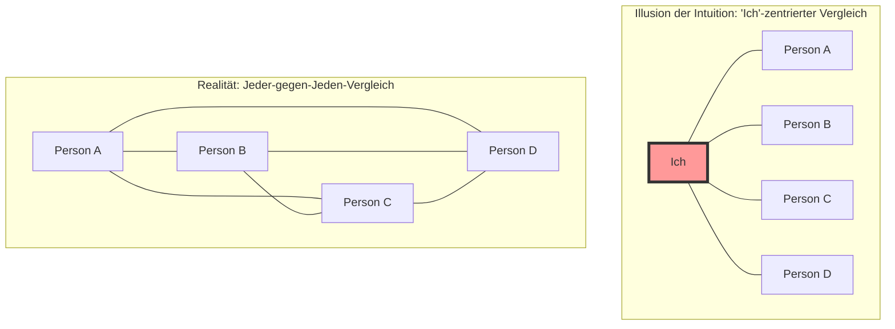
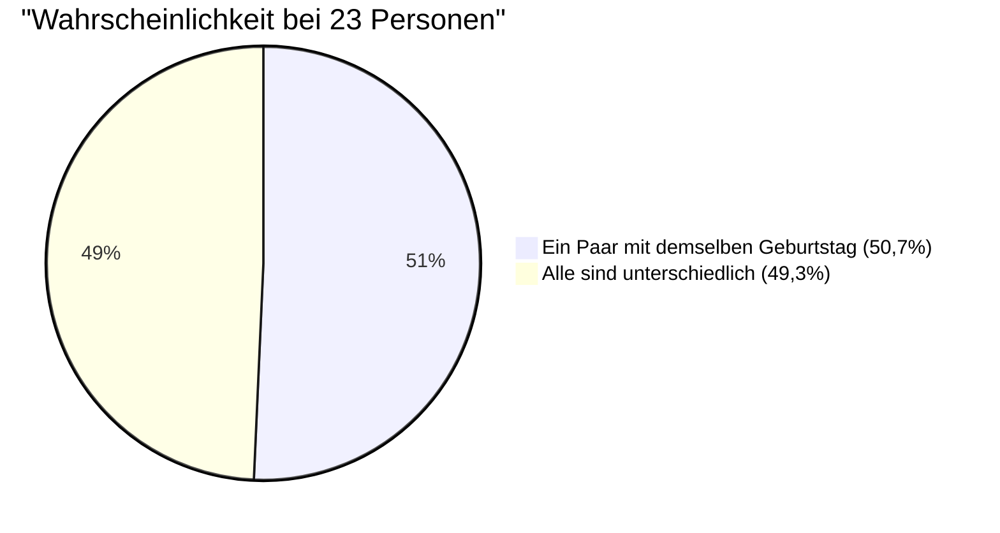

## 1. Test der Intuition: Wie viele Personen braucht man, damit die Wahrscheinlichkeit 50% übersteigt?

Menschen versammeln sich auf einer Party.
Was glauben Sie, wie viele Personen mindestens anwesend sein müssen, damit die **"Wahrscheinlichkeit, dass sich im Raum mindestens ein Paar mit exakt demselben Geburtstag (Monat und Tag) befindet, 50% übersteigt"**? (*Schaltjahre sind ausgenommen, ein Jahr hat 365 Tage, und wir nehmen an, dass jeder Geburtstag gleich wahrscheinlich ist*).

Die menschliche Intuition neigt dazu, wie folgt zu rechnen:
"Ein Jahr hat 365 Tage. Wenn man Personen nacheinander in diese 365 Plätze einordnet, so dass es zu einer Überschneidung kommt, braucht man wohl mindestens etwa 180 Personen. Selbst vorsichtig geschätzt, wird die Wahrscheinlichkeit bei weniger als 50 bis 60 Personen doch nicht die Hälfte erreichen, oder?"

Die von der Mathematik abgeleitete richtige Antwort ist jedoch nur **"23 Personen"**.
In einer Schulklasse (ca. 30 bis 40 Personen) springt die Wahrscheinlichkeit, dass es ein Paar mit demselben Geburtstag gibt, sogar auf etwa 70% bis 89%. Bei 50 Personen erreicht die Wahrscheinlichkeit 97%, was den Zustand "Es ist seltener, dass es niemanden mit demselben Geburtstag gibt" bewirkt.

Warum weicht unsere Intuition so stark von der tatsächlichen Wahrscheinlichkeit ab?

---

## 2. Warum die Intuition sich irrt: Der Unterschied zwischen "Ich und jemand anderes" und "Jemand und jemand anderes"

Der Hauptgrund, warum sich die Intuition bei diesem Problem irrt, ist, dass wir unbewusst an die **"Wahrscheinlichkeit, dass jemand denselben Geburtstag wie eine bestimmte Person (z. B. man selbst) hat"** denken.

Wenn Sie den Raum betreten und nachsehen: "Gibt es jemanden, der denselben Geburtstag hat wie ich?", beträgt die Wahrscheinlichkeit, dass unter 23 Personen jemand Ihren Geburtstag teilt, lediglich **etwa 6,1%**. (Damit diese Wahrscheinlichkeit 50% übersteigt, werden tatsächlich stolze 253 Personen benötigt).

Das Geburtstagsparadoxon fragt jedoch nicht nach dem Paar "Ich und jemand". Es reicht, wenn in **"allen möglichen Kombinationen unter allen Anwesenden im Raum (Person A und Person B, Person B und Person C, Person C und Person A...)"** auch nur ein einziges Paar übereinstimmt.

Selbst in einer Gruppe von nur 4 Personen gibt es beim "Ich"-zentrierten Vergleich 3 Kombinationen, beim Vergleich von jedem mit jedem jedoch 6 Kombinationen (${}_4 C_2 = 6$).
Wenn die Anzahl der Personen auf 23 steigt, explodiert die Anzahl der Paarkombinationen auf sage und schreibe **253 Kombinationen** (${}_{23} C_2$).
Wenn es 253 Paare gibt, erscheint es dann nicht plausibel, dass zumindest eines davon die Wahrscheinlichkeit von "1 zu 365" trifft?

---

## 3. Mathematischer Beweis: Eine elegante Lösung mittels Gegenereignis

Es ist schwierig, die "Wahrscheinlichkeit, dass mindestens ein Paar denselben Geburtstag hat" direkt zu berechnen (da es zu viele Muster gibt: wenn nur 1 Paar denselben Geburtstag hat, wenn 2 Paare denselben Geburtstag haben, wenn 3 Personen denselben Geburtstag haben... usw.).
Daher verwenden wir eine grundlegende Technik der Wahrscheinlichkeitstheorie: das **"Gegenereignis"**.

Ein Gegenereignis ist die "Wahrscheinlichkeit, dass etwas nicht passiert".
Das heißt, wir berechnen die **"Wahrscheinlichkeit, dass alle Geburtstage unterschiedlich sind (kein einziges Paar übereinstimmt)"** und subtrahieren dies von 100% (1), um die gesuchte Wahrscheinlichkeit zu erhalten.

$$ P(\text{Mindestens zwei Personen haben denselben Geburtstag}) = 1 - P(\text{Alle haben verschiedene Geburtstage}) $$

Lassen Sie uns das berechnen, indem wir uns vorstellen, wie die Leute nacheinander den Raum betreten.

1. **1. Person**: Es besteht keine Gefahr, sich mit jemandem zu überschneiden. Die Wahrscheinlichkeit ist $\frac{365}{365}$.
2. **2. Person**: Der Geburtstag muss sich von dem der 1. Person unterscheiden. Die restlichen 364 Tage sind sicher. Die Wahrscheinlichkeit ist $\frac{364}{365}$.
3. **3. Person**: Der Geburtstag muss sich von denen der vorherigen 2 Personen unterscheiden. Die restlichen 363 Tage sind sicher. Die Wahrscheinlichkeit ist $\frac{363}{365}$.

Wenn man dies bis zur $n$-ten Person multipliziert, erhält man den allgemeinen Term für die Wahrscheinlichkeit $P(n)'$, dass alle Geburtstage unterschiedlich sind.

$$ P(n)' = \frac{365}{365} \times \frac{364}{365} \times \frac{363}{365} \times \dots \times \frac{365 - (n - 1)}{365} $$

$$ P(n)' = \prod_{k=1}^{n-1} \left(1 - \frac{k}{365}\right) $$

Folglich ergibt sich die gesuchte "Wahrscheinlichkeit $P(n)$, dass mindestens zwei Personen denselben Geburtstag haben" wie folgt:

$$ P(n) = 1 - \prod_{k=1}^{n-1} \left(1 - \frac{k}{365}\right) $$

Setzt man in diese Formel die Anzahl der Personen $n$ ein, so sieht man, dass die Wahrscheinlichkeit mit erstaunlicher Geschwindigkeit ansteigt.

- Bei $n = 10$ beträgt die Wahrscheinlichkeit etwa **11,7%**
- Bei $n = 23$ beträgt die Wahrscheinlichkeit etwa **50,7%** (Hier übersteigt sie 50%!)
- Bei $n = 40$ beträgt die Wahrscheinlichkeit etwa **89,1%**
- Bei $n = 70$ beträgt die Wahrscheinlichkeit etwa **99,9%**

---

## 4. Näherungsrechnung durch Taylorreihen-Entwicklung

Da es mühsam ist, 23-mal per Hand zu multiplizieren, wollen wir eine mathematische Näherungsformel verwenden, um es etwas intuitiver zu verstehen.

Wir betrachten die Taylor-Entwicklung der Exponentialfunktion $e^{-x}$. Wenn $x$ ausreichend klein ist, gilt folgende Näherung:
$$ e^{-x} \approx 1 - x $$

Wendet man dies auf jeden der vorigen Terme $\left(1 - \frac{k}{365}\right)$ an, erhält man:
$$ 1 - \frac{k}{365} \approx e^{-\frac{k}{365}} $$

Multipliziert man alle diese Werte (was nach den Potenzgesetzen zu einer Addition wird), so erhält man:
$$ P(n)' \approx e^{-\frac{1}{365}} \times e^{-\frac{2}{365}} \times \dots \times e^{-\frac{n-1}{365}} $$
$$ P(n)' \approx \exp\left(-\sum_{k=1}^{n-1} \frac{k}{365}\right) $$

Die Summe von 1 bis $n-1$ ist $\frac{n(n-1)}{2}$ (also die Anzahl der Kombinationen ${}_n C_2$), daher:
$$ P(n)' \approx \exp\left(-\frac{n(n-1)}{2 \times 365}\right) $$

In dieser Formel suchen wir das $n$, bei dem die Wahrscheinlichkeit 50% ($0.5$) wird.
$$ 0.5 = e^{-\frac{n(n-1)}{730}} $$
Wir nehmen auf beiden Seiten den natürlichen Logarithmus ($\ln 0.5 \approx -0.693$).
$$ -0.693 = -\frac{n(n-1)}{730} $$
$$ n(n-1) = 0.693 \times 730 \approx 505.89 $$

Nähert man $n^2 \approx 506$ an, so erhält man $n = \sqrt{506} \approx 22.49$.
Wunderbar, die Antwort **$n \approx 23$** wurde abgeleitet!

---

## 5. Anwendung im Alltag und "Hash-Kollision"

Dieses Paradoxon ist nicht nur ein Partyscherz. Es spielt eine äußerst wichtige Rolle in der **Kryptographie und Informationssicherheit**, die unsere moderne IT-Gesellschaft stützt.

In Computersystemen wird ein Mechanismus namens "Hash-Funktion" verwendet, um schnell die Identität von Passwörtern oder Dateien zu überprüfen. Eine Hash-Funktion liefert eine zufällige Zeichenfolge (Hash-Wert) von fester Länge zurück, unabhängig davon, welche Daten eingegeben werden.
Das Phänomen, dass diese Hash-Werte zufällig gleich sind, wird jedoch als **"Hash-Kollision (Hash Collision)"** bezeichnet.

Hash-Kollisionen treten genau nach demselben Prinzip auf wie das Geburtstagsparadoxon.
Entgegen der menschlichen Intuition, die besagt: "Da die Anzahl der möglichen Hash-Werte astronomisch groß ist, wird es wohl kaum zu Kollisionen kommen", ist es für einen Angreifer, der eine große Menge an Daten zufällig generiert, überraschend einfach, ein Paar zu finden, bei dem "irgendein Wert mit irgendeinem anderen übereinstimmt (die Geburtstage sich überschneiden)".

Dies nennt man einen **"Geburtstagsangriff (Birthday Attack)"**.
Ingenieure, die Sicherheitssysteme entwerfen, setzen eine sehr lange Länge für Hash-Werte fest, um die Sicherheit zu gewährleisten, basierend auf der mathematischen Tatsache, dass "Kollisionen viel früher auftreten als intuitiv erwartet".

## 6. Fazit: Die Grenzen der menschlichen Intuition

Das Geburtstagsparadoxon ist ein perfektes Beispiel dafür, **wie anfällig die menschliche Intuition für "exponentielles Wachstum" und "Kombinationsexplosionen" ist**.

Wir sind stark bei linearem (additivem) Wachstum, aber wir können ein Phänomen, bei dem die Anzahl der Paare mit einer Geschwindigkeit von $n^2$ explodiert, nicht in unserem Gehirn simulieren.
Hinter der Intuition, dass "die Zahl 23 im Vergleich zur großen Zahl 365 zu klein ist", sind die **"253 unsichtbaren Fäden (Paare)"** gespannt, die von den 23 Personen gebildet werden.

Wenn Sie das nächste Mal an einen Ort gehen, an dem sich Menschen versammeln, stellen Sie sich nicht nur die sichtbare "Anzahl an Personen" vor, sondern auch die zahllosen "Kombinationsfäden", die zwischen ihnen existieren. Die Art und Weise, wie Sie die Welt sehen, wird sich sicher ein klein wenig mathematisch verändern.
