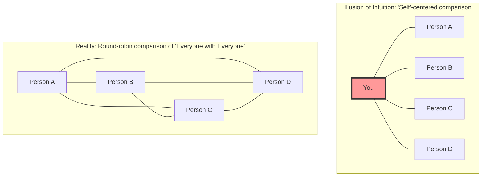
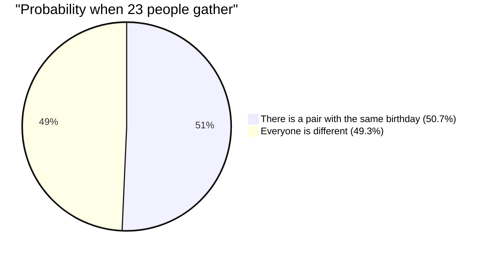

## 1. A Test of Intuition: How many people does it take for the probability to exceed 50%?

People are gathering at a party venue.
Here, **how many people do you think are needed at a minimum for the probability of having at least one pair with the exact same birthday (month and day) to exceed 50%?** (*Excluding leap years, assuming a year has 365 days, and each birthday is equally probable).

Human intuition tends to calculate like this:
"There are 365 days in a year. If we pop people into 365 slots and expect an overlap, we'd probably need at least about 180 people. Even with a conservative estimate, shouldn't there be 50 to 60 people for the probability to be half?"

However, the correct answer derived by mathematics is a mere **"23 people"**.
In a typical school class (about 30 to 40 people), the probability of a pair sharing a birthday jumps to about 70% to 89%. With 50 people, the probability reaches 97%, making it "more unusual not to have people with the same birthday."

Why does our intuition deviate so much from actual probability?

---

## 2. Why Intuition Fails: The Difference Between "Me and Someone" and "Someone and Someone"

The biggest reason intuition fails in this problem is that we unconsciously think about the **"probability that someone has the same birthday as a specific person (e.g., yourself)."**

If you enter the venue and look for "someone with the same birthday as me," the probability that someone among the 23 people shares your birthday is only **about 6.1%**. (For this probability to exceed 50%, you would actually need 253 people).

However, what the Birthday Paradox asks is not a pair of "me and someone." It only requires one match among **"all possible combinations between everyone present at the venue (Person A and Person B, Person B and Person C, Person C and Person A...)."**

Even in a group of just 4 people, a comparison centered around "yourself" yields 3 pairs, but a comparison among everyone yields 6 pairs (${}_4 C_2 = 6$).
When the number of people increases to 23, the combinations of pairs explosively increase to a whopping **253 pairs** (${}_{23} C_2$).
With as many as 253 pairs, doesn't it start to feel unsurprising that at least one of those pairs might hit the "1 in 365" chance?

---

## 3. Mathematical Proof: A Brilliant Solution Using the Complementary Event

Calculating the "probability of at least one pair sharing a birthday" head-on is difficult (because there are too many patterns, such as exactly one pair matching, two pairs matching, three people having the same birthday...).
Therefore, we use a fundamental technique in probability theory: the **"complementary event."**

A complementary event refers to the "probability of something not happening."
In other words, we calculate the **"probability that everyone's birthday is different (not a single pair overlaps),"** and subtract it from 100% (1) to get the probability we want.

$$ P(\text{At least 2 people share a birthday}) = 1 - P(\text{Everyone has a different birthday}) $$

Now, let's imagine people entering the venue one by one and calculate.

1. **1st person**: There's no worry of overlapping with anyone. The probability is $\frac{365}{365}$.
2. **2nd person**: Must have a different birthday from the 1st person. The remaining 364 days are safe. The probability is $\frac{364}{365}$.
3. **3rd person**: Must have a different birthday from the previous 2 people. The remaining 363 days are safe. The probability is $\frac{363}{365}$.

Multiplying this up to the $n$-th person gives the general formula for the probability $P(n)'$ that everyone has a different birthday.

$$ P(n)' = \frac{365}{365} \times \frac{364}{365} \times \frac{363}{365} \times \dots \times \frac{365 - (n - 1)}{365} $$

$$ P(n)' = \prod_{k=1}^{n-1} \left(1 - \frac{k}{365}\right) $$

Therefore, the sought "probability $P(n)$ that at least 2 people share a birthday" is as follows:

$$ P(n) = 1 - \prod_{k=1}^{n-1} \left(1 - \frac{k}{365}\right) $$

If we substitute the number of people $n$ into this formula, we can see the probability rises at an astonishing speed.

- When $n = 10$, the probability is about **11.7%**
- When $n = 23$, the probability is about **50.7%** (it crosses 50% here!)
- When $n = 40$, the probability is about **89.1%**
- When $n = 70$, the probability is about **99.9%**

---

## 4. Approximate Calculation via Taylor Expansion

Calculating 23 multiplications by hand is tedious, so let's use a mathematical approximation formula to understand it a bit more intuitively.

Consider the Taylor expansion of the exponential function $e^{-x}$. When $x$ is sufficiently small, the following approximation holds:
$$ e^{-x} \approx 1 - x $$

Applying this to each term $\left(1 - \frac{k}{365}\right)$ from earlier:
$$ 1 - \frac{k}{365} \approx e^{-\frac{k}{365}} $$

Multiplying all of these together (which becomes addition by the laws of exponents):
$$ P(n)' \approx e^{-\frac{1}{365}} \times e^{-\frac{2}{365}} \times \dots \times e^{-\frac{n-1}{365}} $$
$$ P(n)' \approx \exp\left(-\sum_{k=1}^{n-1} \frac{k}{365}\right) $$

The sum from 1 to $n-1$ is $\frac{n(n-1)}{2}$ (that is, the number of combinations ${}_n C_2$), so:
$$ P(n)' \approx \exp\left(-\frac{n(n-1)}{2 \times 365}\right) $$

Using this formula, we find $n$ when the probability is 50% ($0.5$).
$$ 0.5 = e^{-\frac{n(n-1)}{730}} $$
Taking the natural logarithm of both sides ($\ln 0.5 \approx -0.693$):
$$ -0.693 = -\frac{n(n-1)}{730} $$
$$ n(n-1) = 0.693 \times 730 \approx 505.89 $$

Approximating as $n^2 \approx 506$, we get $n = \sqrt{506} \approx 22.49$
The answer **$n \approx 23$** is beautifully derived!

---

## 5. Application to Daily Life and "Hash Collisions"

This paradox is not just a party trick. It plays a critically important role in the **cryptography and information security** that supports modern IT society.

Computer systems use a mechanism called a "hash function" to quickly verify the identity of passwords or files. A hash function returns a random string of a fixed length (a hash value) no matter what data is put in.
However, the phenomenon where these hash values coincidentally turn out to be the same is called a **"Hash Collision."**

Hash collisions occur due to the exact same principle as the Birthday Paradox.
Contrary to human intuition, which assumes "since the number of possible hash values is astronomical, collisions would rarely happen," it is surprisingly easy for an attacker to randomly generate a massive amount of data and find a "pair that matches (has the same birthday)."

This is called a **"Birthday Attack."**
Engineers designing security systems assume this mathematical fact that "collisions happen far faster than intuition suggests," and ensure safety by setting the hash length to be extremely long.

## 6. Conclusion: The Limits of Human Intuition

The Birthday Paradox is a perfect example of **how fragile human intuition is against "exponential growth" and "combinatorial explosions."**

We are strong at linear (additive) growth, but we cannot simulate in our brains a phenomenon where the number of pairs explodes at a pace of $n^2$.
Behind the intuition that "the number 23 is too small compared to the large number 365," there are **"253 invisible threads (pairs)"** woven by 23 people.

Next time you go to a place where people gather, try to imagine not just the visible "number of people," but the "threads of combinations" that exist innumerably among them. The way you view the world should change just a little bit mathematically.
