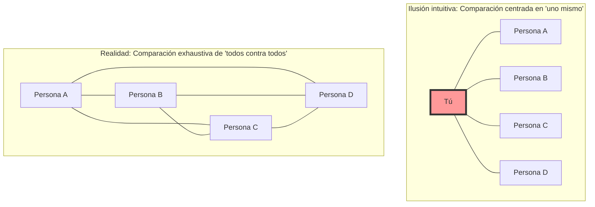
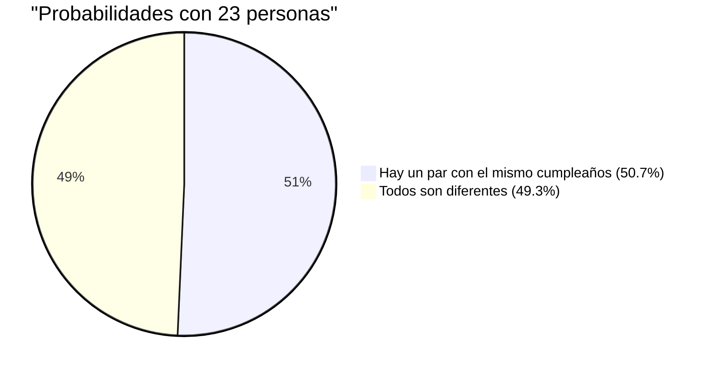

## 1. Prueba de intuición: ¿Cuántas personas se necesitan para que la probabilidad supere el 50%?

Imagina a un grupo de personas reunidas en una fiesta.
Aquí, **para que la probabilidad de que exista al menos un par de personas en la sala con exactamente el mismo cumpleaños (mes y día) supere el 50%**, ¿cuántas personas crees que se necesitan como mínimo? (Excluyendo años bisiestos y asumiendo que un año tiene 365 días, con todos los cumpleaños siendo igualmente probables).

La intuición humana tiende a calcular de la siguiente manera:
"Un año tiene 365 días. Como estamos metiendo personas en 365 espacios y deben coincidir, probablemente se necesiten al menos unas 180 personas. Incluso siendo conservadores, ¿no se necesitarían entre 50 y 60 personas para que la probabilidad sea la mitad?"

Sin embargo, la respuesta correcta que deriva la matemática es de solo **"23 personas"**.
En una clase escolar típica (alrededor de 30 a 40 personas), la probabilidad de que haya un par con el mismo cumpleaños salta a entre el 70% y el 89%. Si hay 50 personas, esa probabilidad alcanza el 97%, llegando a un punto en el que "es más raro que no haya personas con el mismo cumpleaños".

¿Por qué nuestra intuición se desvía tanto de la probabilidad real?

---

## 2. Por qué se equivoca la intuición: La diferencia entre "yo y alguien" y "alguien y alguien"

La razón principal por la que la intuición se equivoca en este problema es porque inconscientemente pensamos en la **"probabilidad de que alguien tenga el mismo cumpleaños que una persona específica (por ejemplo, yo)"**.

Si entras a la sala y buscas "¿Hay alguien con mi mismo cumpleaños?", la probabilidad de que haya alguien con tu mismo cumpleaños entre 23 personas es de solo **alrededor del 6.1%**. (Para que esta probabilidad supere el 50%, se necesitan en realidad 253 personas).

Sin embargo, lo que pregunta la paradoja del cumpleaños no es un par de "yo y alguien". Basta con que coincida 1 solo par entre **"todas las combinaciones posibles de todas las personas en la sala (Persona A y Persona B, Persona B y Persona C, Persona C y Persona A...)"**.

Incluso en un grupo de solo 4 personas, hay 3 comparaciones centradas en "uno mismo", pero si se comparan todos contra todos hay 6 combinaciones (${}_4 C_2 = 6$).
Cuando el número de personas aumenta a 23, las combinaciones de pares explotan a **253 combinaciones** (${}_{23} C_2$).
Con 253 pares, ¿no empieza a parecer menos extraño que al menos 1 par alcance esa probabilidad de "1 en 365"?

---

## 3. Demostración matemática: Una elegante solución usando el suceso complementario

Calcular la "probabilidad de que al menos 1 par comparta cumpleaños" directamente es muy difícil (porque hay demasiados patrones: si solo 1 par es igual, si 2 pares son iguales, si 3 personas comparten cumpleaños...).
Por eso, usamos una técnica básica de teoría de probabilidades: el **"suceso complementario"**.

El suceso complementario es la "probabilidad de que no ocurra".
En otras palabras, calculando la **"probabilidad de que los cumpleaños de todos sean diferentes (ningún par coincide)"** y restando esto del 100% (1), obtenemos la probabilidad que buscamos.

$$ P(\text{al menos 2 personas coinciden}) = 1 - P(\text{todos tienen cumpleaños diferentes}) $$

Entonces, imaginemos a las personas entrando a la sala una por una y calculemos:

1. **1ª persona**: No hay preocupación de coincidir con nadie. La probabilidad es $\frac{365}{365}$.
2. **2ª persona**: Debe tener un cumpleaños diferente a la 1ª persona. Cualquiera de los 364 días restantes es seguro. La probabilidad es $\frac{364}{365}$.
3. **3ª persona**: Debe tener un cumpleaños diferente a las 2 personas anteriores. Cualquiera de los 363 días restantes es seguro. La probabilidad es $\frac{363}{365}$.

Multiplicando esto hasta la $n$-ésima persona, obtenemos el término general para la probabilidad $P(n)'$ de que todos tengan cumpleaños diferentes.

$$ P(n)' = \frac{365}{365} \times \frac{364}{365} \times \frac{363}{365} \times \dots \times \frac{365 - (n - 1)}{365} $$

$$ P(n)' = \prod_{k=1}^{n-1} \left(1 - \frac{k}{365}\right) $$

Por lo tanto, la "probabilidad de que al menos 2 personas compartan cumpleaños $P(n)$" que buscamos es la siguiente:

$$ P(n) = 1 - \prod_{k=1}^{n-1} \left(1 - \frac{k}{365}\right) $$

Sustituyendo el número de personas $n$ en esta fórmula, vemos que la probabilidad aumenta a una velocidad sorprendente:

- Cuando $n = 10$, la probabilidad es aproximadamente **11.7%**
- Cuando $n = 23$, la probabilidad es aproximadamente **50.7%** (¡Aquí supera el 50%!)
- Cuando $n = 40$, la probabilidad es aproximadamente **89.1%**
- Cuando $n = 70$, la probabilidad es aproximadamente **99.9%**

---

## 4. Cálculo aproximado mediante la serie de Taylor

Calcular multiplicaciones 23 veces a mano es complicado, así que usemos una aproximación matemática para entenderlo de forma más intuitiva.

Consideremos la serie de Taylor de la función exponencial $e^{-x}$. Cuando $x$ es suficientemente pequeño, se cumple la siguiente aproximación:
$$ e^{-x} \approx 1 - x $$

Aplicando esto a cada término $\left(1 - \frac{k}{365}\right)$ de antes, tenemos:
$$ 1 - \frac{k}{365} \approx e^{-\frac{k}{365}} $$

Si multiplicamos todos estos términos (lo cual se convierte en suma según las leyes de los exponentes),
$$ P(n)' \approx e^{-\frac{1}{365}} \times e^{-\frac{2}{365}} \times \dots \times e^{-\frac{n-1}{365}} $$
$$ P(n)' \approx \exp\left(-\sum_{k=1}^{n-1} \frac{k}{365}\right) $$

La suma de 1 a $n-1$ es $\frac{n(n-1)}{2}$ (es decir, el número de combinaciones ${}_n C_2$), así que:
$$ P(n)' \approx \exp\left(-\frac{n(n-1)}{2 \times 365}\right) $$

En esta ecuación, busquemos el valor de $n$ para cuando la probabilidad sea 50% ($0.5$).
$$ 0.5 = e^{-\frac{n(n-1)}{730}} $$
Tomando el logaritmo natural en ambos lados ($\ln 0.5 \approx -0.693$).
$$ -0.693 = -\frac{n(n-1)}{730} $$
$$ n(n-1) = 0.693 \times 730 \approx 505.89 $$

Si aproximamos $n^2 \approx 506$, obtenemos $n = \sqrt{506} \approx 22.49$
¡La respuesta **$n \approx 23$** se ha deducido maravillosamente!

---

## 5. Aplicaciones en la vida diaria y "Colisión de hashes"

Esta paradoja no es solo una curiosidad para fiestas. Juega un papel extremadamente importante en la **criptografía y seguridad de la información** que sustentan la sociedad informática moderna.

En los sistemas informáticos, se utiliza un mecanismo llamado "función hash" para confirmar rápidamente la identidad de contraseñas y archivos. Una función hash devuelve una cadena aleatoria de longitud fija (valor hash) sin importar qué datos se introduzcan.
Sin embargo, el fenómeno por el cual estos valores hash resultan ser los mismos por casualidad se denomina **"Colisión de hashes"**.

Las colisiones de hashes ocurren exactamente bajo el mismo principio que la paradoja del cumpleaños.
Contrariamente a la intuición humana que sugiere "como el número de tipos de valores hash es astronómico, las colisiones casi nunca ocurrirán", es sorprendentemente fácil para un atacante generar una gran cantidad de datos aleatorios y encontrar un "par que coincida (comparta cumpleaños)".

A esto se le llama **"Ataque de cumpleaños (Birthday Attack)"**.
Los ingenieros que diseñan sistemas de seguridad asumen este hecho matemático de que "las colisiones ocurren mucho más rápido de lo que sugiere la intuición", y configuran longitudes de valores hash extremadamente largas para garantizar la seguridad.

## 6. Conclusión: Los límites de la intuición humana

La paradoja del cumpleaños es el ejemplo perfecto de **lo frágil que es la intuición humana frente al "crecimiento exponencial" o la "explosión combinatoria"**.

Somos buenos para percibir el crecimiento lineal (aditivo), pero nuestro cerebro no puede simular un fenómeno donde el número de pares crece de manera explosiva al ritmo de $n^2$.
Detrás de la intuición de que "el número 23 es demasiado pequeño comparado con el gran número 365", se oculta una red de **"253 hilos invisibles (pares)"** creados por esas 23 personas.

La próxima vez que vayas a un lugar concurrido, trata de imaginar no solo el "número de personas" visibles, sino también los "hilos de combinaciones" innumerables que existen entre ellos. Tu forma de ver el mundo cambiará, al menos un poco, desde una perspectiva matemática.
