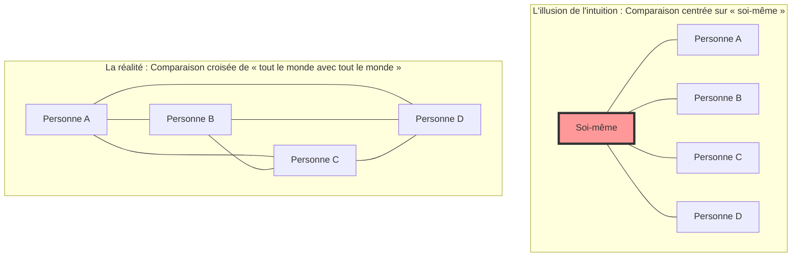
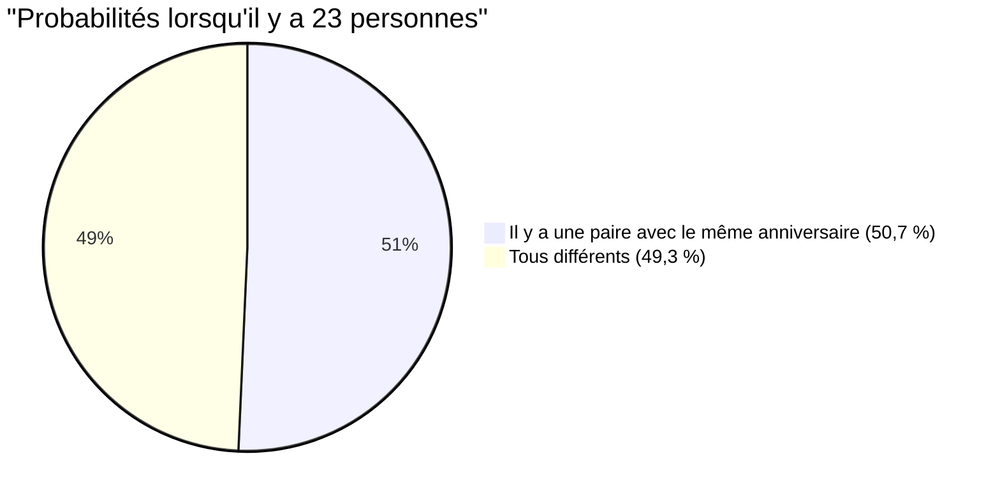

## 1. Test d'intuition : Combien de personnes faut-il rassembler pour que la probabilité dépasse 50 % ?

Des personnes sont rassemblées lors d'une fête.
Ici, **« pour que la probabilité qu'il y ait au moins une paire de personnes partageant exactement le même anniversaire (mois et jour) dans la salle dépasse 50 % »**, combien de personnes pensez-vous qu'il faut au minimum ? (*Nous excluons les années bissextiles, considérons qu'une année compte 365 jours, et supposons que chaque date d'anniversaire est équiprobable).

L'intuition humaine a tendance à calculer comme suit :
« Une année compte 365 jours. Puisqu'on place des personnes dans 365 cases et qu'il faut qu'elles se chevauchent, il faudrait probablement au moins 180 personnes. Même avec une estimation basse, il faudrait au moins 50 à 60 personnes pour que la probabilité atteigne la moitié, non ? »

Cependant, la réponse exacte donnée par les mathématiques n'est que de **« 23 personnes »**.
Dans une classe d'école (environ 30 à 40 personnes), la probabilité qu'il y ait une paire ayant le même anniversaire grimpe à environ 70 % - 89 %. S'il y a 50 personnes, cette probabilité atteint 97 %, ce qui crée une situation où « il est plus rare qu'il n'y ait personne partageant le même anniversaire ».

Pourquoi notre intuition s'écarte-t-elle à ce point de la probabilité réelle ?

---

## 2. La raison pour laquelle l'intuition se trompe : La différence entre « moi et quelqu'un » et « quelqu'un et quelqu'un »

La principale raison pour laquelle l'intuition se trompe sur ce problème est que nous pensons inconsciemment à **« la probabilité qu'il y ait quelqu'un qui partage le même anniversaire qu'une personne spécifique (par exemple, nous-mêmes) »**.

Si vous entrez dans la salle et cherchez « Y a-t-il quelqu'un qui a le même anniversaire que moi ? », la probabilité qu'il y ait quelqu'un avec le même anniversaire que vous parmi 23 personnes n'est que d'**environ 6,1 %**. (Pour que cette probabilité dépasse 50 %, il faut en réalité 253 personnes).

Cependant, le paradoxe des anniversaires ne porte pas sur la paire « moi et quelqu'un ». Il suffit qu'il y ait une seule correspondance parmi **« toutes les combinaisons possibles entre toutes les personnes présentes dans la salle (A et B, B et C, C et A...) »**.

Même dans un groupe de 4 personnes seulement, il y a 3 combinaisons centrées sur « soi-même », mais il existe 6 combinaisons possibles entre toutes les personnes (${}_4 C_2 = 6$).
Lorsque le nombre de personnes passe à 23, le nombre de combinaisons de paires augmente de manière explosive pour atteindre **253** (${}_{23} C_2$).
S'il y a 253 paires, ne commencez-vous pas à vous dire qu'il ne serait pas si surprenant qu'au moins une d'entre elles tire la probabilité de « 1 sur 365 » ?

---

## 3. Preuve mathématique : Une solution élégante utilisant l'événement complémentaire

Il est difficile de calculer directement « la probabilité qu'au moins une paire ait le même anniversaire » (car il y a trop de cas de figure : 1 seule paire identique, 2 paires identiques, 3 personnes avec le même anniversaire... etc.).
C'est pourquoi nous utilisons une technique de base de la théorie des probabilités appelée **« événement complémentaire »**.

L'événement complémentaire est « la probabilité que cela ne se produise pas ».
Autrement dit, il suffit de calculer **« la probabilité que les anniversaires de tout le monde soient différents (aucun chevauchement) »**, puis de la soustraire de 100 % (1) pour obtenir la probabilité recherchée.

$$ P(\text{au moins 2 personnes ont le même anniversaire}) = 1 - P(\text{tous les anniversaires sont différents}) $$

Faisons le calcul en imaginant des personnes entrant dans la salle une par une.

1. **La première personne** : Il n'y a aucun risque de chevauchement. La probabilité est de $\frac{365}{365}$.
2. **La deuxième personne** : Elle doit avoir un anniversaire différent de la première. C'est bon si c'est l'un des 364 jours restants. La probabilité est de $\frac{364}{365}$.
3. **La troisième personne** : Elle doit avoir un anniversaire différent des deux premières. C'est bon si c'est l'un des 363 jours restants. La probabilité est de $\frac{363}{365}$.

En multipliant cela jusqu'à la $n$-ième personne, on obtient le terme général de la probabilité $P(n)'$ que tout le monde ait un anniversaire différent.

$$ P(n)' = \frac{365}{365} \times \frac{364}{365} \times \frac{363}{365} \times \dots \times \frac{365 - (n - 1)}{365} $$

$$ P(n)' = \prod_{k=1}^{n-1} \left(1 - \frac{k}{365}\right) $$

Par conséquent, « la probabilité $P(n)$ qu'au moins 2 personnes aient le même anniversaire » que nous recherchons est la suivante :

$$ P(n) = 1 - \prod_{k=1}^{n-1} \left(1 - \frac{k}{365}\right) $$

En substituant le nombre de personnes $n$ dans cette équation, on peut voir que la probabilité augmente à une vitesse surprenante.

- Pour $n = 10$, la probabilité est d'environ **11,7 %**
- Pour $n = 23$, la probabilité est d'environ **50,7 %** (Elle dépasse 50 % ici !)
- Pour $n = 40$, la probabilité est d'environ **89,1 %**
- Pour $n = 70$, la probabilité est d'environ **99,9 %**

---

## 4. Calcul approché par le développement de Taylor

Puisqu'il est difficile de calculer à la main 23 multiplications, utilisons une formule d'approximation mathématique pour le comprendre de manière un peu plus intuitive.

Considérons le développement de Taylor de la fonction exponentielle $e^{-x}$. Lorsque $x$ est suffisamment petit, l'approximation suivante est valable :
$$ e^{-x} \approx 1 - x $$

En appliquant cela à chaque terme $\left(1 - \frac{k}{365}\right)$ précédent, on obtient :
$$ 1 - \frac{k}{365} \approx e^{-\frac{k}{365}} $$

En multipliant tout cela (ce qui devient une addition selon la règle des exposants), on a :
$$ P(n)' \approx e^{-\frac{1}{365}} \times e^{-\frac{2}{365}} \times \dots \times e^{-\frac{n-1}{365}} $$
$$ P(n)' \approx \exp\left(-\sum_{k=1}^{n-1} \frac{k}{365}\right) $$

La somme de 1 à $n-1$ étant $\frac{n(n-1)}{2}$ (c'est-à-dire le nombre de combinaisons ${}_n C_2$), on a :
$$ P(n)' \approx \exp\left(-\frac{n(n-1)}{2 \times 365}\right) $$

Dans cette équation, cherchons $n$ lorsque la probabilité devient 50 % ($0,5$).
$$ 0,5 = e^{-\frac{n(n-1)}{730}} $$
Prenons le logarithme népérien des deux côtés ($\ln 0,5 \approx -0,693$).
$$ -0,693 = -\frac{n(n-1)}{730} $$
$$ n(n-1) = 0,693 \times 730 \approx 505,89 $$

En approximant à $n^2 \approx 506$, on obtient $n = \sqrt{506} \approx 22,49$
La réponse **$n \approx 23$** en est brillamment déduite !

---

## 5. Application à la vie quotidienne et « Collision de hachage »

Ce paradoxe n'est pas seulement un sujet de conversation pour les banquets. Il joue un rôle extrêmement important dans **la théorie de la cryptographie et la sécurité de l'information** qui soutiennent la société informatique moderne.

Dans les systèmes informatiques, on utilise un mécanisme appelé « fonction de hachage » pour vérifier rapidement l'identité des mots de passe et des fichiers. Une fonction de hachage renvoie une chaîne de caractères aléatoire (valeur de hachage) d'une longueur constante, quelles que soient les données qu'on y insère.
Cependant, le phénomène où ces valeurs de hachage deviennent identiques par hasard est appelé **« collision de hachage » (Hash Collision)**.

Les collisions de hachage se produisent exactement selon le même principe que le paradoxe des anniversaires.
Contrairement à l'intuition humaine selon laquelle « puisqu'il y a un nombre astronomique de types de valeurs de hachage, les collisions ne se produiront presque jamais », il est étonnamment facile pour un attaquant de générer massivement des données aléatoirement et de trouver une paire « qui correspond (qui a le même anniversaire) ».

C'est ce qu'on appelle une **« attaque des anniversaires » (Birthday Attack)**.
Les ingénieurs qui conçoivent des systèmes de sécurité partent de cette réalité mathématique selon laquelle « les collisions se produisent beaucoup plus rapidement que ne le suggère l'intuition », et fixent la longueur des valeurs de hachage à une taille très importante pour garantir la sécurité.

## 6. Conclusion : Les limites de l'intuition humaine

Le paradoxe des anniversaires est un exemple parfait montrant **à quel point l'intuition humaine est vulnérable face aux « croissances exponentielles » ou aux « explosions combinatoires »**.

Nous sommes doués pour appréhender une augmentation linéaire (par addition), mais nous ne pouvons pas simuler mentalement un phénomène où le nombre de paires augmente de manière explosive à un rythme de $n^2$.
Derrière notre intuition selon laquelle « le nombre 23 est trop petit par rapport au grand nombre 365 », il y a en fait **« 253 fils invisibles (paires) »** créés par ces 23 personnes.

La prochaine fois que vous irez dans un endroit où des gens sont rassemblés, essayez d'imaginer non seulement le « nombre de personnes » visibles, mais aussi les « innombrables fils de combinaisons » qui existent entre elles. Votre vision du monde devrait changer de manière légèrement mathématique.
