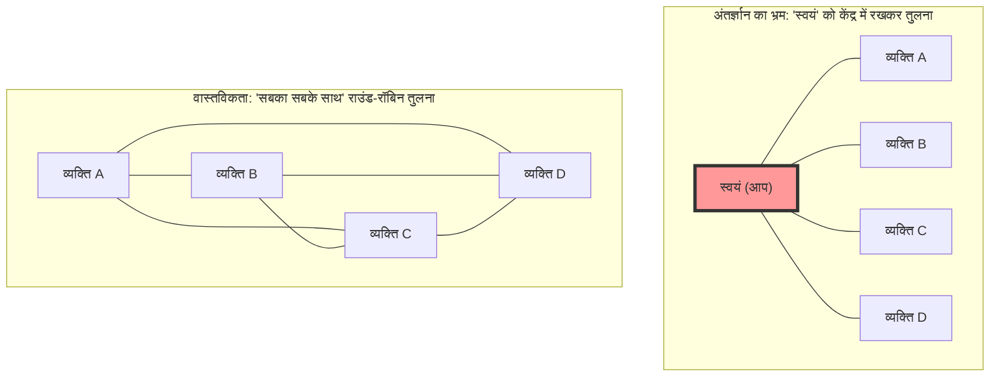
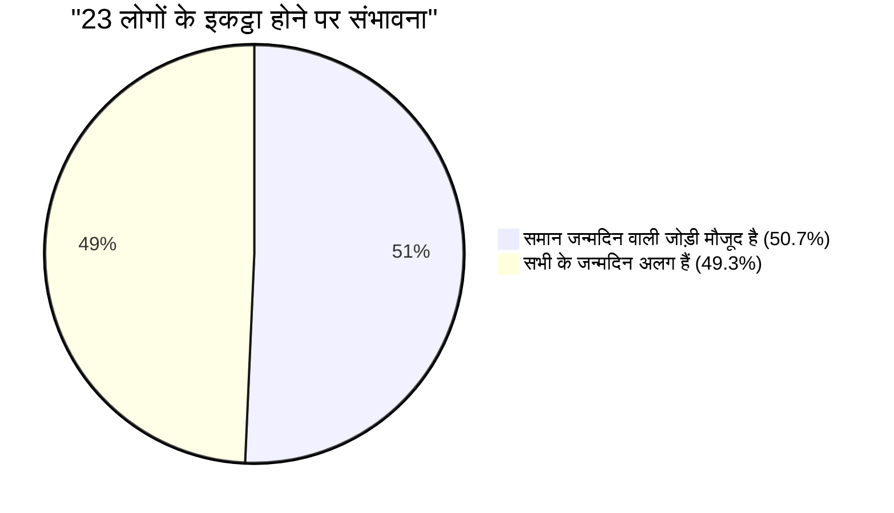

## 1. अंतर्ज्ञान का परीक्षण: संभावना 50% से अधिक होने के लिए कितने लोगों की आवश्यकता है?

मान लीजिए लोग एक पार्टी में इकट्ठे हुए हैं।
यहाँ, आपके विचार में **"इस बात की संभावना 50% से अधिक होने के लिए कम से कम कितने लोगों की आवश्यकता है कि हॉल में कम से कम दो लोगों का जन्मदिन (महीना और दिन) बिल्कुल एक ही हो?"** (※लीप वर्ष को छोड़कर 1 वर्ष को 365 दिन मानते हैं, और यह मान लेते हैं कि सभी जन्मदिनों की संभावना समान है)।

इंसानी अंतर्ज्ञान अक्सर इस तरह से गणना करता है:
"एक वर्ष में 365 दिन होते हैं। 365 स्लॉट्स में लोगों को डालते हुए, किसी का जन्मदिन टकराने (match होने) के लिए, कम से कम लगभग 180 लोगों की आवश्यकता होनी चाहिए। यदि हम कम से कम भी अनुमान लगाएं, तो क्या संभावना के आधे होने के लिए 50-60 लोगों का होना ज़रूरी नहीं है?"

हालाँकि, गणित द्वारा निकाला गया सही उत्तर मात्र **"23 लोग"** है।
अगर यह स्कूल की कोई क्लास (लगभग 30 से 40 लोग) है, तो एक ही जन्मदिन वाले जोड़े के होने की संभावना लगभग 70% से 89% तक उछल जाती है। यदि 50 लोग हैं, तो वह संभावना 97% तक पहुँच जाती है, जो कि एक ऐसी स्थिति है जहाँ "एक ही जन्मदिन वाले किसी व्यक्ति का न होना अधिक असामान्य" होता है।

हमारा अंतर्ज्ञान वास्तविकता की संभावनाओं से इतना विचलित (deviate) क्यों हो जाता है?

---

## 2. अंतर्ज्ञान के गलत होने का कारण: "मैं और कोई और" बनाम "कोई और और कोई और" में अंतर

इस समस्या में हमारे अंतर्ज्ञान के गलत होने का सबसे बड़ा कारण यह है कि हम अनजाने में **"किसी विशिष्ट व्यक्ति (उदाहरण के लिए, स्वयं) के समान जन्मदिन वाले किसी व्यक्ति के होने की संभावना"** के बारे में सोचने लगते हैं।

यदि आप हॉल में प्रवेश करते हैं और पूछते हैं, "क्या किसी का जन्मदिन मेरे ही दिन है?", तो 23 लोगों के बीच आपके समान जन्मदिन वाले किसी व्यक्ति के होने की संभावना मात्र **लगभग 6.1%** है। (इस संभावना को 50% से अधिक होने के लिए वास्तव में 253 लोगों की आवश्यकता होगी)।

हालाँकि, बर्थडे पैराडॉक्स "मेरे और किसी और" की जोड़ी के बारे में नहीं पूछता है। **"हॉल में मौजूद सभी लोगों के सभी संभावित कॉम्बिनेशन (A और B, B और C, C और A...)"** में से, यदि 1 जोड़ी भी मेल खाती है तो काफी है।

केवल 4 लोगों के समूह में भी, "स्वयं" पर केंद्रित तुलना 3 प्रकार की होती है, लेकिन यदि हर कोई एक-दूसरे की तुलना करे, तो 6 प्रकार (${}_4 C_2 = 6$) की तुलनाएं होंगी।
जब लोगों की संख्या बढ़कर 23 हो जाती है, तो जोड़ों के कॉम्बिनेशन विस्फोटक रूप से बढ़कर **253 संभावित जोड़ों** (${}_{23} C_2$) तक पहुंच जाते हैं।
यदि 253 जोड़ियां हों, तो क्या आपको ऐसा नहीं लगता कि उनमें से कम से कम 1 जोड़ी का "365 में से 1" की संभावना से टकराना कोई आश्चर्य की बात नहीं है?

---

## 3. गणित द्वारा प्रमाण: पूरक घटना (Complementary Event) का उपयोग करके एक शानदार समाधान

"कम से कम 1 जोड़े का जन्मदिन एक ही होने की संभावना" की सीधे तौर पर गणना करना कठिन है (क्योंकि ऐसे बहुत सारे पैटर्न हैं, जैसे 1 जोड़ी का समान होना, 2 जोड़ियों का समान होना, 3 लोगों का एक ही जन्मदिन होना... आदि)।
इसलिए, हम प्रायिकता सिद्धांत (probability theory) की एक बुनियादी तकनीक का उपयोग करते हैं जिसे **"पूरक घटना (Complementary Event)"** कहा जाता है।

एक पूरक घटना का अर्थ है "घटना के न होने की संभावना"।
दूसरे शब्दों में, यदि हम **"सभी के जन्मदिन अलग-अलग होने (कोई भी 1 जोड़ी मेल न खाने) की संभावना"** की गणना करें और उसे 100% (1) से घटा दें, तो हमें वह संभावना मिल जाएगी जो हम चाहते हैं।

$$ P(\text{कम से कम 2 लोगों का समान होना}) = 1 - P(\text{सभी का जन्मदिन अलग होना}) $$

तो चलिए गणना करते हैं और कल्पना करते हैं कि लोग एक-एक करके हॉल में प्रवेश कर रहे हैं।

1. **पहला व्यक्ति**: किसी के साथ टकराने (match होने) की कोई चिंता नहीं है। संभावना $\frac{365}{365}$ है।
2. **दूसरा व्यक्ति**: उसका जन्मदिन पहले व्यक्ति से अलग होना चाहिए। यदि यह शेष 364 दिनों में से है तो सुरक्षित है। संभावना $\frac{364}{365}$ है।
3. ** तीसरा व्यक्ति**: उसका जन्मदिन पहले 2 लोगों से अलग होना चाहिए। यदि यह शेष 363 दिनों में से है तो सुरक्षित है। संभावना $\frac{363}{365}$ है।

जब हम इसे $n$ वें व्यक्ति तक गुणा करते हैं, तो हमें संभावना $P(n)'$ का सामान्य पद (general term) मिलता है जहाँ सभी के जन्मदिन अलग-अलग होते हैं।

$$ P(n)' = \frac{365}{365} \times \frac{364}{365} \times \frac{363}{365} \times \dots \times \frac{365 - (n - 1)}{365} $$

$$ P(n)' = \prod_{k=1}^{n-1} \left(1 - \frac{k}{365}\right) $$

अतः, "कम से कम 2 लोगों का एक ही जन्मदिन होने की संभावना $P(n)$" इस प्रकार है:

$$ P(n) = 1 - \prod_{k=1}^{n-1} \left(1 - \frac{k}{365}\right) $$

जैसे-जैसे हम इस समीकरण में $n$ लोगों की संख्या डालते हैं, हम देख सकते हैं कि संभावना आश्चर्यजनक गति से बढ़ती है।

- जब $n = 10$, तो संभावना लगभग **11.7%** होती है
- जब $n = 23$, तो संभावना लगभग **50.7%** होती है (यहाँ यह 50% को पार कर जाती है!)
- जब $n = 40$, तो संभावना लगभग **89.1%** होती है
- जब $n = 70$, तो संभावना लगभग **99.9%** होती है

---

## 4. टेलर विस्तार (Taylor Expansion) द्वारा अनुमानित गणना

चूँकि 23 बार गुणा की गणना हाथ से करना कठिन है, इसलिए आइए इसे गणितीय सन्निकटन सूत्र (mathematical approximation formula) का उपयोग करके थोड़ा और सहजता से समझने का प्रयास करें।

घातीय फलन (exponential function) $e^{-x}$ के टेलर विस्तार पर विचार करें। जब $x$ पर्याप्त रूप से छोटा होता है, तो निम्नलिखित सन्निकटन लागू होता है:
$$ e^{-x} \approx 1 - x $$

यदि हम इसे पहले के प्रत्येक पद $\left(1 - \frac{k}{365}\right)$ पर लागू करें,
$$ 1 - \frac{k}{365} \approx e^{-\frac{k}{365}} $$

यदि हम इन सभी को एक साथ गुणा करते हैं (घातांक के नियम के अनुसार यह जोड़ बन जाता है),
$$ P(n)' \approx e^{-\frac{1}{365}} \times e^{-\frac{2}{365}} \times \dots \times e^{-\frac{n-1}{365}} $$
$$ P(n)' \approx \exp\left(-\sum_{k=1}^{n-1} \frac{k}{365}\right) $$

चूँकि 1 से $n-1$ तक का योग $\frac{n(n-1)}{2}$ है (यानी कॉम्बिनेशन की संख्या ${}_n C_2$),
$$ P(n)' \approx \exp\left(-\frac{n(n-1)}{2 \times 365}\right) $$

इस सूत्र में, हम $n$ खोजते हैं जब संभावना 50% ($0.5$) हो जाती है।
$$ 0.5 = e^{-\frac{n(n-1)}{730}} $$
दोनों पक्षों का प्राकृतिक लघुगणक (natural logarithm) लें ($\ln 0.5 \approx -0.693$)।
$$ -0.693 = -\frac{n(n-1)}{730} $$
$$ n(n-1) = 0.693 \times 730 \approx 505.89 $$

यदि हम सन्निकटन $n^2 \approx 506$ करते हैं, तो $n = \sqrt{506} \approx 22.49$
हमें बहुत ही शानदार ढंग से **$n \approx 23$** उत्तर प्राप्त होता है!

---

## 5. दैनिक जीवन में अनुप्रयोग और "हैश टकराव (Hash Collision)"

यह पैराडॉक्स सिर्फ दावतों के लिए कोई मज़ाक नहीं है। यह आधुनिक आईटी समाज का समर्थन करने वाली **क्रिप्टोग्राफी और सूचना सुरक्षा (Cryptography and Information Security)** में अत्यंत महत्वपूर्ण भूमिका निभाता है।

कंप्यूटर सिस्टम में, हम पासवर्ड या फ़ाइलों की पहचान (सामान्यता) को जल्दी से जांचने के लिए "हैश फ़ंक्शन (Hash Function)" नामक एक तंत्र का उपयोग करते हैं। कोई भी डेटा डाले जाने पर हैश फ़ंक्शन एक निश्चित लंबाई वाली यादृच्छिक वर्णमाला (रैंडम स्ट्रिंग) (हैश वैल्यू) देता है।
हालाँकि, जब ये हैश वैल्यू संयोग से समान हो जाती हैं, तो इस घटना को **"हैश टकराव (Hash Collision)"** कहा जाता है।

हैश टकराव बिल्कुल बर्थडे पैराडॉक्स के सिद्धांत पर ही होते हैं।
इंसानी अंतर्ज्ञान जो यह कहता है, "चूंकि हैश वैल्यू के प्रकारों की संख्या खगोलीय है, टकराव शायद ही कभी होगा" के विपरीत, किसी हमलावर (Attacker) के लिए बड़ी मात्रा में बेतरतीब ढंग से डेटा उत्पन्न करना और "एक जोड़ी को खोजना जो किसी से मेल खाती हो (जन्मदिन टकराता हो)" कल्पना से कहीं अधिक आसान है।

इसे **"बर्थडे अटैक (Birthday Attack)"** कहा जाता है।
सुरक्षा प्रणालियों को डिज़ाइन करने वाले इंजीनियर इस गणितीय तथ्य को आधार मानकर हैश वैल्यू की लंबाई बहुत बड़ी निर्धारित करते हैं, और सुरक्षा सुनिश्चित करते हैं कि "टकराव हमारे अंतर्ज्ञान से कहीं अधिक तेज़ी से होगा"।

## 6. निष्कर्ष: मानव अंतर्ज्ञान की सीमाएं

बर्थडे पैराडॉक्स इस बात का एक आदर्श उदाहरण है कि **"घातीय वृद्धि (exponential growth)" और "कॉम्बिनेशन के विस्फोट" के प्रति मानव अंतर्ज्ञान कितना कमज़ोर है**।

हम रैखिक (जोड़ने वाली) वृद्धि को तो अच्छे से समझ लेते हैं, लेकिन हम अपने मस्तिष्क में उस घटना का अनुकरण नहीं कर सकते जहाँ जोड़ों की संख्या $n^2$ की गति से विस्फोटक रूप से बढ़ती है।
इस अंतर्ज्ञान के पीछे कि "बड़ी संख्या 365 की तुलना में 23 बहुत छोटी है", 23 लोगों द्वारा बनाए गए **"253 अदृश्य धागों (जोड़ियों)"** का एक जाल फैला हुआ है।

अगली बार जब आप किसी ऐसी जगह जाएं जहां लोग इकट्ठा हों, तो न केवल "लोगों की संख्या" की कल्पना करें जो आप देख सकते हैं, बल्कि उनके बीच मौजूद अनगिनत "कॉम्बिनेशन के धागों" की भी कल्पना करें। दुनिया को देखने का आपका नज़रिया गणितीय रूप से थोड़ा बदल जाएगा।
