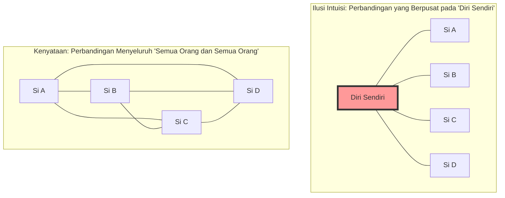
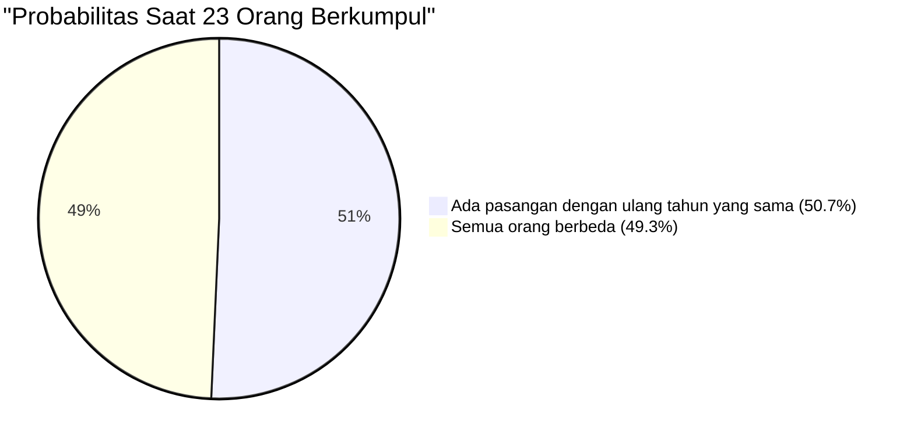

## 1. Tes Intuisi: Berapa Banyak Orang yang Berkumpul agar Probabilitas Melebihi 50%?

Orang-orang berkumpul di suatu tempat pesta.
Di sini, **"probabilitas setidaknya ada 1 pasang (dua orang) dengan ulang tahun (bulan dan tanggal) yang sama persis di dalam tempat tersebut melebihi 50%"**, menurut Anda berapa jumlah minimum orang yang diperlukan? (*Dengan asumsi tidak termasuk tahun kabisat, 1 tahun adalah 365 hari, dan setiap hari ulang tahun memiliki probabilitas yang sama).

Intuisi manusia cenderung menghitung sebagai berikut.
"Dalam 1 tahun ada 365 hari. Karena kita memasukkan orang ke dalam 365 slot dan melihat apakah ada yang tumpang tindih, setidaknya kita membutuhkan sekitar 180 orang. Bahkan dengan perkiraan rendah, bukankah setidaknya harus ada 50 hingga 60 orang agar probabilitasnya menjadi setengah?"

Namun, jawaban yang benar yang dihasilkan oleh matematika hanyalah **"23 orang"**.
Jika di dalam satu kelas sekolah (sekitar 30 hingga 40 orang), probabilitas adanya pasangan dengan ulang tahun yang sama melonjak menjadi sekitar 70% hingga 89%. Jika ada 50 orang, probabilitas tersebut mencapai 97%, menjadikannya kondisi di mana "lebih langka jika tidak ada orang yang berulang tahun sama".

Mengapa intuisi kita bisa menyimpang sejauh ini dari probabilitas di dunia nyata?

---

## 2. Alasan Intuisi Salah: Perbedaan antara "Saya dan Seseorang" dan "Seseorang dan Seseorang"

Alasan terbesar mengapa intuisi salah dalam masalah ini adalah karena kita secara tidak sadar memikirkan **"probabilitas adanya seseorang yang memiliki ulang tahun yang sama dengan satu orang tertentu (misalnya diri sendiri)"**.

Ketika Anda memasuki tempat pesta dan mencari, "Apakah ada orang yang memiliki ulang tahun yang sama dengan saya?", probabilitas bahwa dari 23 orang tersebut ada yang berulang tahun sama dengan Anda hanyalah **sekitar 6,1%**. (Untuk probabilitas ini melebihi 50%, kenyataannya diperlukan sebanyak 253 orang).

Namun, apa yang ditanyakan oleh Paradoks Ulang Tahun bukanlah pasangan "saya dan seseorang". Di antara **"segala kemungkinan kombinasi antara semua orang yang ada di tempat tersebut (Si A dan Si B, Si B dan Si C, Si C dan Si A...)"**, cukup jika ada 1 pasang yang cocok.

Bahkan dalam grup yang hanya terdiri dari 4 orang, perbandingan yang berpusat pada "diri sendiri" hanya ada 3 cara, tetapi perbandingan di antara semua orang ada 6 cara (${}_4 C_2 = 6$).
Ketika jumlah orang meningkat menjadi 23 orang, kombinasi pasangan meledak secara drastis menjadi **253 cara** (${}_{23} C_2$).
Jika ada 253 pasangan, tidakkah terasa wajar jika setidaknya 1 pasangan dari mereka mendapatkan probabilitas "1 dari 365"?

---

## 3. Pembuktian dengan Matematika: Solusi Brilian Menggunakan Komplemen Probabilitas (Kejadian Komplemen)

Sangat sulit untuk menghitung "probabilitas setidaknya ada 1 pasangan dengan ulang tahun yang sama" secara langsung (karena ada terlalu banyak pola, seperti jika hanya 1 pasangan yang sama, 2 pasangan yang sama, 3 orang memiliki ulang tahun yang sama... dll.).
Oleh karena itu, kita menggunakan teknik dasar dalam teori probabilitas yaitu **"Kejadian Komplemen (Complementary Event)"**.

Kejadian Komplemen adalah "probabilitas sesuatu tidak terjadi".
Dengan kata lain, kita menghitung **"probabilitas ulang tahun semua orang berbeda (tidak ada 1 pasangan pun yang sama)"**, lalu menguranginya dari 100% (1), maka kita akan mendapatkan probabilitas yang diinginkan.

$$ P(\text{setidaknya 2 orang sama}) = 1 - P(\text{semua orang memiliki ulang tahun berbeda}) $$

Mari kita bayangkan orang-orang yang memasuki ruangan satu per satu dan menghitungnya.

1. **Orang ke-1**: Tidak ada kekhawatiran ulang tahunnya sama dengan siapa pun. Probabilitasnya adalah $\frac{365}{365}$.
2. **Orang ke-2**: Ulang tahunnya harus berbeda dengan orang ke-1. Aman jika berada di 364 hari yang tersisa. Probabilitasnya adalah $\frac{364}{365}$.
3. **Orang ke-3**: Ulang tahunnya harus berbeda dengan 2 orang sebelumnya. Aman jika berada di 363 hari yang tersisa. Probabilitasnya adalah $\frac{363}{365}$.

Jika kita mengalikannya hingga orang ke-$n$, kita mendapatkan bentuk umum dari probabilitas semua orang memiliki ulang tahun yang berbeda $P(n)'$.

$$ P(n)' = \frac{365}{365} \times \frac{364}{365} \times \frac{363}{365} \times \dots \times \frac{365 - (n - 1)}{365} $$

$$ P(n)' = \prod_{k=1}^{n-1} \left(1 - \frac{k}{365}\right) $$

Oleh karena itu, "probabilitas setidaknya ada 2 orang dengan ulang tahun yang sama $P(n)$" yang dicari adalah sebagai berikut.

$$ P(n) = 1 - \prod_{k=1}^{n-1} \left(1 - \frac{k}{365}\right) $$

Dengan mensubstitusikan jumlah orang $n$ ke dalam rumus ini, kita dapat melihat bahwa probabilitasnya meningkat dengan kecepatan yang mengejutkan.

- Ketika $n = 10$, probabilitasnya sekitar **11,7%**
- Ketika $n = 23$, probabilitasnya sekitar **50,7%** (Di sini melebihi 50%!)
- Ketika $n = 40$, probabilitasnya sekitar **89,1%**
- Ketika $n = 70$, probabilitasnya sekitar **99,9%**

---

## 4. Perhitungan Perkiraan dengan Deret Taylor

Mengingat sangat merepotkan untuk menghitung perkalian 23 kali secara manual, mari kita coba memahami ini secara lebih intuitif menggunakan rumus pendekatan matematis.

Pertimbangkan Deret Taylor dari fungsi eksponensial $e^{-x}$. Ketika $x$ cukup kecil, pendekatan berikut ini berlaku.
$$ e^{-x} \approx 1 - x $$

Jika kita menerapkan ini pada masing-masing suku sebelumnya $\left(1 - \frac{k}{365}\right)$,
$$ 1 - \frac{k}{365} \approx e^{-\frac{k}{365}} $$

Jika kita mengalikan semuanya (menjadi penjumlahan menurut hukum eksponen),
$$ P(n)' \approx e^{-\frac{1}{365}} \times e^{-\frac{2}{365}} \times \dots \times e^{-\frac{n-1}{365}} $$
$$ P(n)' \approx \exp\left(-\sum_{k=1}^{n-1} \frac{k}{365}\right) $$

Jumlah dari 1 hingga $n-1$ adalah $\frac{n(n-1)}{2}$ (dengan kata lain, jumlah kombinasi ${}_n C_2$), jadi
$$ P(n)' \approx \exp\left(-\frac{n(n-1)}{2 \times 365}\right) $$

Dalam rumus ini, kita mencari $n$ saat probabilitasnya menjadi 50% ($0.5$).
$$ 0.5 = e^{-\frac{n(n-1)}{730}} $$
Kita mengambil logaritma natural dari kedua ruas ($\ln 0.5 \approx -0.693$).
$$ -0.693 = -\frac{n(n-1)}{730} $$
$$ n(n-1) = 0.693 \times 730 \approx 505.89 $$

Jika kita mendekati dengan $n^2 \approx 506$, maka $n = \sqrt{506} \approx 22.49$
Ternyata jawaban **$n \approx 23$** berhasil diturunkan dengan luar biasa!

---

## 5. Aplikasi dalam Kehidupan Sehari-hari dan "Tabrakan Hash"

Paradoks ini bukan sekadar bahan obrolan di pesta. Ia memainkan peran yang sangat penting dalam **teori kriptografi dan keamanan informasi** yang menopang masyarakat IT modern.

Dalam sistem komputer, mekanisme yang disebut "fungsi hash (hash function)" digunakan untuk mengonfirmasi identitas kata sandi atau file dengan cepat. Fungsi hash mengembalikan string acak (nilai hash) dengan panjang tertentu, terlepas dari data apa pun yang dimasukkan.
Namun, fenomena di mana nilai hash ini secara kebetulan menjadi sama disebut **"Tabrakan Hash (Hash Collision)"**.

Tabrakan hash terjadi dengan prinsip yang persis sama dengan Paradoks Ulang Tahun.
Bertentangan dengan intuisi manusia yang berpikir, "Karena ada jumlah jenis nilai hash yang astronomis, tabrakan jarang terjadi", sangat mudah bagi penyerang untuk secara acak menghasilkan data dalam jumlah besar dan menemukan "pasangan di mana satu dengan yang lain cocok (ulang tahun yang tumpang tindih)".

Ini disebut **"Serangan Ulang Tahun (Birthday Attack)"**.
Insinyur yang merancang sistem keamanan menggunakan fakta matematis "tabrakan terjadi jauh lebih cepat dari intuisi" ini sebagai premis, dan mengatur panjang nilai hash menjadi sangat panjang untuk memastikan keamanannya.

## 6. Kesimpulan: Keterbatasan Intuisi Manusia

Paradoks Ulang Tahun adalah contoh sempurna yang menunjukkan **betapa rentannya intuisi manusia terhadap "peningkatan eksponensial" dan "ledakan kombinasi"**.

Kita kuat dalam mengenali peningkatan linear (berbasis penjumlahan), tetapi kita tidak dapat mensimulasikan dalam otak kita fenomena di mana jumlah pasangan meledak dengan kecepatan $n^2$.
Di balik intuisi yang mengatakan bahwa "angka 23 terlalu kecil dibandingkan dengan angka 365 yang besar", terdapat **"253 benang (pasangan) tak terlihat"** yang dihubungkan oleh 23 orang tersebut.

Lain kali Anda pergi ke tempat di mana orang-orang berkumpul, cobalah untuk membayangkan tidak hanya "jumlah orang" yang terlihat, tetapi juga "benang kombinasi" yang tak terhitung jumlahnya yang ada di antara mereka. Cara Anda melihat dunia pasti akan sedikit berubah secara matematis.
