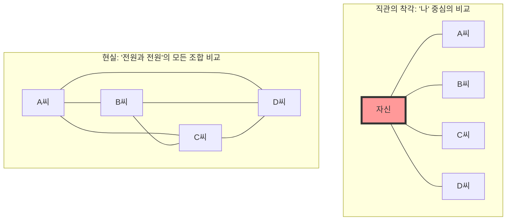
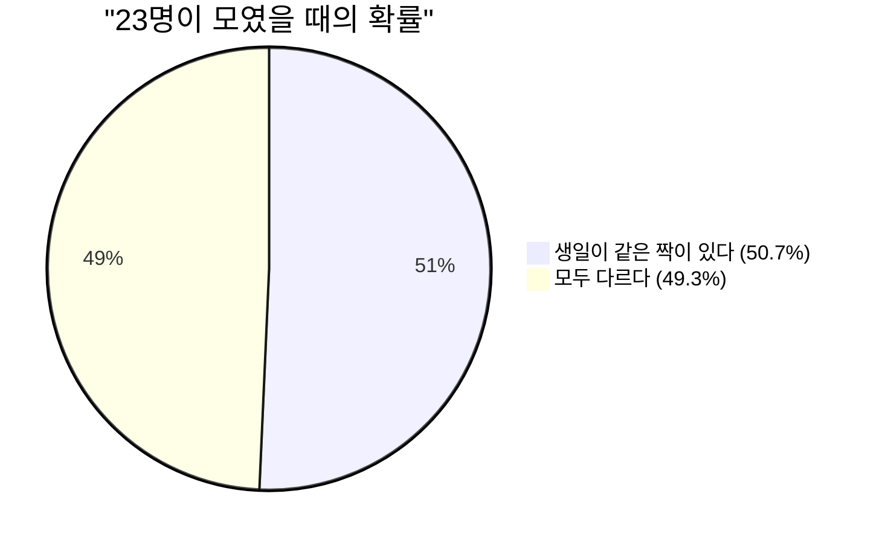

## 1. 직관 테스트: 몇 명이 모여야 확률이 50%를 넘을까?

어떤 파티장에 사람들이 모여 있습니다.
여기서 **"파티장 안에 생일(월과 일)이 완전히 같은 두 사람이 최소 한 쌍 존재할 확률이 50%를 넘기"** 위해서는 최소 몇 명의 사람이 필요하다고 생각하십니까? (※ 윤년은 제외하고 1년은 365일로 하며, 각 생일은 동일한 확률이라고 가정합니다).

인간의 직관은 다음과 같이 계산하기 쉽습니다.
"1년은 365일이나 된다. 365개의 틀 안에 사람들을 하나씩 넣다 보면 겹치게 마련이니, 적어도 180명 정도는 필요할 것이다. 적게 잡아도 50~60명은 있어야 확률이 절반이 되지 않을까?"

하지만 수학이 도출해낸 정답은 겨우 **"23명"**입니다.
학교의 한 학급(약 30명~40명)이라면 생일이 같은 쌍이 있을 확률은 약 70%~89%로 훌쩍 뜁니다. 50명이 있으면 그 확률은 97%에 달해, "생일이 같은 사람이 없는 쪽이 더 드문" 상태가 됩니다.

왜 우리의 직관은 이토록 현실의 확률과 크게 어긋나는 것일까요?

---

## 2. 직관이 틀리는 이유: "나와 누군가"와 "누군가와 누군가"의 차이

이 문제에서 직관이 틀리는 가장 큰 이유는 우리가 무의식중에 **"특정 한 사람(예를 들어 자신)과 생일이 같은 사람이 있을 확률"**을 생각하기 때문입니다.

당신이 파티장에 들어가 "나와 생일이 같은 사람이 있을까?"라고 찾을 경우, 23명 중에 당신과 생일이 같은 사람이 있을 확률은 겨우 **약 6.1%**밖에 되지 않습니다. (이 확률이 50%를 넘으려면 무려 253명이나 되는 사람이 필요합니다).

하지만 생일 역설이 묻고 있는 것은 "나와 누군가"의 짝이 아닙니다. **"파티장에 있는 모든 사람들끼리의 모든 조합(A씨와 B씨, B씨와 C씨, C씨와 A씨…)"** 중에서 한 쌍이라도 일치하면 되는 것입니다.

단 4명인 그룹에서도 "자신"을 중심으로 한 비교는 3가지지만, 모두끼리의 비교라면 6가지(${}_4 C_2 = 6$)가 존재합니다.
인원이 23명으로 늘어나면 짝의 조합은 무려 **253가지**(${}_{23} C_2$)로 폭발적으로 증가합니다.
253쌍이나 되는 짝이 있다면, 그 중 한 쌍 정도는 "365분의 1"의 확률을 뽑아도 이상하지 않을 것 같다는 생각이 들지 않으십니까?

---

## 3. 수학에 의한 증명: 여사건을 사용한 명쾌한 해법

"적어도 한 쌍이 생일이 같을 확률"을 정면으로 계산하는 것은 매우 어렵습니다(한 쌍만 같은 경우, 두 쌍이 같은 경우, 세 명이 생일이 같아지는 경우… 등 패턴이 너무 많기 때문입니다).
그래서 확률론의 기본 테크닉인 **"여사건(余事象)"**을 사용합니다.

여사건이란 "일어나지 않을 확률"을 말합니다.
즉, **"모두의 생일이 제각각일(한 쌍도 겹치지 않을) 확률"**을 계산하여, 그것을 100%(1)에서 빼면 구하고자 하는 확률이 나옵니다.

$$ P(\text{적어도 2명이 같음}) = 1 - P(\text{모두가 다른 생일}) $$

그럼 순서대로 파티장에 들어오는 사람을 상상하며 계산해 봅시다.

1. **첫 번째 사람**: 누구와도 겹칠 걱정이 없습니다. 확률은 $\frac{365}{365}$입니다.
2. **두 번째 사람**: 첫 번째 사람과 다른 생일이어야 합니다. 남은 364일이라면 안전합니다. 확률은 $\frac{364}{365}$입니다.
3. **세 번째 사람**: 앞의 두 사람과 다른 생일이어야 합니다. 남은 363일이라면 안전합니다. 확률은 $\frac{363}{365}$입니다.

이것을 $n$번째 사람까지 곱하면, 모두의 생일이 제각각일 확률 $P(n)'$의 일반항을 얻을 수 있습니다.

$$ P(n)' = \frac{365}{365} \times \frac{364}{365} \times \frac{363}{365} \times \dots \times \frac{365 - (n - 1)}{365} $$

$$ P(n)' = \prod_{k=1}^{n-1} \left(1 - \frac{k}{365}\right) $$

따라서, 구하고자 하는 "적어도 2명이 생일이 같을 확률 $P(n)$"은 다음과 같아집니다.

$$ P(n) = 1 - \prod_{k=1}^{n-1} \left(1 - \frac{k}{365}\right) $$

이 식에 인원수 $n$을 대입해 보면, 놀라운 속도로 확률이 상승하는 것을 알 수 있습니다.

- $n = 10$일 때, 확률은 약 **11.7%**
- $n = 23$일 때, 확률은 약 **50.7%** (여기서 50%를 넘습니다!)
- $n = 40$일 때, 확률은 약 **89.1%**
- $n = 70$일 때, 확률은 약 **99.9%**

---

## 4. 테일러 전개에 의한 근사 계산

곱셈을 23번이나 직접 계산하는 것은 힘드니, 수학적인 근사식을 사용하여 조금 더 직관적으로 이해해 봅시다.

지수 함수 $e^{-x}$의 테일러 전개를 생각해 봅니다. $x$가 충분히 작을 때, 다음과 같은 근사가 성립합니다.
$$ e^{-x} \approx 1 - x $$

앞서 구한 각 항 $\left(1 - \frac{k}{365}\right)$에 이를 적용하면,
$$ 1 - \frac{k}{365} \approx e^{-\frac{k}{365}} $$

이것을 모두 곱하면 (지수 법칙에 의해 덧셈이 되므로),
$$ P(n)' \approx e^{-\frac{1}{365}} \times e^{-\frac{2}{365}} \times \dots \times e^{-\frac{n-1}{365}} $$
$$ P(n)' \approx \exp\left(-\sum_{k=1}^{n-1} \frac{k}{365}\right) $$

1부터 $n-1$까지의 합은 $\frac{n(n-1)}{2}$ (즉, 조합의 수 ${}_n C_2$)이므로,
$$ P(n)' \approx \exp\left(-\frac{n(n-1)}{2 \times 365}\right) $$

이 식에서 확률이 50% ($0.5$)가 될 때의 $n$을 구합니다.
$$ 0.5 = e^{-\frac{n(n-1)}{730}} $$
양변의 자연로그를 취합니다 ($\ln 0.5 \approx -0.693$).
$$ -0.693 = -\frac{n(n-1)}{730} $$
$$ n(n-1) = 0.693 \times 730 \approx 505.89 $$

$n^2 \approx 506$으로 근사하면, $n = \sqrt{506} \approx 22.49$
멋지게 **$n \approx 23$**이라는 답이 도출되었습니다!

---

## 5. 일상생활로의 응용과 "해시 충돌"

이 역설은 단순한 파티의 이야깃거리가 아닙니다. 현대의 IT 사회를 지탱하는 **암호 이론과 정보 보안**에서 매우 중요한 역할을 하고 있습니다.

컴퓨터 시스템에서는 비밀번호나 파일의 동일성을 빠르게 확인하기 위해 "해시 함수"라는 구조를 사용합니다. 해시 함수는 어떤 데이터를 넣어도 일정한 길이의 무작위 문자열(해시값)을 반환합니다.
하지만 이 해시값이 우연히 같아지는 현상을 **"해시 충돌(Hash Collision)"**이라고 부릅니다.

해시 충돌은 바로 생일 역설과 같은 원리로 발생합니다.
"해시값의 종류가 천문학적인 수이기 때문에 충돌 따위는 좀처럼 일어나지 않을 것이다"라는 인간의 직관에 반하여, 공격자가 대량의 데이터를 무작위로 생성해 "어떤 것과 어떤 것이 일치하는(생일이 겹치는) 짝"을 찾아내는 것은 상상 이상으로 간단합니다.

이것을 **"생일 공격(Birthday Attack)"**이라고 부릅니다.
보안 시스템을 설계하는 엔지니어는 이 "직관보다 훨씬 빠르게 충돌이 일어난다"는 수학적 사실을 전제로 하여, 해시값의 길이를 매우 길게 설정함으로써 안전성을 담보하고 있습니다.

## 6. 요약: 인간 직관의 한계

생일 역설은 **"지수 함수적인 증가"나 "조합의 폭발"에 대해 인간의 직관이 얼마나 취약한지**를 보여주는 완벽한 예입니다.

우리는 직선적인 (덧셈적인) 증가에는 강하지만, 짝의 수가 $n^2$의 속도로 폭발적으로 늘어나는 현상을 뇌 속에서 시뮬레이션할 수 없습니다.
"365라는 큰 숫자에 비해 23이라는 숫자는 너무 작다"는 직관의 이면에는, 23명이 만들어내는 **"253가닥의 보이지 않는 실(짝)"**이 사방으로 뻗어 있는 것입니다.

다음에 사람들이 모이는 장소에 갔을 때는, 눈에 보이는 "인원수"뿐만 아니라 그 사이에 무수히 존재하는 "조합의 실"을 상상해 보세요. 세상이 보이는 방식이 조금은 수학적으로 바뀔 것입니다.
