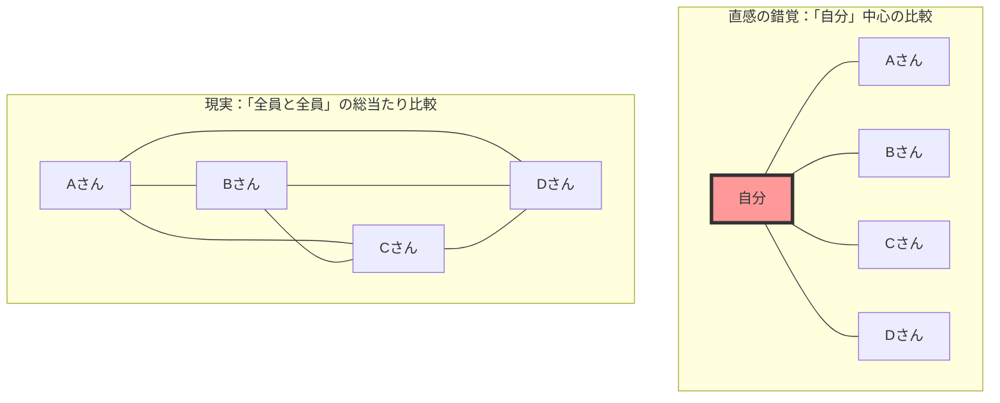
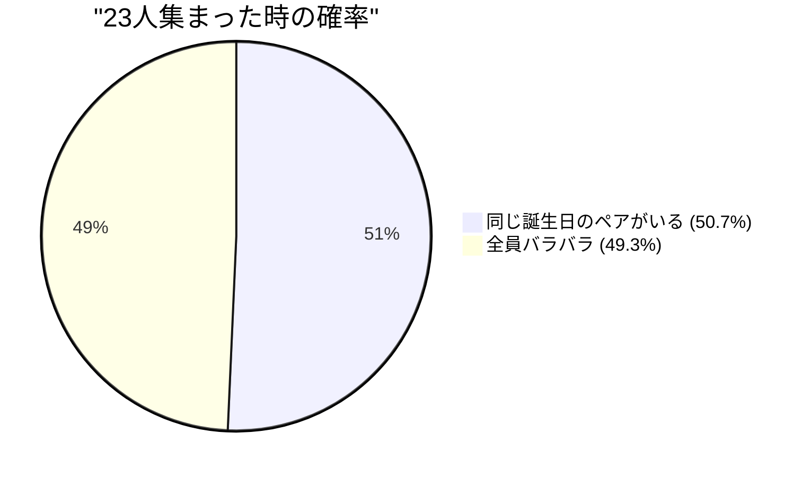

## 1. 直感のテスト：何人集まれば確率は50%を超える？

あるパーティー会場に人々が集まっています。
ここで、**「会場の中に、誕生日（月と日）が全く同じ2人組が少なくとも1組存在する確率が50%を超える」**には、最低何人の人が必要だと思いますか？（※うるう年は除外して1年は365日とし、各誕生日は等確率であると仮定します）。

人間の直感は、次のように計算しがちです。
「1年は365日もある。365個の枠の中に人をポンポンと入れていって被るのだから、少なくとも180人くらいは必要だろう。少なく見積もっても、50〜60人はいないと確率は半分にならないのでは？」

しかし、数学が導き出す正解は、わずか **「23人」** です。
学校の1クラス（約30人〜40人）であれば、同じ誕生日のペアがいる確率は約70%〜89%にも跳ね上がります。50人いれば、その確率は97%に達し、「同じ誕生日の人がいない方が珍しい」状態になります。

なぜ私たちの直感はこれほどまでに現実の確率とズレてしまうのでしょうか？

---

## 2. 直感が間違える理由：「私と誰か」と「誰かと誰か」の違い

この問題で直感が間違う最大の理由は、私たちが無意識のうちに**「特定の一人（例えば自分）と同じ誕生日の人がいる確率」**を考えてしまうからです。

あなたが会場に入り、「自分と同じ誕生日の人はいるかな？」と探す場合、23人の中にあなたと同じ誕生日の人がいる確率はたったの **約6.1%** しかありません。（この確率が50%を超えるには、実に253人もの人が必要です）。

しかし、バースデイパラドックスが問うているのは「私と誰か」のペアではありません。**「会場にいる全ての人同士のあらゆる組み合わせ（AさんとBさん、BさんとCさん、CさんとAさん…）」**の中で、1組でも一致すれば良いのです。

たった4人のグループでも、「自分」を中心とした比較は3通りですが、全員同士の比較なら6通り（${}_4 C_2 = 6$）存在します。
人数が23人に増えると、ペアの組み合わせはなんと **253通り** (${}_{23} C_2$) にも爆発的に増加します。
253組ものペアがいれば、その中の1組くらいは「365分の1」の確率を引き当てても不思議ではない気がしてきませんか？

---

## 3. 数学による証明：余事象を使った鮮やかな解法

「少なくとも1組が同じ誕生日である確率」を真正面から計算するのは大変です（1組だけ同じ場合、2組同じ場合、3人が同じ誕生日になる場合…など、パターンが多すぎるため）。
そこで、確率論の基本テクニックである**「余事象（よじしょう）」**を使います。

余事象とは、「起こらない確率」のことです。
つまり、**「全員の誕生日がバラバラである（1組も被らない）確率」** を計算し、それを100%（1）から引き算すれば、求めたい確率が出ます。

$$ P(\text{少なくとも2人が同じ}) = 1 - P(\text{全員が違う誕生日}) $$

では、順番に会場に入ってくる人をイメージして計算してみましょう。

1. **1人目**：誰とも被る心配はありません。確率は $\frac{365}{365}$ です。
2. **2人目**：1人目とは違う誕生日でなければなりません。残りの364日ならセーフです。確率は $\frac{364}{365}$ です。
3. **3人目**：前の2人とは違う誕生日でなければなりません。残りの363日ならセーフです。確率は $\frac{363}{365}$ です。

これを $n$ 人目まで掛け合わせると、全員の誕生日がバラバラである確率 $P(n)'$ の一般項が得られます。

$$ P(n)' = \frac{365}{365} \times \frac{364}{365} \times \frac{363}{365} \times \dots \times \frac{365 - (n - 1)}{365} $$

$$ P(n)' = \prod_{k=1}^{n-1} \left(1 - \frac{k}{365}\right) $$

したがって、求める「少なくとも2人が同じ誕生日である確率 $P(n)$」は次のようになります。

$$ P(n) = 1 - \prod_{k=1}^{n-1} \left(1 - \frac{k}{365}\right) $$

この式に人数 $n$ を代入していくと、驚くべきスピードで確率が上昇することが分かります。

- $n = 10$ のとき、確率は約 **11.7%**
- $n = 23$ のとき、確率は約 **50.7%** （ここで50%を超えます！）
- $n = 40$ のとき、確率は約 **89.1%**
- $n = 70$ のとき、確率は約 **99.9%**

---

## 4. テイラー展開による近似計算

掛け算を23回も手計算するのは大変なので、数学的な近似式を使ってもう少し直感的に理解してみましょう。

指数関数 $e^{-x}$ のテイラー展開を考えます。$x$ が十分に小さいとき、以下の近似が成り立ちます。
$$ e^{-x} \approx 1 - x $$

先ほどの各項 $\left(1 - \frac{k}{365}\right)$ にこれを適用すると、
$$ 1 - \frac{k}{365} \approx e^{-\frac{k}{365}} $$

これをすべて掛け合わせる（指数法則により足し算になる）と、
$$ P(n)' \approx e^{-\frac{1}{365}} \times e^{-\frac{2}{365}} \times \dots \times e^{-\frac{n-1}{365}} $$
$$ P(n)' \approx \exp\left(-\sum_{k=1}^{n-1} \frac{k}{365}\right) $$

1から $n-1$ までの和は $\frac{n(n-1)}{2}$ （つまり、組み合わせの数 ${}_n C_2$）ですから、
$$ P(n)' \approx \exp\left(-\frac{n(n-1)}{2 \times 365}\right) $$

この式において、確率が 50% ($0.5$) になるときの $n$ を求めます。
$$ 0.5 = e^{-\frac{n(n-1)}{730}} $$
両辺の自然対数をとります（$\ln 0.5 \approx -0.693$）。
$$ -0.693 = -\frac{n(n-1)}{730} $$
$$ n(n-1) = 0.693 \times 730 \approx 505.89 $$

$n^2 \approx 506$ と近似すると、$n = \sqrt{506} \approx 22.49$
見事に **$n \approx 23$** という答えが導き出されました！

---

## 5. 日常生活への応用と「ハッシュ衝突」

このパラドックスは単なる宴会のネタではありません。現代のIT社会を支える**暗号理論と情報セキュリティ**において極めて重要な役割を果たしています。

コンピュータシステムでは、パスワードやファイルの同一性を素早く確認するために「ハッシュ関数」という仕組みを使います。ハッシュ関数は、どんなデータを入れても一定の長さのランダムな文字列（ハッシュ値）を返します。
しかし、このハッシュ値が偶然同じになってしまう現象を**「ハッシュ衝突（Hash Collision）」**と呼びます。

ハッシュ衝突は、まさにバースデイパラドックスと同じ原理で発生します。
「ハッシュ値の種類が天文学的な数だから、衝突なんて滅多に起きないだろう」という人間の直感に反して、攻撃者が大量のデータを無作為に生成して「どれかとどれかが一致する（誕生日が被る）ペア」を見つけることは、想像以上に簡単なのです。

これを**「誕生日攻撃（Birthday Attack）」**と呼びます。
セキュリティシステムを設計するエンジニアは、この「直感よりもはるかに早く衝突が起きる」という数学的事実を前提として、ハッシュ値の長さを非常に長く設定し、安全性を担保しています。

## 6. まとめ：人間の直感の限界

バースデイパラドックスは、**「指数関数的な増加」や「組み合わせの爆発」に対する人間の直感がいかに脆弱であるか**を示す完璧な例です。

私たちは直線的な（足し算的な）増加には強いですが、ペアの数が $n^2$ のペースで爆発的に増える現象を脳内でシミュレーションすることができません。
「365という大きな数字に比べて、23という数字は小さすぎる」という直感の裏で、23人が作り出す**「253通りの見えない糸（ペア）」**が張り巡らされているのです。

次に人が集まる場所に行ったときは、目に見える「人数」だけでなく、その間に無数に存在する「組み合わせの糸」を想像してみてください。世界の見え方が少しだけ数学的に変わるはずです。
