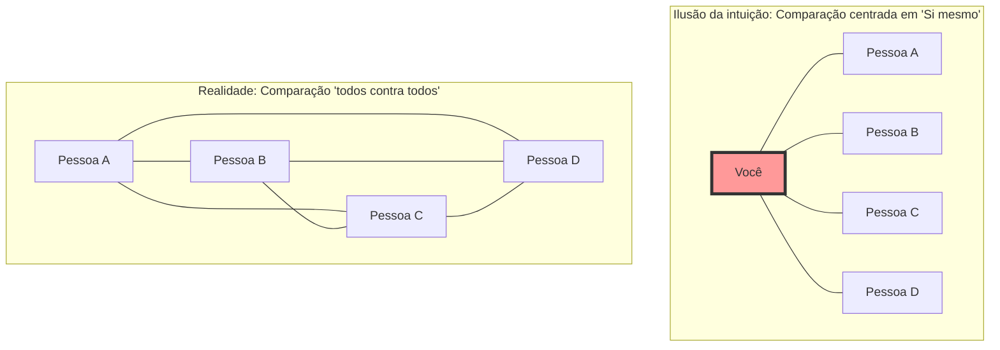
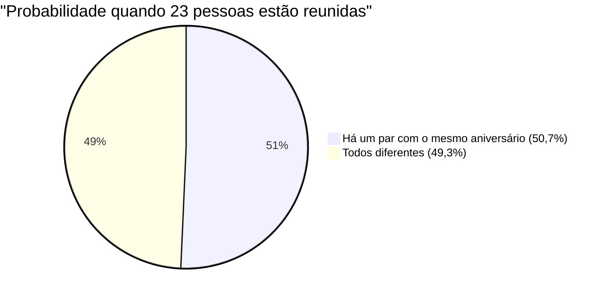

## 1. Teste de Intuição: Quantas pessoas são necessárias para que a probabilidade ultrapasse 50%?

Imagine que as pessoas estão reunidas em uma festa.
Aqui, qual você acha que é o número mínimo de pessoas necessárias para que **"a probabilidade de haver pelo menos um par de pessoas com exatamente o mesmo aniversário (mês e dia) no local seja superior a 50%"**? (*Excluindo anos bissextos e assumindo que um ano tem 365 dias, e que todos os aniversários são igualmente prováveis*).

A intuição humana tende a calcular da seguinte forma:
"Um ano tem 365 dias. Se formos colocar pessoas aleatoriamente nessas 365 vagas, deve ser necessário pelo menos cerca de 180 pessoas para que haja uma sobreposição. Mesmo estimando por baixo, a probabilidade não seria metade se não houvesse pelo menos 50 a 60 pessoas, certo?"

No entanto, a resposta correta obtida pela matemática é de apenas **"23 pessoas"**.
Em uma turma de escola (cerca de 30 a 40 alunos), a probabilidade de haver uma dupla com o mesmo aniversário salta para cerca de 70% a 89%. Com 50 pessoas, essa probabilidade chega a 97%, chegando a um estado onde "é mais raro não haver pessoas com o mesmo aniversário".

Por que a nossa intuição se desvia tanto das probabilidades reais?

---

## 2. A razão pela qual a intuição falha: A diferença entre "eu e alguém" e "alguém e alguém"

O principal motivo pelo qual a intuição erra neste problema é que, inconscientemente, pensamos na **"probabilidade de haver alguém com o mesmo aniversário que uma pessoa específica (por exemplo, você mesmo)"**.

Se você entrar no salão e pensar "Será que tem alguém aqui com o mesmo aniversário que o meu?", a probabilidade de haver alguém entre 23 pessoas com o mesmo aniversário que você é de apenas **cerca de 6,1%**. (Para que essa probabilidade ultrapasse 50%, seriam necessárias impressionantes 253 pessoas).

No entanto, o Paradoxo do Aniversário não pergunta sobre o par "eu e alguém". Basta que haja uma coincidência em pelo menos um par dentre **"todas as combinações possíveis entre todas as pessoas presentes (Pessoa A e Pessoa B, Pessoa B e Pessoa C, Pessoa C e Pessoa A...)"**.

Mesmo em um grupo de apenas 4 pessoas, há 3 comparações centradas em "si mesmo", mas se compararmos todos com todos, existem 6 formas (${}_4 C_2 = 6$).
Quando o número de pessoas aumenta para 23, as combinações de pares aumentam de forma explosiva para surpreendentes **253 formas** (${}_{23} C_2$).
Com 253 pares, não começa a parecer razoável que pelo menos um deles acerte a probabilidade de "1 em 365"?

---

## 3. Prova Matemática: Uma solução elegante usando o evento complementar

Calcular diretamente "a probabilidade de pelo menos um par ter o mesmo aniversário" é muito difícil (porque há muitos padrões: um único par igual, dois pares iguais, três pessoas com o mesmo aniversário, etc.).
Portanto, usaremos a técnica básica da teoria das probabilidades, o **"evento complementar"**.

O evento complementar é "a probabilidade de algo não acontecer".
Ou seja, calculamos a **"probabilidade de que os aniversários de todos sejam diferentes (nenhuma coincidência)"** e subtraímos isso de 100% (1) para obter a probabilidade desejada.

$$ P(\text{pelo menos 2 pessoas com o mesmo aniversário}) = 1 - P(\text{todos com aniversários diferentes}) $$

Então, vamos imaginar as pessoas entrando no local uma a uma e calcular.

1. **1ª pessoa**: Não há preocupação de coincidir com ninguém. A probabilidade é $\frac{365}{365}$.
2. **2ª pessoa**: Deve ter um aniversário diferente da 1ª pessoa. Qualquer um dos 364 dias restantes é seguro. A probabilidade é $\frac{364}{365}$.
3. **3ª pessoa**: Deve ter um aniversário diferente das duas primeiras pessoas. Qualquer um dos 363 dias restantes é seguro. A probabilidade é $\frac{363}{365}$.

Multiplicando isso até a $n$-ésima pessoa, obtemos o termo geral da probabilidade $P(n)'$ de que todos os aniversários sejam diferentes.

$$ P(n)' = \frac{365}{365} \times \frac{364}{365} \times \frac{363}{365} \times \dots \times \frac{365 - (n - 1)}{365} $$

$$ P(n)' = \prod_{k=1}^{n-1} \left(1 - \frac{k}{365}\right) $$

Portanto, a "probabilidade $P(n)$ de que pelo menos duas pessoas tenham o mesmo aniversário" que procuramos é:

$$ P(n) = 1 - \prod_{k=1}^{n-1} \left(1 - \frac{k}{365}\right) $$

Ao substituir o número de pessoas $n$ nesta fórmula, podemos ver que a probabilidade aumenta a uma velocidade surpreendente.

- Quando $n = 10$, a probabilidade é de cerca de **11,7%**
- Quando $n = 23$, a probabilidade é de cerca de **50,7%** (Aqui ultrapassa os 50%!)
- Quando $n = 40$, a probabilidade é de cerca de **89,1%**
- Quando $n = 70$, a probabilidade é de cerca de **99,9%**

---

## 4. Cálculo aproximado por expansão de Taylor

Como calcular multiplicações 23 vezes à mão é trabalhoso, vamos tentar entender isso de forma mais intuitiva usando uma fórmula de aproximação matemática.

Considere a expansão de Taylor da função exponencial $e^{-x}$. Quando $x$ é suficientemente pequeno, a seguinte aproximação é válida:
$$ e^{-x} \approx 1 - x $$

Aplicando isso a cada termo $\left(1 - \frac{k}{365}\right)$ anterior,
$$ 1 - \frac{k}{365} \approx e^{-\frac{k}{365}} $$

Multiplicando tudo isso (o que se torna uma adição pelas leis dos expoentes),
$$ P(n)' \approx e^{-\frac{1}{365}} \times e^{-\frac{2}{365}} \times \dots \times e^{-\frac{n-1}{365}} $$
$$ P(n)' \approx \exp\left(-\sum_{k=1}^{n-1} \frac{k}{365}\right) $$

Como a soma de 1 a $n-1$ é $\frac{n(n-1)}{2}$ (ou seja, o número de combinações ${}_n C_2$),
$$ P(n)' \approx \exp\left(-\frac{n(n-1)}{2 \times 365}\right) $$

Nesta fórmula, encontramos o $n$ quando a probabilidade é 50% ($0.5$).
$$ 0.5 = e^{-\frac{n(n-1)}{730}} $$
Tomamos o logaritmo natural de ambos os lados ($\ln 0.5 \approx -0.693$).
$$ -0.693 = -\frac{n(n-1)}{730} $$
$$ n(n-1) = 0.693 \times 730 \approx 505.89 $$

Aproximando $n^2 \approx 506$, temos $n = \sqrt{506} \approx 22.49$
A resposta **$n \approx 23$** foi brilhantemente derivada!

---

## 5. Aplicação no cotidiano e "Colisão de Hash"

Este paradoxo não é apenas um assunto para festas. Ele desempenha um papel extremamente importante na **teoria da criptografia e segurança da informação** que sustenta a sociedade de TI moderna.

Em sistemas de computador, usamos um mecanismo chamado "função hash" para confirmar rapidamente a identidade de senhas ou arquivos. Uma função hash retorna uma string aleatória de comprimento fixo (valor hash) não importa qual dado seja inserido.
No entanto, o fenômeno em que esses valores hash coincidentemente se tornam iguais é chamado de **"Colisão de Hash (Hash Collision)"**.

As colisões de hash ocorrem exatamente pelo mesmo princípio do Paradoxo do Aniversário.
Ao contrário da intuição humana que diz "Como os tipos de valores hash são um número astronômico, as colisões raramente ocorrerão", é mais fácil do que se imagina para um invasor gerar uma grande quantidade de dados aleatoriamente e encontrar "um par em que algo coincida com algo (como aniversários repetidos)".

Isso é chamado de **"Ataque do Aniversário (Birthday Attack)"**.
Os engenheiros que projetam sistemas de segurança assumem esse fato matemático de que "as colisões ocorrem muito mais rápido do que a intuição sugere", e definem o comprimento do valor hash para ser muito longo para garantir a segurança.

## 6. Conclusão: Os limites da intuição humana

O Paradoxo do Aniversário é o exemplo perfeito para mostrar **o quão frágil é a intuição humana em relação ao "crescimento exponencial" e à "explosão combinatória"**.

Somos bons com aumentos lineares (aditivos), mas não conseguimos simular em nossos cérebros fenômenos em que o número de pares aumenta explosivamente no ritmo de $n^2$.
Por trás da intuição de que "23 é um número muito pequeno em comparação com o grande número 365", existe uma complexa teia de **"253 fios invisíveis (pares)"** criados por 23 pessoas.

Da próxima vez que você for a um lugar onde as pessoas estão reunidas, tente imaginar não apenas o "número de pessoas" visíveis, mas os inumeráveis "fios de combinações" que existem entre elas. A sua forma de ver o mundo deve mudar um pouco matematicamente.
