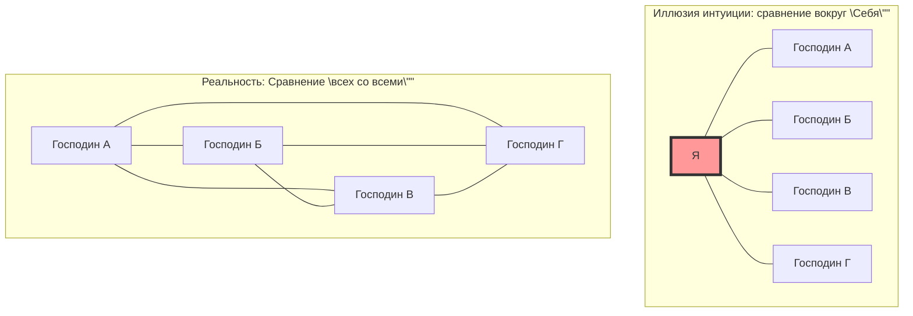
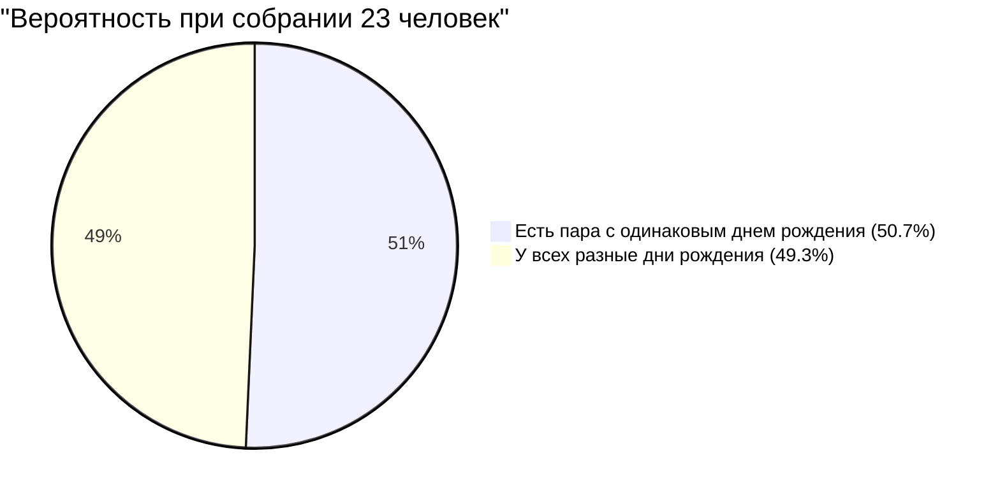

## 1. Проверка интуиции: Сколько человек нужно, чтобы вероятность превысила 50%?

Люди собираются на вечеринке.
Как вы думаете, какое минимальное количество людей необходимо для того, чтобы **"вероятность того, что в зале найдется хотя бы одна пара людей с абсолютно одинаковыми днями рождения (месяц и день), превысила 50%"**? (Предположим, что високосные годы исключаются, в году 365 дней, и все дни рождения равновероятны).

Человеческая интуиция склонна рассчитывать так:
"В году целых 365 дней. Поскольку мы помещаем людей в 365 ячеек, где они могут совпасть, должно потребоваться хотя бы около 180 человек. Как минимум, разве не нужно 50-60 человек, чтобы вероятность составила половину?"

Однако математически выведенный правильный ответ — всего лишь **"23 человека"**.
В школьном классе (около 30-40 человек) вероятность наличия пары с одинаковыми днями рождения возрастает примерно до 70-89%. Если людей 50, эта вероятность достигает 97%, и возникает ситуация, когда "скорее необычно, если нет людей с одинаковыми днями рождения".

Почему же наша интуиция настолько расходится с реальной вероятностью?

---

## 2. Причина ошибки интуиции: Разница между "Я и кто-то" и "Кто-то и кто-то"

Главная причина, по которой интуиция ошибается в этой задаче, заключается в том, что мы бессознательно думаем о **"вероятности того, что найдется кто-то с тем же днем рождения, что и у определенного человека (например, вас)"**.

Если вы входите в зал и ищете: "Есть ли здесь кто-то с таким же днем рождения, как у меня?", вероятность того, что среди 23 человек найдется кто-то с таким же днем рождения, составляет всего **около 6,1%**. (Чтобы эта вероятность превысила 50%, требуется целых 253 человека).

Однако парадокс дней рождения спрашивает не о паре "Я и кто-то". Достаточно, чтобы совпала хотя бы одна пара среди **"всевозможных комбинаций всех людей в зале друг с другом (господин А и господин Б, господин Б и господин В, господин В и господин А...)"**.

Даже в группе из 4 человек существует 3 варианта сравнения вокруг "себя", но сравнение всех со всеми дает 6 вариантов (${}_4 C_2 = 6$).
Когда количество людей увеличивается до 23, количество возможных комбинаций пар взрывообразно возрастает до **253** (${}_{23} C_2$).
Если у нас 253 пары, разве не кажется возможным, что хотя бы одна из них "вытянет" вероятность "1 к 365"?

---

## 3. Математическое доказательство: Элегантное решение через противоположное событие

Прямой расчет "вероятности того, что хотя бы у одной пары совпадают дни рождения" очень сложен (потому что слишком много вариантов: если совпадает только 1 пара, если совпадают 2 пары, если 3 человека имеют одинаковый день рождения... и т.д.).
Поэтому мы воспользуемся базовым приемом теории вероятностей — **"противоположным событием"**.

Противоположное событие означает "вероятность того, что событие не произойдет".
Другими словами, мы вычисляем **"вероятность того, что дни рождения всех людей разные (ни одно совпадение)"**, и вычитаем это из 100% (из 1), чтобы получить искомую вероятность.

$$ P(\text{хотя бы двое совпадают}) = 1 - P(\text{все дни рождения разные}) $$

Давайте представим людей, входящих в зал по очереди, и рассчитаем.

1. **1-й человек**: Нет риска совпадения с кем-либо. Вероятность равна $\frac{365}{365}$.
2. **2-й человек**: День рождения должен отличаться от первого человека. Любой из оставшихся 364 дней подходит. Вероятность равна $\frac{364}{365}$.
3. **3-й человек**: День рождения должен отличаться от предыдущих двух. Любой из оставшихся 363 дней подходит. Вероятность равна $\frac{363}{365}$.

Умножая это до $n$-го человека, мы получаем общий член для вероятности того, что дни рождения всех разные, $P(n)'$.

$$ P(n)' = \frac{365}{365} \times \frac{364}{365} \times \frac{363}{365} \times \dots \times \frac{365 - (n - 1)}{365} $$

$$ P(n)' = \prod_{k=1}^{n-1} \left(1 - \frac{k}{365}\right) $$

Следовательно, искомая "вероятность того, что хотя бы два человека имеют одинаковый день рождения $P(n)$" выглядит так:

$$ P(n) = 1 - \prod_{k=1}^{n-1} \left(1 - \frac{k}{365}\right) $$

Подставляя количество людей $n$ в эту формулу, мы видим, что вероятность возрастает с поразительной скоростью.

- При $n = 10$ вероятность составляет около **11,7%**
- При $n = 23$ вероятность составляет около **50,7%** (Здесь она превышает 50%!)
- При $n = 40$ вероятность составляет около **89,1%**
- При $n = 70$ вероятность составляет около **99,9%**

---

## 4. Приближенное вычисление с помощью ряда Тейлора

Выполнять умножение 23 раза вручную тяжело, поэтому давайте используем математическую формулу приближения для более интуитивного понимания.

Рассмотрим разложение в ряд Тейлора экспоненциальной функции $e^{-x}$. Когда $x$ достаточно мало, справедливо следующее приближение:
$$ e^{-x} \approx 1 - x $$

Применяя это к каждому члену $\left(1 - \frac{k}{365}\right)$ из предыдущего расчета:
$$ 1 - \frac{k}{365} \approx e^{-\frac{k}{365}} $$

Перемножая все это (согласно правилам степеней, это становится сложением), получаем:
$$ P(n)' \approx e^{-\frac{1}{365}} \times e^{-\frac{2}{365}} \times \dots \times e^{-\frac{n-1}{365}} $$
$$ P(n)' \approx \exp\left(-\sum_{k=1}^{n-1} \frac{k}{365}\right) $$

Сумма от 1 до $n-1$ равна $\frac{n(n-1)}{2}$ (то есть число сочетаний ${}_n C_2$), поэтому:
$$ P(n)' \approx \exp\left(-\frac{n(n-1)}{2 \times 365}\right) $$

В этой формуле найдем $n$, при котором вероятность равна 50% ($0.5$).
$$ 0.5 = e^{-\frac{n(n-1)}{730}} $$
Возьмем натуральный логарифм от обеих частей ($\ln 0.5 \approx -0.693$).
$$ -0.693 = -\frac{n(n-1)}{730} $$
$$ n(n-1) = 0.693 \times 730 \approx 505.89 $$

Аппроксимируя как $n^2 \approx 506$, получаем $n = \sqrt{506} \approx 22.49$
Блестяще выведен ответ **$n \approx 23$**!

---

## 5. Применение в повседневной жизни и "Коллизия хеш-функций"

Этот парадокс — не просто тема для застольной беседы. Он играет чрезвычайно важную роль в **теории криптографии и информационной безопасности**, на которых держится современное IT-общество.

В компьютерных системах используется механизм под названием "хеш-функция" для быстрой проверки идентичности паролей или файлов. Хеш-функция, независимо от того, какие данные в нее введены, возвращает случайную строку фиксированной длины (хеш-значение).
Однако явление, при котором эти хеш-значения случайно совпадают, называется **"коллизией хеш-функции" (Hash Collision)**.

Коллизии хеш-функций происходят точно по тому же принципу, что и парадокс дней рождения.
Вопреки человеческой интуиции, которая говорит: "Поскольку количество видов хеш-значений астрономически велико, коллизии будут происходить крайне редко", для злоумышленника генерировать случайным образом огромное количество данных и находить "пару, где одно совпадает с другим (совпадающие дни рождения)", намного проще, чем кажется.

Это называется **"Атака «Дни рождения»" (Birthday Attack)**.
Инженеры, проектирующие системы безопасности, принимают за основу тот математический факт, что "коллизии происходят намного быстрее, чем подсказывает интуиция", и устанавливают длину хеш-значения очень большой, чтобы гарантировать безопасность.

## 6. Заключение: Границы человеческой интуиции

Парадокс дней рождения — идеальный пример того, **насколько уязвима человеческая интуиция к "экспоненциальному росту" и "комбинаторным взрывам"**.

Мы сильны в восприятии линейного (аддитивного) роста, но не можем смоделировать в уме явление, когда количество пар взрывообразно увеличивается в темпе $n^2$.
За интуицией "число 23 слишком мало по сравнению с большим числом 365" скрываются **"253 невидимые нити (пары)"**, сплетенные 23 людьми.

В следующий раз, когда вы окажетесь в месте скопления людей, попробуйте представить не только видимое "количество людей", но и бесчисленные "нити комбинаций", существующие между ними. Ваше видение мира должно немного измениться с математической точки зрения.
