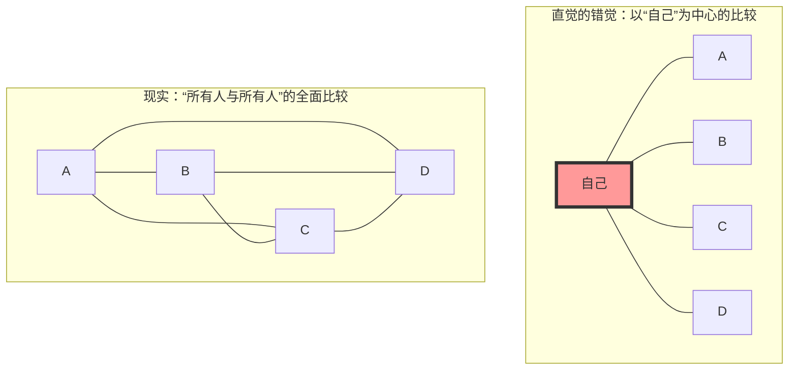
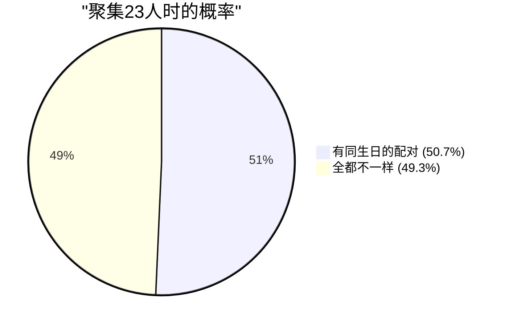

## 1. 直觉测试：聚集多少人概率才会超过50%？

在一个派对会场聚集了许多人。
在这里，您认为要使**“会场中至少存在一对生日（月和日）完全相同的两人的概率超过50%”**，最少需要多少人？（※排除闰年，一年按365天计算，并假设每个生日的概率相等）。

人类的直觉很容易这样计算：
“一年有365天之多。把人一个个放进365个框里直到重复，至少需要180人左右吧。即使保守估计，没有50到60人，概率也不会达到一半吧？”

然而，数学得出的正确答案仅为**“23人”**。
如果是学校的一个班级（约30至40人），存在同生日配对的概率甚至会飙升到约70%至89%。如果有50人，该概率将达到97%，变成“没有人生日相同反而更罕见”的状态。

为什么我们的直觉与现实概率会产生如此巨大的偏差呢？

---

## 2. 直觉出错的原因：“我和某人”与“某人和某人”的区别

在这个问题上直觉出错的最大原因是，我们在潜意识里考虑的是**“与特定的一人（例如自己）生日相同的概率”**。

当您进入会场并寻找“有没有人和我生日相同？”时，在23人中与您生日相同的人存在的概率仅有**约6.1%**。（要使这个概率超过50%，实际上需要多达253人）。

但是，生日悖论所问的并不是“我和某人”的配对。而是**“在场所有人之间的所有可能组合（A与B，B与C，C与A……）”**中，只要有一对匹配即可。

即使是只有4人的小组，以“自己”为中心的比较只有3种情况，但所有人之间的比较则存在6种情况（${}_4 C_2 = 6$）。
当人数增加到23人时，配对的组合数竟然会爆炸性地增加到**253种**（${}_{23} C_2$）。
既然有253对组合，其中有一对抽中“365分之一”的概率，是不是感觉也就不奇怪了？

---

## 3. 数学证明：使用对立事件的巧妙解法

正面计算“至少有一对同生日的概率”非常困难（因为模式太多，例如只有一对相同，有两对相同，有三人同生日等等）。
因此，我们使用概率论的基本技巧——**“对立事件”**。

对立事件是指“不发生的概率”。
也就是说，计算**“所有人的生日都不一样（没有一对重复）的概率”**，然后用100%（1）减去它，就可以得出所求的概率。

$$ P(\text{至少有2人同生日}) = 1 - P(\text{全员生日均不同}) $$

那么，让我们想象人们依次进入会场来进行计算吧。

1. **第1人**：不用担心和任何人重复。概率是 $\frac{365}{365}$。
2. **第2人**：必须和第1人生日不同。剩下的364天都是安全的。概率是 $\frac{364}{365}$。
3. **第3人**：必须和前2人生日不同。剩下的363天都是安全的。概率是 $\frac{363}{365}$。

将这些相乘直到第 $n$ 人，就可以得出全员生日都不相同的概率 $P(n)'$ 的一般项。

$$ P(n)' = \frac{365}{365} \times \frac{364}{365} \times \frac{363}{365} \times \dots \times \frac{365 - (n - 1)}{365} $$

$$ P(n)' = \prod_{k=1}^{n-1} \left(1 - \frac{k}{365}\right) $$

因此，所求的“至少有2人同生日的概率 $P(n)$”如下所示。

$$ P(n) = 1 - \prod_{k=1}^{n-1} \left(1 - \frac{k}{365}\right) $$

将人数 $n$ 代入这个公式，你会发现概率以惊人的速度上升。

- $n = 10$ 时，概率约 **11.7%**
- $n = 23$ 时，概率约 **50.7%**（在此超过50%！）
- $n = 40$ 时，概率约 **89.1%**
- $n = 70$ 时，概率约 **99.9%**

---

## 4. 使用泰勒展开的近似计算

手动计算23次乘法很麻烦，所以我们用数学近似公式来更直观地理解一下。

考虑指数函数 $e^{-x}$ 的泰勒展开。当 $x$ 足够小时，以下近似成立。
$$ e^{-x} \approx 1 - x $$

将其应用到刚才的每一项 $\left(1 - \frac{k}{365}\right)$ 中，
$$ 1 - \frac{k}{365} \approx e^{-\frac{k}{365}} $$

将它们全部相乘（根据指数法则变成加法），
$$ P(n)' \approx e^{-\frac{1}{365}} \times e^{-\frac{2}{365}} \times \dots \times e^{-\frac{n-1}{365}} $$
$$ P(n)' \approx \exp\left(-\sum_{k=1}^{n-1} \frac{k}{365}\right) $$

从1到 $n-1$ 的和为 $\frac{n(n-1)}{2}$（即组合数 ${}_n C_2$），所以，
$$ P(n)' \approx \exp\left(-\frac{n(n-1)}{2 \times 365}\right) $$

在这个公式中，我们求当概率为 50% ($0.5$) 时的 $n$。
$$ 0.5 = e^{-\frac{n(n-1)}{730}} $$
对两边取自然对数（$\ln 0.5 \approx -0.693$）。
$$ -0.693 = -\frac{n(n-1)}{730} $$
$$ n(n-1) = 0.693 \times 730 \approx 505.89 $$

如果近似为 $n^2 \approx 506$，则 $n = \sqrt{506} \approx 22.49$
非常漂亮地得出了 **$n \approx 23$** 这个答案！

---

## 5. 日常生活中的应用与“哈希碰撞”

这个悖论不仅仅是宴会上的谈资。在支撑现代IT社会的**密码学和信息安全**中，它扮演着极其重要的角色。

在计算机系统中，为了快速确认密码或文件的同一性，会使用名为“哈希函数”的机制。无论输入什么数据，哈希函数都会返回固定长度的随机字符串（哈希值）。
然而，这种哈希值偶然变相同的现象被称为**“哈希碰撞（Hash Collision）”**。

哈希碰撞正是根据生日悖论的原理发生的。
与人类“哈希值的种类是天文数字，所以几乎不会发生碰撞吧”的直觉相反，攻击者随机生成大量数据来寻找“某一个和某一个匹配（生日重复）的组合”这件事，比想象中要容易得多。

这被称为**“生日攻击（Birthday Attack）”**。
设计安全系统的工程师，正是以这种“碰撞发生的速度比直觉快得多”的数学事实为前提，将哈希值的长度设置得非常长，以确保安全性。

## 6. 总结：人类直觉的局限性

生日悖论是一个完美的例子，证明了**人类的直觉在面对“指数级增长”和“组合爆炸”时是多么脆弱**。

我们对线性的（加法的）增长很敏感，却无法在脑海中模拟配对数量以 $n^2$ 的速度爆炸性增长的现象。
在“与365这个大数字相比，23这个数字太小了”的直觉背后，其实交织着23人所构成的**“253条看不见的线（配对）”**。

下次去人群聚集的地方时，不仅要看肉眼可见的“人数”，请试着想象存在于他们之间无数的“组合之线”。你看待世界的方式应该会发生一点点数学上的改变。
