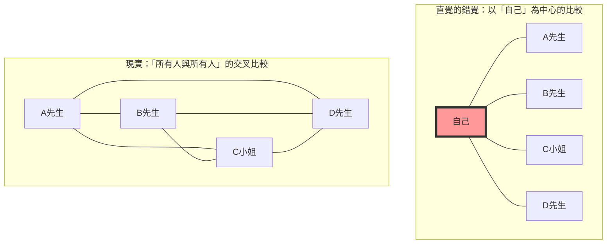
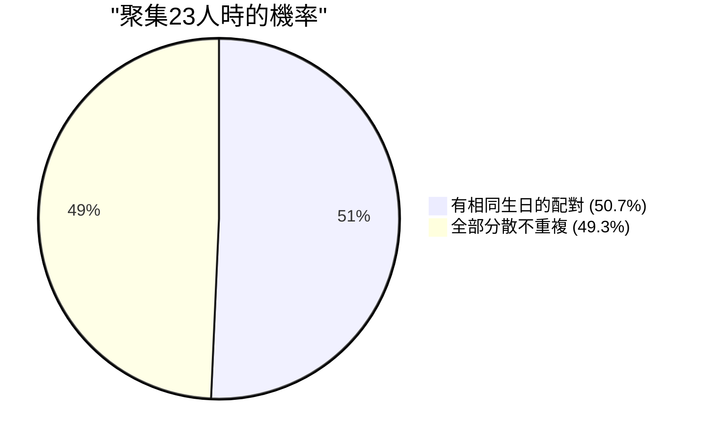

## 1. 直覺測試：聚集多少人機率才會超過50%？

某個派對會場聚集了一群人。
這時候，您認為要讓**「會場中，至少有一組生日（月和日）完全相同的兩人的機率超過50%」**，最少需要多少人？（※排除閏年，一年以365天計算，並假設每天作為生日的機率相等）。

人類的直覺往往會這樣計算：
「一年有365天這麼多。把人隨機放入365個格子中，如果要發生重複，至少也需要180人左右吧。保守估計，沒有個50到60人，機率應該不到一半吧？」

然而，數學算出的正確答案，竟然只有**「23人」**。
如果是一個學校班級（約30人到40人），有生日相同的配對存在的機率，會暴增到約70%到89%。如果有50人，這個機率更會高達97%，變成「沒有人生日相同反而比較稀奇」的狀態。

為什麼我們的直覺與現實的機率會有如此巨大的落差呢？

---

## 2. 直覺出錯的原因：「我與某人」和「某人與某人」的差異

這個問題中，直覺會出錯的最大原因，是因為我們會在無意識中思考**「有人的生日和特定一人（例如自己）相同的機率」**。

當您走進會場，想尋找「有沒有人的生日和我一樣呢？」時，在23人之中有與您生日相同的人的機率，僅僅只有**約6.1%**。（要讓這個機率超過50%，實際上需要多達253人）。

但是，生日悖論所問的，並不是「我與某人」的配對。而是**「會場中所有人的所有可能組合（A先生和B先生、B先生和C小姐、C小姐和A先生……）」**中，只要有一組一致就可以了。

即便只有4人的小組，以「自己」為中心的比較只有3種，但所有人互相比較的話則有6種（${}_4 C_2 = 6$）。
當人數增加到23人時，配對的組合更是爆炸性地增加到**253種**（${}_{23} C_2$）。
既然有高達253組配對，其中有一組抽中「365分之1」的機率，是不是就讓人覺得不那麼不可思議了呢？

---

## 3. 數學的證明：使用餘事件的巧妙解法

要正面計算「至少有一組生日相同的機率」非常困難（因為要考慮只有1組相同、有2組相同、有3個人同一天生日等各種情況，模式太多了）。
因此，我們要使用機率論的基本技巧**「餘事件（Complementary Event）」**。

餘事件是指「不會發生的機率」。
也就是說，只要計算出**「所有人的生日都不一樣（連一組都沒有重複）的機率」**，再用100%（即1）去減，就能得出我們想求的機率。

$$ P(\text{至少有2人相同}) = 1 - P(\text{所有人生日皆不同}) $$

那麼，我們想像人們依序進入會場來計算看看。

1. **第1人**：不用擔心跟任何人重複。機率是 $\frac{365}{365}$。
2. **第2人**：生日必須和第1人不同。只要在剩下的364天就安全。機率是 $\frac{364}{365}$。
3. **第3人**：生日必須和前2人不同。只要在剩下的363天就安全。機率是 $\frac{363}{365}$。

將這些機率乘到第 $n$ 人，就能得出所有人的生日都不同的機率 $P(n)'$ 的一般項。

$$ P(n)' = \frac{365}{365} \times \frac{364}{365} \times \frac{363}{365} \times \dots \times \frac{365 - (n - 1)}{365} $$

$$ P(n)' = \prod_{k=1}^{n-1} \left(1 - \frac{k}{365}\right) $$

因此，所求的「至少有2人具有相同生日的機率 $P(n)$」就會變成以下公式。

$$ P(n) = 1 - \prod_{k=1}^{n-1} \left(1 - \frac{k}{365}\right) $$

如果將人數 $n$ 代入這個公式，就會發現機率以驚人的速度上升。

- 當 $n = 10$ 時，機率約為 **11.7%**
- 當 $n = 23$ 時，機率約為 **50.7%** （在這裡超過了50%！）
- 當 $n = 40$ 時，機率約為 **89.1%**
- 當 $n = 70$ 時，機率約為 **99.9%**

---

## 4. 泰勒展開的近似計算

要手動計算23次乘法實在太辛苦了，所以讓我們用數學的近似公式來更直覺地理解。

考慮指數函數 $e^{-x}$ 的泰勒展開式。當 $x$ 夠小時，下列近似式成立。
$$ e^{-x} \approx 1 - x $$

將這個公式應用到剛才的各項 $\left(1 - \frac{k}{365}\right)$，
$$ 1 - \frac{k}{365} \approx e^{-\frac{k}{365}} $$

將它們全部相乘（根據指數定律會變成相加），
$$ P(n)' \approx e^{-\frac{1}{365}} \times e^{-\frac{2}{365}} \times \dots \times e^{-\frac{n-1}{365}} $$
$$ P(n)' \approx \exp\left(-\sum_{k=1}^{n-1} \frac{k}{365}\right) $$

從1到 $n-1$ 的總和是 $\frac{n(n-1)}{2}$ （也就是組合數 ${}_n C_2$），所以
$$ P(n)' \approx \exp\left(-\frac{n(n-1)}{2 \times 365}\right) $$

在這個公式中，我們要求當機率為 50% ($0.5$) 時的 $n$。
$$ 0.5 = e^{-\frac{n(n-1)}{730}} $$
將兩邊取自然對數（$\ln 0.5 \approx -0.693$）。
$$ -0.693 = -\frac{n(n-1)}{730} $$
$$ n(n-1) = 0.693 \times 730 \approx 505.89 $$

如果近似為 $n^2 \approx 506$，則 $n = \sqrt{506} \approx 22.49$
完美地推導出了 **$n \approx 23$** 這個答案！

---

## 5. 日常生活的應用與「雜湊碰撞」

這個悖論並不只是宴會上的話題。在支撐現代IT社會的**密碼學與資訊安全**中，它扮演著極為重要的角色。

在電腦系統中，為了快速確認密碼或檔案的同一性，我們會使用一種稱為「雜湊函數（Hash Function）」的機制。雜湊函數無論輸入什麼資料，都會回傳固定長度的隨機字串（雜湊值）。
然而，這種雜湊值偶然變得相同的現象，就被稱為**「雜湊碰撞（Hash Collision）」**。

雜湊碰撞正是以和生日悖論相同的原理發生。
違反了人類直覺中「雜湊值的種類是天文數字，所以應該幾乎不會發生碰撞」的想法，攻擊者隨機產生大量資料來找出「某個和某個一致（生日重複）的配對」，其實比想像中容易得多。

這被稱為**「生日攻擊（Birthday Attack）」**。
設計安全系統的工程師們，就是以這個「碰撞發生的速度遠比直覺更快」的數學事實為前提，將雜湊值的長度設定得非常長，藉此確保安全性。

## 6. 總結：人類直覺的極限

生日悖論是一個完美的例子，顯示了**人類的直覺對於「指數性增長」或「組合的爆炸」是多麼地脆弱**。

我們雖然擅長處理線性（加法性）的增長，但卻無法在腦內模擬配對數量以 $n^2$ 的速度爆炸性增加的現象。
在「與365這個大數字相比，23這個數字太小了」的直覺背後，其實交織著由23人所創造出的**「253條看不見的線（配對）」**。

下次當您前往人群聚集的地方時，除了眼睛看得到的「人數」，也不妨想像一下存在於他們之間無數的「組合的線」。您看世界的方式，應該會變得稍微有數學味一點。
