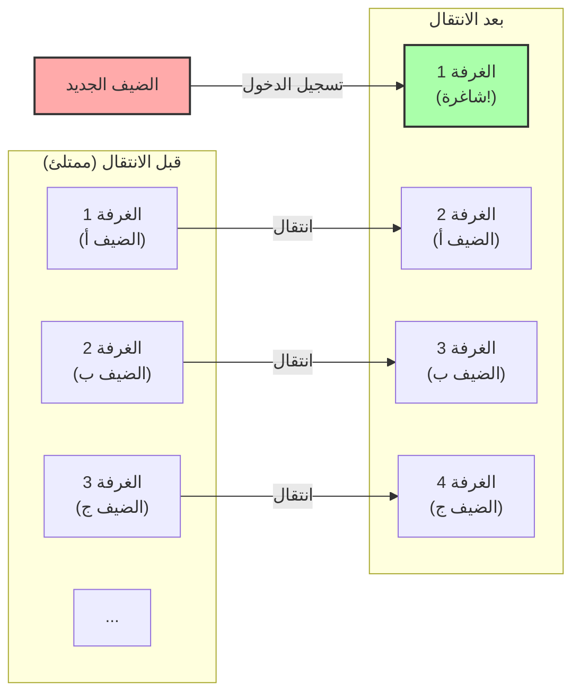
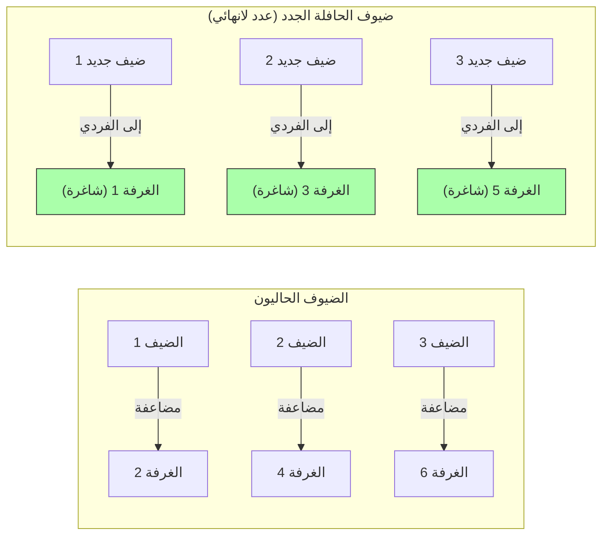

## 1. مرحباً بكم في الفندق المطلق

ابتكر عالم الرياضيات الألماني العظيم ديفيد هيلبرت تجربة فكرية مثيرة للاهتمام لشرح مدى بعد مفهوم "اللانهاية" عن الحدس البشري، وهي كالتالي.

تخيل ذلك. في مكان ما في الكون يوجد فندق يُدعى **"فندق هيلبرت اللانهائي"**.
يحتوي هذا الفندق على **عدد لانهائي** من الغرف المرقمة: الغرفة 1، الغرفة 2، الغرفة 3، وهكذا.

في أحد الأيام، أقيم حدث ضخم في جميع أنحاء الكون، وامتلأت جميع الغرف في هذا الفندق اللانهائي، وأصبح الفندق **"ممتلئاً بالكامل"**.
في تلك اللحظة، وصل مسافر منهك وسأل موظف الاستقبال: "هل يمكنكم توفير غرفة واحدة لي؟"

لو كان فندقاً عادياً، لكان الجواب الوحيد: "نأسف، الفندق ممتلئ".
لكن هذا هو الفندق اللانهائي. ابتسم المدير وقال: "بالتأكيد. سنقوم بتجهيز غرفتك على الفور."
الفندق ممتلئ، فكيف سيتمكن من استيعاب ضيف جديد؟

---

## 2. الحالة 1: كيف تستضيف ضيفاً جديداً واحداً

أعلن المدير عبر نظام البث الداخلي لجميع الضيوف المقيمين بالفعل في الفندق ما يلي:

**"أعزائي الضيوف، يرجى الانتقال إلى الغرفة التي يزيد رقمها عن رقم غرفتكم الحالية بـ 'زائد 1'."**

فماذا سيحدث إذن؟
- سينتقل ضيف الغرفة 1 إلى الغرفة 2.
- سينتقل ضيف الغرفة 2 إلى الغرفة 3.
- سينتقل ضيف الغرفة 3 إلى الغرفة 4.
- سينتقل ضيف الغرفة $n$ إلى الغرفة $n+1$.

نظراً لأن الغرف لانهائية، فلن يحدث أبداً أن "يُطرد ضيف الغرفة الأخيرة". سيتمكن الجميع من الانتقال بأمان إلى الغرفة المجاورة.
وبذلك وبكل براعة، **أصبحت الغرفة 1 شاغرة.** وتمكن المسافر الجديد من الإقامة في الغرفة 1 بنجاح.

في عالم اللانهاية، تتحقق المعادلة $\infty + 1 = \infty$.
حتى لو أخذت "واحداً" من "الكل (اللانهاية)"، فإن الحجم الكلي لا يتغير.

---

## 3. الحالة 2: كيف تستضيف عدداً لانهائياً من الضيوف الجدد

حسناً، في اليوم التالي، عاد الفندق ليكون ممتلئاً بالكامل.
ولكن هذه المرة، وصلت **حافلة لانهائية تحمل "عدداً لانهائياً من الركاب"**.
نزل الركاب من الحافلة وتوجهوا إلى الاستقبال مطالبين: "جهزوا غرفاً لنا جميعاً!"

إذا طلبنا منهم الانتقال بـ "زائد 1" كما حدث بالأمس، فسيستغرق الأمر وقتاً أبدياً.
لكن المدير لم يصب بالذعر. وقام بالبث عبر نظام الإذاعة الداخلية مرة أخرى.

**"أعزائي الضيوف، يرجى الانتقال إلى الغرفة التي يساوي رقمها 'ضعف' رقم غرفتكم الحالية."**

فماذا سيحدث؟
- ضيف الغرفة 1 سينتقل إلى الغرفة 2.
- ضيف الغرفة 2 سينتقل إلى الغرفة 4.
- ضيف الغرفة 3 سينتقل إلى الغرفة 6.
- ضيف الغرفة $n$ سينتقل إلى الغرفة $2n$.

بفضل هذا الانتقال، أصبح جميع الضيوف اللانهائيين المقيمين بالفعل يستقرون تماماً في **"جميع الغرف ذات الأرقام الزوجية"**.
وبطريقة إعجازية، **أصبحت "جميع الغرف ذات الأرقام الفردية (الغرفة 1، الغرفة 3، الغرفة 5...)" شاغرة بالكامل**!

بما أن الأعداد الفردية هي أيضاً لانهائية، يمكن للمدير توجيه ركاب الحافلة اللانهائية واحداً تلو الآخر بدءاً من الأول إلى الغرفة 1، ثم الغرفة 3، فالغرفة 5، وهكذا... وسيتمكن من استيعابهم جميعاً.

في عالم اللانهاية، تتحقق المعادلة $\infty + \infty = \infty$.
حتى لو أضفت لانهاية إلى لانهاية، فإن الحجم يظل نفس "اللانهاية".

---

## 4. الحالة 3: ماذا لو وصلت عدد لانهائي من الحافلات اللانهائية؟

في اليوم الذي يليه، كان الفندق ممتلئاً بالكامل مرة أخرى.
وفجأة، وصلت **"عدد لانهائي من الحافلات اللانهائية، كل منها يحمل عدداً لانهائياً من الركاب"** واحدة تلو الأخرى.

الحافلة رقم 1 بها عدد لانهائي من الركاب، والحافلة رقم 2 بها عدد لانهائي، والحافلة رقم 3 بها عدد لانهائي... ويستمر هذا لعدد لانهائي من الحافلات.
قد يبدو أن المدير سيصاب بالذعر هذه المرة، لكنه كان عبقرياً في الرياضيات. خطرت له فكرة استخدام "الأعداد الأولية".

أصدر المدير التعليمات التالية:

1. **انتقال الضيوف المقيمين بالفعل في الفندق**
   إذا كان رقم الغرفة الحالية هو $n$، يُطلب منهم الانتقال إلى الغرفة "$2^n$".
   (الغرفة 1 $\rightarrow$ الغرفة 2، الغرفة 2 $\rightarrow$ الغرفة 4، الغرفة 3 $\rightarrow$ الغرفة 8...)
   بذلك تم استيعاب جميع الضيوف الحاليين.

2. **توجيه ركاب الحافلة رقم 1 (عدد لانهائي)**
   إذا كان رقم مقعد الراكب هو $n$، يتم توجيهه إلى الغرفة "$3^n$".
   (الغرفة 3، الغرفة 9، الغرفة 27...)

3. **توجيه ركاب الحافلة رقم 2 (عدد لانهائي)**
   باستخدام العدد الأولي التالي وهو 5، يتم توجيههم إلى الغرفة "$5^n$".
   (الغرفة 5، الغرفة 25، الغرفة 125...)

4. **توجيه ركاب الحافلة رقم $k$ (عدد لانهائي)**
   باستخدام العدد الأولي $k+1$ الذي نرمز له بـ $P$، يتم توجيههم إلى الغرفة "$P^n$".

بفضل المبرهنة الرياضية القوية "وحدانية التحليل إلى العوامل الأولية (كل عدد يمكن تمثيله كحاصل ضرب عوامل أولية بطريقة واحدة فقط)"، فإنه من المستحيل مطلقاً أن تتداخل أرقام الغرف $2^n, 3^n, 5^n, 7^n \dots$ مع أي شخص آخر.

وهكذا، تمكن المدير ببراعة من استيعاب هذا العدد الهائل من الضيوف المتمثل في **"لانهاية $\times$ لانهاية"** داخل فندق لانهائي واحد!

---

## 5. اللانهاية لها "أحجام" مختلفة (مبرهنة كانتور)

ما يعلمنا إياه فندق هيلبرت اللانهائي هو حقيقة أن **"اللانهاية القابلة للعد (التي يمكن عدها بتخصيص أرقام 1، 2، 3...)"، مهما تم جمعها أو ضربها، ستظل دائماً ضمن إطار 'اللانهاية القابلة للعد' وبنفس الحجم**.

لكن عالم الرياضيات جورج كانتور اكتشف حقيقة أكثر رعباً.
يمكن استيعاب "الأعداد الطبيعية" و"الكسور" في هذا الفندق اللانهائي. ولكن، **"إذا جاء ضيوف يمثلون 'الأعداد الحقيقية (جميع الأعداد العشرية بما في ذلك الأعداد غير النسبية)'، فمن المستحيل استيعابهم جميعاً حتى باستخدام هذا الفندق اللانهائي"**.

لقد تم إثبات أن عدد الأعداد الحقيقية هو "لانهاية أكبر (ذات مستوى أعلى)" بشكل جوهري من عدد غرف الفندق اللانهائي (اللانهاية القابلة للعد).
غالباً ما يتم تجميع الأشياء تحت كلمة "لانهاية"، ولكن في الواقع يوجد هيكل هرمي (أصلية) داخل اللانهاية، حيث توجد "لانهاية صغيرة" و"لانهاية كبيرة جداً لا يمكن الوصول إليها أبداً".

---

## 6. الخلاصة: "اللانهاية" التي تدمر الحدس البشري

يصور فندق هيلبرت اللانهائي بوضوح كيف أن "المنطق المحدود" الذي اكتسبناه في حياتنا اليومية لا يصلح في "عالم اللانهاية".

"الكل أكبر من الجزء"
"لا يمكن لأحد الدخول إلى فندق ممتلئ"
"إذا أضفت لانهاية إلى لانهاية، فستصبح أكبر"

كل هذه الحدسيات البديهية يتم دحضها بشكل مذهل.
عالم اللانهاية هو كنز من المفارقات (الحقائق التي تخالف الحدس). بدلاً من الخوف من هذه المفارقات، قام علماء الرياضيات بترويضها بقوة المنطق، وصنفوها، ليصنعوا النظام الجميل المعروف اليوم بنظرية المجموعات.

في المرة القادمة التي يتم فيها رفضك بعبارة "الفندق ممتلئ"، تخيل: "ماذا لو كان هذا الفندق هو فندق هيلبرت اللانهائي؟".
