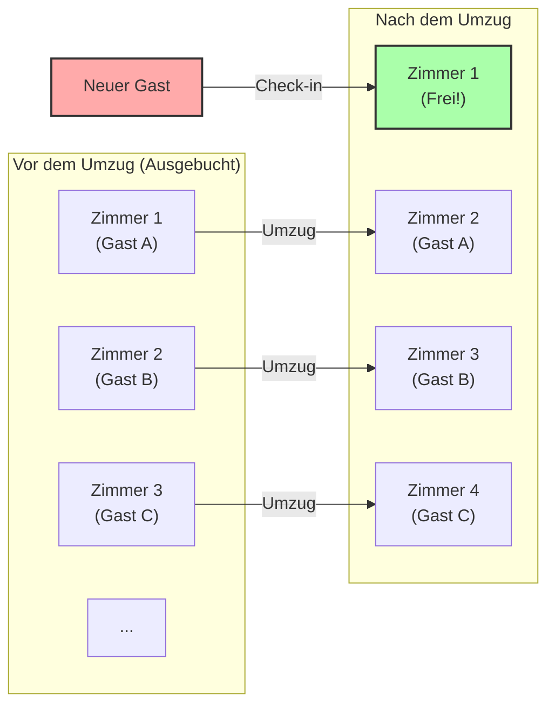
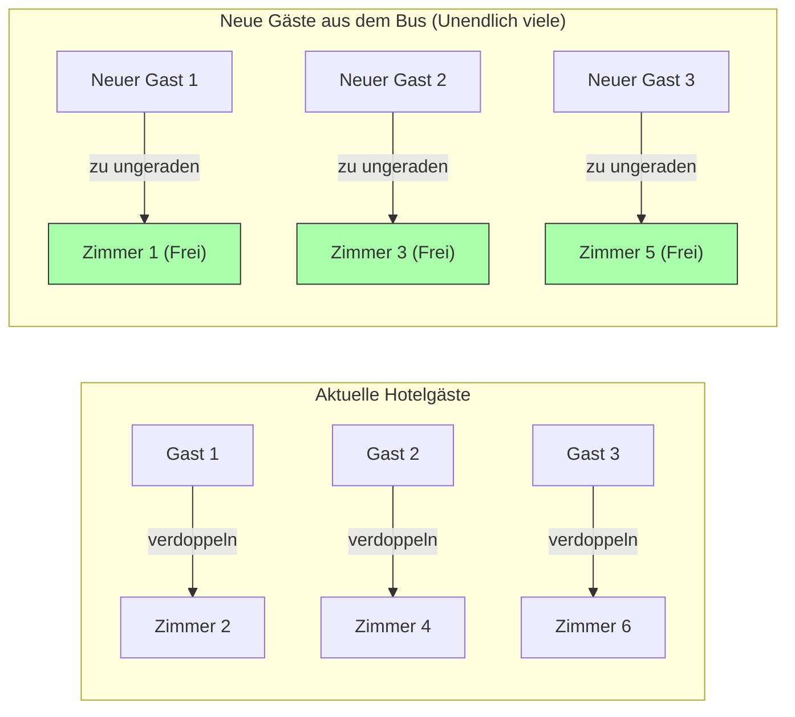

## 1. Willkommen im ultimativen Hotel

Der große deutsche Mathematiker David Hilbert hat folgendes interessantes Gedankenexperiment erfunden, um zu veranschaulichen, wie weit das Konzept der "Unendlichkeit" von der menschlichen Intuition entfernt ist.

Stellen Sie sich vor: Irgendwo im Universum gibt es **"Hilberts unendliches Hotel"**.
In diesem Hotel gibt es **unendlich viele** nummerierte Zimmer, also Zimmer 1, Zimmer 2, Zimmer 3, und so weiter.

Eines Tages gab es ein riesiges Ereignis im gesamten Universum, und dieses unendliche Hotel war völlig **"ausgebucht"**, jedes Zimmer war belegt.
Da kam ein völlig erschöpfter Reisender an und fragte an der Rezeption: "Könnten Sie ein Zimmer für mich freimachen?"

Ein normales Hotel müsste ablehnen: "Es tut uns leid, wir sind ausgebucht."
Aber dies ist ein unendliches Hotel. Der Manager lächelte und sagte: "Natürlich, wir bereiten sofort ein Zimmer für Sie vor."
Wie kann man neue Gäste unterbringen, wenn das Hotel doch voll ist?

---

## 2. Fall 1: Wie man einen einzigen neuen Gast unterbringt

Der Manager machte über die Lautsprecheranlage des Hotels folgende Ansage an alle bereits eingecheckten Gäste:

**"Liebe Gäste, bitte wechseln Sie in das Zimmer mit der Nummer, die sich ergibt, wenn Sie zu Ihrer aktuellen Zimmernummer 'plus 1' addieren."**

Was passiert dann?
- Der Gast in Zimmer 1 zieht in Zimmer 2 um.
- Der Gast in Zimmer 2 zieht in Zimmer 3 um.
- Der Gast in Zimmer 3 zieht in Zimmer 4 um.
- Der Gast in Zimmer $n$ zieht in Zimmer $n+1$ um.

Da es unendlich viele Zimmer gibt, wird der Gast im "letzten Zimmer" nie hinausgeworfen – es gibt kein letztes Zimmer. Jeder kann problemlos in das Zimmer nebenan umziehen.
Und siehe da, **Zimmer 1 ist frei geworden.** Der neue Reisende konnte erfolgreich in Zimmer 1 einziehen.

In der Welt der Unendlichkeit gilt $\infty + 1 = \infty$.
Wenn man "eins" aus der "Gesamtheit (Unendlichkeit)" herausnimmt (bzw. ihr hinzufügt), ändert sich die Größe der Gesamtheit nicht.

---

## 3. Fall 2: Wie man unendlich viele neue Gäste unterbringt

Nun, am nächsten Tag. Das Hotel ist wieder komplett belegt.
Da kommt doch tatsächlich ein **unendlicher Bus** mit **"unendlich vielen Passagieren"** an.
Die Gäste steigen aus dem Bus und drängen an die Rezeption: "Bereiten Sie Zimmer für uns alle vor!"

Wenn wir wie gestern um "plus 1" bitten würden, würde es ewig dauern.
Der Manager gerät jedoch nicht in Panik. Er machte erneut eine Ansage über die Lautsprecheranlage.

**"Liebe Gäste, bitte wechseln Sie in das Zimmer mit der Nummer, die dem 'Doppelten' Ihrer aktuellen Zimmernummer entspricht."**

Was passiert dann?
- Der Gast in Zimmer 1 zieht in Zimmer 2 um.
- Der Gast in Zimmer 2 zieht in Zimmer 4 um.
- Der Gast in Zimmer 3 zieht in Zimmer 6 um.
- Der Gast in Zimmer $n$ zieht in Zimmer $2n$ um.

Durch diesen Umzug passten die unendlich vielen Gäste, die bereits übernachtet hatten, ordentlich in **"alle Zimmer mit geraden Nummern"**.
Und wie durch ein Wunder wurden **"alle Zimmer mit ungeraden Nummern (Zimmer 1, Zimmer 3, Zimmer 5...)" vollständig leer**!

Da es auch unendlich viele ungerade Zahlen gibt, kann der Manager die Fahrgäste des unendlichen Busses vom ersten bis zum letzten auf die Zimmer 1, 3, 5 usw. verteilen, sodass alle untergebracht sind.

In der Welt der Unendlichkeit gilt $\infty + \infty = \infty$.
Auch wenn man zur Unendlichkeit noch einmal Unendlichkeit hinzufügt, bleibt die Größe immer noch dieselbe "Unendlichkeit".

---

## 4. Fall 3: Was passiert, wenn unendlich viele unendliche Busse ankommen?

Wieder ein Tag später. Wieder einmal ist das Hotel ausgebucht.
Da kommen doch tatsächlich **"unendlich viele unendliche Busse mit unendlich vielen Passagieren"** hintereinander an.

Unendlich viele Menschen im Bus Nr. 1, unendlich viele Menschen im Bus Nr. 2, unendlich viele Menschen im Bus Nr. 3... das geht bis in die Unendlichkeit so weiter.
Da würde wahrscheinlich sogar der Manager in Panik geraten, aber er war ein mathematisches Genie. Er kam auf die Idee, "Primzahlen" zu verwenden.

Der Manager gab folgende Anweisungen:

1. **Umzug der Gäste, die bereits im Hotel übernachten**
   Wenn die aktuelle Zimmernummer $n$ ist, werden sie gebeten, in Zimmer "$2^n$" umzuziehen.
   (Zimmer 1 $\rightarrow$ Zimmer 2, Zimmer 2 $\rightarrow$ Zimmer 4, Zimmer 3 $\rightarrow$ Zimmer 8...)
   Damit sind alle aktuellen Gäste untergebracht.

2. **Unterbringung der Gäste (unendlich viele) aus Bus 1**
   Wenn die Sitzplatznummer des Gastes $n$ ist, wird er in Zimmer "$3^n$" untergebracht.
   (Zimmer 3, Zimmer 9, Zimmer 27...)

3. **Unterbringung der Gäste (unendlich viele) aus Bus 2**
   Wir verwenden die nächste Primzahl, nämlich 5, und bringen sie in Zimmer "$5^n$" unter.
   (Zimmer 5, Zimmer 25, Zimmer 125...)

4. **Unterbringung der Gäste (unendlich viele) aus Bus $k$**
   Wir verwenden die $k+1$-te Primzahl $P$ und bringen sie in Zimmer "$P^n$" unter.

Durch das mächtige mathematische Theorem der "Eindeutigkeit der Primfaktorzerlegung" (jede Zahl lässt sich nur auf eine einzige Weise in ein Produkt von Primzahlen zerlegen) ist absolut ausgeschlossen, dass sich die Zimmernummern $2^n, 3^n, 5^n, 7^n \dots$ mit denen von jemand anderem überschneiden.

Auf diese Weise hat der Manager die ungeheure Anzahl von **"unendlich $\times$ unendlich"** Gästen brillant in einem einzigen unendlichen Hotel untergebracht!

---

## 5. Unendlichkeiten haben verschiedene "Größen" (Satz von Cantor)

Hilberts unendliches Hotel lehrt uns die Tatsache, dass **die "abzählbare Unendlichkeit" (eine Unendlichkeit, die man mit 1, 2, 3... nummerieren und zählen kann), egal wie oft man sie addiert oder multipliziert, letztendlich immer in den Rahmen derselben "abzählbaren Unendlichkeit" passt**.

Der Mathematiker Georg Cantor entdeckte jedoch eine noch erschreckendere Tatsache.
"Natürliche Zahlen" und "Brüche" können alle in diesem unendlichen Hotel untergebracht werden. Aber **wenn Gäste in Form von "reellen Zahlen (alle Dezimalzahlen einschließlich irrationaler Zahlen)" ankommen, können absolut nicht alle in diesem unendlichen Hotel untergebracht werden**.

Es ist bewiesen, dass die Menge der reellen Zahlen grundlegend eine "größere (höherstufige) Unendlichkeit" ist als die Anzahl der Zimmer im unendlichen Hotel (abzählbare Unendlichkeit).
Oft wird alles unter dem Begriff "Unendlichkeit" zusammengefasst, aber in Wirklichkeit gibt es innerhalb der Unendlichkeit eine hierarchische Struktur (Mächtigkeit): von der "kleinen Unendlichkeit" bis hin zur "absolut unerreichbaren, großen Unendlichkeit".

---

## 6. Fazit: Die "Unendlichkeit", die unsere menschliche Intuition zerstört

Hilberts unendliches Hotel zeigt auf brillante Weise, dass unser "endlicher gesunder Menschenverstand", den wir in unserem täglichen Leben entwickelt haben, in der "unendlichen Welt" einfach nicht funktioniert.

"Das Ganze ist größer als seine Teile"
"Niemand kann ein voll belegtes Hotel betreten"
"Wenn man unendlich zu unendlich addiert, wird es noch größer"

Alle diese selbstverständlichen Intuitionen werden auf wunderbare Weise widerlegt.
Die unendliche Welt ist eine Schatztruhe voller Paradoxien (Wahrheiten, die der Intuition widersprechen). Mathematiker haben diese Paradoxien nicht gefürchtet, sondern sie mit der Kraft der Logik bezwungen, klassifiziert und das wunderschöne System der modernen Mengenlehre geschaffen.

Wenn man Ihnen das nächste Mal absagt mit den Worten "Das Hotel ist ausgebucht", stellen Sie sich doch einfach vor: "Was wäre, wenn dieses Hotel Hilberts unendliches Hotel wäre?"
