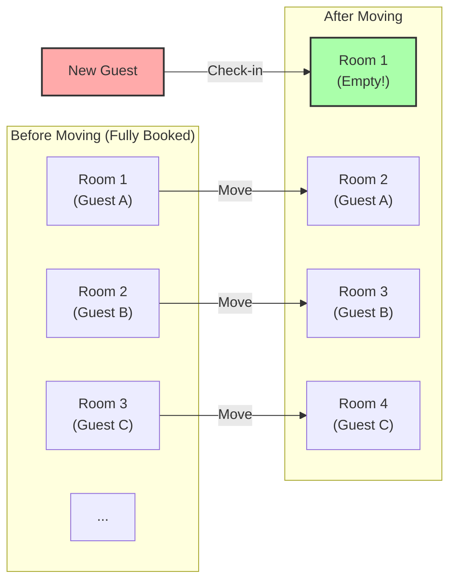
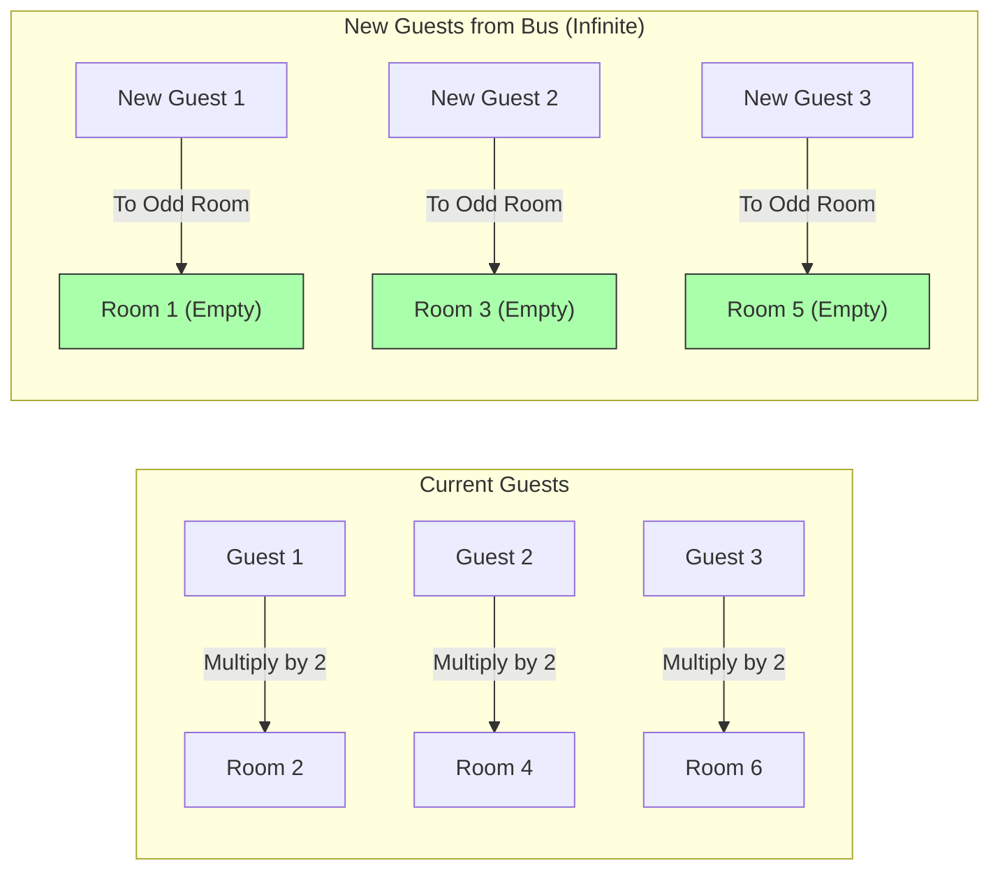

## 1. Welcome to the Ultimate Hotel

The great German mathematician David Hilbert devised an interesting thought experiment to illustrate how far the concept of "infinity" is from human intuition.

Imagine that somewhere in the universe, there is a hotel called **"Hilbert's Grand Hotel."**
This hotel has an **infinite number** of rooms, numbered 1, 2, 3, and so on.

One day, there was a massive event in the universe, and every single room in this infinite hotel was occupied, making it **"fully booked."**
Then, an exhausted traveler arrived and asked the front desk, "Could you please find me a room?"

A normal hotel would have no choice but to refuse, saying, "We are sorry, but we are fully booked."
However, this is the Grand Hotel. The manager smiled and said, "Certainly. We will have a room ready for you right away."
How can they accommodate a new guest when the hotel is already full?

---

## 2. Case 1: How to Accommodate One New Guest

The manager made an announcement over the intercom to all the guests currently staying at the hotel:

**"Attention all guests. Please move to the room whose number is 'plus 1' of your current room number."**

What happens then?
- The guest in room 1 moves to room 2.
- The guest in room 2 moves to room 3.
- The guest in room 3 moves to room 4.
- The guest in room $n$ moves to room $n+1$.

Since there are an infinite number of rooms, the scenario where "the guest in the last room is kicked out" never occurs. Everyone successfully moves to the next room.
And brilliantly, **Room 1 becomes vacant.** The new traveler was able to stay in Room 1 safely.

In the world of infinity, $\infty + 1 = \infty$ holds true.
Even if you take out "one" from the "whole (infinity)," the size of the whole does not change.

---

## 3. Case 2: How to Accommodate an Infinite Number of New Guests

Well, the next day, the hotel was fully booked once again.
Then, incredibly, an **infinite bus** carrying an **"infinite number of passengers"** arrived.
The passengers who got off the bus pressed the front desk, saying, "We need rooms for everyone!"

If they asked for the "plus 1" move like yesterday, it would take forever.
However, the manager didn't panic. He made another intercom announcement.

**"Attention all guests. Please move to the room whose number is 'multiplied by 2' of your current room number."**

What happens then?
- The guest in room 1 moves to room 2.
- The guest in room 2 moves to room 4.
- The guest in room 3 moves to room 6.
- The guest in room $n$ moves to room $2n$.

Through this move, the infinite number of guests who were already staying fit perfectly into **"all the even-numbered rooms."**
And miraculously, **"all the odd-numbered rooms (Room 1, 3, 5...)" became completely vacant**!

Since there are an infinite number of odd numbers as well, the manager can accommodate everyone by guiding the passengers of the infinite bus sequentially from the front to Room 1, Room 3, Room 5, and so on.

In the world of infinity, $\infty + \infty = \infty$ holds true.
Even if you add infinity to infinity, the size remains the same "infinity."

---

## 4. Case 3: What if an Infinite Number of Infinite Buses Arrive?

Furthermore, the next day. Once again, the hotel is fully booked.
And then, astonishingly, **"an infinite number of infinite buses, each carrying an infinite number of passengers,"** arrived in a continuous line.

Bus 1 has an infinite number of people, Bus 2 has an infinite number of people, Bus 3 has an infinite number of people... this goes on for an infinite number of buses.
Even the manager seems like he might panic, but he was a mathematical genius. He came up with the idea of using "prime numbers."

The manager gave the following instructions:

1. **Movement of guests already staying in the hotel**
   Let the current room number be $n$. Have them move to room "$2^n$".
   (Room 1 $\rightarrow$ Room 2, Room 2 $\rightarrow$ Room 4, Room 3 $\rightarrow$ Room 8...)
   This accommodates all the current guests.

2. **Guiding guests from Bus 1 (Infinite people)**
   Let the guest's seat number be $n$. Guide them to room "$3^n$".
   (Room 3, Room 9, Room 27...)

3. **Guiding guests from Bus 2 (Infinite people)**
   Use the next prime number, 5, and guide them to room "$5^n$".
   (Room 5, Room 25, Room 125...)

4. **Guiding guests from Bus $k$ (Infinite people)**
   Use the $(k+1)$-th prime number, $P$, and guide them to room "$P^n$".

Thanks to a powerful mathematical theorem known as "the uniqueness of prime factorization (any number can be expressed as a combination of prime factor multiplications in only one way)," the room numbers $2^n, 3^n, 5^n, 7^n \dots$ will absolutely never overlap with anyone else.

In this way, the manager brilliantly managed to accommodate a staggering number of guests—**"Infinity $\times$ Infinity"**—into a single infinite hotel!

---

## 5. Infinite Sets Have Different "Sizes" (Cantor's Theorem)

What Hilbert's Grand Hotel teaches us is the fact that **"countably infinite (infinity that can be counted by assigning numbers like 1, 2, 3...)", no matter how many times it is added together or multiplied, will ultimately fit within the same size of "countably infinite" framework.**

However, the mathematician Georg Cantor discovered an even more terrifying truth.
"Natural numbers" and "fractions" can all be accommodated in this infinite hotel. But **if guests of "real numbers (all decimals, including irrational numbers)" arrive, even this infinite hotel will absolutely not be able to accommodate all of them.**

It has been proven that the number of real numbers is fundamentally a "larger (higher-level) infinity" than the number of rooms in the infinite hotel (countably infinite).
Although often lumped together under the word "infinity," there actually exists a hierarchical structure (cardinality) within infinity, ranging from a "small infinity" to an "infinity so large it is absolutely unreachable."

---

## 6. Conclusion: The "Infinity" That Destroys Human Intuition

Hilbert's Grand Hotel vividly illustrates how the "common sense of the finite" cultivated in our daily lives simply does not apply in the "world of infinity."

"The whole is greater than the part"
"No one can enter a fully booked hotel"
"If you add infinity to infinity, it gets bigger"

All these obvious intuitions are brilliantly betrayed.
The world of infinity is a treasure trove of paradoxes (truths that contradict intuition). Mathematicians did not fear these paradoxes; instead, they subdued them with the power of logic, classified them, and built the beautiful system of modern set theory.

The next time you are turned away because "the hotel is fully booked," try to imagine, "What if this hotel were Hilbert's Grand Hotel?"
