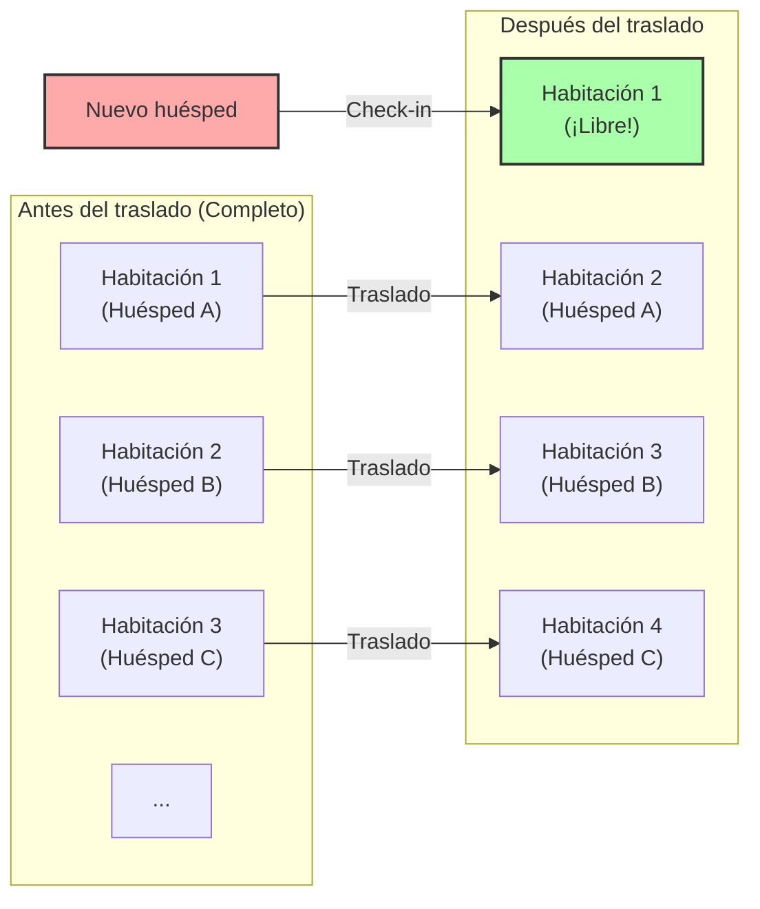
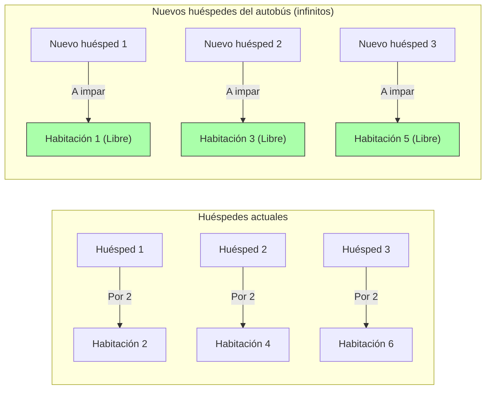

## 1. Bienvenido al hotel definitivo

El gran matemático alemán David Hilbert ideó el siguiente experimento mental fascinante para explicar cuán lejos está el concepto de "infinito" de la intuición humana.

Imagínese: en algún lugar del universo existe el **"Gran Hotel de Hilbert"**.
En este hotel hay **infinitas** habitaciones numeradas: habitación 1, habitación 2, habitación 3...

Un día, hubo un gran evento en todo el universo, y este hotel infinito se llenó, ocupando todas sus habitaciones, quedando **"completo"**.
Entonces, un viajero exhausto llegó y preguntó en recepción: "¿Podrían darme una habitación?".

Un hotel normal no tendría más remedio que rechazarlo diciendo: "Lo sentimos, estamos completos".
Sin embargo, este es el hotel infinito. El gerente sonrió y dijo: "Por supuesto. Le prepararemos una habitación de inmediato".
A pesar de estar lleno, ¿cómo alojará al nuevo huésped?

---

## 2. Caso 1: Cómo alojar a 1 nuevo huésped

El gerente hizo el siguiente anuncio por megafonía a todos los huéspedes que ya estaban alojados:

**"Atención a todos los huéspedes. Por favor, trasládense a la habitación con el número resultante de sumar '1' a su número de habitación actual."**

¿Qué sucederá entonces?
- El huésped de la habitación 1 se traslada a la habitación 2.
- El huésped de la habitación 2 se traslada a la habitación 3.
- El huésped de la habitación 3 se traslada a la habitación 4.
- El huésped de la habitación $n$ se traslada a la habitación $n+1$.

Como hay infinitas habitaciones, no ocurrirá que "el huésped de la última habitación sea expulsado". Todos pueden mudarse sin problemas a la habitación contigua.
Y de manera asombrosa, **la habitación 1 quedó libre.** El nuevo viajero pudo alojarse sin problemas en la habitación 1.

En el mundo del infinito, se cumple que $\infty + 1 = \infty$.
Incluso si sacamos "uno" del "todo (infinito)", el tamaño del todo no cambia.

---

## 3. Caso 2: Cómo alojar a infinitos huéspedes nuevos

Ahora bien, al día siguiente. El hotel vuelve a estar completamente lleno.
En ese momento llega un autobús infinito con, nada menos, que **"infinitos pasajeros"**.
Los huéspedes que bajan del autobús exigen en recepción: "¡Preparen habitaciones para todos!".

Si pidiera el traslado de "sumar 1" como el día anterior, llevaría una eternidad.
Pero el gerente no entra en pánico. Vuelve a hacer un anuncio por megafonía.

**"Atención a todos los huéspedes. Por favor, trasládense a la habitación con el número resultante de multiplicar 'por 2' su número de habitación actual."**

¿Qué sucederá entonces?
- El huésped de la habitación 1 se traslada a la habitación 2.
- El huésped de la habitación 2 se traslada a la habitación 4.
- El huésped de la habitación 3 se traslada a la habitación 6.
- El huésped de la habitación $n$ se traslada a la habitación $2n$.

Con este traslado, los infinitos huéspedes que ya estaban alojados encajaron perfectamente en **"todas las habitaciones con números pares"**.
¡Y milagrosamente, **"todas las habitaciones con números impares (habitación 1, habitación 3, habitación 5...)" quedaron completamente vacías**!

Dado que también existen infinitos números impares, si el gerente va guiando a los pasajeros del autobús infinito en orden comenzando por el primero hacia la habitación 1, luego la 3, la 5..., podrá alojarlos a todos.

En el mundo del infinito, se cumple que $\infty + \infty = \infty$.
Aunque se sume infinito al infinito, el tamaño sigue siendo el mismo "infinito".

---

## 4. Caso 3: ¿Qué pasa si llegan infinitos autobuses infinitos?

Al día siguiente. El hotel está lleno una vez más.
Entonces, asombrosamente, llegan **"infinitos autobuses, cada uno con infinitos pasajeros"**, uno tras otro.

Infinitos pasajeros en el autobús 1, infinitos pasajeros en el autobús 2, infinitos pasajeros en el autobús 3... esto continúa infinitamente.
Como era de esperar, incluso el gerente casi entra en pánico, pero como es un genio matemático, se le ocurrió utilizar "números primos".

El gerente dio las siguientes instrucciones:

1. **Traslado de los huéspedes que ya están en el hotel**
   Tomando su número de habitación actual como $n$, se les pide que se trasladen a la habitación "$2^n$".
   (Habitación 1 $\rightarrow$ Habitación 2, Habitación 2 $\rightarrow$ Habitación 4, Habitación 3 $\rightarrow$ Habitación 8...)
   Con esto, todos los huéspedes actuales han sido reubicados.

2. **Acomodación de los pasajeros del autobús 1 (infinitos)**
   Tomando su número de asiento como $n$, se les guía a la habitación "$3^n$".
   (Habitación 3, Habitación 9, Habitación 27...)

3. **Acomodación de los pasajeros del autobús 2 (infinitos)**
   Usando el siguiente número primo, el 5, se les guía a la habitación "$5^n$".
   (Habitación 5, Habitación 25, Habitación 125...)

4. **Acomodación de los pasajeros del autobús $k$ (infinitos)**
   Usando el $k+1$-ésimo número primo $P$, se les guía a la habitación "$P^n$".

Por el poderoso teorema matemático de la "unicidad de la factorización en números primos (cualquier número puede expresarse de una única manera como producto de números primos)", los números de habitación $2^n, 3^n, 5^n, 7^n \dots$ nunca se superpondrán con los de nadie más.

De esta manera, el gerente logró alojar brillantemente a la incomprensible cantidad de **"infinito $\times$ infinito"** huéspedes en un solo hotel infinito.

---

## 5. El infinito tiene diferentes "tamaños" (Teorema de Cantor)

Lo que nos enseña el Gran Hotel de Hilbert es el hecho de que **el "infinito numerable (el infinito que se puede contar asignando números como 1, 2, 3...)", por mucho que se sume o se multiplique, finalmente cabe dentro del mismo tamaño de 'infinito numerable'**.

Sin embargo, el matemático Georg Cantor descubrió una verdad aún más aterradora.
Los "números naturales" y las "fracciones" se pueden alojar todos en este hotel infinito. Pero **si llegan huéspedes que representan los "números reales (todos los decimales, incluidos los irracionales)", es absolutamente imposible alojarlos a todos, incluso usando este hotel infinito**.

Está demostrado que la cantidad de números reales es fundamentalmente un "infinito mayor (de un nivel superior)" que la cantidad de habitaciones del hotel infinito (infinito numerable).
Solemos agrupar todo bajo la palabra "infinito", pero en realidad, dentro del infinito existe una estructura jerárquica (cardinalidad) que va desde los "infinitos pequeños" hasta los "infinitos tan grandes que son absolutamente inalcanzables".

---

## 6. Conclusión: El "infinito" que destruye la intuición humana

El Gran Hotel de Hilbert ilustra vívidamente cómo el "sentido común de lo finito" cultivado en nuestra vida diaria simplemente no aplica en el "mundo de lo infinito".

"El todo es mayor que la parte"
"Nadie puede entrar en un hotel lleno"
"Si sumas infinito a infinito, se hace más grande"

Todas estas intuiciones obvias son espectacularmente traicionadas.
El mundo del infinito es un tesoro de paradojas (verdades contraintuitivas). Los matemáticos, en lugar de temer a estas paradojas, las dominaron con el poder de la lógica, las clasificaron y construyeron el hermoso sistema que hoy conocemos como teoría de conjuntos moderna.

La próxima vez que le digan "el hotel está completo" y le rechacen una habitación, intente imaginar: "Ojalá este hotel fuera el Gran Hotel de Hilbert".
