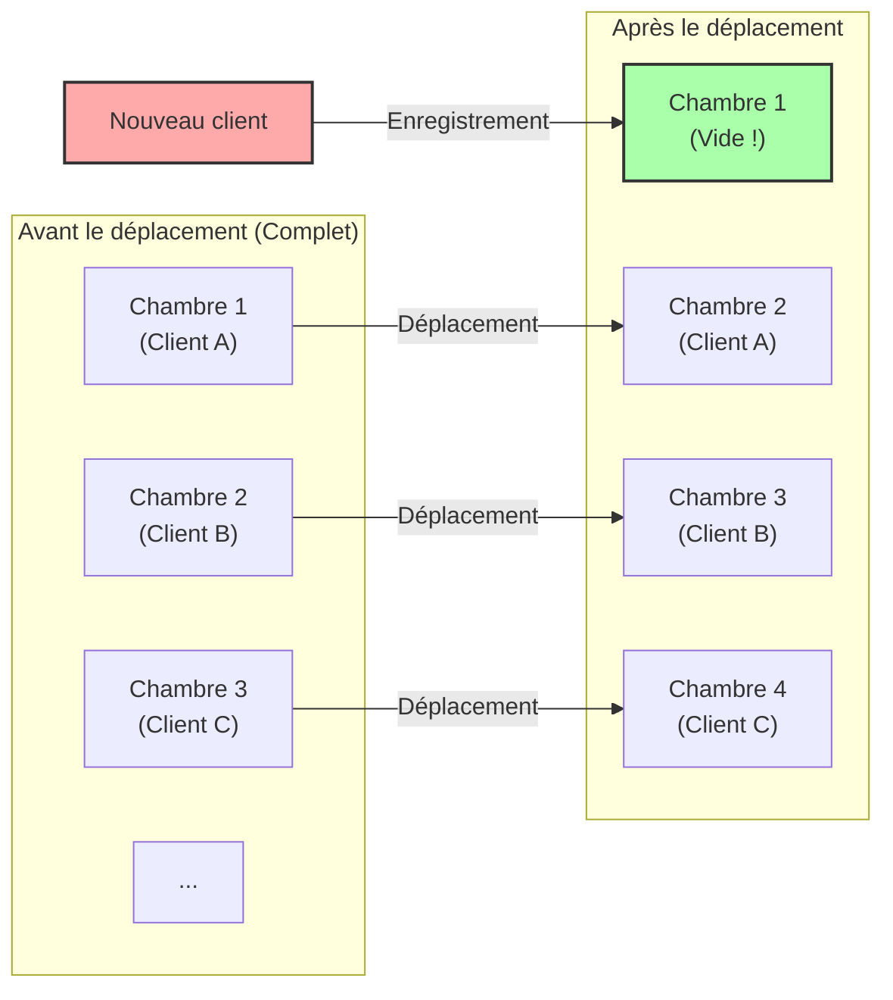
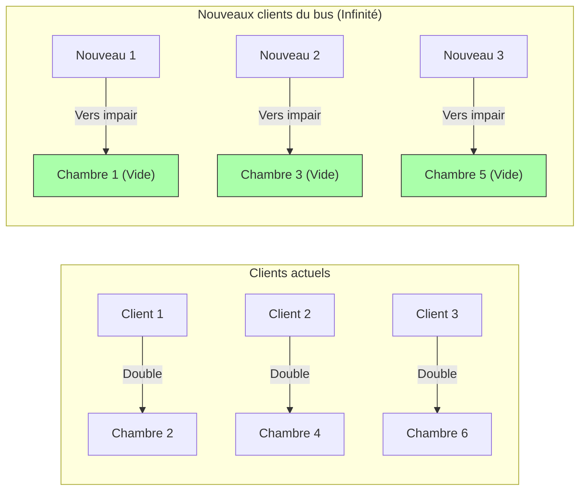

## 1. Bienvenue dans l'hôtel ultime

Le grand mathématicien allemand David Hilbert a conçu l'expérience de pensée amusante suivante pour expliquer à quel point le concept d'« infini » est éloigné de l'intuition humaine.

Imaginez. Quelque part dans l'univers, il y a un hôtel appelé **« L'Hôtel Infini de Hilbert »**.
Cet hôtel possède un nombre **infini** de chambres numérotées : chambre 1, chambre 2, chambre 3...

Un jour, un grand événement a eu lieu dans l'univers, et cet hôtel infini s'est retrouvé **« complet »**, toutes les chambres étant occupées.
Un voyageur épuisé est alors arrivé et a demandé à la réception : « Pourriez-vous me libérer une chambre ? »

Un hôtel ordinaire n'aurait d'autre choix que de refuser en disant : « Nous sommes désolés, l'hôtel est complet. »
Cependant, il s'agit d'un hôtel infini. Le directeur a souri et a dit : « Certainement. Nous allons vous préparer une chambre immédiatement. »
Comment peut-on loger un nouveau client alors que l'hôtel est complet ?

---

## 2. Cas 1 : Comment loger 1 nouveau client

Le directeur a fait une annonce à tous les clients déjà séjournant dans l'hôtel :

**« Chers clients, veuillez vous déplacer vers la chambre dont le numéro correspond à votre numéro de chambre actuel "plus 1". »**

Que se passe-t-il alors ?
- Le client de la chambre 1 se déplace vers la chambre 2.
- Le client de la chambre 2 se déplace vers la chambre 3.
- Le client de la chambre 3 se déplace vers la chambre 4.
- Le client de la chambre $n$ se déplace vers la chambre $n+1$.

Comme il y a une infinité de chambres, il n'arrivera jamais que « le client de la toute dernière chambre soit expulsé ». Tout le monde peut déménager sans problème dans la chambre d'à côté.
Et voilà, **la chambre 1 est devenue vide.** Le nouveau voyageur a pu séjourner sans problème dans la chambre 1.

Dans le monde de l'infini, $\infty + 1 = \infty$ est vrai.
Même si l'on retire « 1 » du « tout (l'infini) », la taille globale ne change pas.

---

## 3. Cas 2 : Comment loger une infinité de nouveaux clients

Le lendemain, l'hôtel est redevenu complet.
C'est alors qu'arrive, à la surprise générale, **un bus infini transportant une « infinité de passagers »**.
Les passagers qui descendent du bus exigent à la réception : « Préparez-nous des chambres pour tout le monde ! »

Si l'on demande un déplacement « plus 1 » comme la veille, cela prendra une éternité.
Cependant, le directeur ne panique pas. Il fait à nouveau une annonce dans l'hôtel.

**« Chers clients, veuillez vous déplacer vers la chambre dont le numéro correspond au "double" de votre numéro de chambre actuel. »**

Que se passe-t-il alors ?
- Le client de la chambre 1 se déplace vers la chambre 2.
- Le client de la chambre 2 se déplace vers la chambre 4.
- Le client de la chambre 3 se déplace vers la chambre 6.
- Le client de la chambre $n$ se déplace vers la chambre $2n$.

Grâce à ce déplacement, l'infinité de clients déjà présents s'est parfaitement installée dans **« toutes les chambres à numéro pair »**.
Et miraculeusement, **« toutes les chambres à numéro impair (chambre 1, chambre 3, chambre 5...) » se sont retrouvées complètement vides** !

Comme il existe également une infinité de nombres impairs, le directeur peut loger tout le monde en guidant les passagers du bus infini dans l'ordre, à partir du premier, vers la chambre 1, la chambre 3, la chambre 5...

Dans le monde de l'infini, $\infty + \infty = \infty$ est vrai.
Même si l'on ajoute l'infini à l'infini, la taille reste la même, c'est-à-dire l'« infini ».

---

## 4. Cas 3 : Et si une infinité de bus infinis arrivaient ?

Le surlendemain, l'hôtel est encore complet.
C'est alors qu'arrive, incroyablement, **« une infinité de bus infinis transportant chacun une infinité de passagers »**, l'un après l'autre.

Une infinité de personnes dans le bus 1, une infinité de personnes dans le bus 2, une infinité de personnes dans le bus 3... et cela continue indéfiniment.
Même ce directeur aurait pu paniquer, mais il était un génie des mathématiques. Il a eu l'idée d'utiliser les « nombres premiers ».

Le directeur a donné les instructions suivantes :

1. **Déplacement des clients séjournant déjà à l'hôtel**
   Si le numéro de la chambre actuelle est $n$, on leur demande de se déplacer vers la chambre « $2^n$ ».
   (Chambre 1 $\rightarrow$ Chambre 2, Chambre 2 $\rightarrow$ Chambre 4, Chambre 3 $\rightarrow$ Chambre 8...)
   Ainsi, tous les clients actuels sont logés.

2. **Placement des clients du bus 1 (une infinité)**
   Si le numéro de siège du client est $n$, il est dirigé vers la chambre « $3^n$ ».
   (Chambre 3, Chambre 9, Chambre 27...)

3. **Placement des clients du bus 2 (une infinité)**
   En utilisant le nombre premier suivant, 5, ils sont dirigés vers la chambre « $5^n$ ».
   (Chambre 5, Chambre 25, Chambre 125...)

4. **Placement des clients du bus $k$ (une infinité)**
   En utilisant le $k+1$-ème nombre premier $P$, ils sont dirigés vers la chambre « $P^n$ ».

Grâce au puissant théorème mathématique de l'« unicité de la décomposition en facteurs premiers » (n'importe quel nombre a une seule combinaison possible de multiplication de nombres premiers), il est absolument impossible que les numéros de chambre $2^n, 3^n, 5^n, 7^n \dots$ se chevauchent avec ceux de quelqu'un d'autre.

C'est ainsi que le directeur a réussi à loger de manière spectaculaire un nombre astronomique de **« l'infini $\times$ l'infini »** clients dans un seul hôtel infini !

---

## 5. L'infini a des différences de « taille » (Le théorème de Cantor)

Ce que l'Hôtel Infini de Hilbert nous apprend, c'est le fait que **l'« infini dénombrable » (l'infini que l'on peut compter en attribuant des numéros 1, 2, 3...), peu importe combien on l'additionne ou le multiplie, finit toujours par tenir dans le cadre d'un « infini dénombrable » de la même taille.**

Cependant, le mathématicien Georg Cantor a découvert un fait encore plus terrifiant.
Les « entiers naturels » et les « fractions » peuvent tous être logés dans cet hôtel infini. Mais, **si les clients des « nombres réels » (tous les nombres décimaux, y compris les nombres irrationnels) arrivaient, il serait absolument impossible de tous les loger, même en utilisant cet hôtel infini.**

Il a été prouvé que la quantité de nombres réels est un « infini (de niveau supérieur) fondamentalement plus grand » que le nombre de chambres de l'Hôtel Infini (infini dénombrable).
On a tendance à tout regrouper sous le mot « infini », mais en réalité, il existe une structure hiérarchique (cardinalité) au sein de l'infini, avec un « petit infini » et un « grand infini que l'on ne peut absolument pas atteindre ».

---

## 6. Conclusion : L'« infini » qui détruit l'intuition humaine

L'Hôtel Infini de Hilbert illustre de manière éclatante à quel point le « bon sens du fini » cultivé dans notre vie quotidienne ne s'applique pas au « monde de l'infini ».

« Le tout est plus grand que la partie »
« Personne ne peut entrer dans un hôtel complet »
« Si l'on ajoute l'infini à l'infini, cela devient encore plus grand »

Toutes ces intuitions évidentes sont brillamment contredites.
Le monde de l'infini est un trésor de paradoxes (des vérités contraires à l'intuition). Les mathématiciens n'ont pas craint ces paradoxes ; ils les ont maîtrisés par la force de la logique, les ont classés et ont créé le magnifique système de la théorie des ensembles moderne.

La prochaine fois que l'on vous refusera une chambre en disant « L'hôtel est complet », essayez d'imaginer : « Si seulement cet hôtel était l'Hôtel Infini de Hilbert... »
