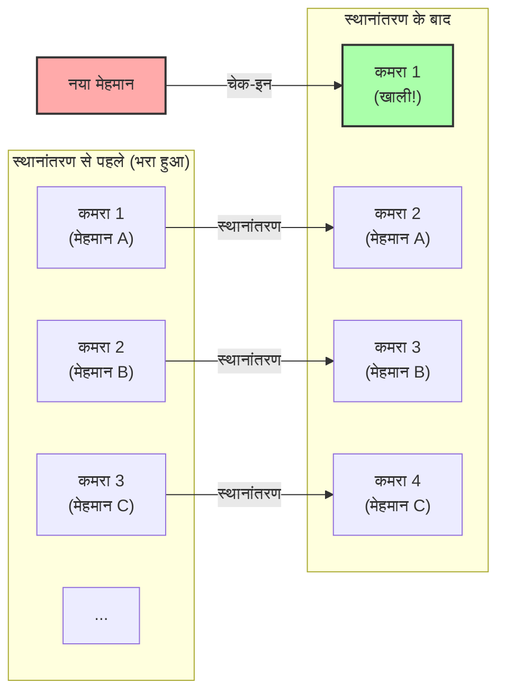
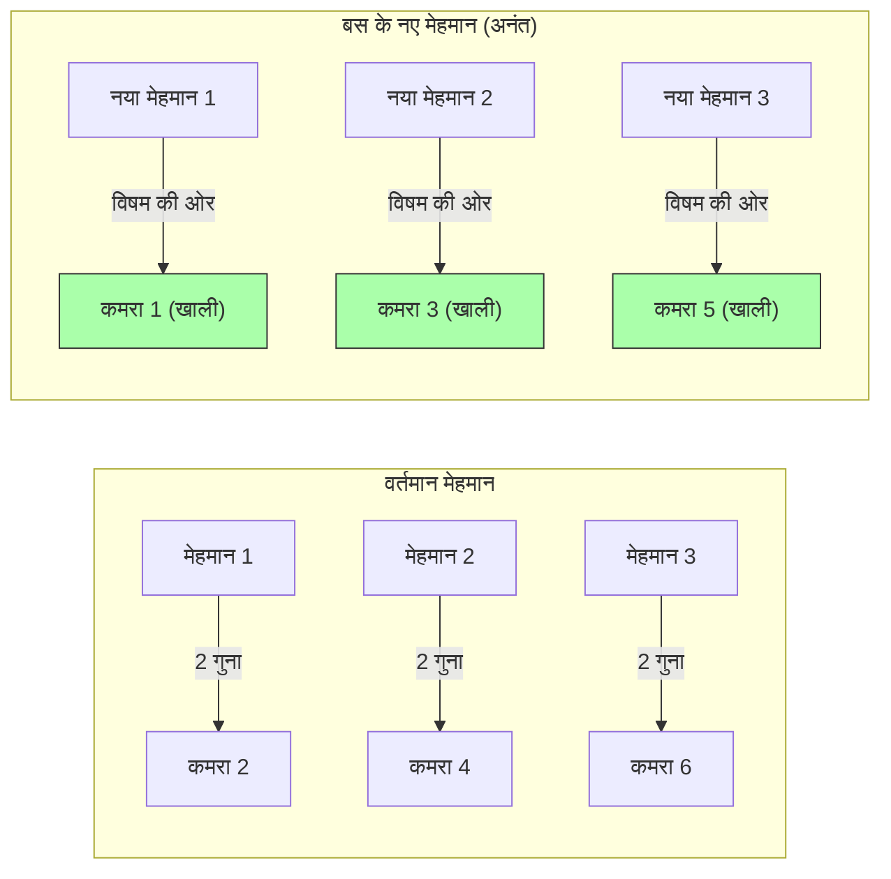

## 1. अंतिम होटल में आपका स्वागत है

महान जर्मन गणितज्ञ डेविड हिल्बर्ट ने एक दिलचस्प वैचारिक प्रयोग (thought experiment) तैयार किया ताकि यह समझाया जा सके कि "अनंत" की अवधारणा मानव की सहज समझ (intuition) से कितनी दूर है।

कल्पना करें कि ब्रह्मांड में कहीं **"हिल्बर्ट का अनंत होटल"** नामक एक होटल है।
इस होटल में 1, 2, 3... नंबर वाले **अनंत** कमरे हैं।

एक दिन, ब्रह्मांड में एक बहुत बड़ा कार्यक्रम हुआ और इस अनंत होटल के सभी कमरे भर गए और यह **"फुल" (Full)** हो गया।
तभी, एक थका हुआ यात्री वहां पहुंचा और रिसेप्शन से पूछा, "क्या मुझे एक कमरा मिल सकता है?"

सामान्य होटल होता तो कहता, "क्षमा करें, हमारे पास कोई कमरा खाली नहीं है।"
लेकिन, यह अनंत होटल है। मैनेजर ने मुस्कुराते हुए कहा, "बिल्कुल, मैं आपके लिए तुरंत एक कमरा तैयार करता हूँ।"
जब होटल पूरा भरा हुआ है, तो वह नए मेहमान को कैसे ठहराएगा?

---

## 2. स्थिति 1: एक नए मेहमान को कैसे ठहराएं

मैनेजर ने होटल के इंटरकॉम के माध्यम से सभी मौजूदा मेहमानों के लिए एक घोषणा की:

**"प्रिय मेहमानों, कृपया अपने वर्तमान कमरा नंबर में 'प्लस 1 (1 जोड़कर)' वाले कमरा नंबर में चले जाएं।"**

तो क्या होगा?
- कमरा 1 का मेहमान कमरा 2 में चला जाएगा।
- कमरा 2 का मेहमान कमरा 3 में चला जाएगा।
- कमरा 3 का मेहमान कमरा 4 में चला जाएगा।
- कमरा $n$ का मेहमान कमरा $n+1$ में चला जाएगा।

चूंकि कमरे अनंत हैं, इसलिए "आखिरी कमरे के मेहमान को बाहर निकाल दिया जाएगा" ऐसा कभी नहीं होता। हर कोई सुरक्षित रूप से अपने से अगले कमरे में जा सकता है।
और आश्चर्यजनक रूप से, **कमरा 1 खाली हो गया।** नया यात्री सुरक्षित रूप से कमरा 1 में ठहर सका।

अनंत की दुनिया में, $\infty + 1 = \infty$ मान्य होता है।
अगर आप "संपूर्ण (अनंत)" में से "एक" निकाल भी लें या जोड़ दें, तो समग्र आकार नहीं बदलता है।

---

## 3. स्थिति 2: अनंत नए मेहमानों को कैसे ठहराएं

खैर, अगले दिन। होटल फिर से पूरी तरह भर गया।
तभी, एक **अनंत बस** आ पहुंची जिसमें **"अनंत यात्री"** सवार थे।
बस से उतरे यात्रियों ने रिसेप्शन पर आकर मांग की, "हम सभी के लिए कमरा तैयार करो!"

अगर मैनेजर ने कल की तरह "प्लस 1" करने के लिए कहा होता, तो इसमें हमेशा के लिए समय लग जाता।
लेकिन, मैनेजर घबराया नहीं। उसने फिर से एक घोषणा की:

**"प्रिय मेहमानों, कृपया अपने वर्तमान कमरा नंबर को '2 से गुणा' करके प्राप्त हुए कमरा नंबर में चले जाएं।"**

तो क्या होगा?
- कमरा 1 का मेहमान कमरा 2 में चला जाएगा।
- कमरा 2 का मेहमान कमरा 4 में चला जाएगा।
- कमरा 3 का मेहमान कमरा 6 में चला जाएगा।
- कमरा $n$ का मेहमान कमरा $2n$ में चला जाएगा।

इस स्थानांतरण के द्वारा, होटल में पहले से मौजूद अनंत मेहमान सुरक्षित रूप से **"सभी सम संख्या (Even number) वाले कमरों"** में समा गए।
और चमत्कारिक रूप से, **"सभी विषम संख्या (Odd number) वाले कमरे (कमरा 1, 3, 5...)" पूरी तरह से खाली हो गए!**

चूंकि विषम संख्याएँ भी अनंत हैं, मैनेजर अनंत बस के यात्रियों को एक-एक करके 1, 3, 5... कमरों में भेजकर सभी को ठहरा सकता है।

अनंत की दुनिया में, $\infty + \infty = \infty$ मान्य होता है।
अनंत में अनंत को जोड़ने पर भी, आकार समान "अनंत" ही रहता है।

---

## 4. स्थिति 3: यदि अनंत मेहमानों वाली अनंत बसें आ जाएं तो क्या होगा?

उसके अगले दिन। होटल फिर से भरा हुआ है।
तभी, **"अनंत यात्रियों वाली अनंत बसें"** एक के बाद एक आ पहुंचीं।

बस नंबर 1 में अनंत लोग, बस नंबर 2 में अनंत लोग, बस नंबर 3 में अनंत लोग... यह सिलसिला अनंत तक चलता रहता है।
यह देखकर कोई भी मैनेजर घबरा सकता है, लेकिन वह गणित का जीनियस था। उसने "अभाज्य संख्याओं (Prime numbers)" का उपयोग करने का सोचा।

मैनेजर ने निम्नलिखित निर्देश दिए:

1. **होटल में पहले से मौजूद मेहमानों का स्थानांतरण**
   यदि वर्तमान कमरा नंबर $n$ है, तो उन्हें कमरा "$2^n$" में जाने के लिए कहें।
   (कमरा 1 $\rightarrow$ कमरा 2, कमरा 2 $\rightarrow$ कमरा 4, कमरा 3 $\rightarrow$ कमरा 8...)
   इससे सभी वर्तमान मेहमान समा गए।

2. **बस नंबर 1 के मेहमानों (अनंत) का मार्गदर्शन**
   यदि यात्री का सीट नंबर $n$ है, तो उसे कमरा "$3^n$" में निर्देशित करें।
   (कमरा 3, 9, 27...)

3. **बस नंबर 2 के मेहमानों (अनंत) का मार्गदर्शन**
   अगली अभाज्य संख्या 5 का उपयोग करें और उन्हें कमरा "$5^n$" में निर्देशित करें।
   (कमरा 5, 25, 125...)

4. **बस $k$ के मेहमानों (अनंत) का मार्गदर्शन**
   $k+1$ वीं अभाज्य संख्या $P$ का उपयोग करें और उन्हें कमरा "$P^n$" में निर्देशित करें।

"अभाज्य गुणनखंडन की विशिष्टता (Unique factorization theorem - किसी भी संख्या को अभाज्य संख्याओं के गुणनफल के रूप में केवल एक ही तरीके से दर्शाया जा सकता है)" के शक्तिशाली गणितीय प्रमेय के कारण, $2^n, 3^n, 5^n, 7^n \dots$ कमरा नंबर कभी भी किसी अन्य के साथ नहीं टकराएंगे (डुप्लिकेट नहीं होंगे)।

इस प्रकार मैनेजर ने **"अनंत $\times$ अनंत"** की अविश्वसनीय संख्या वाले मेहमानों को एक ही अनंत होटल में सफलतापूर्वक ठहरा दिया!

---

## 5. अनंत के "आकार" में अंतर (कैंटर का प्रमेय)

हिल्बर्ट का अनंत होटल हमें सिखाता है कि **"गणनीय अनंत (Countably infinite - वह अनंत जिसे 1, 2, 3... के रूप में गिना जा सकता है)" को आप चाहे कितनी भी बार जोड़ें या गुणा करें, वह अंततः उसी 'गणनीय अनंत' के आकार में समा जाता है।**

हालाँकि, गणितज्ञ जॉर्ज कैंटर ने इससे भी अधिक भयानक सच्चाई की खोज की।
"प्राकृतिक संख्याएं (Natural numbers)" और "भिन्न (Fractions)" सभी इस अनंत होटल में ठहराए जा सकते हैं। लेकिन, **यदि "वास्तविक संख्याएं (Real numbers - सभी दशमलव जिनमें अपरिमेय संख्याएं भी शामिल हैं)" मेहमान के रूप में आ जाएं, तो इस अनंत होटल का उपयोग करने पर भी सभी को ठहराना बिल्कुल असंभव है।**

यह सिद्ध हो चुका है कि वास्तविक संख्याओं की संख्या मौलिक रूप से अनंत होटल के कमरों की संख्या (गणनीय अनंत) से "बड़ा (उच्च स्तर का) अनंत" है।
हालांकि हम अक्सर "अनंत" शब्द का उपयोग एक ही अर्थ में करते हैं, लेकिन वास्तव में अनंत के भीतर भी एक पदानुक्रमित संरचना (cardinality) मौजूद है, जैसे "छोटा अनंत" और "इतना बड़ा अनंत जहाँ तक पहुँचना असंभव है"।

---

## 6. निष्कर्ष: मानव सहज समझ को नष्ट करने वाला "अनंत"

हिल्बर्ट का अनंत होटल यह स्पष्ट रूप से दर्शाता है कि कैसे हमारे दैनिक जीवन में विकसित "सीमित सामान्य ज्ञान (Finite common sense)" "अनंत की दुनिया" में बिल्कुल काम नहीं आता है।

"संपूर्ण (Whole) अपने हिस्से (Part) से बड़ा होता है"
"भरे हुए होटल में कोई नहीं जा सकता"
"अनंत में अनंत जोड़ने पर, वह और बड़ा हो जाता है"

इस तरह की सभी स्पष्ट और सहज धारणाएं बुरी तरह विफल हो जाती हैं।
अनंत की दुनिया विरोधाभासों (सहज ज्ञान के विपरीत सत्य) का खजाना है। गणितज्ञों ने इन विरोधाभासों से डरने के बजाय, तर्क की शक्ति से उन्हें वश में किया, वर्गीकृत किया, और आधुनिक सेट सिद्धांत की एक सुंदर प्रणाली बनाई।

अगली बार जब आपसे कहा जाए कि "होटल भरा हुआ है", तो कृपया यह कल्पना जरूर करें कि "अगर यह हिल्बर्ट का अनंत होटल होता तो क्या होता।"
