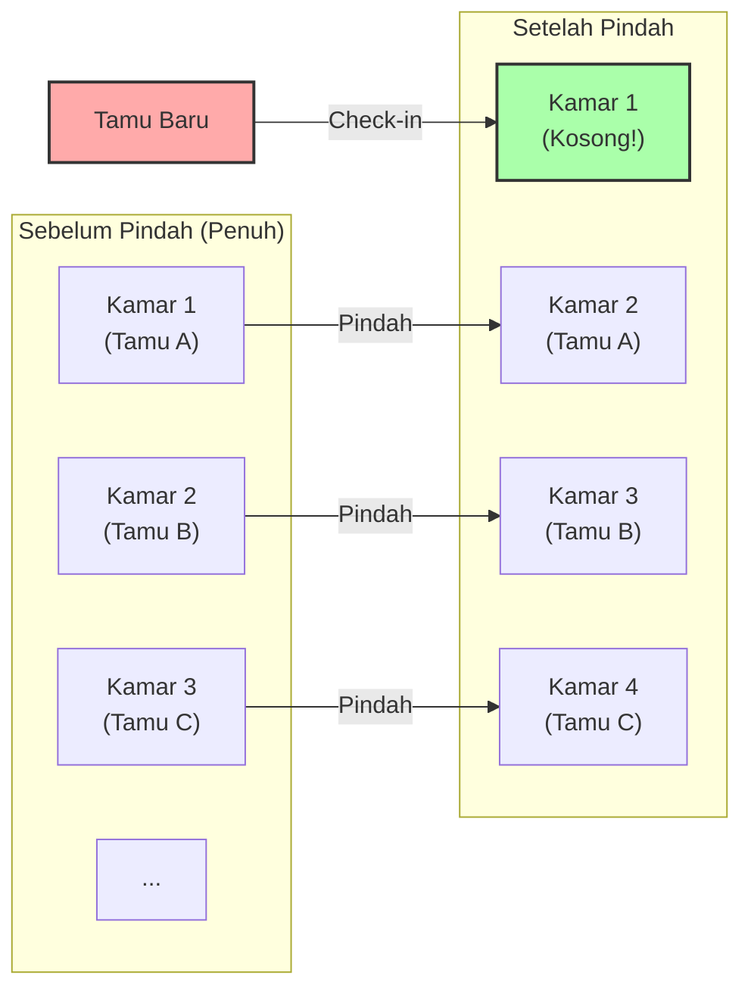
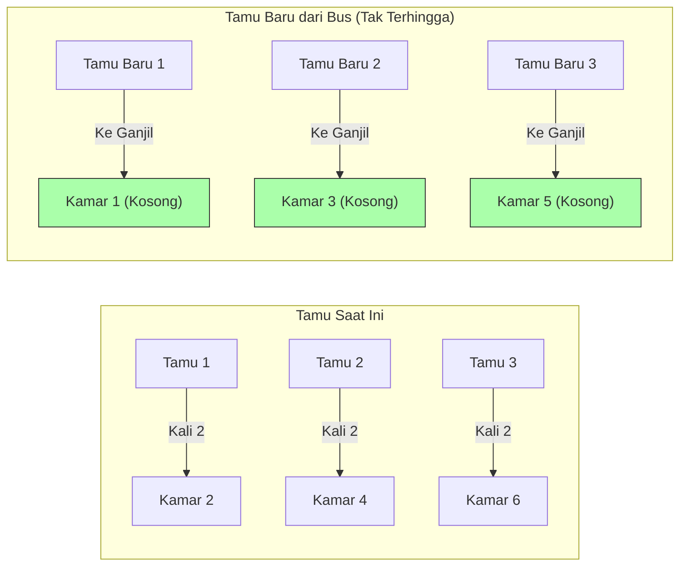

## 1. Selamat Datang di Hotel Paling Mutakhir

Matematikawan besar Jerman, David Hilbert, merancang eksperimen pemikiran yang menarik berikut ini untuk menjelaskan betapa konsep "tak terhingga" sangat jauh dari intuisi manusia.

Bayangkan. Di suatu tempat di alam semesta, ada sebuah hotel bernama **"Hotel Tak Terhingga Hilbert"**.
Di hotel ini, terdapat **jumlah tak terhingga** kamar tamu yang diberi nomor, seperti kamar 1, kamar 2, kamar 3, dan seterusnya.

Suatu hari, ada acara besar di alam semesta, dan setiap kamar di hotel yang tak terhingga ini terisi, menjadi **"penuh"**.
Kemudian, seorang pelancong yang kelelahan tiba dan bertanya ke resepsionis, "Bisakah Anda memberikan saya satu kamar?"

Di hotel biasa, mereka tidak punya pilihan selain menolak dan mengatakan, "Maaf, kami sudah penuh."
Namun, ini adalah Hotel Tak Terhingga. Manajer tersenyum dan berkata, "Tentu saja. Kami akan segera menyiapkan kamar untuk Anda."
Bagaimana cara menampung tamu baru padahal hotel sudah penuh?

---

## 2. Kasus 1: Cara Menampung Satu Tamu Baru

Manajer menggunakan sistem pengumuman hotel untuk menyampaikan hal berikut kepada semua tamu yang sudah menginap:

**"Kepada para tamu yang terhormat. Silakan pindah ke kamar dengan nomor 'ditambah 1' dari nomor kamar Anda saat ini."**

Lalu apa yang akan terjadi?
- Tamu di kamar 1 akan pindah ke kamar 2.
- Tamu di kamar 2 akan pindah ke kamar 3.
- Tamu di kamar 3 akan pindah ke kamar 4.
- Tamu di kamar $n$ akan pindah ke kamar $n+1$.

Karena jumlah kamar tak terhingga, situasi di mana "tamu di kamar terakhir diusir" tidak akan pernah terjadi. Semua orang bisa dengan aman pindah ke kamar di sebelahnya.
Dan voila, **Kamar 1 menjadi kosong.** Pelancong baru tersebut bisa menginap di kamar 1 dengan selamat.

Dalam dunia tak terhingga, $\infty + 1 = \infty$ berlaku.
Meskipun Anda mengambil "satu" dari "keseluruhan (tak terhingga)", ukuran keseluruhan tetap tidak berubah.

---

## 3. Kasus 2: Cara Menampung Jumlah Tamu Baru Tak Terhingga

Sekarang, pada hari berikutnya. Hotel tersebut kembali dalam kondisi penuh.
Kali ini, tiba sebuah **bus tak terhingga yang mengangkut "jumlah penumpang tak terhingga"**.
Para penumpang yang turun dari bus bergegas ke resepsionis dan menuntut, "Siapkan kamar untuk kami semua!"

Jika manajer meminta mereka untuk pindah "ditambah 1" seperti kemarin, itu akan memakan waktu selamanya.
Namun, manajer tidak panik. Ia kembali menyalakan sistem pengumuman.

**"Kepada para tamu yang terhormat. Silakan pindah ke kamar dengan nomor 'dikalikan 2' dari nomor kamar Anda saat ini."**

Lalu apa yang akan terjadi?
- Tamu di kamar 1 akan pindah ke kamar 2.
- Tamu di kamar 2 akan pindah ke kamar 4.
- Tamu di kamar 3 akan pindah ke kamar 6.
- Tamu di kamar $n$ akan pindah ke kamar $2n$.

Dengan pemindahan ini, jumlah tamu tak terhingga yang sudah menginap di sana akan ditempatkan dengan pas di **"semua kamar dengan nomor genap"**.
Dan secara ajaib, **"semua kamar bernomor ganjil (kamar 1, kamar 3, kamar 5...)" menjadi benar-benar kosong**!

Karena jumlah angka ganjil juga tak terhingga, manajer dapat menampung semua penumpang dari bus tak terhingga secara berurutan mulai dari yang pertama, mengarahkan mereka ke kamar 1, kamar 3, kamar 5, dan seterusnya.

Dalam dunia tak terhingga, $\infty + \infty = \infty$ berlaku.
Bahkan jika Anda menambahkan tak terhingga ke tak terhingga, ukurannya tetap sama, yaitu "tak terhingga".

---

## 4. Kasus 3: Bagaimana Jika Jumlah Bus Tak Terhingga dengan Penumpang Tak Terhingga Tiba?

Keesokan harinya. Hotel kembali penuh.
Kali ini, tiba **"jumlah bus tak terhingga, di mana setiap bus membawa jumlah penumpang tak terhingga"**, berbaris satu per satu.

Jumlah penumpang tak terhingga di bus nomor 1, jumlah penumpang tak terhingga di bus nomor 2, jumlah penumpang tak terhingga di bus nomor 3... ini berlanjut tanpa henti secara tak terhingga.
Bahkan manajer pun hampir panik, tapi dia adalah seorang jenius matematika. Dia mendapatkan ide untuk menggunakan "bilangan prima".

Manajer memberikan instruksi berikut:

1. **Memindahkan tamu yang sudah menginap di hotel**
   Jika nomor kamar saat ini adalah $n$, minta mereka untuk pindah ke kamar "$2^n$".
   (Kamar 1 $\rightarrow$ Kamar 2, Kamar 2 $\rightarrow$ Kamar 4, Kamar 3 $\rightarrow$ Kamar 8...)
   Ini mengakomodasi semua tamu saat ini.

2. **Memandu tamu dari bus nomor 1 (jumlah tak terhingga)**
   Jika nomor kursi penumpang adalah $n$, arahkan mereka ke kamar "$3^n$".
   (Kamar 3, Kamar 9, Kamar 27...)

3. **Memandu tamu dari bus nomor 2 (jumlah tak terhingga)**
   Menggunakan bilangan prima berikutnya, yaitu 5, arahkan mereka ke kamar "$5^n$".
   (Kamar 5, Kamar 25, Kamar 125...)

4. **Memandu tamu dari bus nomor $k$ (jumlah tak terhingga)**
   Menggunakan bilangan prima ke-$(k+1)$ yaitu $P$, arahkan mereka ke kamar "$P^n$".

Berdasarkan teorema matematika yang kuat dari "Faktorisasi prima unik (setiap bilangan hanya dapat direpresentasikan sebagai perkalian bilangan prima dengan satu cara)", nomor kamar yang ditentukan oleh $2^n, 3^n, 5^n, 7^n \dots$ tidak akan pernah tumpang tindih dengan kamar orang lain.

Dengan cara ini, manajer berhasil menampung sejumlah **"tak terhingga $\times$ tak terhingga"** tamu yang luar biasa banyak ke dalam satu Hotel Tak Terhingga!

---

## 5. Ada Perbedaan "Ukuran" pada Tak Terhingga (Teorema Cantor)

Apa yang diajarkan oleh Hotel Tak Terhingga Hilbert adalah fakta bahwa **"tak terhingga yang dapat dihitung (tak terhingga yang bisa Anda hitung dengan memberikan angka seperti 1, 2, 3...)" pada akhirnya akan masuk ke dalam kategori "tak terhingga yang dapat dihitung" yang ukurannya sama, tidak peduli seberapa banyak Anda menambah atau mengalikannya**.

Namun, matematikawan Georg Cantor menemukan fakta yang lebih menakutkan.
"Bilangan asli" dan "pecahan" semuanya dapat ditampung di Hotel Tak Terhingga ini. Namun, **jika ada tamu dari "bilangan real (semua desimal termasuk bilangan irasional)" yang datang, bahkan dengan menggunakan Hotel Tak Terhingga ini, tidak mungkin untuk menampung semuanya**.

Jumlah bilangan real terbukti sebagai "tak terhingga yang secara mendasar lebih besar (level yang lebih tinggi)" daripada jumlah kamar di Hotel Tak Terhingga (tak terhingga yang dapat dihitung).
Istilah "tak terhingga" sering kali dikelompokkan bersama, namun nyatanya di dalam tak terhingga, terdapat struktur hierarkis (kardinalitas) dari "tak terhingga kecil" hingga "tak terhingga besar yang tidak akan pernah bisa dicapai".

---

## 6. Kesimpulan: "Tak Terhingga" yang Menghancurkan Intuisi Manusia

Hotel Tak Terhingga Hilbert dengan jelas menggambarkan bagaimana "akal sehat terbatas" yang dipupuk dalam kehidupan kita sehari-hari sama sekali tidak berlaku di "dunia tak terhingga".

"Keseluruhan lebih besar daripada sebagiannya"
"Tidak ada yang bisa masuk ke hotel yang penuh"
"Jika Anda menambahkan tak terhingga ke tak terhingga, ia akan menjadi lebih besar"

Semua intuisi yang dianggap wajar ini dikhianati dengan indahnya.
Dunia tak terhingga adalah harta karun dari paradoks (kebenaran yang bertentangan dengan intuisi). Bukannya takut pada paradoks ini, para matematikawan justru menaklukkannya dengan kekuatan logika, mengklasifikasikannya, dan menciptakan sistem yang indah dari teori himpunan modern.

Lain kali jika Anda ditolak dan diberitahu bahwa "Hotel sudah penuh," cobalah bayangkan, "Seandainya saja hotel ini adalah Hotel Tak Terhingga Hilbert."
