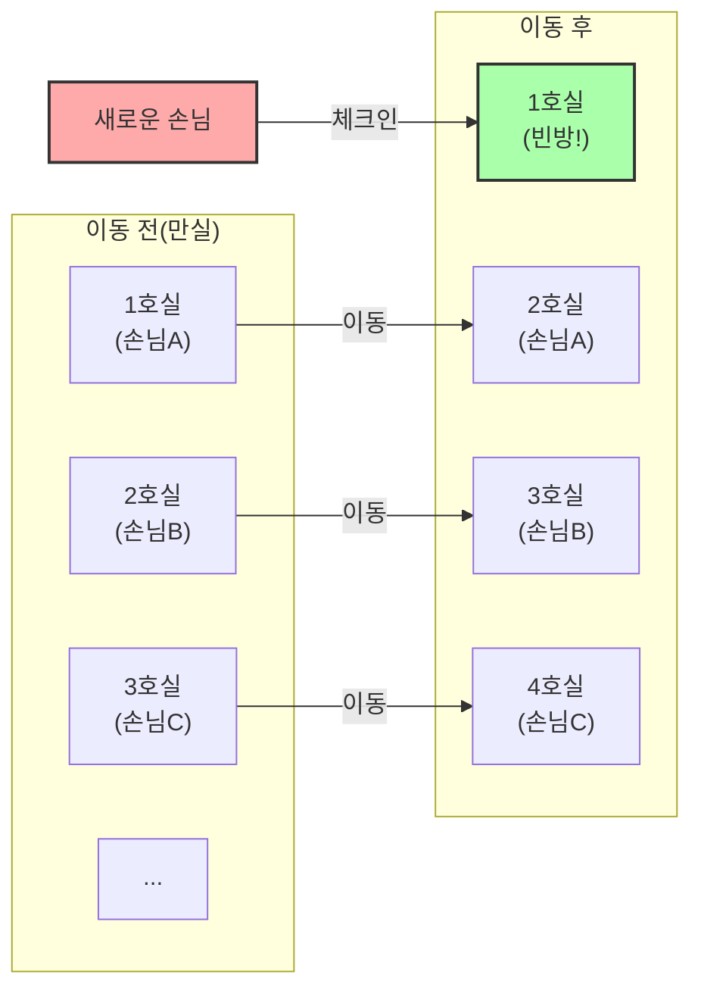
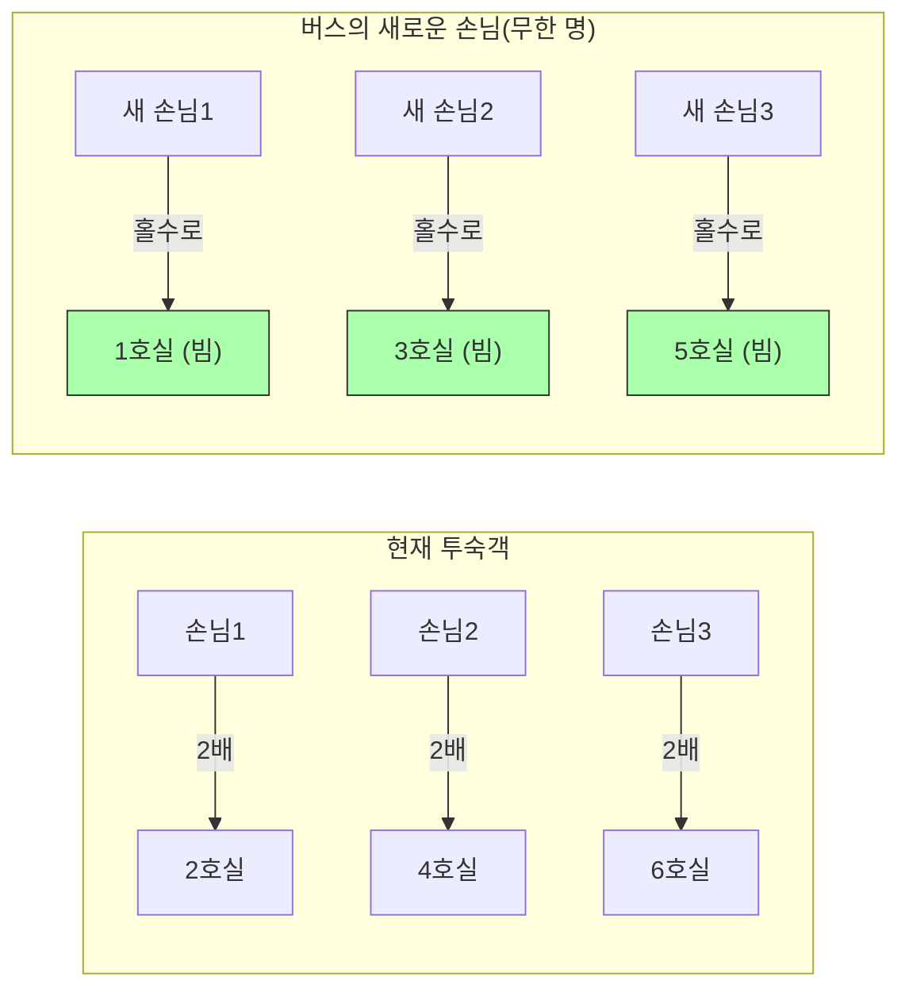

## 1. 궁극의 호텔에 오신 것을 환영합니다

독일의 위대한 수학자 다비트 힐베르트는 '무한'이라는 개념이 인간의 직관과 얼마나 동떨어져 있는지를 설명하기 위해 다음과 같은 흥미로운 사고 실험을 고안했습니다.

상상해 보세요. 우주 어딘가에 **"힐베르트의 무한 호텔"**이라는 호텔이 있습니다.
이 호텔에는 1호실, 2호실, 3호실……과 같이 번호가 매겨진 객실이 **무한 개** 존재합니다.

어느 날, 우주 전역에서 큰 행사가 열려 이 무한 호텔은 모든 방에 손님이 들어차 **"만실"**이 되었습니다.
그때 몹시 지친 한 명의 여행자가 찾아와 프런트에 "방을 하나 비워주실 수 있나요?"라고 물었습니다.

보통의 호텔이라면 "죄송합니다, 만실입니다"라고 거절할 수밖에 없습니다.
하지만 이곳은 무한 호텔입니다. 지배인은 "알겠습니다. 바로 방을 준비해 드리겠습니다"라며 미소 지었습니다.
만실인데 어떻게 새로운 손님을 투숙시킬 수 있을까요?

---

## 2. 케이스 1: 1명의 새로운 손님을 투숙시키는 방법

지배인은 구내방송으로 이미 투숙하고 있는 모든 손님에게 다음과 같이 안내했습니다.

**"손님 여러분께 안내 말씀드립니다. 현재의 방 번호에 '플러스 1'을 한 번호의 방으로 이동해 주시기 바랍니다."**

그러면 어떻게 될까요?
- 1호실 손님은 2호실로 이동합니다.
- 2호실 손님은 3호실로 이동합니다.
- 3호실 손님은 4호실로 이동합니다.
- $n$호실 손님은 $n+1$호실로 이동합니다.

방은 무한히 있으므로 "가장 마지막 방의 손님이 쫓겨난다"는 일은 일어나지 않습니다. 모두가 옆 방으로 무사히 이사할 수 있습니다.
그리고 마침내 **1호실이 빈방이 되었습니다.** 새로운 여행자는 무사히 1호실에 머물 수 있게 된 것입니다.

무한의 세계에서는 $\infty + 1 = \infty$ 가 성립합니다.
"전체(무한)" 중에서 "1개"를 빼내어도 전체의 크기는 변하지 않는 것입니다.

---

## 3. 케이스 2: 무한 명의 새로운 손님을 투숙시키는 방법

자, 다음 날. 호텔은 다시 만실 상태로 돌아갔습니다.
그런데 이번에는 무려 **"무한 명의 승객"을 태운 무한 버스**가 도착했습니다.
버스에서 내린 손님들은 "우리 모두가 묵을 방을 준비해 주시오!"라며 프런트로 몰려들었습니다.

어제와 똑같이 "플러스 1"의 이동을 부탁하다가는 영원히 시간이 걸리고 말 것입니다.
하지만 지배인은 당황하지 않습니다. 다시 구내방송을 켰습니다.

**"손님 여러분께 안내 말씀드립니다. 현재의 방 번호를 '2배' 한 번호의 방으로 이동해 주시기 바랍니다."**

그러면 어떻게 될까요?
- 1호실 손님은 2호실로 이동합니다.
- 2호실 손님은 4호실로 이동합니다.
- 3호실 손님은 6호실로 이동합니다.
- $n$호실 손님은 $2n$호실로 이동합니다.

이 이동을 통해 이미 투숙하고 있던 무한 명의 손님은 **"모든 짝수 번호의 방"**에 쏙 들어가게 되었습니다.
그리고 기적적으로 **"모든 홀수 번호의 방(1호실, 3호실, 5호실...)"이 완전히 빈방이 된** 것입니다!

홀수도 무한히 존재하므로, 지배인은 무한 버스의 승객을 맨 앞부터 차례대로 1호실, 3호실, 5호실...로 안내해 나가면 모두를 투숙시킬 수 있습니다.

무한의 세계에서는 $\infty + \infty = \infty$ 가 성립합니다.
무한에 무한을 더해도 역시 크기는 같은 "무한" 그대로인 것입니다.

---

## 4. 케이스 3: 무한 대의 무한 버스가 도착한다면?

그리고 또 다음 날. 또다시 호텔은 만실입니다.
그런데 놀랍게도 **"무한 명의 승객을 태운 무한 버스가 무한 대"** 연달아 도착했습니다.

버스 1호차에 무한 명, 버스 2호차에 무한 명, 버스 3호차에 무한 명…… 이것이 무한 대 이어집니다.
아무리 지배인이라도 패닉에 빠질 법하지만, 그는 수학의 천재였습니다. '소수'를 사용할 생각을 해낸 것입니다.

지배인은 다음과 같이 지시를 내렸습니다.

1. **이미 호텔에 투숙하고 있는 손님의 이동**
   현재 방 번호를 $n$이라고 했을 때, "$2^n$ 호실"로 이동하게 합니다.
   (1호실 $\rightarrow$ 2호실, 2호실 $\rightarrow$ 4호실, 3호실 $\rightarrow$ 8호실...)
   이로써 현재의 손님은 모두 수용되었습니다.

2. **버스 1호차 손님(무한 명)의 안내**
   손님의 좌석 번호를 $n$이라고 했을 때, "$3^n$ 호실"로 안내합니다.
   (3호실, 9호실, 27호실...)

3. **버스 2호차 손님(무한 명)의 안내**
   다음 소수인 5를 사용하여 "$5^n$ 호실"로 안내합니다.
   (5호실, 25호실, 125호실...)

4. **버스 $k$호차 손님(무한 명)의 안내**
   $k+1$ 번째 소수 $P$를 사용하여 "$P^n$ 호실"로 안내합니다.

"소인수분해의 유일성(어떤 수든 소수의 곱셈 조합은 1가지뿐이다)"이라는 강력한 수학 정리에 의해, $2^n, 3^n, 5^n, 7^n \dots$ 의 방 번호가 다른 누군가와 중복되는 일은 절대 없습니다.

이렇게 지배인은 **"무한 $\times$ 무한"**이라는 터무니없는 인원의 손님을 1개의 무한 호텔에 훌륭하게 수용해 낸 것입니다!

---

## 5. 무한에는 "크기"의 차이가 있다(칸토어의 정리)

힐베르트의 무한 호텔이 가르쳐 주는 것은 **"가산 무한(1, 2, 3... 하고 번호를 매겨 셀 수 있는 무한)"은 아무리 더하거나 곱해도 결국 같은 크기의 '가산 무한'의 틀 안에 수용되고 만다**는 사실입니다.

하지만 수학자 게오르크 칸토어는 더욱 무서운 사실을 발견했습니다.
"자연수"나 "분수"는 모두 이 무한 호텔에 묵게 할 수 있습니다. 하지만 **"실수(무리수를 포함한 모든 소수)" 손님이 찾아올 경우, 이 무한 호텔을 사용하더라도 절대 모두를 투숙시킬 수 없습니다**.

실수의 개수는 무한 호텔의 방 개수(가산 무한)보다 근본적으로 "더 큰(차원이 높은) 무한"임이 증명되어 있습니다.
"무한"이라는 단어로 하나로 묶이기 쉽지만, 사실 무한 안에도 "작은 무한"과 "절대 도달할 수 없을 만큼 큰 무한"이라는 계층 구조(농도)가 존재하는 것입니다.

---

## 6. 요약: 인간의 직관을 파괴하는 "무한"

힐베르트의 무한 호텔은 우리의 일상생활에서 길러진 "유한의 상식"이 "무한의 세계"에서는 얼마나 통용되지 않는지를 선명하게 그려냅니다.

"전체는 부분보다 크다"
"만실인 호텔에는 아무도 들어갈 수 없다"
"무한에 무한을 더하면 더 커진다"

이러한 당연한 직관은 모두 보기 좋게 빗나갑니다.
무한의 세계는 역설(직관에 반하는 진리)의 보고입니다. 수학자들은 이 역설을 두려워하는 것이 아니라 논리의 힘으로 제압하고 분류하여 현대의 집합론이라는 아름다운 체계를 만들어 냈습니다.

다음에 "호텔이 만실입니다"라며 거절당했을 때는 꼭 "만약 이 호텔이 힐베르트의 무한 호텔이었다면 어땠을까" 하고 상상해 보시기 바랍니다.
